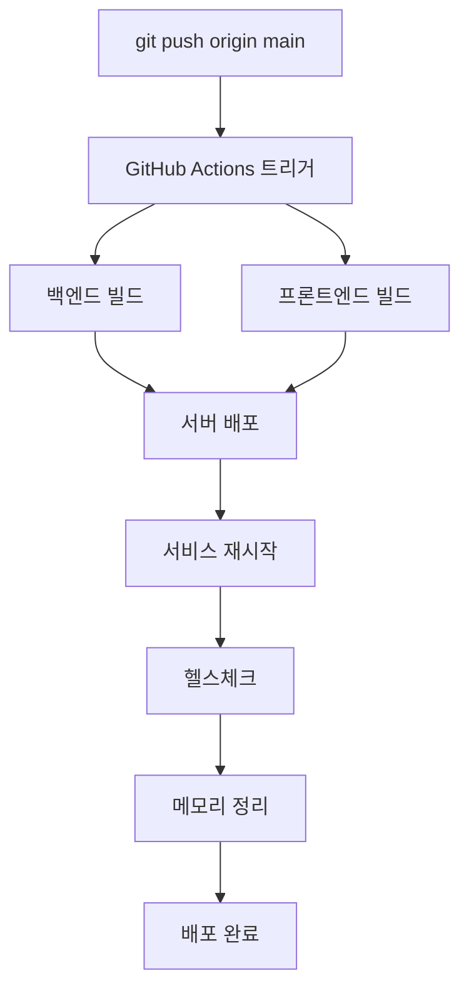

# 🔑 GitHub Secrets 설정 가이드

## 📍 GitHub 저장소 설정 경로
1. GitHub 저장소 페이지로 이동
2. **Settings** 탭 클릭
3. 왼쪽 메뉴에서 **Secrets and variables** > **Actions** 클릭

## 🔐 추가할 Secrets

### 1. SERVER_HOST
- **Name:** `SERVER_HOST`
- **Value:** `beta74.cafe24.com`

### 2. SERVER_USER  
- **Name:** `SERVER_USER`
- **Value:** `root`

### 3. SERVER_SSH_KEY
- **Name:** `SERVER_SSH_KEY`
- **Value:** 아래 명령어로 출력되는 SSH 개인키 전체 내용

```bash
cat ~/.ssh/mindgarden_github_actions
```

**⚠️ 중요:** SSH 개인키 전체를 복사해서 붙여넣으세요 (-----BEGIN 부터 -----END 까지 모든 내용)

## 🧪 테스트 방법

1. **GitHub Secrets 설정 완료 후:**
```bash
git add .github/workflows/deploy-production.yml docs/GITHUB_ACTIONS_SETUP.md GITHUB_SECRETS_SETUP.md
git commit -m "feat: GitHub Actions 자동 배포 워크플로우 추가"
git push origin main
```

2. **GitHub Actions 확인:**
   - GitHub 저장소 > Actions 탭에서 배포 진행 상황 확인
   - 각 단계별 로그 확인 가능

3. **배포 완료 확인:**
   - 서비스 상태: `sudo systemctl status mindgarden.service`
   - 애플리케이션 접근: `http://m-garden.co.kr`

## 🔄 배포 플로우



## 🎯 주요 특징

- ✅ **자동 백업**: 기존 파일 자동 백업
- ✅ **롤백 지원**: 배포 실패 시 이전 버전으로 복구 가능
- ✅ **헬스체크**: 배포 후 자동 상태 확인
- ✅ **메모리 관리**: 자동 메모리 정리 및 모니터링
- ✅ **Zero Downtime**: systemd 서비스 관리로 최소 다운타임

## 🚨 문제 해결

### 배포 실패 시
1. GitHub Actions 로그 확인
2. 서버 SSH 접속하여 수동 복구:
```bash
cd /var/www/mindgarden
sudo systemctl stop mindgarden.service
cp app.jar.backup.YYYYMMDD_HHMMSS app.jar
sudo systemctl start mindgarden.service
```

### SSH 연결 실패 시
- GitHub Secrets의 `SERVER_SSH_KEY` 값 재확인
- SSH 키 형식 확인 (-----BEGIN ~ -----END 포함)

---

**🎉 설정 완료 후 `git push origin main`으로 자동 배포를 테스트해보세요!**
# GitHub Actions 자동 배포 테스트 완료
