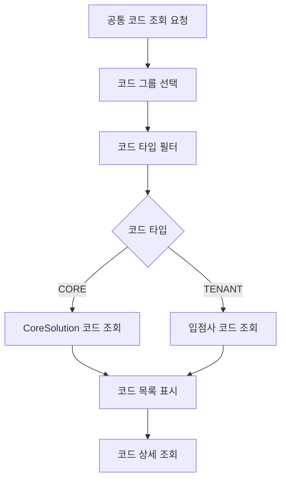
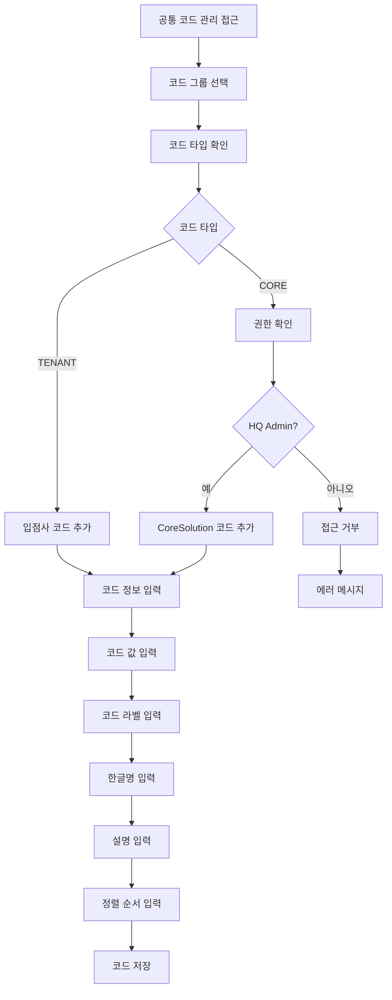

# 공통 코드 관리 문서

**작성일**: 2025-11-20  
**버전**: 1.0.0  
**상태**: 완료

---

## 📋 개요

CoreSolution 플랫폼의 공통 코드 관리 시스템을 정리한 문서입니다. 공통 코드는 CoreSolution 전체에서 사용되는 코드와 입점사별로 관리되는 코드로 구분됩니다.

---

## 🏗️ 공통 코드 시스템 구조

### 코드 분리 전략

**단일 테이블 전략:**
- `common_codes` 테이블 하나에 모든 코드 저장
- `tenant_id` 컬럼으로 구분
  - `tenant_id = NULL`: CoreSolution 공통 코드
  - `tenant_id = UUID`: 입점사 공통 코드

**코드 타입:**
- `CORE`: CoreSolution 전체에서 사용되는 코드 (HQ Admin만 수정 가능)
- `TENANT`: 입점사별로 관리되는 코드 (Tenant Admin 수정 가능)

---

## 📊 공통 코드 구조

### CommonCode 엔티티

```
CommonCode
├─ id: 코드 ID
├─ tenant_id: 테넌트 ID (NULL = CoreSolution 코드)
├─ code_group: 코드 그룹
├─ code_value: 코드 값
├─ code_label: 코드 라벨
├─ korean_name: 한글명 (필수)
├─ code_description: 설명
├─ sort_order: 정렬 순서
├─ is_active: 활성화 여부
└─ extra_data: 추가 데이터 (JSON)
```

### CodeGroupMetadata 엔티티

```
CodeGroupMetadata
├─ code_group: 코드 그룹
├─ code_type: CORE 또는 TENANT
├─ description: 설명
└─ is_active: 활성화 여부
```

---

## 🔄 공통 코드 관리 프로세스

### 코드 조회 프로세스



### 코드 추가 프로세스



---

## 🎯 역할별 공통 코드 관리 권한

### HQ Admin (본사 관리자)

**권한:**
- ✅ CoreSolution 공통 코드 조회
- ✅ CoreSolution 공통 코드 추가/수정/삭제
- ✅ 입점사 공통 코드 조회
- ❌ 입점사 공통 코드 수정 (입점사 관리자 권한)

### Tenant Admin (입점사 관리자)

**권한:**
- ✅ CoreSolution 공통 코드 조회 (읽기 전용)
- ❌ CoreSolution 공통 코드 수정 (HQ Admin만 가능)
- ✅ 자신의 입점사 공통 코드 조회
- ✅ 자신의 입점사 공통 코드 추가/수정/삭제

---

## 📝 공통 코드 관리 기능

### 1. 코드 그룹 관리

**코드 그룹 목록:**
- CoreSolution 공통 코드 그룹 (CORE)
- 입점사 공통 코드 그룹 (TENANT)

**코드 그룹 메타데이터:**
- 코드 그룹명
- 코드 타입 (CORE/TENANT)
- 설명

### 2. 코드 CRUD

**코드 추가:**
- 코드 그룹 선택
- 코드 값 입력
- 코드 라벨 입력
- 한글명 입력 (필수)
- 설명 입력
- 정렬 순서 입력

**코드 수정:**
- 코드 정보 수정
- 한글명 수정
- 설명 수정
- 정렬 순서 수정

**코드 삭제:**
- 코드 삭제 (소프트 삭제)
- 사용 중인 코드는 삭제 불가

### 3. 코드 조회

**조회 옵션:**
- 코드 그룹별 조회
- 코드 타입별 필터 (CORE/TENANT)
- 활성화된 코드만 조회
- 검색 기능

---

## 🔐 공통 코드 권한 매트릭스

| 기능 | HQ Admin | Tenant Admin |
|------|----------|--------------|
| CoreSolution 코드 조회 | ✅ | ✅ (읽기 전용) |
| CoreSolution 코드 추가 | ✅ | ❌ |
| CoreSolution 코드 수정 | ✅ | ❌ |
| CoreSolution 코드 삭제 | ✅ | ❌ |
| 입점사 코드 조회 | ✅ | ✅ (자신의 코드만) |
| 입점사 코드 추가 | ❌ | ✅ (자신의 코드만) |
| 입점사 코드 수정 | ❌ | ✅ (자신의 코드만) |
| 입점사 코드 삭제 | ❌ | ✅ (자신의 코드만) |

---

## ⚠️ 중요 사항

1. **코드 분리**
   - CoreSolution 코드와 입점사 코드는 명확히 구분
   - 입점사는 자신의 코드만 관리 가능

2. **한글명 필수**
   - 모든 공통 코드는 `korean_name` 필수
   - 한국 시장 중심 시스템

3. **권한 분리**
   - HQ Admin: CoreSolution 코드 관리
   - Tenant Admin: 입점사 코드 관리

4. **하드코딩 금지**
   - 백엔드는 항상 CommonCode에서 코드 조회
   - 하드코딩된 값 사용 금지

---

## 🔗 관련 문서

- [메뉴 구조도](./MENU_STRUCTURE.md)
- [IA 구조도](./IA_ARCHITECTURE.md)
- [스토리보드 패턴](./STORYBOARD_PATTERNS.md)
- [테넌트 공통 코드 분리 계획](../TENANT_COMMON_CODE_SEPARATION_PLAN.md)

---

**마지막 업데이트**: 2025-11-20

