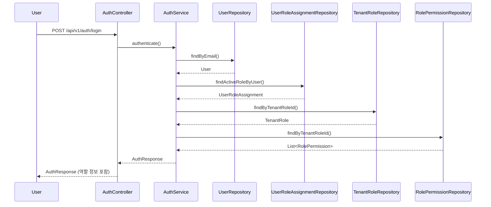
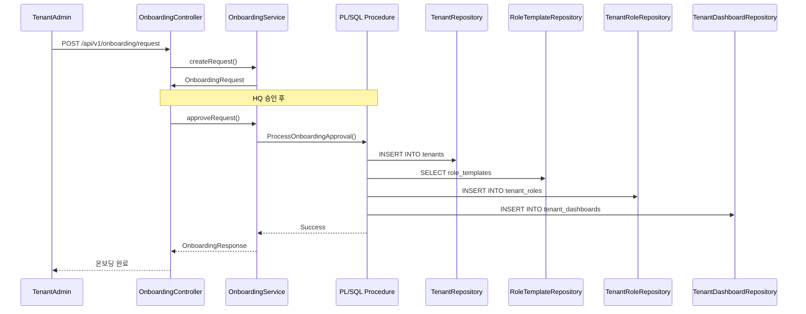
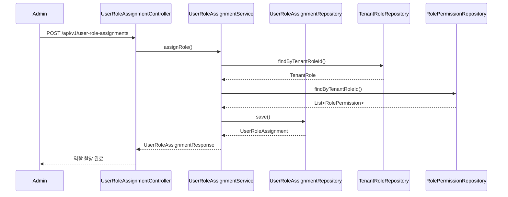
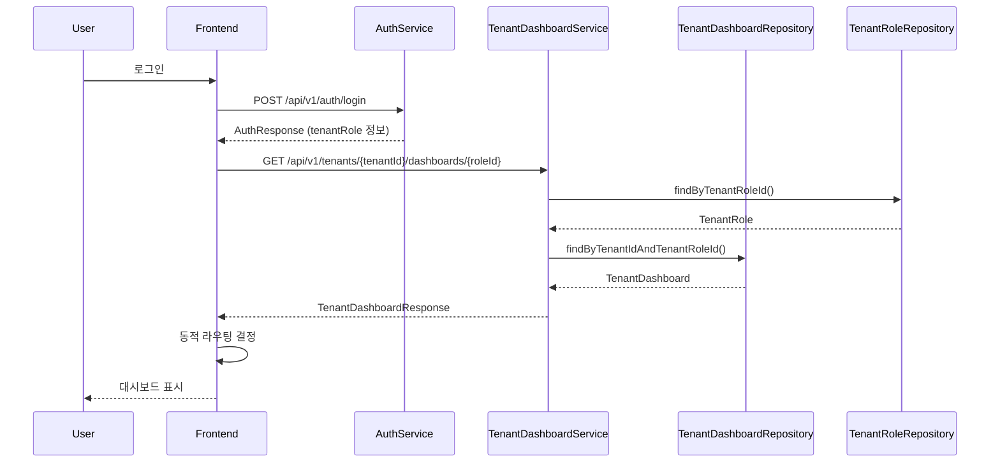
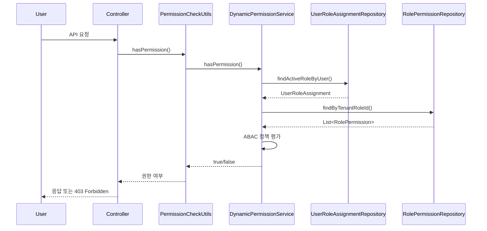

# 데이터 흐름도

**작성일**: 2025-11-20  
**버전**: 1.0.0  
**상태**: 완료

---

## 📋 개요

CoreSolution 플랫폼의 데이터 흐름을 시각화한 문서입니다. 주요 프로세스의 데이터 흐름을 다이어그램으로 표현합니다.

---

## 🔄 주요 데이터 흐름

### 1. 사용자 인증 및 역할 조회 흐름



### 2. 테넌트 온보딩 데이터 흐름



### 3. 역할 할당 데이터 흐름



### 4. 동적 대시보드 라우팅 데이터 흐름



---

## 📊 데이터 저장 흐름

### 역할 템플릿 → 테넌트 역할 생성

```
RoleTemplate (템플릿)
  ├─ template_code: "ACADEMY_STUDENT"
  ├─ name_ko: "학생"
  └─ permissions: [...]
      ↓ 복제
TenantRole (테넌트 역할)
  ├─ tenant_id: "tenant-001"
  ├─ role_template_id: "template-001"
  ├─ name_ko: "학생" (커스터마이징 가능)
  └─ permissions: [...] (복제됨)
```

### 사용자 역할 할당

```
User (사용자)
  ├─ id: 1
  └─ email: "student@academy.com"
      ↓ 할당
UserRoleAssignment (역할 할당)
  ├─ user_id: 1
  ├─ tenant_id: "tenant-001"
  ├─ tenant_role_id: "role-001"
  ├─ branch_id: 1 (또는 NULL)
  └─ effective_from: "2025-01-01"
```

---

## 🔐 권한 검증 데이터 흐름

### 권한 체크 프로세스



---

## 🗄️ 데이터베이스 트랜잭션 흐름

### 온보딩 트랜잭션

```
START TRANSACTION
  ├─ INSERT INTO tenants
  ├─ INSERT INTO tenant_roles (템플릿 기반)
  ├─ INSERT INTO role_permissions (권한 복제)
  ├─ INSERT INTO tenant_dashboards
  ├─ INSERT INTO tenant_subscriptions
  └─ INSERT INTO tenant_components
COMMIT (또는 ROLLBACK)
```

### 역할 할당 트랜잭션

```
START TRANSACTION
  ├─ SELECT FROM tenant_roles (역할 존재 확인)
  ├─ SELECT FROM user_role_assignments (중복 확인)
  └─ INSERT INTO user_role_assignments
COMMIT (또는 ROLLBACK)
```

---

## 📡 API 요청-응답 흐름

### 표준 API 응답 구조

```
요청
  ↓
Controller
  ↓
Service (비즈니스 로직)
  ↓
Repository (데이터 접근)
  ↓
Database
  ↓
Response DTO 변환
  ↓
ApiResponse<T> 래퍼
  ↓
응답
```

### 에러 처리 흐름

```
요청
  ↓
Controller
  ↓
Service (예외 발생)
  ↓
GlobalExceptionHandler
  ↓
ErrorResponse 생성
  ↓
응답 (에러 정보 포함)
```

---

## 🔗 관련 문서

- [IA 구조도](./IA_ARCHITECTURE.md)
- [동적 역할 시스템](./DYNAMIC_ROLE_SYSTEM.md)
- [테넌트 대시보드 관리 시스템](../TENANT_DASHBOARD_MANAGEMENT_SYSTEM.md)

---

**마지막 업데이트**: 2025-11-20

