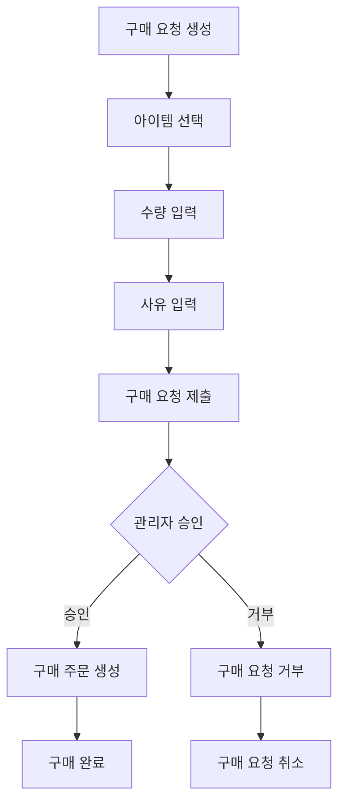
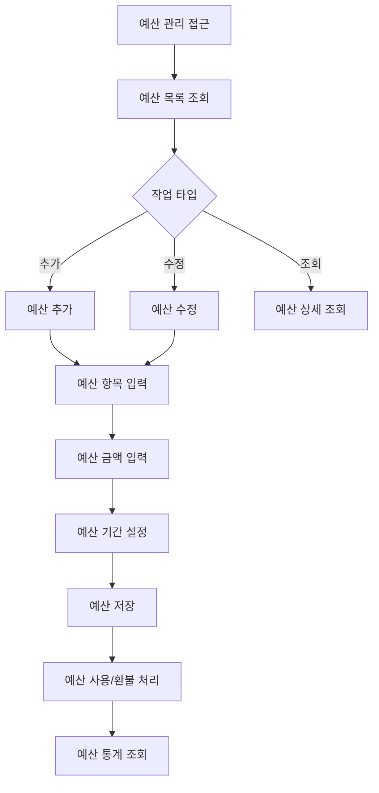

# ERP 시스템 문서

**작성일**: 2025-11-20  
**버전**: 1.0.0  
**상태**: 완료

---

## 📋 개요

CoreSolution 플랫폼의 ERP(Enterprise Resource Planning) 시스템을 정리한 문서입니다. ERP는 재무 관리, 구매 관리, 예산 관리, 재고 관리 등의 기능을 제공합니다.

---

## 🏗️ ERP 시스템 구조

### ERP 모듈 구조

```
ERP 모듈
├─ 구매 관리 (Purchase Management)
│   ├─ 구매 요청 (PurchaseRequest)
│   ├─ 구매 주문 (PurchaseOrder)
│   └─ 아이템 관리 (Item)
├─ 예산 관리 (Budget Management)
│   ├─ 예산 생성/수정/삭제
│   ├─ 예산 사용/환불
│   └─ 예산 통계
├─ 재무 관리 (Financial Management)
│   ├─ 재무 거래 (FinancialTransaction)
│   ├─ 수입/지출 관리
│   └─ 재무 통계
└─ 재고 관리 (Inventory Management)
    ├─ 아이템 재고 관리
    └─ 재고 부족 알림
```

---

## 📊 ERP 메뉴 구조

### ERP 관리자 메뉴 (BRANCH_SUPER_ADMIN, HQ_MASTER 등)

```
ERP 관리
├─ ERP 대시보드
├─ 구매 요청
│   ├─ 구매 요청 목록
│   └─ 구매 요청 생성
├─ 승인 관리
│   ├─ 관리자 승인
│   └─ 수퍼 관리자 승인
├─ 아이템 관리
│   ├─ 아이템 목록
│   ├─ 아이템 추가/수정
│   └─ 재고 관리
├─ 예산 관리
│   ├─ 예산 목록
│   ├─ 예산 추가/수정
│   └─ 예산 통계
└─ 주문 관리
    ├─ 주문 목록
    └─ 주문 상세
```

---

## 🔄 ERP 주요 프로세스

### 구매 요청 프로세스



### 예산 관리 프로세스



---

## 🎯 ERP 역할별 기능

### BRANCH_SUPER_ADMIN (지점 수퍼 관리자)

**ERP 접근 권한:**
- ✅ ERP 대시보드 조회
- ✅ 구매 요청 생성/조회
- ✅ 관리자 승인 처리
- ✅ 아이템 관리
- ✅ 예산 관리
- ✅ 주문 관리

### HQ_MASTER (본사 총관리자)

**ERP 접근 권한:**
- ✅ 모든 ERP 기능 접근
- ✅ 수퍼 관리자 승인 처리
- ✅ 전체 예산 관리
- ✅ 전체 재무 통계

### ADMIN (일반 관리자)

**ERP 접근 권한:**
- ❌ ERP 메뉴 접근 불가
- ❌ 구매 요청 생성 불가
- ❌ 예산 관리 불가

---

## 📝 ERP 주요 엔티티

### Item (아이템)

- 아이템 ID
- 아이템 이름
- 카테고리
- 단가
- 재고 수량
- 최소 재고 수량

### PurchaseRequest (구매 요청)

- 구매 요청 ID
- 요청자
- 아이템
- 수량
- 단가
- 총액
- 사유
- 상태 (PENDING, APPROVED, REJECTED)

### PurchaseOrder (구매 주문)

- 주문 ID
- 구매 요청 ID
- 주문 상태
- 주문 일자
- 배송 정보

### Budget (예산)

- 예산 ID
- 예산 항목
- 예산 금액
- 예산 기간
- 사용 금액
- 잔액

### FinancialTransaction (재무 거래)

- 거래 ID
- 거래 유형 (INCOME, EXPENSE)
- 거래 금액
- 거래 상태
- 승인 정보

---

## 🔐 ERP 권한 매트릭스

| 기능 | BRANCH_SUPER_ADMIN | HQ_MASTER | ADMIN |
|------|-------------------|-----------|-------|
| ERP 대시보드 조회 | ✅ | ✅ | ❌ |
| 구매 요청 생성 | ✅ | ✅ | ❌ |
| 구매 요청 조회 | ✅ | ✅ | ❌ |
| 관리자 승인 | ✅ | ✅ | ❌ |
| 수퍼 관리자 승인 | ❌ | ✅ | ❌ |
| 아이템 관리 | ✅ | ✅ | ❌ |
| 예산 관리 | ✅ | ✅ | ❌ |
| 주문 관리 | ✅ | ✅ | ❌ |

---

## 🔗 관련 문서

- [메뉴 구조도](./MENU_STRUCTURE.md)
- [IA 구조도](./IA_ARCHITECTURE.md)
- [스토리보드 패턴](./STORYBOARD_PATTERNS.md)

---

**마지막 업데이트**: 2025-11-20

