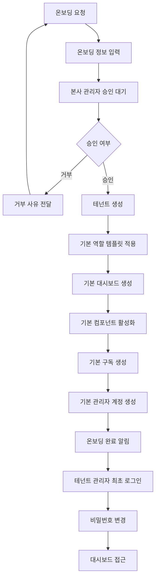
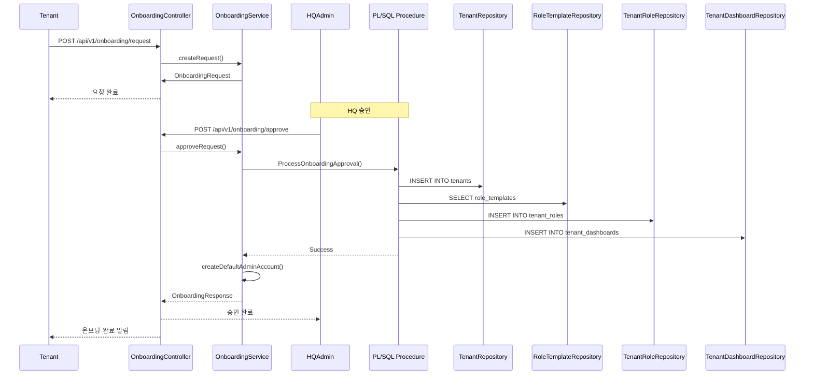

# 온보딩 패턴

**작성일**: 2025-11-20  
**버전**: 1.0.0  
**상태**: 완료

---

## 📋 개요

CoreSolution 플랫폼의 테넌트 온보딩 프로세스를 정리한 문서입니다. 입점사가 플랫폼에 입점하는 과정부터 초기 설정까지의 전체 프로세스를 다룹니다.

---

## 🔄 온보딩 프로세스 개요

### 전체 프로세스 흐름



---

## 📝 단계별 상세 프로세스

### 1단계: 온보딩 요청

**입점사가 수행하는 작업:**
- 온보딩 요청서 작성
- 업종 선택 (ACADEMY, CONSULTATION 등)
- 기본 정보 입력
  - 사업자 정보
  - 대표자 정보
  - 연락처 정보
- 결제 정보 입력
  - 결제 수단 선택
  - 요금제 선택
- 필수 동의 사항 확인
  - 서비스 이용 약관
  - 개인정보 수집·이용/처리 위탁
  - 전자금융거래 약관
  - 광고성 정보 수신 여부

**시스템 처리:**
- 온보딩 요청 저장
- 본사 관리자에게 알림 발송
- 온보딩 대기 목록에 추가

---

### 2단계: 본사 관리자 승인

**본사 관리자가 수행하는 작업:**
- 온보딩 요청 검토
- 필수 정보 확인
  - 사업자 정보 검증
  - 필수 서류 확인
  - 결제 정보 확인
- 승인 또는 거부 결정
- 거부 시 사유 입력

**시스템 처리:**
- 승인 시 온보딩 프로세스 시작
- 거부 시 입점사에게 알림 발송

---

### 3단계: 테넌트 생성

**시스템 자동 처리:**
- 테넌트 생성
  - `tenant_id` 생성 (UUID)
  - 테넌트 정보 저장
  - 테넌트 상태: `ACTIVE`
- 카테고리 매핑 설정
- 기본 컴포넌트 활성화
- 기본 구독 생성

---

### 4단계: 기본 역할 템플릿 적용

**시스템 자동 처리:**
- 업종별 기본 역할 템플릿 조회
- 템플릿 기반 테넌트 역할 생성
- 권한 복제

**기본 역할 템플릿:**

| 업종 | 역할 코드 | 역할명 | 설명 |
|------|----------|--------|------|
| ACADEMY | STUDENT | 학생 | 강좌 신청, 출석 확인, 성적 조회 |
| ACADEMY | TEACHER | 선생님 | 반 관리, 출석 체크, 성적 입력 |
| ACADEMY | ADMIN | 관리자 | 학생/교사 관리, 통계 조회 |
| CONSULTATION | CLIENT | 내담자 | 상담 예약, 상담 내역 조회 |
| CONSULTATION | CONSULTANT | 상담사 | 일정 관리, 상담 기록 작성 |
| CONSULTATION | ADMIN | 관리자 | 상담사/내담자 관리, 통계 조회 |

---

### 5단계: 기본 대시보드 생성

**시스템 자동 처리:**
- 각 기본 역할에 대해 대시보드 자동 생성
- 대시보드 이름: 기본값 (테넌트 관리자가 수정 가능)
- `is_default=true`로 설정
- `display_order` 자동 설정

**기본 대시보드 설정:**

| 업종 | 역할 | 기본 대시보드 이름 | dashboard_type |
|------|------|-------------------|----------------|
| ACADEMY | STUDENT | 학생 대시보드 | STUDENT |
| ACADEMY | TEACHER | 선생님 대시보드 | TEACHER |
| ACADEMY | ADMIN | 관리자 대시보드 | ADMIN |
| CONSULTATION | CLIENT | 내담자 대시보드 | CLIENT |
| CONSULTATION | CONSULTANT | 상담사 대시보드 | CONSULTANT |
| CONSULTATION | ADMIN | 관리자 대시보드 | ADMIN |

---

### 6단계: 기본 관리자 계정 생성

**시스템 자동 처리:**
- 기본 관리자 계정 생성
  - 이메일: 온보딩 요청 시 입력한 이메일
  - 역할: ADMIN
  - `tenant_id` 설정
- 임시 비밀번호 생성
- 이메일 발송 (임시 비밀번호 안내)

---

### 7단계: 테넌트 관리자 최초 로그인

**테넌트 관리자가 수행하는 작업:**
- 로그인 페이지 접속
- 임시 비밀번호로 로그인
- 최초 로그인 감지 → 비밀번호 변경 화면으로 리다이렉트
- 비밀번호 변경
- 업종별 대시보드 접근

**시스템 처리:**
- 최초 로그인 감지
- 비밀번호 변경 강제
- 대시보드 라우팅

---

## 🎯 역할별 온보딩 체크리스트

### 테넌트 관리자 (ADMIN)

**온보딩 후 필수 작업:**
- [ ] 비밀번호 변경
- [ ] 프로필 정보 확인/수정
- [ ] 기본 역할 확인
  - [ ] 역할명 수정 (필요시)
  - [ ] 권한 확인/수정 (필요시)
- [ ] 기본 대시보드 확인
  - [ ] 대시보드 이름 수정 (필요시)
  - [ ] 대시보드 설정 확인
- [ ] 사용자 추가
  - [ ] 상담사/선생님 추가
  - [ ] 내담자/학생 추가
- [ ] 시스템 설정 확인
  - [ ] 공통코드 확인
  - [ ] 알림 설정 확인

---

### 본사 관리자 (HQ_ADMIN)

**온보딩 승인 시 확인 사항:**
- [ ] 온보딩 요청 정보 검토
  - [ ] 사업자 정보 확인
  - [ ] 필수 서류 확인
  - [ ] 결제 정보 확인
- [ ] 필수 동의 사항 확인
- [ ] 승인 또는 거부 결정
- [ ] 온보딩 완료 후 확인
  - [ ] 테넌트 생성 확인
  - [ ] 기본 역할 생성 확인
  - [ ] 기본 대시보드 생성 확인
  - [ ] 기본 관리자 계정 생성 확인

---

## 🔄 온보딩 프로세스 상세 플로우

### 온보딩 요청 → 승인 → 완료 플로우



---

## 📊 온보딩 데이터 구조

### 테넌트 생성 시 자동 생성되는 데이터

```
Tenant (테넌트)
  ├─ tenant_id (UUID)
  ├─ tenant_name
  ├─ business_type
  └─ status: ACTIVE
      ↓
TenantRole (테넌트 역할) × 3개
  ├─ tenant_role_id (UUID)
  ├─ tenant_id
  ├─ role_template_id
  ├─ name_ko
  └─ permissions (복제됨)
      ↓
TenantDashboard (테넌트 대시보드) × 3개
  ├─ dashboard_id (UUID)
  ├─ tenant_id
  ├─ tenant_role_id
  ├─ dashboard_name_ko
  └─ is_default: true
      ↓
User (기본 관리자 계정) × 1개
  ├─ user_id
  ├─ email
  ├─ tenant_id
  ├─ role: ADMIN
  └─ password: 임시 비밀번호
```

---

## ⚠️ 중요 사항

1. **자동 생성 항목**
   - 기본 역할 템플릿 기반 역할 생성
   - 기본 대시보드 자동 생성
   - 기본 관리자 계정 자동 생성

2. **커스터마이징 가능 항목**
   - 역할명 수정
   - 권한 추가/수정
   - 대시보드 이름 수정
   - 대시보드 설정 수정

3. **필수 확인 사항**
   - 온보딩 승인 전 필수 정보 확인
   - 온보딩 완료 후 기본 설정 확인
   - 최초 로그인 시 비밀번호 변경

---

## 🔗 관련 문서

- [역할별 온보딩 가이드](./ONBOARDING_GUIDE_BY_ROLE.md)
- [MindGarden 예시 온보딩](./ONBOARDING_EXAMPLES_MINDGARDEN.md)
- [테넌트 대시보드 관리 시스템](../TENANT_DASHBOARD_MANAGEMENT_SYSTEM.md)
- [동적 역할 시스템](./DYNAMIC_ROLE_SYSTEM.md)

---

**마지막 업데이트**: 2025-11-20

