# 역할별 프로세스 플로우차트

**작성일**: 2025-11-20  
**버전**: 1.0.0  
**상태**: 완료

---

## 📋 개요

역할별 주요 프로세스를 플로우차트로 정리한 문서입니다. 각 역할은 다른 프로세스를 가지지만, 공통적인 패턴을 공유합니다.

---

## 🎯 레벨별 프로세스 패턴

### 레벨 1: 기본 사용자 프로세스

#### 서비스 예약/신청 프로세스

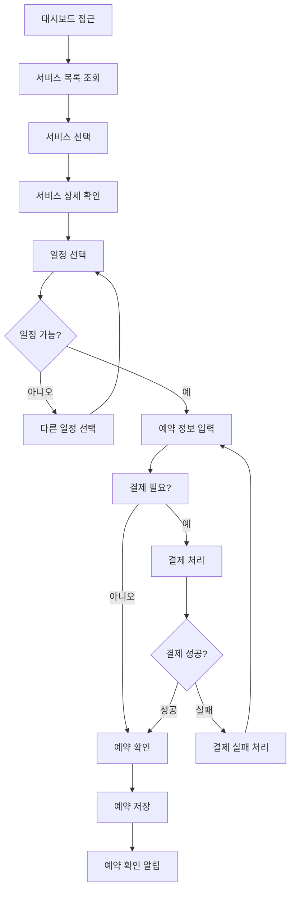

#### 내역 조회 프로세스

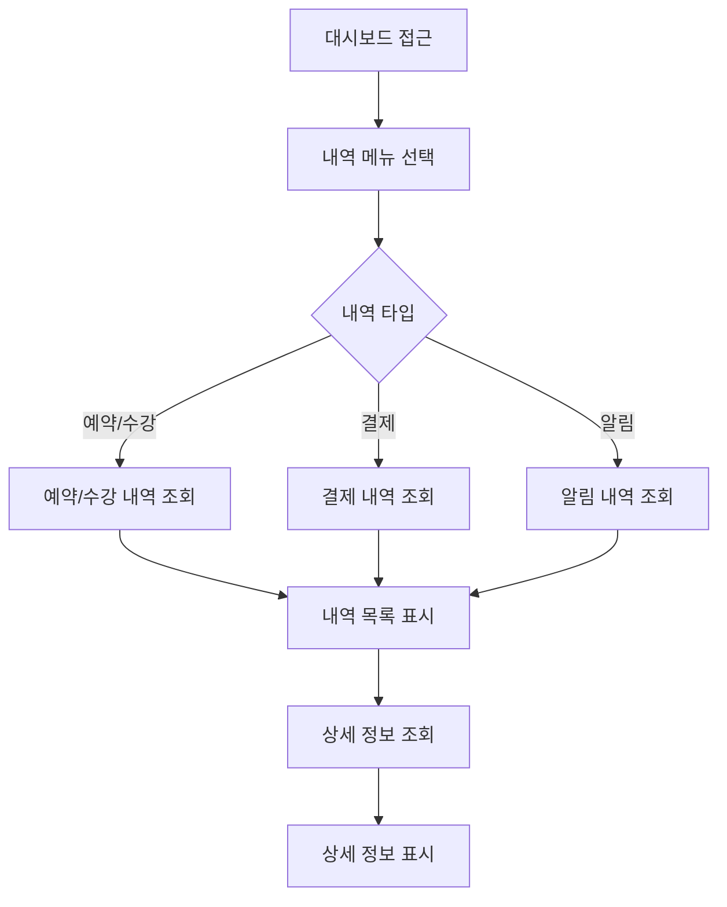

---

### 레벨 2: 서비스 제공자 프로세스

#### 일정 관리 프로세스

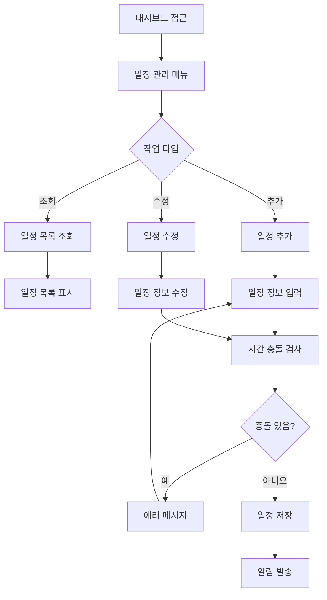

#### 서비스 제공 프로세스

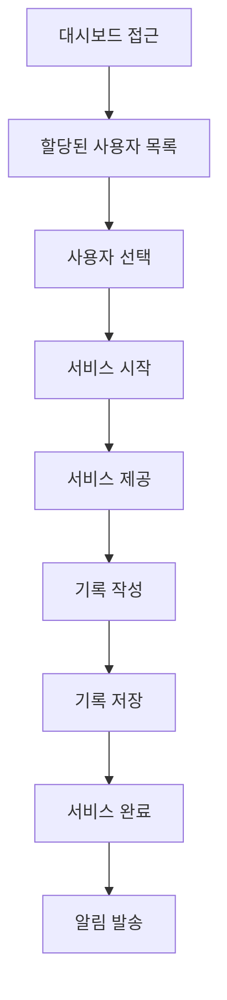

---

### 레벨 3: 관리자 프로세스

#### 사용자 관리 프로세스

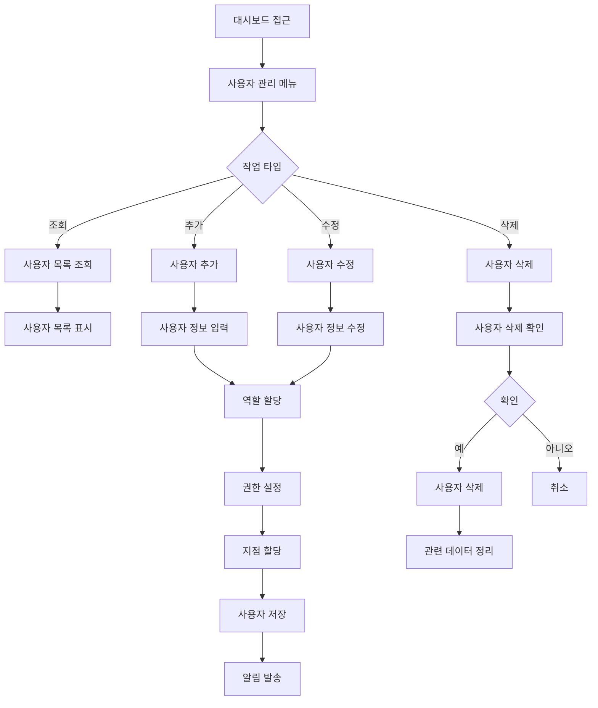

#### 통계 조회 프로세스

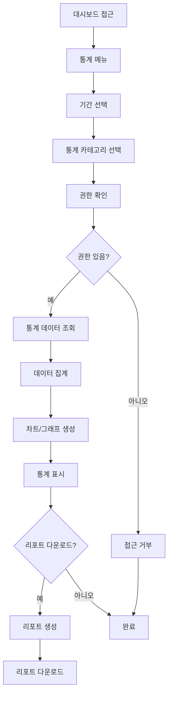

#### 공통 코드 관리 프로세스

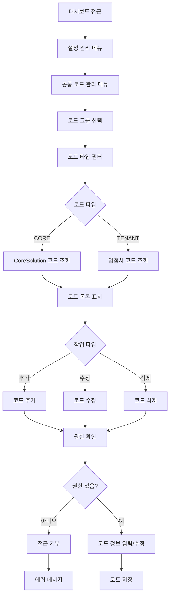

---

### 레벨 4: 최고 관리자 프로세스

#### 역할 관리 프로세스

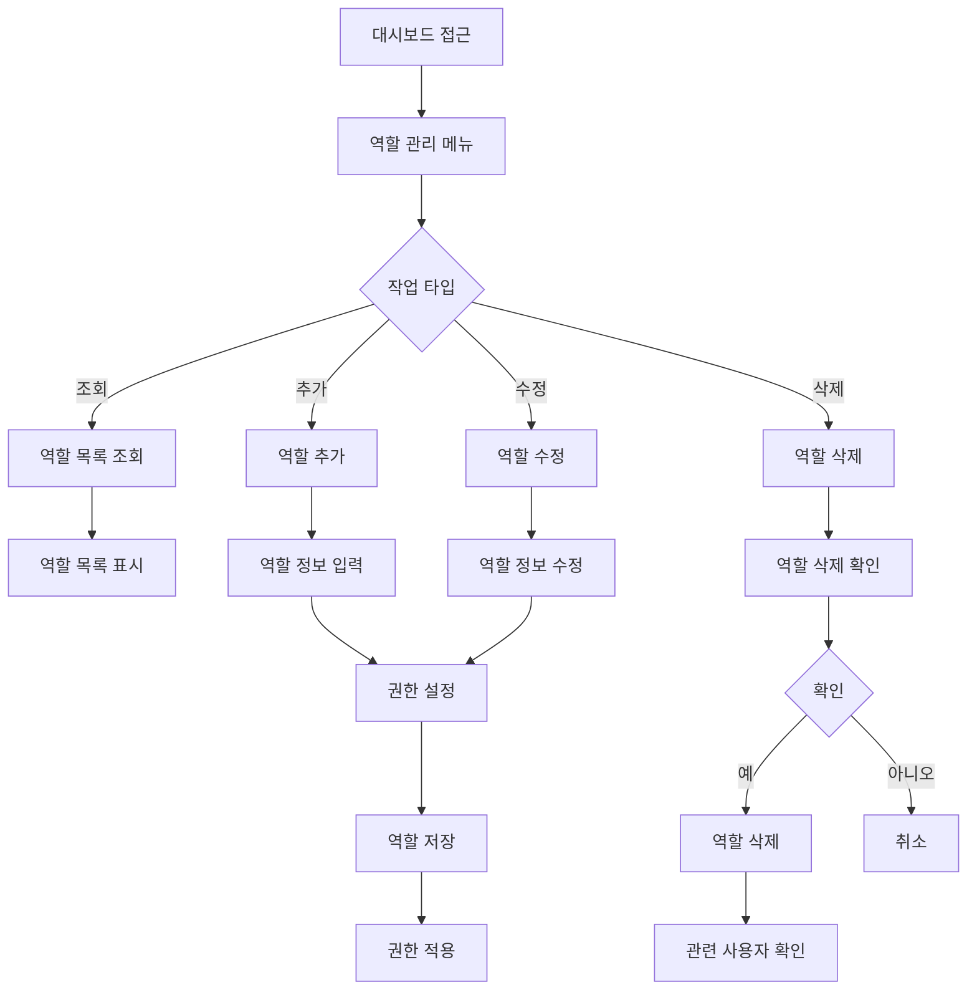

#### 시스템 설정 프로세스

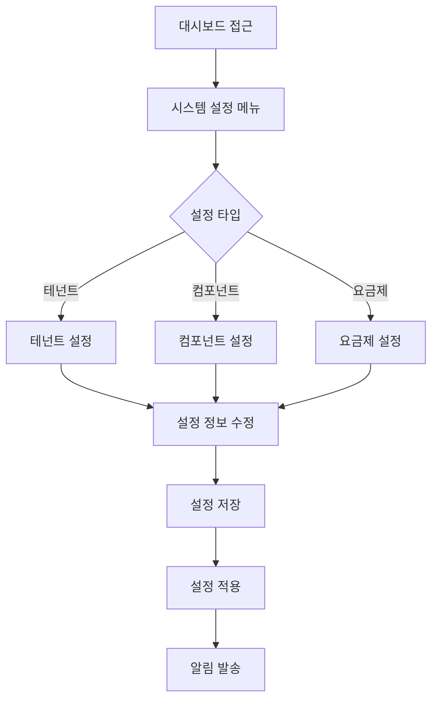

#### ERP 관리 프로세스 (BRANCH_SUPER_ADMIN, HQ_MASTER)

##### 구매 요청 프로세스

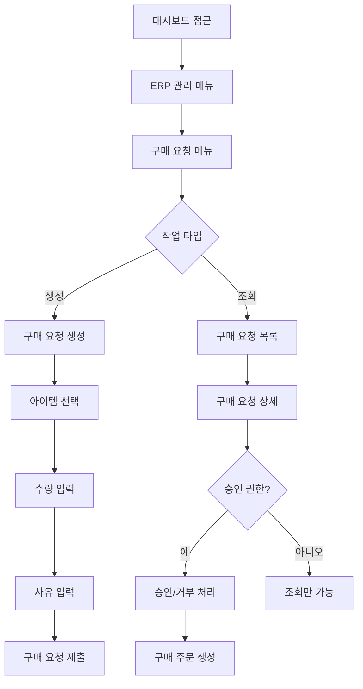

##### 예산 관리 프로세스

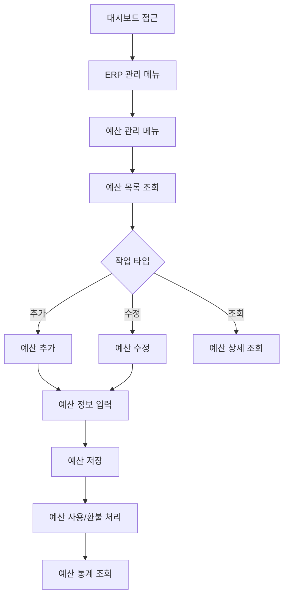

---

## 🎓 ACADEMY (학원) 프로세스

### 학생 (STUDENT) 프로세스

#### 강좌 신청 프로세스

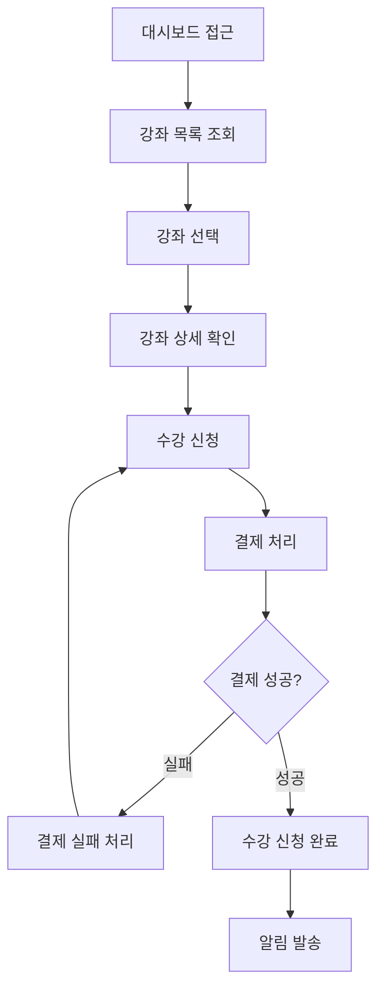

---

### 선생님 (TEACHER) 프로세스

#### 출석 체크 프로세스

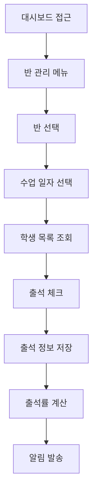

---

## 🏥 CONSULTATION (상담소) 프로세스

### 내담자 (CLIENT) 프로세스

**참고**: [MindGarden 예시 플로우차트](./PROCESS_FLOWCHARTS_EXAMPLES_MINDGARDEN.md) 참조

- 상담 예약 프로세스
- 상담 내역 조회 프로세스

---

### 상담사 (COUNSELOR) 프로세스

**참고**: [MindGarden 예시 플로우차트](./PROCESS_FLOWCHARTS_EXAMPLES_MINDGARDEN.md) 참조

- 일정 관리 프로세스
- 상담 기록 작성 프로세스

---

## ⚠️ 중요 사항

1. **범용 패턴 제공**
   - 이 문서는 범용적인 프로세스 패턴을 제공
   - 실제 입점사는 다른 프로세스를 가질 수 있음

2. **MindGarden은 예시**
   - MindGarden의 프로세스는 CONSULTATION 업종의 예시
   - 다른 상담소는 다른 프로세스를 가질 수 있음

3. **동적 프로세스**
   - 프로세스는 역할별로 동적으로 구성
   - 테넌트 관리자가 프로세스 커스터마이징 가능

---

## 🔗 관련 문서

- [프로세스 플로우차트](./PROCESS_FLOWCHARTS.md)
- [MindGarden 예시 플로우차트](./PROCESS_FLOWCHARTS_EXAMPLES_MINDGARDEN.md)
- [데이터 흐름도](./DATA_FLOW_DIAGRAM.md)

---

**마지막 업데이트**: 2025-11-20

