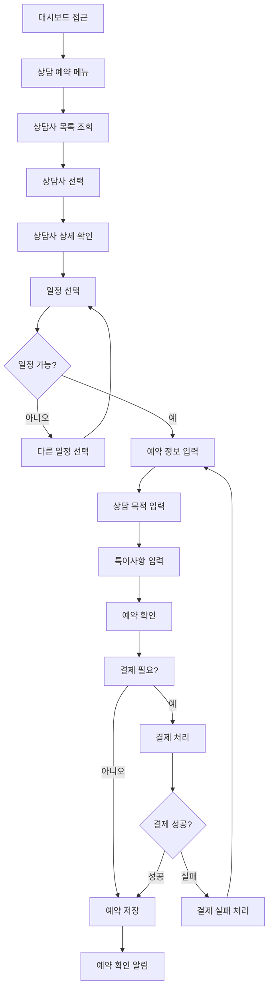
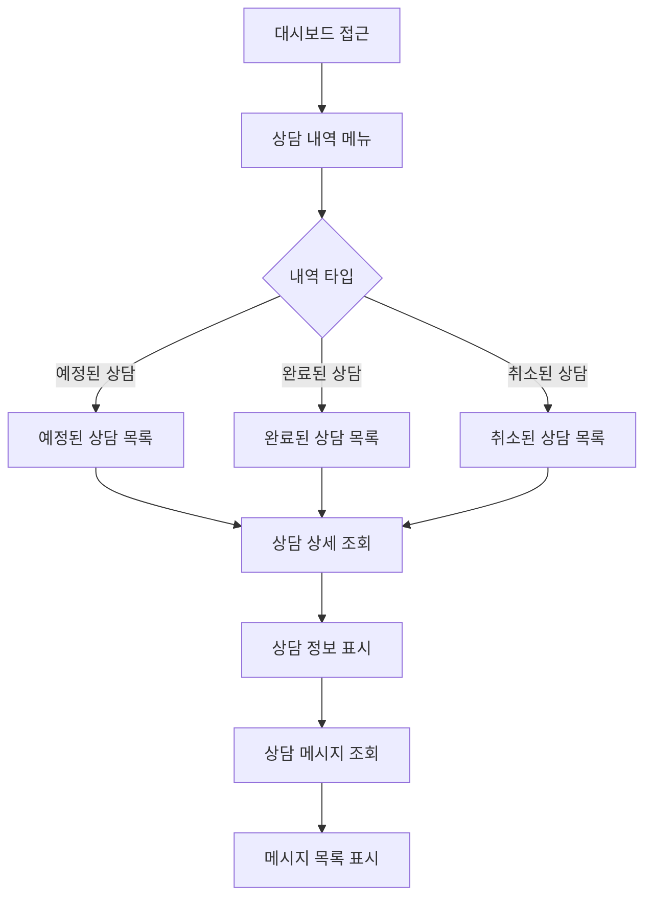
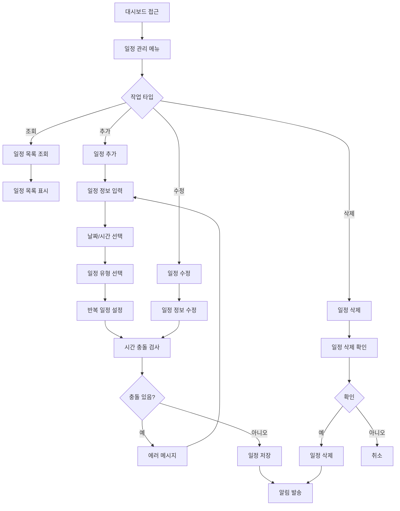
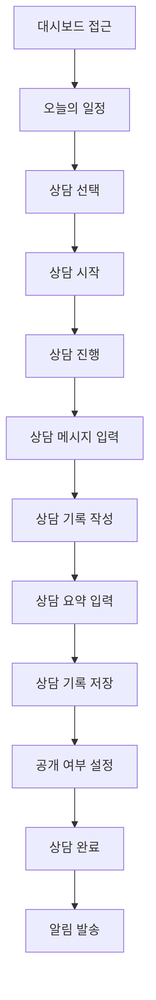
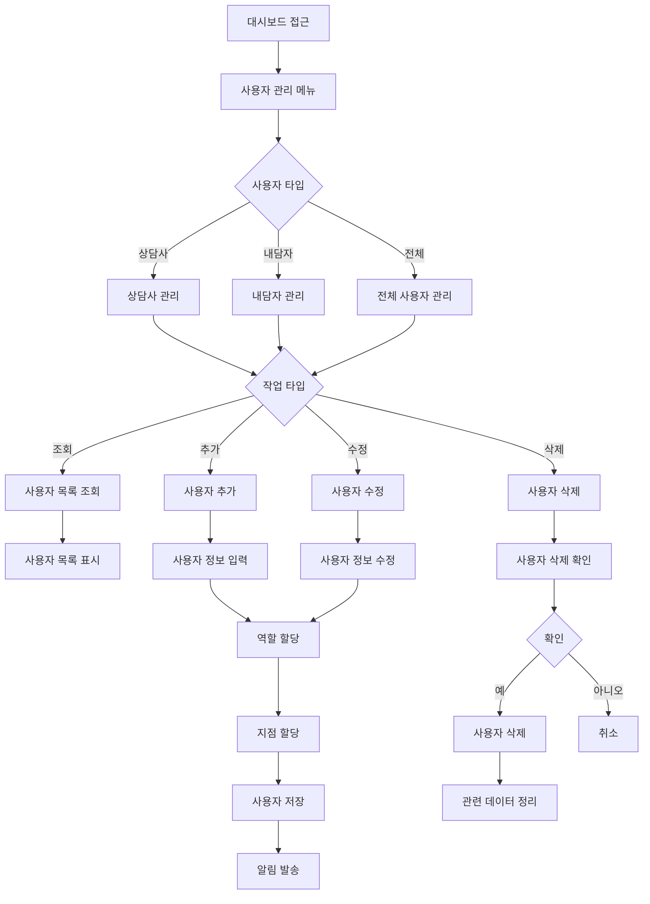
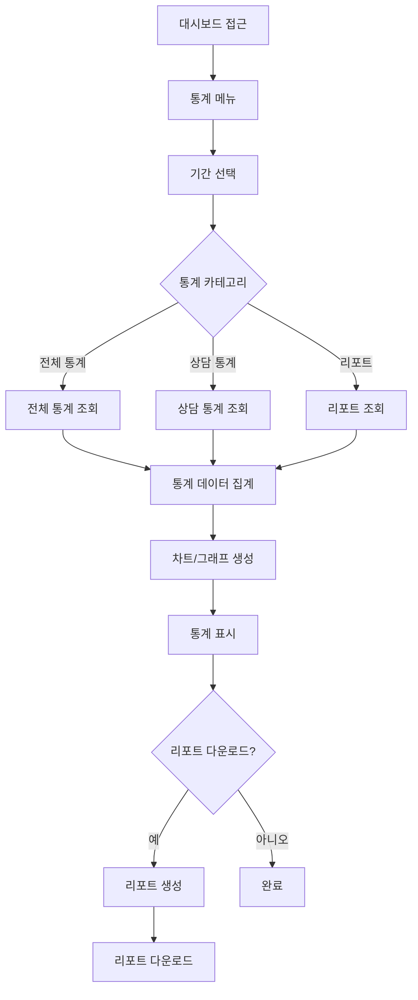
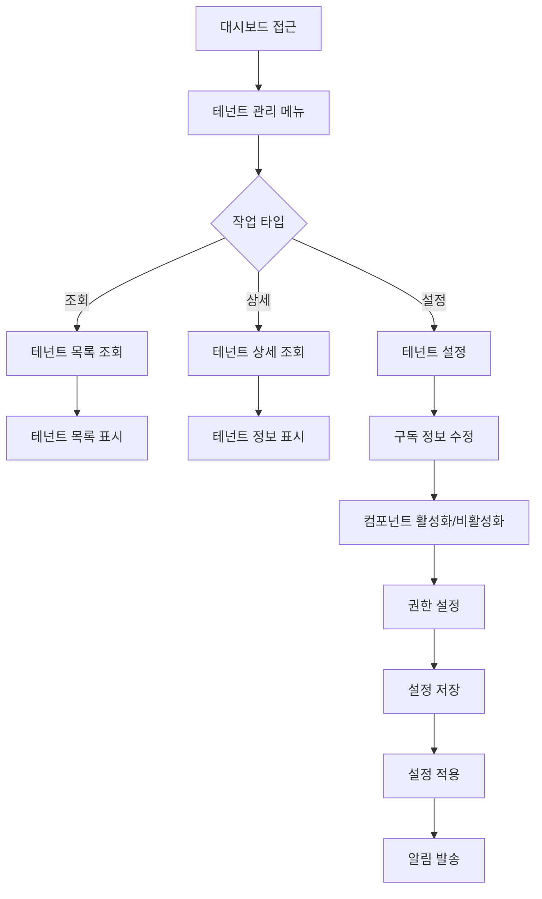
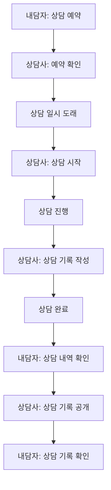
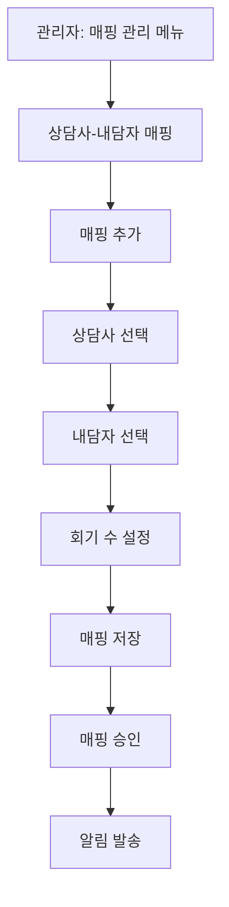

# MindGarden 예시 프로세스 플로우차트

**작성일**: 2025-11-20  
**버전**: 1.0.0  
**상태**: 완료

---

## 📋 개요

MindGarden은 CONSULTATION 업종의 실제 구현 예시입니다. 이 문서는 MindGarden의 주요 프로세스를 플로우차트로 정리한 것입니다.

**⚠️ 참고**: MindGarden의 프로세스는 CONSULTATION 업종의 예시일 뿐이며, 다른 상담소는 다른 프로세스를 가질 수 있습니다.

---

## 👤 역할별 프로세스

### 1. 내담자 (CLIENT) 프로세스

#### 상담 예약 프로세스

#### 상담 내역 조회 프로세스

---

### 2. 상담사 (CONSULTANT) 프로세스

#### 일정 관리 프로세스

#### 상담 기록 작성 프로세스

---

### 3. 관리자 (ADMIN) 프로세스

#### 사용자 관리 프로세스

#### 통계 조회 프로세스

---

### 4. 본사 관리자 (HQ_MASTER) 프로세스

#### 테넌트 관리 프로세스

---

## 🔄 주요 프로세스 상세

### 상담 예약 → 상담 진행 → 상담 완료 플로우

### 매핑 관리 프로세스

---

## ⚠️ 중요 사항

1. **MindGarden은 예시일 뿐**
   - MindGarden의 프로세스는 CONSULTATION 업종의 예시
   - 다른 상담소는 다른 프로세스를 가질 수 있음

2. **동적 프로세스**
   - 프로세스는 역할별로 동적으로 구성
   - 테넌트 관리자가 프로세스 커스터마이징 가능

3. **업종별 차이**
   - 학원: 강좌 신청, 출석 체크, 성적 조회
   - 상담소: 상담 예약, 상담 기록, 결제
   - 기타: 업종별 다른 프로세스

---

## 🔗 관련 문서

- [프로세스 플로우차트](./PROCESS_FLOWCHARTS.md)
- [역할별 플로우차트](./PROCESS_FLOWCHARTS_BY_ROLE.md)
- [데이터 흐름도](./DATA_FLOW_DIAGRAM.md)

---

**마지막 업데이트**: 2025-11-20

