# 프로세스 플로우차트

**작성일**: 2025-11-21  
**버전**: 1.1.0  
**상태**: 업데이트 완료

---

## 📋 개요

CoreSolution 플랫폼의 주요 비즈니스 프로세스를 플로우차트로 정리한 문서입니다. 각 프로세스는 범용 패턴을 제공하며, 입점사별로 다른 프로세스를 가질 수 있습니다.

---

## 🔄 주요 프로세스 목록

### 핵심 프로세스

1. **사용자 인증 및 로그인**
2. **테넌트 온보딩**
3. **역할 할당**
4. **동적 대시보드 라우팅**
5. **권한 검증**
6. **서비스 예약/신청** (업종별)
7. **일정 관리**
8. **사용자 관리**
9. **통계 조회**
10. **공통 코드 관리** (입점사별 코드 관리)
11. **ERP 관리** (구매 요청, 예산 관리 등)

---

## 1. 사용자 인증 및 로그인 프로세스

### 범용 플로우차트

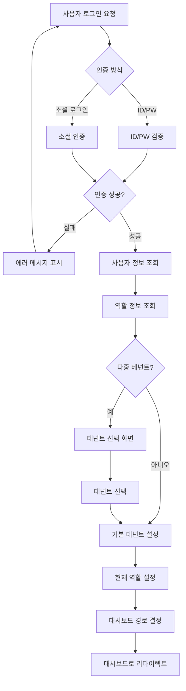

### 프로세스 설명

1. **인증 요청**: 사용자가 ID/PW 또는 소셜 로그인 선택
2. **인증 처리**: 백엔드에서 인증 검증
3. **사용자 정보 조회**: 인증 성공 시 사용자 정보 조회
4. **역할 정보 조회**: 사용자의 역할 정보 조회
5. **테넌트 선택**: 다중 테넌트인 경우 테넌트 선택
6. **대시보드 라우팅**: 역할별 대시보드로 리다이렉트

---

## 2. 테넌트 온보딩 프로세스

### 범용 플로우차트

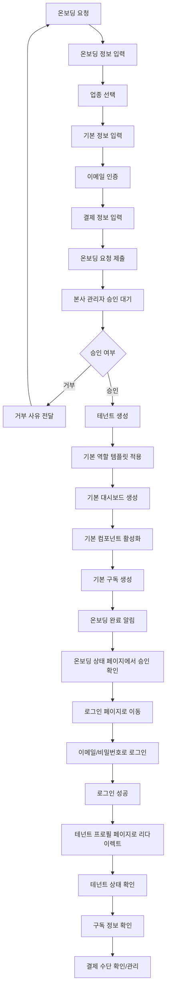

### 프로세스 설명

1. **온보딩 요청**: 입점사가 온보딩 요청
2. **정보 입력**: 업종, 기본 정보, 이메일 인증, 결제 정보 입력
3. **승인 대기**: 본사 관리자 승인 대기
4. **테넌트 생성**: 승인 시 테넌트 생성
5. **기본 설정**: 역할 템플릿, 대시보드, 컴포넌트, 구독 자동 설정
6. **완료 알림**: 온보딩 완료 알림 발송
7. **상태 확인**: 온보딩 상태 페이지에서 승인 완료 확인
8. **로그인**: 이메일과 비밀번호로 로그인
9. **프로필 페이지 이동**: 로그인 성공 시 테넌트 프로필 페이지로 자동 리다이렉트
10. **정보 확인**: 테넌트 상태, 구독 정보, 결제 수단 확인 및 관리

---

## 3. 역할 할당 프로세스

### 범용 플로우차트

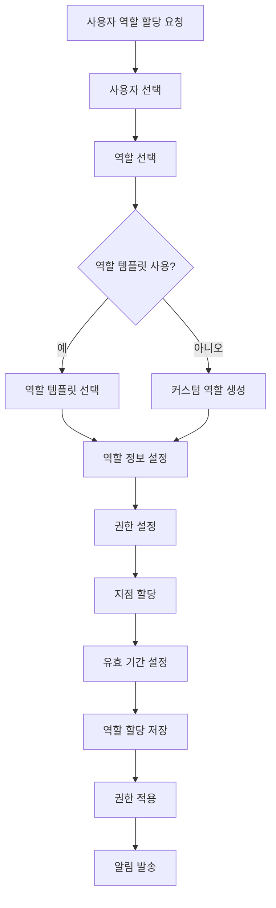

### 프로세스 설명

1. **사용자 선택**: 역할을 할당할 사용자 선택
2. **역할 선택**: 역할 템플릿 또는 커스텀 역할 선택
3. **권한 설정**: 역할에 대한 권한 설정
4. **지점 할당**: 지점별 역할 할당 (필요시)
5. **유효 기간 설정**: 역할 할당 유효 기간 설정
6. **저장 및 적용**: 역할 할당 저장 및 권한 적용

---

## 4. 동적 대시보드 라우팅 프로세스

### 범용 플로우차트

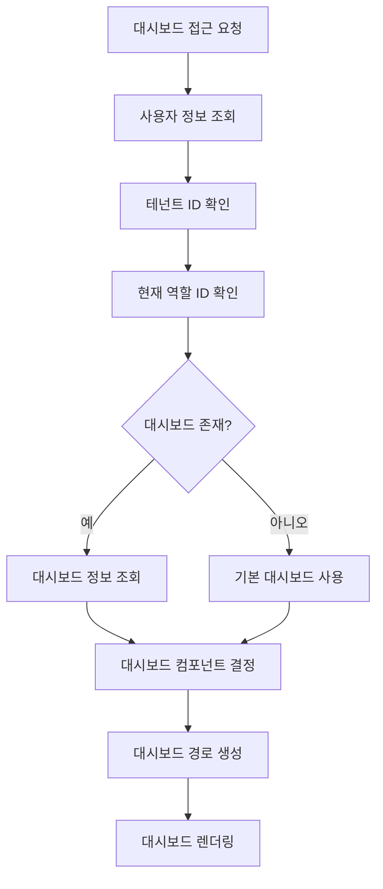

### 프로세스 설명

1. **사용자 정보 조회**: 현재 사용자 정보 조회
2. **테넌트/역할 확인**: 테넌트 ID와 역할 ID 확인
3. **대시보드 조회**: 역할별 대시보드 정보 조회
4. **컴포넌트 결정**: 대시보드 타입에 따른 컴포넌트 결정
5. **경로 생성**: 동적 경로 생성
6. **렌더링**: 대시보드 렌더링

---

## 5. 권한 검증 프로세스

### 범용 플로우차트

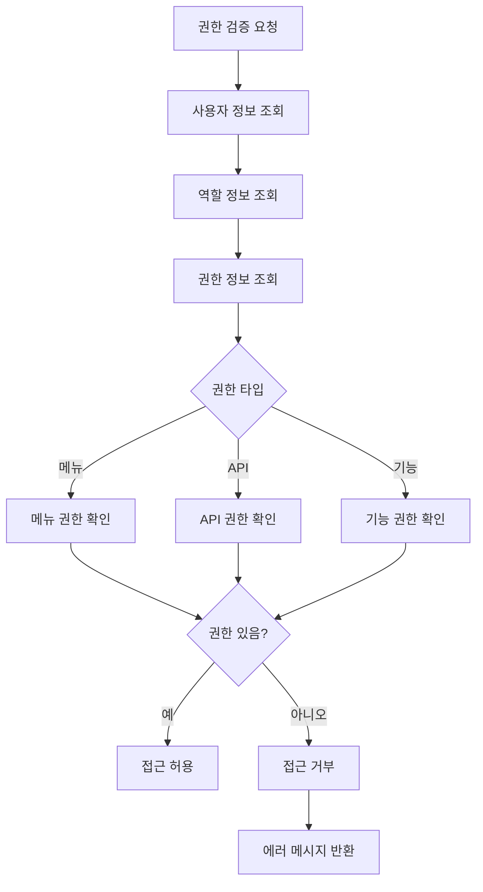

### 프로세스 설명

1. **권한 검증 요청**: 메뉴/API/기능 접근 시 권한 검증 요청
2. **사용자 정보 조회**: 현재 사용자 정보 조회
3. **역할 정보 조회**: 사용자의 역할 정보 조회
4. **권한 확인**: 권한 타입에 따른 권한 확인
5. **접근 허용/거부**: 권한이 있으면 허용, 없으면 거부

---

## 6. 서비스 예약/신청 프로세스 (범용)

### 범용 플로우차트

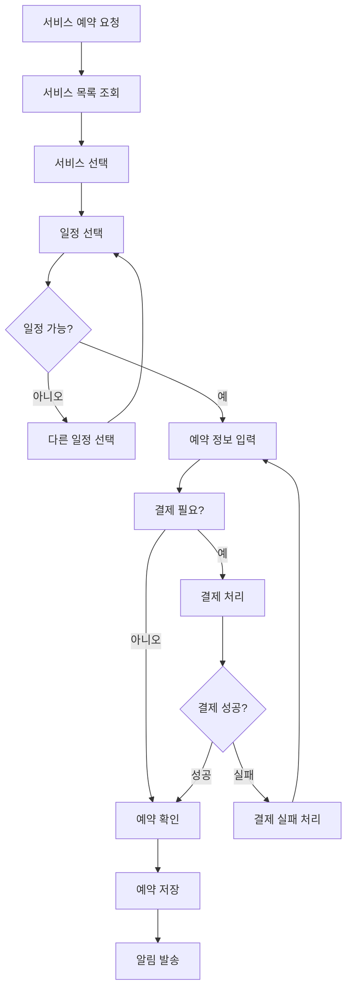

### 프로세스 설명

1. **서비스 목록 조회**: 예약 가능한 서비스 목록 조회
2. **서비스 선택**: 원하는 서비스 선택
3. **일정 선택**: 가능한 일정 선택
4. **예약 정보 입력**: 예약 정보 입력
5. **결제 처리**: 결제가 필요한 경우 결제 처리
6. **예약 저장**: 예약 정보 저장
7. **알림 발송**: 예약 확인 알림 발송

---

## 7. 일정 관리 프로세스

### 범용 플로우차트

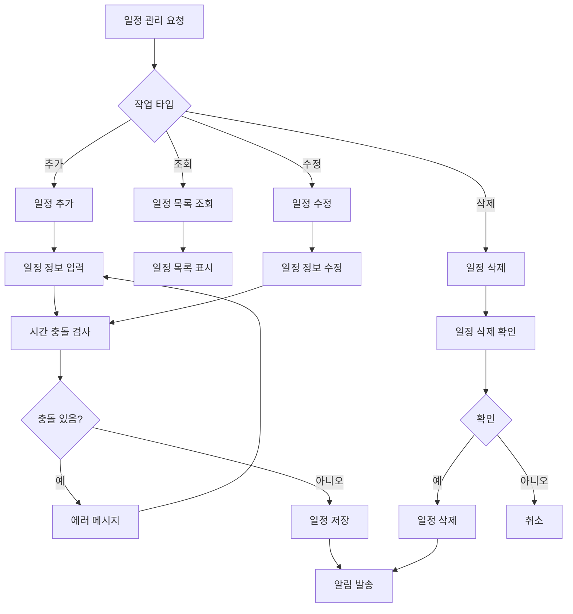

### 프로세스 설명

1. **작업 타입 선택**: 조회/추가/수정/삭제 선택
2. **일정 정보 입력**: 일정 정보 입력
3. **시간 충돌 검사**: 기존 일정과 시간 충돌 검사
4. **일정 저장/수정/삭제**: 일정 정보 저장/수정/삭제
5. **알림 발송**: 관련 사용자에게 알림 발송

---

## 8. 사용자 관리 프로세스

### 범용 플로우차트

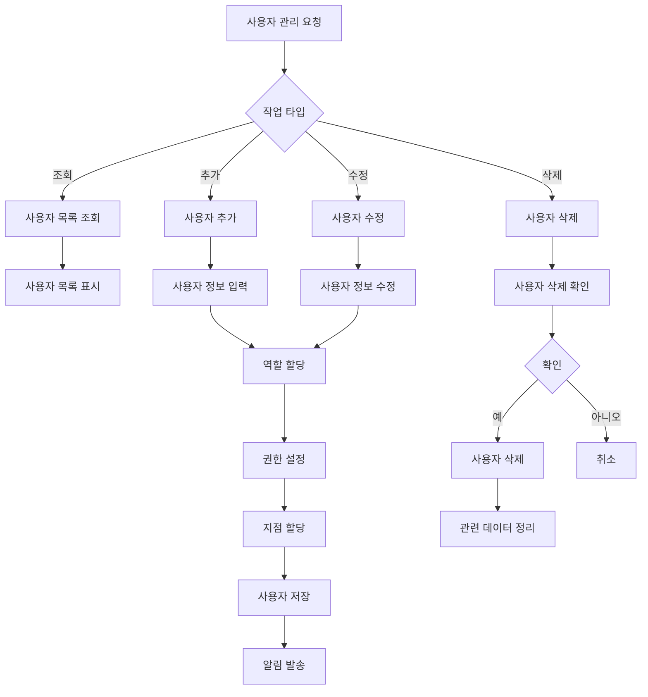

### 프로세스 설명

1. **작업 타입 선택**: 조회/추가/수정/삭제 선택
2. **사용자 정보 입력**: 사용자 정보 입력
3. **역할 할당**: 사용자에게 역할 할당
4. **권한 설정**: 역할에 대한 권한 설정
5. **지점 할당**: 지점별 사용자 할당 (필요시)
6. **사용자 저장**: 사용자 정보 저장
7. **알림 발송**: 사용자에게 알림 발송

---

## 9. 통계 조회 프로세스

### 범용 플로우차트

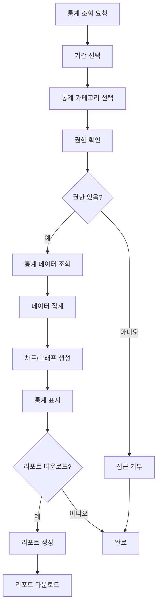

### 프로세스 설명

1. **기간 선택**: 통계 조회 기간 선택
2. **카테고리 선택**: 통계 카테고리 선택
3. **권한 확인**: 통계 조회 권한 확인
4. **데이터 조회**: 통계 데이터 조회
5. **데이터 집계**: 데이터 집계 및 분석
6. **차트 생성**: 차트/그래프 생성
7. **리포트 다운로드**: 리포트 다운로드 (선택)

---

## 10. 공통 코드 관리 프로세스

### 코드 조회 프로세스

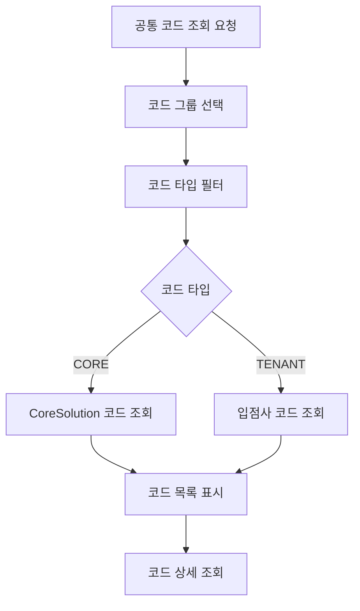

### 코드 추가 프로세스

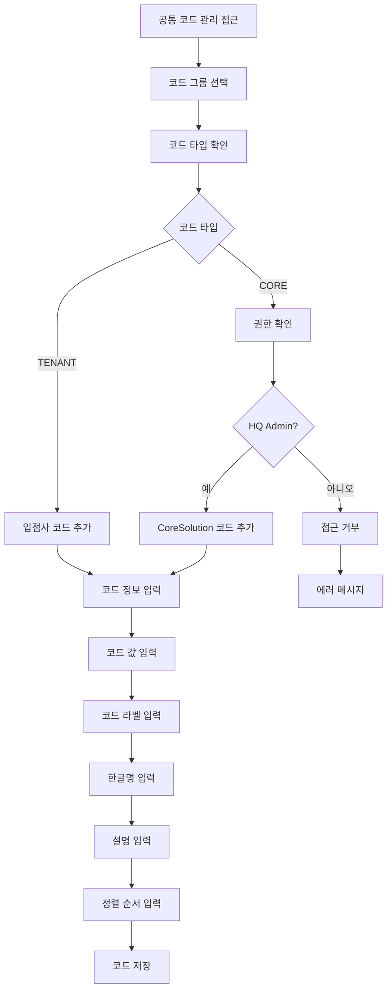

### 코드 수정/삭제 프로세스

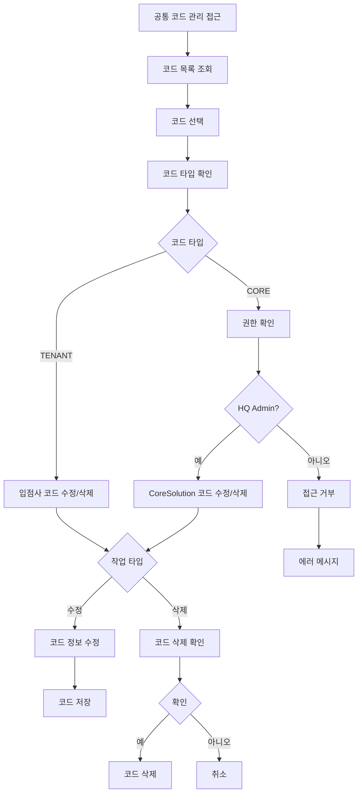

### 프로세스 설명

1. **코드 조회**: 코드 그룹 및 코드 타입별 코드 조회
2. **코드 추가**: 입점사 코드 추가 (CoreSolution 코드는 HQ Admin만 추가 가능)
3. **코드 수정**: 입점사 코드 수정 (CoreSolution 코드는 HQ Admin만 수정 가능)
4. **코드 삭제**: 입점사 코드 삭제 (CoreSolution 코드는 HQ Admin만 삭제 가능)
5. **권한 확인**: 코드 타입별 권한 확인 (CORE: HQ Admin만, TENANT: Tenant Admin 가능)

---

## 11. ERP 관리 프로세스

### 구매 요청 프로세스

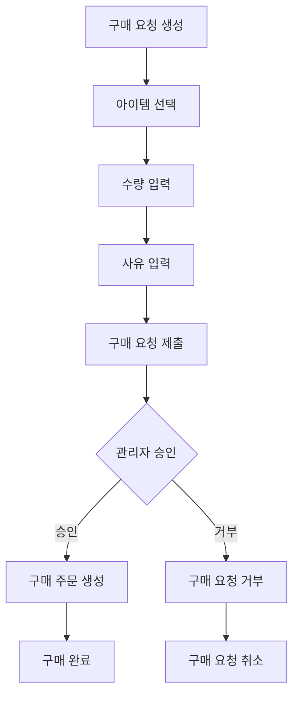

### 프로세스 설명

1. **구매 요청 생성**: 구매 요청 생성
2. **아이템 선택**: 구매할 아이템 선택
3. **수량 입력**: 구매 수량 입력
4. **사유 입력**: 구매 사유 입력
5. **구매 요청 제출**: 구매 요청 제출
6. **관리자 승인**: 관리자 승인 처리
7. **구매 주문 생성**: 승인 시 구매 주문 생성
8. **구매 완료**: 구매 완료 처리

### 예산 관리 프로세스

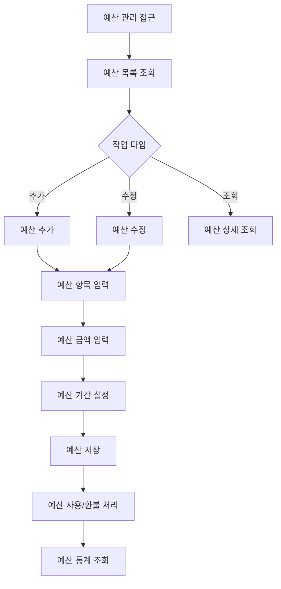

### 프로세스 설명

1. **예산 목록 조회**: 예산 목록 조회
2. **예산 추가/수정**: 예산 추가 또는 수정
3. **예산 정보 입력**: 예산 항목, 금액, 기간 입력
4. **예산 저장**: 예산 정보 저장
5. **예산 사용/환불**: 예산 사용 또는 환불 처리
6. **예산 통계 조회**: 예산 통계 조회

---

## 🔗 관련 문서

- [역할별 플로우차트](./PROCESS_FLOWCHARTS_BY_ROLE.md)
- [MindGarden 예시 플로우차트](./PROCESS_FLOWCHARTS_EXAMPLES_MINDGARDEN.md)
- [데이터 흐름도](./DATA_FLOW_DIAGRAM.md)

---

**마지막 업데이트**: 2025-11-21

## 📝 변경 이력

### v1.1.0 (2025-11-21)
- 테넌트 온보딩 프로세스 업데이트
  - 이메일 인증 단계 추가
  - 온보딩 완료 후 로그인 플로우 추가
  - 로그인 성공 시 테넌트 프로필 페이지로 자동 리다이렉트 추가
  - 테넌트 프로필 페이지에서 상태, 구독, 결제 수단 확인 및 관리 플로우 추가

