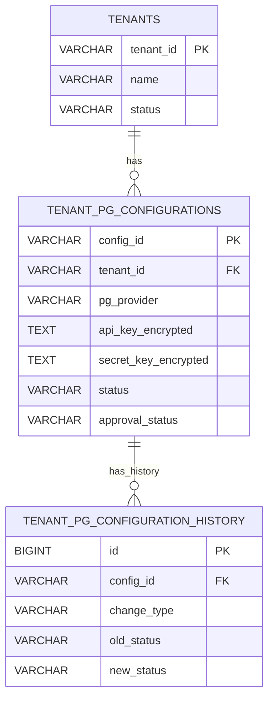
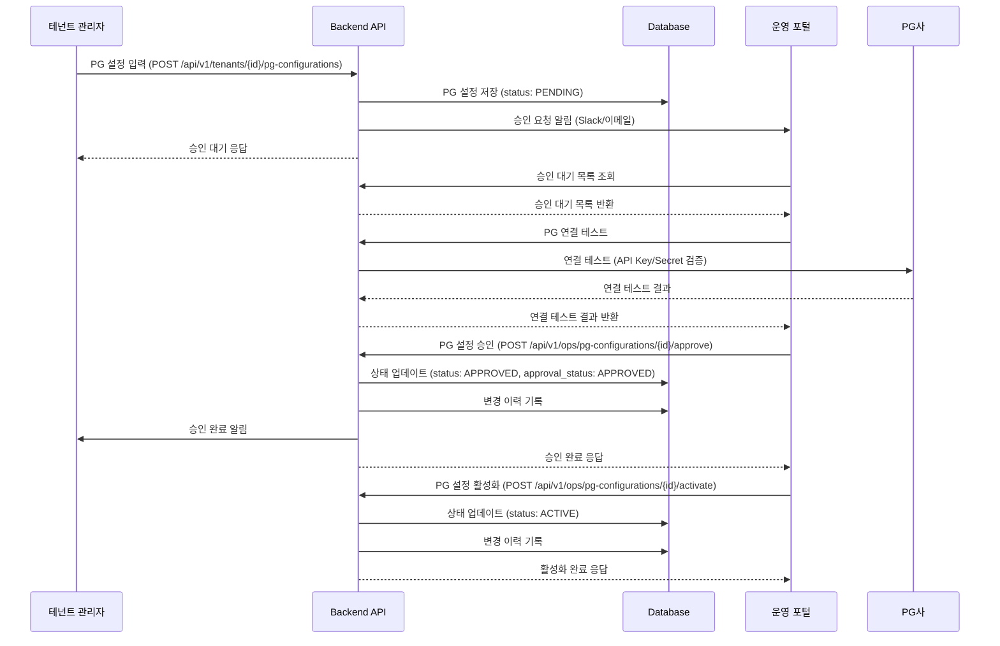
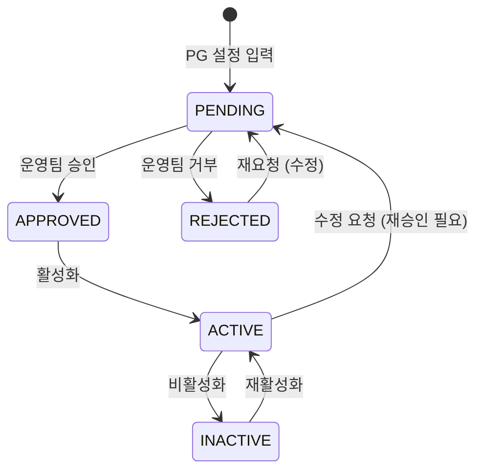

# 테넌트별 PG사 연계 승인 시스템 설계

**작성일:** 2025-01-XX  
**목적:** 각 입점사(테넌트)마다 PG사 연계 정보를 입력하고 승인 대기 후 활성화할 수 있는 시스템 구축

## 1. 배경 및 목적

### 1.1 배경
- 현재 PG 연동은 전역 설정으로만 관리됨
- 테넌트별로 다른 PG사 사용 불가
- 테넌트별 PG 설정 승인 프로세스 없음

### 1.2 목적
- 각 테넌트가 자체 PG사 연동 정보를 입력할 수 있도록 함
- 입력된 PG 정보는 승인 대기 상태로 저장
- 운영 포털에서 승인 후 활성화
- 승인된 PG 정보로 테넌트별 결제 처리

## 2. 요구사항

### 2.1 기능 요구사항
1. **테넌트 PG 설정 입력**
   - 테넌트 관리자가 PG사 선택 및 정보 입력
   - PG사별 필수 정보 입력 (API Key, Secret Key, Merchant ID 등)
   - 입력 정보 암호화 저장

2. **승인 대기 상태 관리**
   - PG 설정 입력 시 자동으로 `PENDING` 상태로 저장
   - 승인 대기 중인 PG 설정 목록 조회
   - 승인 대기 상태에서 수정 가능

3. **승인 프로세스**
   - 운영 포털에서 PG 설정 승인/거부
   - 승인 시 PG 정보 검증 (연결 테스트)
   - 승인 완료 시 `ACTIVE` 상태로 전환

4. **PG 설정 관리**
   - 승인된 PG 설정 활성화/비활성화
   - PG 설정 수정 (재승인 필요)
   - PG 설정 이력 관리

### 2.2 비기능 요구사항
- **보안**: PG 정보 암호화 저장 (민감 정보)
- **감사**: PG 설정 변경 이력 기록
- **알림**: 승인 요청 시 운영팀 알림
- **검증**: PG 연결 테스트 기능

## 3. 데이터베이스 설계

### 3.1 테넌트 PG 설정 테이블

```sql
-- 테넌트별 PG 설정 테이블
CREATE TABLE tenant_pg_configurations (
    id BIGINT AUTO_INCREMENT PRIMARY KEY,
    config_id VARCHAR(36) UNIQUE NOT NULL COMMENT 'PG 설정 UUID',
    tenant_id VARCHAR(36) NOT NULL COMMENT '테넌트 UUID',
    
    -- PG사 정보
    pg_provider VARCHAR(50) NOT NULL COMMENT 'PG사: TOSS, IAMPORT, KAKAO, NAVER, PAYPAL, STRIPE',
    pg_name VARCHAR(255) COMMENT 'PG사 명칭 (커스텀)',
    
    -- PG 인증 정보 (암호화 저장)
    api_key_encrypted TEXT NOT NULL COMMENT 'API Key (암호화)',
    secret_key_encrypted TEXT NOT NULL COMMENT 'Secret Key (암호화)',
    merchant_id VARCHAR(255) COMMENT 'Merchant ID',
    store_id VARCHAR(255) COMMENT 'Store ID',
    
    -- PG 설정 정보
    webhook_url VARCHAR(500) COMMENT 'Webhook URL',
    return_url VARCHAR(500) COMMENT 'Return URL',
    cancel_url VARCHAR(500) COMMENT 'Cancel URL',
    test_mode BOOLEAN DEFAULT FALSE COMMENT '테스트 모드 여부',
    
    -- 상태 관리
    status VARCHAR(20) NOT NULL DEFAULT 'PENDING' COMMENT '상태: PENDING, APPROVED, REJECTED, ACTIVE, INACTIVE',
    approval_status VARCHAR(20) DEFAULT 'PENDING' COMMENT '승인 상태: PENDING, APPROVED, REJECTED',
    
    -- 승인 정보
    requested_by VARCHAR(100) COMMENT '요청자',
    requested_at TIMESTAMP DEFAULT CURRENT_TIMESTAMP COMMENT '요청 시각',
    approved_by VARCHAR(100) COMMENT '승인자',
    approved_at TIMESTAMP NULL COMMENT '승인 시각',
    rejection_reason TEXT COMMENT '거부 사유',
    
    -- 검증 정보
    last_connection_test_at TIMESTAMP NULL COMMENT '마지막 연결 테스트 시각',
    connection_test_result VARCHAR(20) COMMENT '연결 테스트 결과: SUCCESS, FAILED',
    connection_test_message TEXT COMMENT '연결 테스트 메시지',
    
    -- 메타데이터
    settings_json JSON COMMENT 'PG별 추가 설정 (JSON)',
    notes TEXT COMMENT '비고',
    created_at TIMESTAMP DEFAULT CURRENT_TIMESTAMP,
    updated_at TIMESTAMP DEFAULT CURRENT_TIMESTAMP ON UPDATE CURRENT_TIMESTAMP,
    deleted_at TIMESTAMP NULL,
    is_deleted BOOLEAN DEFAULT FALSE,
    version BIGINT DEFAULT 0,
    created_by VARCHAR(100),
    updated_by VARCHAR(100),
    
    -- 인덱스
    INDEX idx_config_id (config_id),
    INDEX idx_tenant_id (tenant_id),
    INDEX idx_pg_provider (pg_provider),
    INDEX idx_status (status),
    INDEX idx_approval_status (approval_status),
    INDEX idx_requested_at (requested_at),
    INDEX idx_is_deleted (is_deleted),
    
    -- 제약조건
    CONSTRAINT chk_tenant_pg_status CHECK (status IN ('PENDING', 'APPROVED', 'REJECTED', 'ACTIVE', 'INACTIVE')),
    CONSTRAINT chk_tenant_pg_approval_status CHECK (approval_status IN ('PENDING', 'APPROVED', 'REJECTED')),
    CONSTRAINT chk_tenant_pg_provider CHECK (pg_provider IN ('TOSS', 'IAMPORT', 'KAKAO', 'NAVER', 'PAYPAL', 'STRIPE')),
    
    -- 외래키
    CONSTRAINT fk_tenant_pg_configurations_tenant 
    FOREIGN KEY (tenant_id) REFERENCES tenants(tenant_id) 
    ON DELETE RESTRICT ON UPDATE CASCADE
) ENGINE=InnoDB DEFAULT CHARSET=utf8mb4 COLLATE=utf8mb4_unicode_ci
COMMENT='테넌트별 PG 설정 테이블';

-- 테넌트 PG 설정 변경 이력
CREATE TABLE tenant_pg_configuration_history (
    id BIGINT AUTO_INCREMENT PRIMARY KEY,
    config_id VARCHAR(36) NOT NULL COMMENT 'PG 설정 UUID',
    change_type VARCHAR(50) NOT NULL COMMENT '변경 타입: CREATED, UPDATED, APPROVED, REJECTED, ACTIVATED, DEACTIVATED',
    change_description TEXT COMMENT '변경 설명',
    old_status VARCHAR(20) COMMENT '이전 상태',
    new_status VARCHAR(20) COMMENT '새 상태',
    changed_by VARCHAR(100) NOT NULL COMMENT '변경자',
    changed_at TIMESTAMP DEFAULT CURRENT_TIMESTAMP COMMENT '변경 시각',
    metadata_json JSON COMMENT '변경 메타데이터',
    
    INDEX idx_config_id (config_id),
    INDEX idx_change_type (change_type),
    INDEX idx_changed_at (changed_at),
    
    CONSTRAINT fk_tenant_pg_configuration_history_config 
    FOREIGN KEY (config_id) REFERENCES tenant_pg_configurations(config_id) 
    ON DELETE CASCADE ON UPDATE CASCADE
) ENGINE=InnoDB DEFAULT CHARSET=utf8mb4 COLLATE=utf8mb4_unicode_ci
COMMENT='테넌트 PG 설정 변경 이력 테이블';
```

### 3.2 ERD 관계



## 4. API 설계

### 4.1 테넌트 PG 설정 API

```yaml
# 테넌트 PG 설정 목록 조회
GET /api/v1/tenants/{tenantId}/pg-configurations
Query Parameters:
  - status: PENDING | APPROVED | REJECTED | ACTIVE | INACTIVE
  - approval_status: PENDING | APPROVED | REJECTED
Response: List<TenantPgConfigurationResponse>

# 테넌트 PG 설정 상세 조회
GET /api/v1/tenants/{tenantId}/pg-configurations/{configId}
Response: TenantPgConfigurationDetailResponse

# 테넌트 PG 설정 생성 (입력)
POST /api/v1/tenants/{tenantId}/pg-configurations
Request Body:
  - pg_provider: TOSS | IAMPORT | KAKAO | NAVER | PAYPAL | STRIPE
  - api_key: string (암호화하여 저장)
  - secret_key: string (암호화하여 저장)
  - merchant_id: string (optional)
  - store_id: string (optional)
  - webhook_url: string (optional)
  - return_url: string (optional)
  - cancel_url: string (optional)
  - test_mode: boolean
  - settings_json: object (optional)
Response: TenantPgConfigurationResponse

# 테넌트 PG 설정 수정
PUT /api/v1/tenants/{tenantId}/pg-configurations/{configId}
Request Body: (동일)
Response: TenantPgConfigurationResponse

# 테넌트 PG 설정 삭제
DELETE /api/v1/tenants/{tenantId}/pg-configurations/{configId}
Response: void

# PG 연결 테스트
POST /api/v1/tenants/{tenantId}/pg-configurations/{configId}/test-connection
Response: ConnectionTestResponse
```

### 4.2 운영 포털 승인 API

```yaml
# 승인 대기 중인 PG 설정 목록 조회
GET /api/v1/ops/pg-configurations/pending
Query Parameters:
  - tenant_id: string (optional)
  - pg_provider: TOSS | IAMPORT | ... (optional)
Response: List<TenantPgConfigurationResponse>

# PG 설정 승인
POST /api/v1/ops/pg-configurations/{configId}/approve
Request Body:
  - approved_by: string
  - approval_note: string (optional)
  - test_connection: boolean (default: true) - 승인 전 연결 테스트 여부
Response: TenantPgConfigurationResponse

# PG 설정 거부
POST /api/v1/ops/pg-configurations/{configId}/reject
Request Body:
  - rejected_by: string
  - rejection_reason: string (required)
Response: TenantPgConfigurationResponse

# PG 설정 활성화/비활성화
POST /api/v1/ops/pg-configurations/{configId}/activate
Response: TenantPgConfigurationResponse

POST /api/v1/ops/pg-configurations/{configId}/deactivate
Response: TenantPgConfigurationResponse

# PG 설정 변경 이력 조회
GET /api/v1/ops/pg-configurations/{configId}/history
Response: List<TenantPgConfigurationHistoryResponse>
```

## 5. 워크플로우

### 5.1 PG 설정 입력 및 승인 플로우



### 5.2 상태 전환 다이어그램



## 6. 보안 고려사항

### 6.1 암호화
- **API Key, Secret Key**: AES-256 암호화 저장
- **암호화 키 관리**: 환경변수 또는 Secrets Manager 사용
- **암호화 키 로테이션**: 정기적 키 로테이션 정책

### 6.2 접근 제어
- **테넌트 관리자**: 본인 테넌트의 PG 설정만 조회/수정 가능
- **운영 포털**: 모든 테넌트의 PG 설정 조회 및 승인 가능
- **API 인증**: JWT 토큰 기반 인증

### 6.3 감사 로그
- 모든 PG 설정 변경 이력 기록
- 승인/거부 이력 기록
- 연결 테스트 이력 기록

## 7. 구현 계획

### 7.1 Phase 1: 기본 기능 (2주)

**목표:** 테넌트 PG 설정 입력 및 승인 기본 기능 구현

**작업 내용:**
1. 데이터베이스 테이블 생성
2. 엔티티 및 Repository 구현
3. PG 설정 입력 API 구현
4. PG 설정 조회 API 구현
5. 운영 포털 승인 API 구현

### 7.2 Phase 2: 보안 및 검증 (1주)

**목표:** 보안 강화 및 PG 연결 테스트 기능

**작업 내용:**
1. PG 정보 암호화 구현
2. PG 연결 테스트 기능 구현
3. 접근 제어 구현
4. 감사 로그 구현

### 7.3 Phase 3: UI 구현 (2주)

**목표:** 테넌트 포털 및 운영 포털 UI 구현

**작업 내용:**
1. 테넌트 포털: PG 설정 입력 페이지
2. 운영 포털: PG 설정 승인 페이지
3. PG 설정 목록 및 상세 페이지
4. 알림 연동 (Slack/이메일)

### 7.4 Phase 4: 통합 및 테스트 (1주)

**목표:** 결제 시스템과 통합 및 테스트

**작업 내용:**
1. 결제 시스템과 통합 (테넌트별 PG 사용)
2. 통합 테스트
3. 성능 테스트
4. 문서화

## 8. 연계 문서

- `PG_INTEGRATION_GUIDE.md`: PG 연동 가이드
- `BILLING_DOMAIN_DESIGN.md`: 결제 도메인 설계
- `ONBOARDING_AND_BILLING_OVERVIEW.md`: 온보딩 및 결제 개요
- `internal-ops/feature/ONBOARDING_REGISTRATION_PLAN.md`: 온보딩 등록 계획

