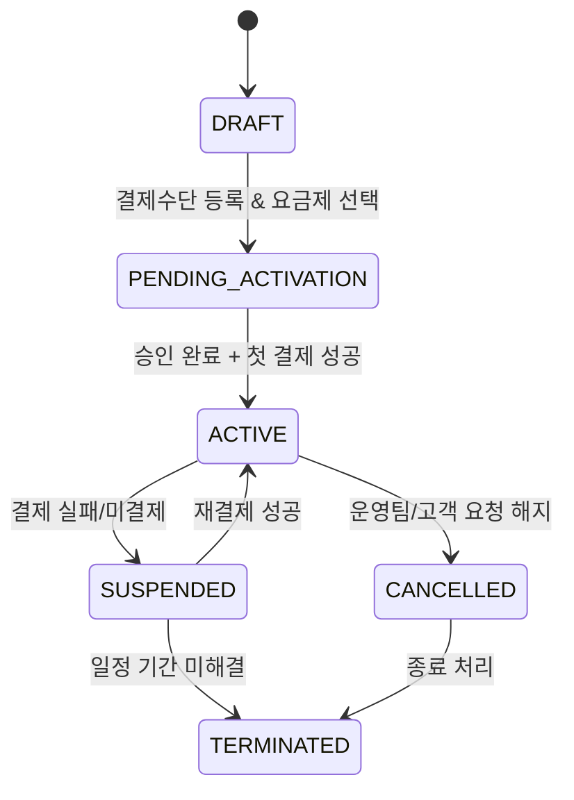

# 결제·구독 도메인 설계 (Draft)

작성일: 2025-11-13  
작성자: 운영 포털 v1 팀

---

## 1. 목적
- MindGarden SaaS의 자동 결제 및 구독 관리를 위한 도메인 구조, 데이터 모델, 상태 머신, API, 배치 로직을 정의한다.
- 외부 온보딩 흐름과 연계되어 **결제 정보 수집 → 구독 활성화 → 정기 결제 → 정산/영수** 과정을 안정적으로 운영하기 위한 기준을 마련한다.

---

## 2. 범위
- 초기 MVP 대상: 월 정기 결제(Subscription) + 선결제(Prepaid Add-on) 병행
- PG 연동은 토큰화 기반(카드 정보 미보관)으로 설계
- 테넌트/지점 단위 과금 지원, MindGarden 수수료(커미션) 계산 포함
- 향후 확장: 다중 PG, 복수 통화, Usage 기반 과금(토큰/건수) 등

---

## 3. 데이터 모델 개요

| 테이블 | 설명 | 비고 |
| --- | --- | --- |
| `ops_subscription` | 테넌트별 구독 기본 정보 (요금제, 시작/종료일, 결제 주기) | MindGarden HQ 통합 |
| `ops_subscription_cycle` | 구독 청구 주기별 기록 (청구일, 금액, 상태) | 결제 실패/재시도 관리 |
| `ops_subscription_payment` | 실제 결제 내역 (PG 결제 ID, 금액, 수수료, MindGarden 수익) | PG 연동 |
| `ops_payment_method` | 결제 수단 토큰, PG Provider, 만료일 | 민감 정보 → 암호화/토큰화 |
| `ops_addon_usage` | 애드온 사용량 기록(Usage 기반) | 월말 정산 |
| `ops_invoice` | 영수/세금계산서 정보 (발행 상태) | 회계 협의 예정 |

> 상세 컬럼 정의는 향후 ERD 문서(`DATA_CORE_AND_PL_SQL.md`)에 반영 예정.

---

## 4. 구독 상태 머신

| 상태 | 설명 | 전환 조건 |
| --- | --- | --- |
| `DRAFT` | 온보딩 중 요금제 선택 완료 전 | 신청서 생성 시 기본 |
| `PENDING_ACTIVATION` | 결제수단 등록 완료, 승인/첫 결제 대기 | 운영 승인 + PG 토큰 확보 |
| `ACTIVE` | 정상 이용 중 | 최초 결제 성공 |
| `SUSPENDED` | 결제 실패로 일시 중단 | 정기 결제 실패, 이용 제한 |
| `CANCELLED` | 고객/운영팀 해지 요청 | 즉시 과금 중단, 잔여 기간 처리 |
| `TERMINATED` | 완전 종료 | 서비스 이용 불가, 데이터 보존 정책 적용 |

---

## 5. 핵심 API 설계 (초안)

| 메서드 | 경로 | 설명 | 인증/권한 |
| --- | --- | --- | --- |
| `POST /api/v1/billing/subscriptions` | 구독 생성 (온보딩 연계) | 외부 페이지 → internal-api Gateway |
| `POST /api/v1/billing/payment-methods` | 카드/PG 토큰 등록 | Secure iframe/SDK |
| `POST /api/v1/billing/subscriptions/{id}/activate` | 승인 + 첫 결제 트리거 | Ops 관리자 |
| `POST /api/v1/billing/subscriptions/{id}/retry` | 결제 재시도 | 자동/수동 |
| `PATCH /api/v1/billing/subscriptions/{id}` | 요금제 변경/해지 요청 | 테넌트 관리자 |
| `GET /api/v1/billing/subscriptions/{id}/cycle` | 결제 주기/사용량 조회 | 테넌트/HQ |
| `POST /api/v1/billing/invoices/{cycleId}/issue` | 영수증/세금계산서 발행 | HQ 회계 |

- 모든 요청은 `X-Actor-Id`, `X-Actor-Role`, `X-Tenant-Id` 헤더 필수 (감사 로그 + 멀티테넌시)
- 응답 스키마는 OpenAPI 문서화 예정 (`ONBOARDING_AND_BILLING_OVERVIEW.md`에서 링크 예정)

---

## 6. 배치 & 자동화 플로우

| 배치명 | 빈도 | 주요 로직 | 알림/연동 |
| --- | --- | --- | --- |
| `subscription-cycle-job` | 매일 00:30 | 새 청구 주기 생성, 결제 예약 | Ops Slack, 이메일 |
| `payment-capture-job` | 매일 01:00 | PG 결제 실행, 성공/실패 기록 | PG Webhook 연동 |
| `payment-retry-job` | 실패 1/3/7일차 | 실패 건 재시도, SUSPENDED 처리 | 이메일 + SMS(향후) |
| `invoice-issue-job` | 월말 | 인보이스 생성, 세금계산서 연동 | 회계/정산 시스템 |

> 스케줄러는 Spring Batch + Quartz 기반 고려, 장기적으로 Event-driven(Kafka) 전환 검토.

---

## 7. 보안·컴플라이언스
- 카드 정보는 PG에 직접 전달, 서버에는 토큰/마스킹 정보만 저장
- 결제 관련 로그는 별도 보안 레벨(`mg-audit`)로 분리 → 테넌트별 필터 지원
- 개인정보 암호화 키 Rotation 정책 준수 (`SECURITY_POLICY.md`)
- 결제 실패/재시도·취소 요청은 감사 로그 필수 기록, 운영 포털에서 확인 가능
- PCI DSS 준수 검토 (장기 과제)

---

## 8. MindGarden 수익/커미션 정책
- `ops_subscription_payment`에 PG 수수료, MindGarden 커미션 금액, 정산 대상 금액 컬럼 분리
- MindGarden 커미션율은 요금제/애드온 별로 상이 → Pricing Plan/Addon 테이블 연계
- HQ 대시보드에서 커미션 누적, 환불/조정 이력 관리

---

## 9. 운영 시나리오 체크리스트
- [ ] 온보딩 승인 시 구독 자동 생성 여부 확인
- [ ] 첫 결제 실패 시 에스컬레이션 경로 정의 (Ops → 고객)
- [ ] 환불/부분 환불 프로세스 (PG API) 설계
- [ ] 결제 실패 다중 채널 알림 (이메일/SMS/앱 푸시) 정책 확정
- [ ] 세금계산서 발행/회계 연동 범위 확정

---

## 10. 연계 문서
- `docs/mgsb/feature/ONBOARDING_AND_BILLING_OVERVIEW.md` (상위 개요)
- `docs/mgsb/internal-ops/feature/ONBOARDING_REGISTRATION_PLAN.md` (온보딩 신청 UX)
- (작성 예정) `docs/mgsb/feature/PG_INTEGRATION_GUIDE.md`
- (작성 예정) `docs/mgsb/feature/OPS_SOP_ONBOARDING_BILLING.md`

---

## 11. 향후 과제
1. PG 연동 세부 가이드 작성 (SDK 선택, Webhook 보안, 테스트 시나리오)
2. 결제 실패 시 자동 SUSPENDED 처리 → 사용량 차단(Feature Flag) 연동
3. Usage 기반 과금(예: AI 토큰) 정산 로직과 통합
4. 환불/부분 환불 API 정의 및 Ops UI 반영
5. 국제화(통화/세금) 고려 사항 정리

---

