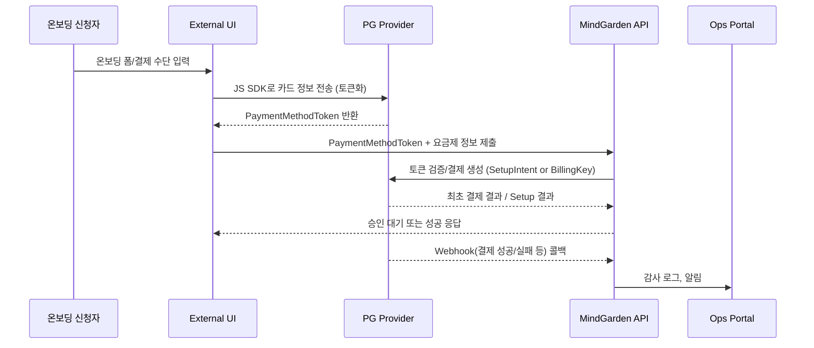

# PG 연동 가이드 (Draft)

작성일: 2025-11-13  
작성자: 운영 포털 v1 팀

---

## 1. 목적
- 코어(Core) 솔루션 SaaS 온보딩/정기 결제 흐름을 위해 PG(Payment Gateway) 연동 전략과 기술 요소를 정리한다.
- 카드 정보를 직접 저장하지 않고 토큰화 기반으로 안전하게 결제를 처리한다.
- 초기 MVP에서는 단일 PG(Stripe 또는 토스페이먼츠)로 시작하고, 향후 다중 PG·다중 통화 지원을 대비한다.

---

## 2. PG 선정 기준
- **토큰화 지원**: 카드 번호 대신 결제 토큰 사용 (PCI 부담 최소화)
- **정기 결제 API**: Subscription 관리, Webhook(Invoice/Payment) 제공
- **해외/국내 결제 범위**: 향후 해외 확장 대비 (국내 PG + Stripe 조합 고려)
- **수수료 구조**: 코어(Core) 솔루션 커미션 모델과의 궁합
- **정산 주기**: 코어(Core) 솔루션 정산 계획과 일치 여부
- **개발 Kit**: JS SDK, Webhook 보안, Sandbox 환경 등 개발 생산성

---

## 3. 연동 전체 흐름

---

## 4. 프런트엔드 구현

### 4.1 공개 온보딩 페이지
- Next.js(App Router) → PG JS SDK 로드 (Stripe Elements, 토스페이먼츠 인증결제 등)
- 카드 입력 Form과 코어(Core) 솔루션 요금제 선택 Form 분리, 결제 완료 시 **PaymentMethod Token** 획득
- **Security**: 카드 정보는 PG Iframe/Hosted Field에서 처리, 코어(Core) 솔루션 서버로 전송 금지
- 네트워크 실패 대비 재시도 UX 제공

### 4.2 저장 데이터
- MindGarden 서버로 전송: 토큰, 카드사/브랜드(마스킹), 만료월/년도(마스킹), 소유자 이름
- DB 저장 시 민감 정보는 암호화 또는 토큰 그대로 저장 (`ops_payment_method`)

---

## 5. 백엔드 연동

### 5.1 엔드포인트
| 메서드 | 경로 | 설명 |
| --- | --- | --- |
| `POST /api/v1/billing/payment-methods` | 결제 수단 토큰 등록 및 검증 |
| `POST /api/v1/billing/subscriptions` | 결제 토큰 + 요금제로 구독 생성 |
| `POST /api/v1/billing/subscriptions/{id}/activate` | 첫 결제 수행 (SetupIntent/Key 사용) |
| `POST /api/v1/billing/payments/webhook` | PG Webhook 수신 |

### 5.2 처리 순서
1. **토큰 저장**: PG API로 토큰 유효성 확인, `ops_payment_method`에 저장
2. **결제 준비**: Setup Intent/Billing Key 생성하여 정기 결제 준비 상태 진입
3. **첫 결제**: 온보딩 승인 시 첫 결제 API 호출 → 성공 시 구독 ACTIVE
4. **Webhook**: 결제 성공/실패, 환불, 구독 변경 이벤트 수신 → 감사 로그, 알림 발송

### 5.3 보안
- Webhook Endpoint: HMAC Signature 검증
- IP 화이트리스트(PG 제공 시) + Rate Limit
- 비밀 키, 서명 키는 Vault/환경변수에서 로딩 (`SECURITY_POLICY.md` 참고)

---

## 6. Webhook 이벤트 처리

| 이벤트 | 설명 | 처리 로직 |
| --- | --- | --- |
| `invoice.paid` / `payment.succeeded` | 정기 결제 성공 | `subscription_cycle` 상태 업데이트, 영수증 발행 준비 |
| `invoice.payment_failed` | 결제 실패 | 재시도 스케줄 생성, `SUSPENDED` 전환 검토 |
| `customer.subscription.deleted` | 구독 취소 | Ops/테넌트 요청과 동기화 |
| `charge.refunded` | 환불 | 회계 기록, 고객 알림 |

- 이벤트 별로 `OpsAuditLog` 남기고, Ops Portal 알림(슬랙/이메일) 트리거
- 실패 이벤트는 리트라이 정책(HTTP 500 시 PG가 재전송) 고려

---

## 7. 테스트 전략
- **Sandbox 계정**: 개발/스테이징 환경 분리, 실 카드 정보 사용 금지
- **자동화**: Postman/Newman 시나리오, Cypress E2E(온보딩 → 결제), PG 제공 Mock Server 사용
- **Webhook 테스트**: ngrok 등 터널링으로 로컬 테스트, Staging Webhook 엔드포인트 별도 구성
- **테스트 케이스**:
  - 결제 성공/실패/부분 성공
  - 구독 변경(업그레이드/다운그레이드)
  - 카드 만료, 갱신
  - 환불/부분 환불

---

## 8. 운영 고려 사항
- PG 관리자 페이지 접근 권한 관리 (Ops 운영팀 전용 계정)
- 정기적으로 결제 성공률/실패 사유 모니터링 → 대시보드 반영
- PG 장애 시 비상 플랜: 수동 결제 안내, retry 일시 중지
- 세금계산서 발행 시 PG 정산 데이터와 회계 시스템 매핑

---

## 9. 향후 확장
- 다중 PG 라우팅 (국내/해외·카드/계좌이체)
- 다중 통화 및 세율 적용
- Usage-based billing (AI 토큰, SMS 등) → 계량형 과금 연동
- Stored credentials (Card-on-file) 재인증 워크플로우
- PCI DSS 자체 인증 준비 (장기 과제)

---

## 10. 연계 문서
- `docs/mgsb/feature/ONBOARDING_AND_BILLING_OVERVIEW.md`
- `docs/mgsb/feature/BILLING_DOMAIN_DESIGN.md`
- `docs/mgsb/internal-ops/feature/ONBOARDING_REGISTRATION_PLAN.md`
- (작성 예정) `docs/mgsb/feature/OPS_SOP_ONBOARDING_BILLING.md`

---

