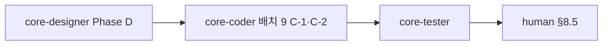

# 감정일기 → 상담사 수신함·푸시 오케스트레이션 (SSOT)

**작성일**: 2026-05-21 · **갱신**: 2026-05-22 (core-planner · **배치 9** SSOT)  
**작성자**: core-planner  
**상태**: **배치 8 코드 DONE** — **배치 9** 잔여: C-1·C-2(coder WIP) · 단위·Jest green · **human §8.5·CI PENDING** (§0)  
**범위**: 내담자 감정일기 `sharedWithConsultant` → `dispatchMoodJournalShared`(`mood_journal_shared`) + `GET /api/v1/mood-journals/inbox` + Expo `mood-journal-inbox` + 더보기 메뉴

---

## 0. 배치 9 진행 (2026-05-22) — **명시**

> **배치 9** = 배치 8 구현 이후 **잔여 게이트** (coder C-1·C-2 → tester 통합 재실행 → 사용자 push → CI → human §8.5).  
> **배치 9 CLOSED** = **CI green** + **human §8.5 PASS** + **C-1** Stack 반영 (§8·§9).

| 순서 | 담당 | 작업 | 완료 기준 | **tester** | **human** | **CI** | **planner** |
|------|------|------|-----------|:----------:|:---------:|:------:|:-----------:|
| **9-1** | **core-coder** | TEST_PLAN §7 **C-1** Stack `mood-journal-inbox` · **C-2** `SMS_API_KEY` test profile (`application-test.yml`·Schedule WIP **병렬**) | C-1: `(consultant)/(more)/_layout.tsx` `<Stack.Screen name="mood-journal-inbox" … />` · C-2: `MoodJournalControllerInboxIntegrationTest` ApplicationContext green | — | — | — | — |
| **9-2** | **core-tester** | `MOOD_JOURNAL_CONSULTANT_INBOX_TEST_PLAN.md` §3~§6 (**C-2 후** 통합 재실행) | 단위·Jest·통합·`pushNavigation` `mood_journal_shared` PASS → human §8.5 착수 승인 | **PARTIAL** — 단위·Jest **PASS**; 통합 **C-2 선행** | — | — | — |
| **9-3** | **human** | §8.5 스모크 3줄 | CLIENT 공유 ON → CONSULTANT 푸시 1건(`mood_journal_shared`) + **감정 일기 수신함** 1건; 재저장(이미 ON) 시 푸시 **추가 없음** | — | **PENDING** | — | — |
| **9-4** | **core-deployer / CI** | 사용자 **커밋·`develop` push** 후 코드 품질 검사 green | `mvn test`·Expo/Jest CI · test profile `SMS_API_KEY` 로딩 | — | — | **PENDING** | — |
| **9-5** | **core-planner** | 본 문서 §0·§8·§9 **배치 9** 기준 갱신 · SSOT↔코드 정합 | §0 진행 열·CLOSED 조건·다음 단계 표 | — | — | — | **DONE** |

### 배치 9 다음 단계 (CLOSED 전)

| 순서 | 담당 | 작업 | 게이트 |
|------|------|------|--------|
| **N-1** | **사용자** | 로컬 WIP(**C-1·C-2·Schedule** 등) **커밋·`develop` push** | coder 9-1 반영 후 |
| **N-2** | **core-deployer** | CI 코드 품질 검사 **green** | §0 **9-4** · `mvn test`·Jest |
| **N-3** | **human** | §8.5 스모크 **3줄 Pass** 기록 | §8·§9 **배치 9 CLOSED** 필수 |
| **N-4** | *(선택·1줄)* | Admin mobile **G4** cross-ref | [`ADMIN_MOBILE_COMMERCIALIZATION_ORCHESTRATION.md`](../ADMIN_MOBILE_COMMERCIALIZATION_ORCHESTRATION.md) G4 **CONDITIONAL** · EAS IPA **`79fbcd1b`** — **본 배치 범위 외·병렬** |

**2026-05-21 완료 (배치 8)**: inbox API·푸시·Expo 수신함·더보기·develop push  
**2026-05-22 잔여 (배치 9)**: §0 **9-1** coder · **9-2** 통합(C-2 후) · **9-3** human · **9-4** CI  
**선행**: [`CONSULTANT_CLIENT_APP_PLAN.md`](../CONSULTANT_CLIENT_APP_PLAN.md) Phase 4 (A) · [`MIND_WEATHER_UI_UX_SPEC.md`](../../design-system/v2/MIND_WEATHER_UI_UX_SPEC.md) · [`EXPO_NATIVE_APP_PLAN.md`](../EXPO_NATIVE_APP_PLAN.md) §13 API 표  
**위임 규칙**: [`CORE_PLANNER_DELEGATION_ORDER.md`](../CORE_PLANNER_DELEGATION_ORDER.md) — 메인·일반 어시스턴트 **코드 직접 수정 금지**, 구현·검증은 §6·§8 분배실행

---

## 목차

1. [목표](#1-목표)
2. [갭 분석](#2-갭-분석)
3. [범위](#3-범위)
4. [의존성·순서](#4-의존성순서)
5. [마음날씨 5항 체크리스트](#5-마음날씨-5항-체크리스트)
6. [분배실행 표 (Phase D·C·T)](#6-분배실행-표-phase-dct)
7. [블로커 B-PUSH · B-INBOX](#7-블로커-b-push--b-inbox)
8. [배치 9 — coder → tester → human §8.5](#8-배치-9--coder--tester--human-85)
9. [완료 기준](#9-완료-기준)
10. [참조·링크](#10-참조링크)

**디자이너 handoff (목차 1줄)**: [`MOOD_JOURNAL_CONSULTANT_INBOX_DESIGN_HANDOFF.md`](./MOOD_JOURNAL_CONSULTANT_INBOX_DESIGN_HANDOFF.md) — §1 개요·단일 플로우·수신함·카피·토큰 (Phase D 통합)

---

## 1. 목표

**한 줄**: 내담자가 감정일기를 남기고 **명시적 동의**(`sharedWithConsultant`)로 상담사에게 전달한 내용이, **전용 푸시**(`type=mood_journal_shared`)·**전용 수신함 API**(`GET /api/v1/mood-journals/inbox`)·Expo **`mood-journal-inbox`**·더보기 **「감정 일기 수신함」** 에 도착·표시·철회까지 끊기지 않게 한다. **마음날씨 수신함**(`mind-weather-inbox`·`mind_weather_shared`)과 **분리·병행** — 회귀만 유지(V4).

| 관점 | 목표 |
|------|------|
| **사용성** | 감정일기 저장 시 「공유」 토글이 상담사 **감정 일기 수신함**으로 직접 연결; 상담사는 **더보기 → 감정 일기 수신함** (`BookHeart`)으로 확인 (**마음 날씨 수신함** `CloudSun`과 별도 메뉴) |
| **푸시** | 공유 **false→true** 1회 시 **`MobilePushDispatchService.dispatchMoodJournalShared`** — 제목 「감정 일기 공유」, `data.type=mood_journal_shared`, `journalDate` dedupe — [`pushScenarios.ts`](../../../expo-app/src/constants/pushScenarios.ts) `MOOD_JOURNAL_SHARED_SCENARIO` 딥링크 `/(consultant)/(more)/mood-journal-inbox` |
| **정보 노출** | 수신함은 **mood·emoji·tags·memo**·내담자 표시명·날짜; **진단 아님** 고지 고정 ([`consultantMoodJournalInboxCopy.ts`](../../../expo-app/src/constants/consultantMoodJournalInboxCopy.ts)) |
| **레이아웃** | 내담자: `app/(client)/(wellness)/mood-journal/*` 작성·공유; 상담사: `mood-journal-inbox` + 더보기 — handoff [`MOOD_JOURNAL_CONSULTANT_INBOX_DESIGN_HANDOFF.md`](./MOOD_JOURNAL_CONSULTANT_INBOX_DESIGN_HANDOFF.md) |

---

## 2. 갭 분석

| # | 갭 | 현황 (2026-05-22) | 판정 |
|---|-----|-------------------|------|
| G1 | **inbox 파이프라인** | `MoodJournalServiceImpl.listInboxForConsultant` · `GET /api/v1/mood-journals/inbox` · `moodJournalEntryRepository.findInboxForConsultant` | **CLOSED** |
| G2 | **푸시 발화** | `maybeDispatchSharePush` → `dispatchMoodJournalShared` (`false→true` 1회, 멱등) | **CLOSED** |
| G3 | **UX 이중 경로** | 감정일기 토글 vs 마음날씨 share — **별도 inbox·푸시 type**으로 분리; 단일 플로우 handoff는 **P2** | **DEFER** |
| G4 | **inbox·더보기** | Expo `mood-journal-inbox.tsx` · 더보기 `CONSULTANT_MOOD_JOURNAL_INBOX_COPY.MENU_*` · API 연동 | **CLOSED** |
| G5 | **웹 상담사 수신함** | 웹 `ConsultantMoodJournalInbox` **미구현** — Expo 우선 | **OUT OF SCOPE** |
| G6 | **매칭·테넌트** | `consultantClientShareSupport.resolveTargetConsultant` · `assertConsultantMappedToClient` | **CLOSED** |
| G7 | **검증·게이트** | 배치 9: 단위·Jest **PASS**; 통합 **C-2 선행**; C-1 Stack **WIP**; human §8.5·CI **PENDING** | **PARTIAL** |

**구현 상태 스냅샷 (2026-05-22 · 코드 팩트)**

| 계층 | 자산 | 상태 |
|------|------|------|
| 백엔드 | `GET /api/v1/mood-journals/inbox` · `dispatchMoodJournalShared` · `MobilePushCanonicalTypes.MOOD_JOURNAL_SHARED` | ✅ |
| Expo 내담자 | `app/(client)/(wellness)/mood-journal/*` · CRUD·공유 토글 | ✅ |
| Expo 상담사 | `/(consultant)/(more)/mood-journal-inbox` · 더보기 「감정 일기 수신함」 | ✅ |
| 푸시 시나리오 | `pushScenarios.ts` `mood_journal_shared` → `mood-journal-inbox` | ✅ |
| 마음날씨 회귀 | `mind-weather/inbox` · `mind_weather_shared` · `mind-weather-inbox` | ✅ **별도 트랙** (V4) |
| 테스트 | `MoodJournalServiceImplSharePushTest` · `MobilePushDispatchServiceImplTest#dispatchMoodJournalShared_*` · `pushNavigation` | ✅ 단위·Jest |
| 테스트 | `MoodJournalControllerInboxIntegrationTest` | ⏳ **C-2** (`SMS_API_KEY` test profile — coder WIP) |

---

## 3. 범위

### 포함

- 감정일기 **`sharedWithConsultant`** → **`dispatchMoodJournalShared`** → `GET /api/v1/mood-journals/inbox` → Expo `mood-journal-inbox` + 더보기
- 백엔드: `MoodJournalServiceImpl` · `MoodJournalController.inbox` · `MobilePushDispatchServiceImpl.dispatchMoodJournalShared`
- 프라이버시·동의·철회·매칭·테넌트 — `consultantClientShareSupport` 재사용
- 테스트 플랜·통합 테스트·**human §8.5** 스모크 3줄
- 마음날씨 inbox **회귀**(V4) — 본 배치 범위 밖·깨지지 않음만 확인

### 제외

- 마음 정원(Phase 4-B)·음성/STT 전체
- 어드민 마음날씨 관측 변경
- ERP·어드민 LNB·하드코딩 대량 정리 ([`HARDCODE_CLEANUP_HOTZONE_INVENTORY.md`](./HARDCODE_CLEANUP_HOTZONE_INVENTORY.md))
- **코드 커밋** — 본 문서 작성자(기획)는 커밋하지 않음

---

## 4. 의존성·순서

| 순서 | 담당 | 병렬 | 비고 |
|------|------|------|------|
| 0 | `explore` (선택) | — | G1 연동 지점 인벤토리 |
| 1 | **`core-designer`** Phase D | ✅ **배치 8과 동시 착수** · **DONE** | [`MOOD_JOURNAL_CONSULTANT_INBOX_DESIGN_HANDOFF.md`](./MOOD_JOURNAL_CONSULTANT_INBOX_DESIGN_HANDOFF.md) |
| 2 | **`core-coder`** 배치 8 ✅ · **배치 9** C-1·C-2 | — | B-PUSH·B-INBOX 코드 **DONE** · Stack·`SMS_API_KEY` 잔여 |
| 3 | **`core-tester`** | — | §9 게이트 (**코더 산출물 필요**) |
| 4 | **human** | — | §8.5 스모크 3줄 (**tester 자동 PASS 후**) |

**필수 참조 (위임 프롬프트에 경로 포함)**

- [`COMMON_DISPLAY_BOUNDARY_MEETING_20260322.md`](../COMMON_DISPLAY_BOUNDARY_MEETING_20260322.md)
- [`EXPO_APP_METRO_ALIAS_AND_MMKV_HANDOFF.md`](../EXPO_APP_METRO_ALIAS_AND_MMKV_HANDOFF.md) §5
- [`PRE_PRODUCTION_GO_LIVE_CHECKLIST.md`](../../운영반영/PRE_PRODUCTION_GO_LIVE_CHECKLIST.md) · [`ADMIN_LNB_LAYOUT_UNIFICATION_MEETING_HANDOFF.md`](../ADMIN_LNB_LAYOUT_UNIFICATION_MEETING_HANDOFF.md) §17
- 스킬: `/core-solution-frontend`, `/core-solution-api`, `/core-solution-multi-tenant`, `/core-solution-testing`

---

## 5. 마음날씨 5항 체크리스트

> `CONSULTANT_CLIENT_APP_PLAN.md` Phase 4 **(A) 마음 날씨** 5항. 본 배치 **완료 판정**에 사용.

| # | 항목 | 완료 기준 (요약) | 검증 주체 |
|---|------|------------------|-----------|
| **MW-1** | **입력** | 감정일기 CRUD·`sharedWithConsultant` 저장·매칭 검증 | coder ✅ + tester 단위 ✅ |
| **MW-2** | **분석 결과** | mood·emoji·tags·memo·**진단 아님** 고지 (수신함 카피) | designer ✅ + tester |
| **MW-3** | **트렌드(선택)** | **P2** — **DEFER** | planner |
| **MW-4** | **상담사 브릿지** | 공유 ON → `mood-journals/inbox` 1건·더보기·푸시 딥링크; OFF → 미노출 | tester + human §8.5 **PENDING** |
| **MW-5** | **거버넌스** | 테넌트·매칭·**`dispatchMoodJournalShared` 1회**·멱등 | tester 단위 ✅ · human **PENDING** |

---

## 6. 분배실행 표 (Phase D·C·T)

> UI handoff: `model: "gemini-3.1-pro"` 권장.

### Phase D — `core-designer` (배치 8과 병렬)

**상태**: **DONE** — [`MOOD_JOURNAL_CONSULTANT_INBOX_DESIGN_HANDOFF.md`](./MOOD_JOURNAL_CONSULTANT_INBOX_DESIGN_HANDOFF.md) (2026-05-22 라우트·type 정합 갱신)

**목표**: 감정일기·수신함·더보기 UX handoff.

**완료 조건**: handoff § Push — `mood_journal_shared` · `mood-journal-inbox` 랜딩 ✅

---

### Phase C — `core-coder` (배치 8 · B-PUSH·B-INBOX)

**상태**: **DONE** (2026-05-21 develop)

**목표**: G1·G2·G4 해소 — 전용 inbox API·`dispatchMoodJournalShared`·Expo 수신함·더보기.

**산출 (코드 팩트)**:

- `MoodJournalController` `GET /inbox` · `MoodJournalServiceImpl.listInboxForConsultant` · `maybeDispatchSharePush`
- `MobilePushDispatchServiceImpl.dispatchMoodJournalShared` · `MobilePushCanonicalTypes.MOOD_JOURNAL_SHARED`
- Expo: `mood-journal-inbox.tsx` · `(more)/index.tsx` · `pushScenarios.ts` · `endpoints.ts` `MOOD_JOURNAL_API.CONSULTANT_INBOX`

**완료 조건**: §9.1 기능 항목 **코드 기준 충족** · B-PUSH·B-INBOX **CLOSED**

---

### Phase T — `core-tester` (배치 9 · C-2 후 통합 재실행)

**상태**: **PARTIAL** — 단위·Jest ✅ · 통합 **C-2 선행** · human·CI ⏳

**목표**: [`MOOD_JOURNAL_CONSULTANT_INBOX_TEST_PLAN.md`](../MOOD_JOURNAL_CONSULTANT_INBOX_TEST_PLAN.md) 자동 게이트 → human §8.5 handoff.

**전달 프롬프트 요약** (잔여):

> MindGarden — 감정일기→수신함·푸시 테스트 재실행.  
> SSOT: 본 문서 §9 · §8.5.  
> 자동: `MoodJournalControllerInboxIntegrationTest` (**선행: test profile `SMS_API_KEY`**) · `MoodJournalServiceImplSharePushTest` · `MobilePushDispatchServiceImplTest#dispatchMoodJournalShared_*` · `npm run test:utils -- pushNavigation`.  
> 회귀: `MindWeatherControllerInboxIntegrationTest` (V4).  
> human용 §8.5 스모크 3줄 — **`mood_journal_shared`** · **`mood-journal-inbox`**.

**완료 조건**: 테스트 플랜 §3 전항 PASS + §8.5 human 착수 가능

---

## 7. 블로커 B-PUSH · B-INBOX

| ID | 블로커 | 담당 | 상태 | 해소 조건 |
|----|--------|------|------|-----------|
| **B-PUSH** | 감정일기 공유 시 **`dispatchMoodJournalShared`** 푸시 | **core-coder** ✅ → **core-tester** → **human** | **CLOSED (코드)** · human **PENDING** | false→true → `type=mood_journal_shared`·title 「감정 일기 공유」·`journalDate` dedupe; Jest `pushNavigation` PASS; human §8.5 |
| **B-INBOX** | 상담사 **`GET /api/v1/mood-journals/inbox`** · Expo `mood-journal-inbox` | **core-coder** ✅ → **배치 9** C-1·C-2 → **core-tester** → **human** | **CLOSED (코드)** · C-1 Stack **WIP** · 통합 **C-2 선행** | inbox·더보기·철회 · 통합 PASS · human §8.5 → **배치 9 CLOSED** |

**B-PUSH SSOT (코드 팩트)**

| 항목 | 값 |
|------|-----|
| 발화 | `MobilePushDispatchServiceImpl.dispatchMoodJournalShared` |
| `data.type` | `mood_journal_shared` (`MobilePushCanonicalTypes.MOOD_JOURNAL_SHARED`) |
| 딥링크 | `/(consultant)/(more)/mood-journal-inbox` (`pushScenarios.ts` `MOOD_JOURNAL_SHARED_SCENARIO`) |
| 트리거 | `MoodJournalServiceImpl.maybeDispatchSharePush` — `sharedWithConsultant` **false→true** 직후 |
| 멱등 | 이미 ON 상태 재저장 시 **미발송** (`MoodJournalServiceImplSharePushTest`) |

**B-INBOX SSOT**

| 항목 | 값 |
|------|-----|
| API | `GET /api/v1/mood-journals/inbox` |
| Expo 목록 | `app/(consultant)/(more)/mood-journal-inbox.tsx` |
| 더보기 | `app/(consultant)/(more)/index.tsx` — `CONSULTANT_MOOD_JOURNAL_INBOX_COPY.MENU_TITLE` (`BookHeart`) |
| 카피·고지 | `expo-app/src/constants/consultantMoodJournalInboxCopy.ts` |
| 웹 | **미구현** (Expo 우선 · G5 OUT OF SCOPE) |

> **마음날씨 (별도)**: `mind_weather_shared` → `mind-weather-inbox` — V4 회귀만 유지. 감정일기와 **inbox·푸시 type 혼합 없음**.

---

## 8. 배치 9 — coder → tester → human §8.5

> **배치 8** (2026-05-21): E2E 구현·develop push — **코드 DONE**.  
> **배치 9** (2026-05-22): 잔여 게이트 — **C-1** Stack · **C-2** `SMS_API_KEY` → tester 통합 → 사용자 push → CI → human §8.5.  
> **배치 9 CLOSED** = **CI green** + **human §8.5 PASS** + **C-1** `(more)/_layout.tsx` Stack `mood-journal-inbox` 반영.

| 순서 | 역할 | 입력 | 산출·게이트 |
|------|------|------|-------------|
| **9-1** | **core-coder** | TEST_PLAN §7 C-1·C-2 · Schedule WIP **병렬** | C-1 Stack.Screen · C-2 통합 ApplicationContext green |
| **9-2** | **core-tester** | 9-1 merge · §0 **9-2** | 단위·Jest **PASS** ✅; 통합·`pushNavigation` PASS(post C-2) → human §8.5 착수 승인 |
| **9-3** | **human** | 9-2 PASS · 9-4 CI green · dev APK/IPA(CONSULTANT+CLIENT) | §8.5 스모크 3줄 Pass/Fail 기록 → **배치 9 CLOSED** |

### 배치 8 (참고·완료)

| 순서 | 역할 | 산출 |
|------|------|------|
| **8-1** | **core-coder** | G1·G2·G4 · B-PUSH·B-INBOX 코드 **DONE** (2026-05-21) |

### 8.5 human 스모크 — QA 3줄 (CONSULTANT · `mood_journal_shared`)

**대상**: 매칭된 **CLIENT** + **CONSULTANT** 실기기 · dev `https://dev.core-solution.co.kr` · 푸시 토큰 등록 선행 ([`PAYMENT_SCHEDULE…UAT` §8.5 E1](../PAYMENT_SCHEDULE_NOTIFICATION_PUSH_UAT_REPORT.md) 동일 선행). Admin mobile G4(`79fbcd1b`)와 **병렬 가능** — 역할·앱 셸 분리.

1. **CLIENT** — 감정일기 작성 → **공유 ON** 저장 → 성공(에러 토스트 없음).
2. **CONSULTANT** — OS 푸시 1건(`mood_journal_shared` / 「감정 일기 공유」) → 탭 시 `/(consultant)/(more)/mood-journal-inbox` 진입.
3. **CONSULTANT** — **감정 일기 수신함** **1건** · mood·memo(또는 tags) 표시 · 공유 OFF 저장 후 **미노출** · 재저장(이미 ON) 시 푸시 **추가 없음** · 콘솔 React #130 **0건**.

**판정**: 3줄 전항 Pass → B-PUSH·B-INBOX **human CLOSED** · MW-4·MW-5 human 확인. 1항목 Fail → `core-debugger` + `core-coder` 재위임.

---

## 9. 완료 기준

> **배치 9 CLOSED** (본 문서·기능 트랙 종료): **CI green** (§0 **9-4**) + **human §8.5 3줄 Pass** (§8.5) + **C-1** Expo `(consultant)/(more)/_layout.tsx` Stack `mood-journal-inbox` 반영.  
> 배치 8 코드 항목(§9.1~9.2 대부분)은 **DONE** — 아래 미체크는 배치 9 게이트.

### 9.1 기능

- [x] **MW-1** — CRUD·`sharedWithConsultant`·매칭
- [x] **MW-2** — 수신함 카피·진단 아님 고지
- [ ] **MW-3** — **DEFER** (트렌드 P2)
- [ ] **MW-4** — human §8.5 **PENDING**
- [x] **MW-5** — 단위 멱등·매칭 (human **PENDING**)
- [x] **B-PUSH** CLOSED (코드) — `dispatchMoodJournalShared`
- [x] **B-INBOX** CLOSED (코드) — `mood-journals/inbox`·`mood-journal-inbox`
- [x] 내담자: 공유 ON → 상담사 inbox **동일 tenant·매칭** (코드)
- [x] 내담자: 공유 OFF → inbox **미노출** (코드)
- [x] 푸시: false→true **`dispatchMoodJournalShared` 1회** (단위 PASS)

### 9.2 품질·표준

- [ ] `mvn -q -Dtest=MoodJournalControllerInboxIntegrationTest test` PASS — **배치 9 C-2** 선행
- [ ] **C-1** — `(consultant)/(more)/_layout.tsx` Stack `mood-journal-inbox` 등록 — **WIP** (coder)
- [x] `MoodJournalServiceImplSharePushTest` · `MobilePushDispatchServiceImplTest#dispatchMoodJournalShared_*` PASS
- [x] Expo `npm run test:utils -- pushNavigation` PASS (`mood_journal_shared` → `mood-journal-inbox`)
- [ ] React #130·`safeDisplay` — human 수신함 **0건** 확인 **PENDING**
- [ ] expo-app·본 배치 touch 하드코딩 — 운영 게이트 **0건** (별도 스캔)

### 9.3 문서

- [x] [`MOOD_JOURNAL_CONSULTANT_INBOX_DESIGN_HANDOFF.md`](./MOOD_JOURNAL_CONSULTANT_INBOX_DESIGN_HANDOFF.md) — 라우트·type **2026-05-22 정합**
- [x] `MOOD_JOURNAL_CONSULTANT_INBOX_TEST_PLAN.md` 존재 (§3 판정 **갱신 잔여**)
- [ ] `CONSULTANT_CLIENT_APP_PLAN` 감정일기 inbox **「구현됨」** 정정
- [x] `expo-app/src/api/endpoints.ts` `MOOD_JOURNAL_API.CONSULTANT_INBOX` 반영

### 9.4 배치 9 human · CI

- [ ] §8.5 스모크 **3줄** Pass 기록 (또는 BLOCKED 사유·재일정) — **human CLOSED 필수**
- [ ] **CI green** — 사용자 push 후 deployer 검증 (§0 **9-4**)
- [ ] **C-1** Stack 반영 확인 (tester §6.1 또는 coder merge)

### 9.5 배치 9 완료 보고

**CLOSED 조건 충족 시** 기획 취합 1장: B-PUSH·B-INBOX · MW-5항 · §8.5 Pass · CI green · C-1·C-2 · 잔여 리스크(Admin G4 등 **범위 외** 1줄).

---

## 10. 참조·링크

| 문서 | 용도 |
|------|------|
| [`MOOD_JOURNAL_CONSULTANT_INBOX_DESIGN_HANDOFF.md`](./MOOD_JOURNAL_CONSULTANT_INBOX_DESIGN_HANDOFF.md) | Phase D UX — **목차 1줄** §1 |
| [`MIND_WEATHER_UI_UX_SPEC.md`](../../design-system/v2/MIND_WEATHER_UI_UX_SPEC.md) | 시각·컴포넌트·카피 |
| [`CONSULTANT_CLIENT_APP_PLAN.md`](../CONSULTANT_CLIENT_APP_PLAN.md) | Phase 4 (A) |
| [`PAYMENT_SCHEDULE_NOTIFICATION_PUSH_UAT_REPORT.md`](../PAYMENT_SCHEDULE_NOTIFICATION_PUSH_UAT_REPORT.md) §8.5 | 푸시 토큰·dev 선행 (CLIENT) |
| [`ADMIN_MOBILE_MVP_TEST_PLAN.md`](../ADMIN_MOBILE_MVP_TEST_PLAN.md) §5.2 | `MindWeatherControllerInboxIntegrationTest` |
| [`CORE_PLANNER_DELEGATION_ORDER.md`](../CORE_PLANNER_DELEGATION_ORDER.md) | 직접 수정 금지·테스터 게이트 |

---

## core-tester 게이트 (배치 9 종료 3줄)

1. **코드 변경 배치는 `core-tester` 없이 완료 보고 금지** (`CORE_PLANNER_DELEGATION_ORDER.md`).
2. **자동**: C-2 후 `MoodJournalControllerInboxIntegrationTest` PASS + 단위·`pushNavigation` `mood_journal_shared` PASS + V4 회귀; **C-1** Stack 등록 점검.
3. **수동·CI**: §8.5 human 3줄 Pass + **CI green** → **배치 9 CLOSED** (§9 상단).
