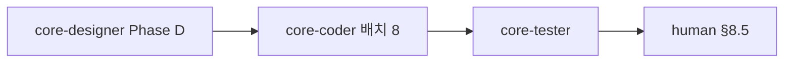

# 감정일기 → 상담사 수신함·푸시 오케스트레이션 (SSOT)

**작성일**: 2026-05-21  
**작성자**: core-planner  
**상태**: **WIP 커밋됨 (2026-05-21)** — 구현·단위 테스트 green · **내일(§0) 테스터·human·CI 잔여**  
**범위**: 내담자 감정일기 `sharedWithConsultant` → `dispatchMoodJournalShared`(`mood_journal_shared`) + `GET /api/v1/mood-journals/inbox` + Expo `mood-journal-inbox` + 더보기 메뉴

---

## 0. 내일 반드시 할 일 (2026-05-22) — **명시**

| 순서 | 담당 | 작업 | 완료 기준 |
|------|------|------|-----------|
| **1** | **core-tester** | `MOOD_JOURNAL_CONSULTANT_INBOX_TEST_PLAN.md` §3~§6 재실행·BLOCKED 해제 | `MoodJournalControllerInboxIntegrationTest`·`MoodJournalServiceImplSharePushTest`·`MobilePushDispatchServiceImplTest` PASS; `pushNavigation` `mood_journal_shared` PASS |
| **2** | **human** | §8.5 스모크 3줄 | CLIENT 공유 ON → CONSULTANT 푸시 1건 + **감정 일기 수신함** 1건; 재저장(이미 ON) 시 푸시 **추가 없음** |
| **3** | **core-deployer / CI** | `develop` push 후 **코드 품질 검사** green | `mvn test`·`SMS_API_KEY` test profile (별도 WIP 있으면 선행 커밋) |
| **4** | **core-planner** | 본 문서 §1 목표를 `mood_journal_shared`·`mood-journal-inbox` 팩트로 정리 (구식 `mind_weather` only 문구 제거) | SSOT와 코드 일치 |

**오늘(2026-05-21) 완료**: inbox API·푸시·Expo 수신함·더보기 메뉴·문서 — **develop push 완료 후 위 4항은 내일 게이트**  
**선행**: [`CONSULTANT_CLIENT_APP_PLAN.md`](../CONSULTANT_CLIENT_APP_PLAN.md) Phase 4 (A) · [`MIND_WEATHER_UI_UX_SPEC.md`](../../design-system/v2/MIND_WEATHER_UI_UX_SPEC.md) · [`EXPO_NATIVE_APP_PLAN.md`](../EXPO_NATIVE_APP_PLAN.md) §13 API 표  
**위임 규칙**: [`CORE_PLANNER_DELEGATION_ORDER.md`](../CORE_PLANNER_DELEGATION_ORDER.md) — 메인·일반 어시스턴트 **코드 직접 수정 금지**, 구현·검증은 §6·§8 분배실행

---

## 목차

1. [목표](#1-목표)
2. [갭 분석](#2-갭-분석)
3. [범위](#3-범위)
4. [의존성·순서](#4-의존성순서)
5. [마음날씨 5항 체크리스트](#5-마음날씨-5항-체크리스트)
6. [분배실행 표 (Phase D·C·T)](#6-분배실행-표-phase-dct)
7. [블로커 B-PUSH · B-INBOX](#7-블로커-b-push--b-inbox)
8. [배치 8 — coder → tester → human §8.5](#8-배치-8--coder--tester--human-85)
9. [완료 기준](#9-완료-기준)
10. [참조·링크](#10-참조링크)

**디자이너 handoff (목차 1줄)**: [`MOOD_JOURNAL_CONSULTANT_INBOX_DESIGN_HANDOFF.md`](./MOOD_JOURNAL_CONSULTANT_INBOX_DESIGN_HANDOFF.md) — §1 개요·단일 플로우·수신함·카피·토큰 (Phase D 통합)

---

## 1. 목표

**한 줄**: 내담자가 감정일기를 남기고 **명시적 동의**로 상담사에게 전달한 내용이, **`MindWeatherServiceImpl.share` → `dispatchMindWeatherShared`와 동일 계열** 푸시(`type=mind_weather_shared`)와 상담사 **수신함·더보기 메뉴**에 **동일 계약**으로 도착·표시·철회까지 끊기지 않게 한다.

| 관점 | 목표 |
|------|------|
| **사용성** | 감정일기 저장 시 「공유」의 의미가 **마음 날씨 카드 + 옵트인**과 일치; 상담사는 **한 곳(수신함)** + **더보기 → 마음 날씨 수신함** 으로만 확인 |
| **푸시** | 공유 성공 시 **`MobilePushDispatchService.dispatchMindWeatherShared`** 1회 — 제목 「마음 날씨 공유」, `data.type=mind_weather_shared`, `cardId` — [`pushScenarios.ts`](../../../expo-app/src/constants/pushScenarios.ts) `MIND_WEATHER_SHARED_SCENARIO` 딥링크 `/(consultant)/(more)/mind-weather-inbox` |
| **정보 노출** | 수신함은 **요약·키워드·메타** 기본; **원문**은 별도 동의 시에만; `source=mood-journal` 라벨; 진단 아님 고지 고정 |
| **레이아웃** | 내담자: 일기 작성 → (필요 시) 분석·공유; 상담사: `mind-weather-inbox` + 더보기 메뉴 — [`MIND_WEATHER_UI_UX_SPEC.md`](../../design-system/v2/MIND_WEATHER_UI_UX_SPEC.md) §2 |

---

## 2. 갭 분석

| # | 갭 | 현황 | 목표 |
|---|-----|------|------|
| G1 | **파이프라인 단절** | `mood_journal_entries.shared_with_consultant` 저장만; **수신함**은 `mind_weather_cards` + `shareSummary=true` 만 조회 | 일기 저장(+공유 ON) → **analyze(`source=mood-journal`, `sourceRefId`) → share(요약 ON)** → **`dispatchMindWeatherShared`** 단일 오케스트레이션 |
| G2 | **푸시 미발화** | `dispatchMindWeatherShared`는 `MindWeatherServiceImpl.share`에서만 호출 | 감정일기 공유 경로에서도 **동일 메서드·동일 payload** — 신규 push type **금지** |
| G3 | **UX 이중 경로** | Expo `mood-journal/create` 공유 토글 vs `mind-weather` 공유 바텀시트 | [`MOOD_JOURNAL_CONSULTANT_INBOX_DESIGN_HANDOFF.md`](./MOOD_JOURNAL_CONSULTANT_INBOX_DESIGN_HANDOFF.md) **단일 플로우** |
| G4 | **inbox·더보기** | Expo `mind-weather-inbox.tsx`·더보기 「마음 날씨 수신함」 **UI 존재**; 데이터는 G1 미연동 | 공유 ON 후 inbox 1건·`source=mood-journal` 표기; 푸시 탭 → 동일 화면 |
| G5 | **웹 상담사 수신함** | `ConsultantMindWeatherInboxPage` + `consultantMindWeatherInboxClient` | 웹·Expo **동일 JSON**·`safeDisplay` |
| G6 | **매칭·테넌트** | `resolveTargetConsultant`·매핑 검증 있음 | 감정일기 경로 **동일 규칙** |
| G7 | **검증·게이트** | `MindWeatherControllerInboxIntegrationTest` 존재; 일기→inbox·푸시 **시나리오 없음** | §9·배치 8 `core-tester` + **human §8.5** |

**구현 상태 스냅샷 (2026-05-21)**

| 계층 | 자산 | 상태 |
|------|------|------|
| 백엔드 | `/api/v1/mood-journals`, `/api/v1/mind-weather/*`, `/inbox`, `dispatchMindWeatherShared` | ✅ API·푸시 **존재** |
| Expo 내담자 | `app/(client)/(wellness)/mood-journal/*` | ✅ CRUD·공유 토글 UI |
| Expo 상담사 | `/(consultant)/(more)/mind-weather-inbox`, 더보기 `CloudSun` 메뉴 | ✅ UI · ❌ G1 데이터 |
| 푸시 시나리오 | `pushScenarios.ts` `mind_weather_shared` → inbox | ✅ · ❌ G2 발화 |
| 연동 | 일기 저장 → analyze/share/push | ❌ **배치 8 핵심 (B-PUSH·B-INBOX)** |

---

## 3. 범위

### 포함

- 감정일기 → analyze·share → **`dispatchMindWeatherShared`** → 상담사 inbox + 더보기 (Expo 우선, 웹 수신함 회귀)
- 백엔드: 오케스트레이션 API 또는 서비스 연동 (`core-coder` 설계)
- 프라이버시·동의·철회·푸시 **마음날씨 share와 동일 계열**
- 테스트 플랜·통합 테스트·**human §8.5** 스모크 3줄

### 제외

- 마음 정원(Phase 4-B)·음성/STT 전체
- 어드민 마음날씨 관측 변경
- ERP·어드민 LNB·하드코딩 대량 정리 ([`HARDCODE_CLEANUP_HOTZONE_INVENTORY.md`](./HARDCODE_CLEANUP_HOTZONE_INVENTORY.md))
- **코드 커밋** — 본 문서 작성자(기획)는 커밋하지 않음

---

## 4. 의존성·순서

| 순서 | 담당 | 병렬 | 비고 |
|------|------|------|------|
| 0 | `explore` (선택) | — | G1 연동 지점 인벤토리 |
| 1 | **`core-designer`** Phase D | ✅ **배치 8과 동시 착수** | [`MOOD_JOURNAL_CONSULTANT_INBOX_DESIGN_HANDOFF.md`](./MOOD_JOURNAL_CONSULTANT_INBOX_DESIGN_HANDOFF.md) |
| 2 | **`core-coder`** 배치 8 | — | B-PUSH·B-INBOX 해소 |
| 3 | **`core-tester`** | — | §9 게이트 (**코더 산출물 필요**) |
| 4 | **human** | — | §8.5 스모크 3줄 (**tester 자동 PASS 후**) |

**필수 참조 (위임 프롬프트에 경로 포함)**

- [`COMMON_DISPLAY_BOUNDARY_MEETING_20260322.md`](../COMMON_DISPLAY_BOUNDARY_MEETING_20260322.md)
- [`EXPO_APP_METRO_ALIAS_AND_MMKV_HANDOFF.md`](../EXPO_APP_METRO_ALIAS_AND_MMKV_HANDOFF.md) §5
- [`PRE_PRODUCTION_GO_LIVE_CHECKLIST.md`](../../운영반영/PRE_PRODUCTION_GO_LIVE_CHECKLIST.md) · [`ADMIN_LNB_LAYOUT_UNIFICATION_MEETING_HANDOFF.md`](../ADMIN_LNB_LAYOUT_UNIFICATION_MEETING_HANDOFF.md) §17
- 스킬: `/core-solution-frontend`, `/core-solution-api`, `/core-solution-multi-tenant`, `/core-solution-testing`

---

## 5. 마음날씨 5항 체크리스트

> `CONSULTANT_CLIENT_APP_PLAN.md` Phase 4 **(A) 마음 날씨** 5항. 본 배치 **완료 판정**에 사용.

| # | 항목 | 완료 기준 (요약) | 검증 주체 |
|---|------|------------------|-----------|
| **MW-1** | **입력** | 감정일기가 `analyze`에 `source=mood-journal`·`sourceRefId`로 전달 | coder + tester |
| **MW-2** | **분석 결과** | 키워드·한 줄 요약·tone·**진단 아님** 고지 내담자 UI | designer + tester |
| **MW-3** | **트렌드(선택)** | **P2** — 미구현 시 **DEFER** | planner |
| **MW-4** | **상담사 브릿지** | 공유 ON → inbox 1건·더보기 진입 동일; OFF/철회 → 제거 | tester E2E + human §8.5 |
| **MW-5** | **거버넌스** | 테넌트·매칭·동의·**`dispatchMindWeatherShared` 1회**·멱등 | tester + 통합 테스트 |

---

## 6. 분배실행 표 (Phase D·C·T)

> UI handoff: `model: "gemini-3.1-pro"` 권장.

### Phase D — `core-designer` (배치 8과 병렬)

**목표**: 감정일기·수신함·더보기 **단일 UX** handoff.

**전달 프롬프트 요약**:

> MindGarden — 감정일기→상담사 수신함 UX handoff. 코드 수정 금지.  
> SSOT: 본 문서 §1·§2·§5 · [`MIND_WEATHER_UI_UX_SPEC.md`](../../design-system/v2/MIND_WEATHER_UI_UX_SPEC.md).  
> 산출 경로: [`MOOD_JOURNAL_CONSULTANT_INBOX_DESIGN_HANDOFF.md`](./MOOD_JOURNAL_CONSULTANT_INBOX_DESIGN_HANDOFF.md) §1 채움.  
> (1) 내담자 `mood-journal/create` 단일 플로우 (2) 상담사 inbox `source=mood-journal` (3) 더보기 메뉴 (4) Empty/Error/철회 (5) 카피·A11y·토큰.

**완료 조건**: handoff §1 표·와이어 — 코더 구현 가능.

---

### Phase C — `core-coder` (배치 8 · B-PUSH·B-INBOX)

**목표**: G1·G2 해소 — analyze/share/push + inbox·더보기 데이터 정합.

**전달 프롬프트 요약**:

> MindGarden — 감정일기→상담사 수신함·푸시 구현.  
> SSOT: 본 문서 §2 G1·G2·G4 · §7 B-PUSH·B-INBOX · §5 MW-1~MW-5.  
> 백엔드: `MoodJournalServiceImpl`, `MindWeatherServiceImpl.share`, `MobilePushDispatchService.dispatchMindWeatherShared` — **신규 push type 금지**.  
> Expo: `mood-journal/create`, `mindWeatherService`, `useMoodJournal`; 상담사 `mind-weather-inbox`, `(more)/index`.  
> 웹: `ConsultantMindWeatherInboxPage` 회귀. Metro·§17 게이트.  
> 완료: §9 + `MindWeatherControllerInboxIntegrationTest` + 일기→inbox 통합 테스트.

**완료 조건**: §9 전항 PASS(또는 DEFER 문서화) · B-PUSH·B-INBOX **해소**.

---

### Phase T — `core-tester` (배치 8 · C 완료 후)

**목표**: 테스트 플랜 + 자동 게이트 → human §8.5 handoff.

**전달 프롬프트 요약**:

> MindGarden — 감정일기→수신함·푸시 테스트 플랜. 테스트·fixture만 수정.  
> SSOT: 본 문서 §5·§9 · §8.5.  
> 산출: `docs/project-management/2026-05-21/MOOD_JOURNAL_CONSULTANT_INBOX_TEST_PLAN.md`.  
> 시나리오: (1) 일기+공유 ON → inbox 1건 (2) OFF/철회 → 제거 (3) 원문 마스킹 (4) 403 비매칭 (5) tenant (6) **`mind_weather_shared` 푸시 payload** Jest.  
> 자동: `MindWeatherControllerInboxIntegrationTest` + 일기→inbox 통합 · `npm run test:utils`.  
> human용 §8.5 스모크 3줄 본 문서 §8.5에 기록.

**완료 조건**: 테스트 플랜 + §9.2 자동 PASS + §8.5 human 착수 가능 상태.

---

## 7. 블로커 B-PUSH · B-INBOX

| ID | 블로커 | 담당 | 상태 | 해소 조건 |
|----|--------|------|------|-----------|
| **B-PUSH** | 감정일기 공유 시 **`dispatchMindWeatherShared` 동일 계열** 푸시 미발화 | **core-coder** → **core-tester** → **human** | **OPEN** | 일기 공유 ON → analyze+share 성공 → `type=mind_weather_shared`·`cardId`·title 「마음 날씨 공유」 — `MindWeatherServiceImpl.share`와 **동일 호출**; 중복 push 멱등 확인; Jest `pushScenarios`/`notificationServiceNavigate` PASS |
| **B-INBOX** | 수신함·더보기 UI는 있으나 **G1 파이프라인** 미연동 — inbox 빈 목록·source 라벨 미검증 | **core-coder** → **core-tester** → **human** | **OPEN** | `GET /api/v1/mind-weather/inbox` 1건 · `source=mood-journal` · 더보기 → `mind-weather-inbox` · 철회 후 미노출 · 웹 `ConsultantMindWeatherInboxPage` 회귀 |

**B-PUSH SSOT (코드 팩트 — 변경 금지 unless product)**

| 항목 | 값 |
|------|-----|
| 발화 | `MobilePushDispatchServiceImpl.dispatchMindWeatherShared` |
| `data.type` | `mind_weather_shared` (`MobilePushCanonicalTypes.MIND_WEATHER_SHARED`) |
| 딥링크 | `/(consultant)/(more)/mind-weather-inbox` (`pushScenarios.ts`) |
| 트리거 | `MindWeatherServiceImpl.share` — shareSummary=true 저장 직후 |

**B-INBOX SSOT**

| 항목 | 값 |
|------|-----|
| API | `GET /api/v1/mind-weather/inbox` |
| Expo 목록 | `app/(consultant)/(more)/mind-weather-inbox.tsx` |
| 더보기 | `app/(consultant)/(more)/index.tsx` — 「마음 날씨 수신함」 |
| source 라벨 | `MIND_WEATHER_SOURCES['mood-journal']` → 「감정 일기」 |
| 웹 | `ConsultantMindWeatherInboxPage` · `/consultant/more/mind-weather-inbox` |

---

## 8. 배치 8 — coder → tester → human §8.5

> **배치 8** = 본 기능(E2E) 구현·검증·수동 스모크 **단일 트랙**. Phase D(designer)는 **병렬** 가능.

| 순서 | 역할 | 입력 | 산출·게이트 |
|------|------|------|-------------|
| **8-1** | **core-coder** | Phase D handoff(확정분) · §7 B-PUSH·B-INBOX | G1 파이프라인 · push 발화 · inbox·더보기 · §9.1~9.2 |
| **8-2** | **core-tester** | 8-1 merge | `MOOD_JOURNAL_CONSULTANT_INBOX_TEST_PLAN.md` · 자동 PASS · human §8.5 착수 승인 |
| **8-3** | **human** | 8-2 PASS · dev APK/IPA(CONSULTANT+CLIENT) | §8.5 스모크 3줄 Pass/Fail 기록 |

### 8.5 human 스모크 — QA 3줄 (CONSULTANT · `mind_weather_shared`)

**대상**: 매칭된 **CLIENT** + **CONSULTANT** 실기기 · dev `https://dev.core-solution.co.kr` · 푸시 토큰 등록 선행 ([`PAYMENT_SCHEDULE…UAT` §8.5 E1](../PAYMENT_SCHEDULE_NOTIFICATION_PUSH_UAT_REPORT.md) 동일 선행).

1. **CLIENT** — 감정일기 작성 → **공유 ON** 저장 → analyze·share 성공(에러 토스트 없음).
2. **CONSULTANT** — OS 푸시 1건(`mind_weather_shared` / 「마음 날씨 공유」) → 탭 시 `/(consultant)/(more)/mind-weather-inbox` 진입.
3. **CONSULTANT** — 수신함 **1건** · source **「감정 일기」** · 요약 표시 · 원문 미동의 시 마스킹 · 공유 OFF/철회 후 **미노출** · 콘솔 React #130 **0건**.

**판정**: 3줄 전항 Pass → B-PUSH·B-INBOX **CLOSED** · MW-4·MW-5 human 확인. 1항목 Fail → `core-debugger` + `core-coder` 재위임.

---

## 9. 완료 기준

### 9.1 기능

- [ ] **MW-1 ~ MW-5** (§5) — MW-3 DEFER 시 사유 기록
- [ ] **B-PUSH** CLOSED — `dispatchMindWeatherShared` 감정일기 경로 발화
- [ ] **B-INBOX** CLOSED — inbox 1건·더보기·source 라벨·철회
- [ ] 내담자: 공유 ON → 상담사 inbox **동일 tenant·매칭**
- [ ] 내담자: 공유 OFF/unshare → inbox **미노출**
- [ ] 상담사: `shareOriginal=false` → 원문 **미표시**
- [ ] 푸시: 공유 성공 **`dispatchMindWeatherShared` 1회** (멱등)

### 9.2 품질·표준

- [ ] `mvn -q -Dtest=MindWeatherControllerInboxIntegrationTest test` PASS
- [ ] 감정일기→inbox 연동 통합 테스트 **1스위트 이상** PASS
- [ ] Expo `npm run test:utils` PASS (`pushNavigation`·`notificationServiceNavigate` 포함)
- [ ] React #130·`safeDisplay` — 수신함·일기 **0건**
- [ ] expo-app·본 배치 touch 하드코딩 — 운영 게이트 **0건** 목표

### 9.3 문서

- [ ] [`MOOD_JOURNAL_CONSULTANT_INBOX_DESIGN_HANDOFF.md`](./MOOD_JOURNAL_CONSULTANT_INBOX_DESIGN_HANDOFF.md) Phase D **PENDING → DONE**
- [ ] `MOOD_JOURNAL_CONSULTANT_INBOX_TEST_PLAN.md` 존재
- [ ] `CONSULTANT_CLIENT_APP_PLAN` 감정일기 API **「구현됨」** 정정
- [ ] `expo-app/src/api/endpoints.ts` MIND_WEATHER 주석 정리

### 9.4 배치 8 human

- [ ] §8.5 스모크 **3줄** Pass 기록 (또는 BLOCKED 사유·재일정)

### 9.5 배치 완료 보고

기획 취합 1장: B-PUSH·B-INBOX · MW-5항 · §8.5 · 테스트 PASS/FAIL · 잔여 리스크.

---

## 10. 참조·링크

| 문서 | 용도 |
|------|------|
| [`MOOD_JOURNAL_CONSULTANT_INBOX_DESIGN_HANDOFF.md`](./MOOD_JOURNAL_CONSULTANT_INBOX_DESIGN_HANDOFF.md) | Phase D UX — **목차 1줄** §1 |
| [`MIND_WEATHER_UI_UX_SPEC.md`](../../design-system/v2/MIND_WEATHER_UI_UX_SPEC.md) | 시각·컴포넌트·카피 |
| [`CONSULTANT_CLIENT_APP_PLAN.md`](../CONSULTANT_CLIENT_APP_PLAN.md) | Phase 4 (A) |
| [`PAYMENT_SCHEDULE_NOTIFICATION_PUSH_UAT_REPORT.md`](../PAYMENT_SCHEDULE_NOTIFICATION_PUSH_UAT_REPORT.md) §8.5 | 푸시 토큰·dev 선행 (CLIENT) |
| [`ADMIN_MOBILE_MVP_TEST_PLAN.md`](../ADMIN_MOBILE_MVP_TEST_PLAN.md) §5.2 | `MindWeatherControllerInboxIntegrationTest` |
| [`CORE_PLANNER_DELEGATION_ORDER.md`](../CORE_PLANNER_DELEGATION_ORDER.md) | 직접 수정 금지·테스터 게이트 |

---

## core-tester 게이트 (배치 종료 3줄)

1. **코드 변경 배치는 `core-tester` 없이 완료 보고 금지** (`CORE_PLANNER_DELEGATION_ORDER.md`).
2. **자동**: `MindWeatherControllerInboxIntegrationTest` PASS + 감정일기→`GET /api/v1/mind-weather/inbox` 연동 통합 PASS + `test:utils` PASS.
3. **수동**: §8.5 human 3줄 — CLIENT 공유 ON → CONSULTANT `mind_weather_shared` 푸시·inbox 1건·철회·#130 0건.
