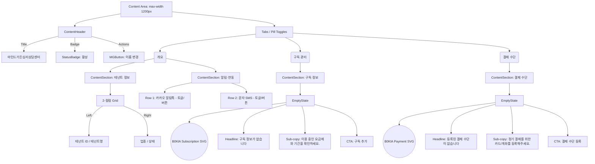

# 테넌트 프로필 UI/UX 디자인 핸드오프 (Tenant Profile UI/UX Design Handoff)

본 문서는 `mg-v2-tenant-profile` 페이지의 UI/UX 개선을 위해 `core-designer`가 작성한 명세서로, `core-coder`가 즉각적으로 구현할 수 있는 디자인 토큰, 일러스트레이션 구조 및 SSOT 컴포넌트 매핑을 제공합니다.

## §A. 사용자 결정 반영 와이어 (Wireframe)

## §B. 디자인 토큰 (Design Tokens)

- **색상 (B0KlA SSOT 인용)**
  - Primary (주조색): `var(--mg-v2-ad-b0kla-green)` 또는 `#3D5246`
  - Background (배경): `var(--mg-v2-bg-base)` 또는 `#FAF9F7`
  - Surface (카드): `var(--mg-v2-surface)` 또는 `#F5F3EF`
  - Border (테두리): `var(--mg-v2-border-base)` 또는 `#D4CFC8`
  - Text Main: `var(--mg-v2-text-main)` 또는 `#2C2C2C`
  - Text Sub: `var(--mg-v2-text-sub)` 또는 `#5C6B61`
- **Spacing 및 레이아웃**
  - 카드 내 Padding: `var(--mg-v2-space-24)` (24px)
  - 요소 간 Gap (2-컬럼): `var(--mg-v2-space-24)` (24px)
  - 탭과 섹션 간 간격 (Margin Top): `var(--mg-v2-space-32)` (32px)
- **카드 장식 및 제거 정책**
  - Border Radius: `var(--mg-v2-radius-16)` (16px)
  - Box Shadow: 없음 (`none`)
  - **Vertical Accent Bar**: 기존 `border-left: 4px solid ...` **완전 제거**. 테넌트 정보/알림 카드 모두에서 좌측 초록색 바는 사용하지 않고 `ContentSection` 공통 스타일을 따름.
- **Typography**
  - 카드 타이틀: `16px`, `font-weight: 600`, `var(--mg-v2-text-main)`
  - 빈 상태 Headline: `20px`, `font-weight: 600`, `var(--mg-v2-text-main)`
  - 빈 상태 Sub-copy: `14px`, `font-weight: 400`, `var(--mg-v2-text-sub)`
  - 라벨 (Label): `12px`, `var(--mg-v2-text-sub)`
  - 값 (Value): `14px`, `font-weight: 500`, `var(--mg-v2-text-main)`

## §C. B0KlA 일러스트 명세 (Q2=B 반영)

인벤토리 점검 결과, 프론트엔드(`frontend/src/assets` 및 `components/admin/b0kla`)에 B0KlA SSOT 톤을 따르는 구독 및 결제용 일러스트가 **부재(신설 필요)**한 것으로 확인됨. `core-coder`는 아래 명세에 따라 인라인 SVG를 구현하거나 신규 에셋을 추가해야 함.

- **구독 정보 빈 상태 일러스트 (Subscription Empty)**
  - **모티브**: 달력, 체크리스트, 또는 작은 구독 박스 형태
  - **크기**: `100px` x `100px` (컴팩트)
  - **컬러 팔레트**: 
    - Base: `#F5F3EF` (Surface)
    - Stroke/Line: `#D4CFC8` (Border)
    - Accent: `#3D5246` (Primary B0KlA green) - 포인트 요소(체크마크 등)에 적용
- **결제 수단 빈 상태 일러스트 (Payment Empty)**
  - **모티브**: 신용카드, 지갑
  - **크기**: `100px` x `100px`
  - **컬러 팔레트**: 구독 일러스트와 동일 (Accent 색상을 부분적으로 사용)
- **SVG 구조 및 접근성**
  - `viewBox="0 0 100 100"`
  - `aria-hidden="true"` 속성 부여하여 스크린 리더에서 무시되도록 처리

## §D. 반응형 (Break point)

- **`≥ 1280px` (Desktop Wide)**
  - 테넌트 정보 2-컬럼 Grid 활성 유지 (좌/우 분할 공간 여유).
- **`1024px ~ 1279px` (Desktop Standard)**
  - 2-컬럼 Grid 유지. 단, Column Gap을 `16px`(`var(--mg-v2-space-16)`)로 축소.
- **`768px ~ 1023px` (Tablet)**
  - 1-컬럼 Stack으로 전환. 좌/우 데이터가 상/하로 배치됨.
- **`< 768px` (Mobile)**
  - 1-컬럼 Stack 유지.
  - `ContentHeader`의 우측 "이름 변경" Actions 버튼이 좁은 화면에서 하단으로 줄바꿈 되거나(Wrap), sticky 형태로 카드 내로 들어갈 수 있도록 유연하게 배치(`flex-wrap: wrap`).

## §E. 접근성 (Accessibility)

- 탭 메뉴: `role="tablist"`, 개별 탭 `role="tab"`, 현재 선택된 탭 `aria-selected="true"`.
- "이름 변경" 버튼: `aria-label="테넌트 이름 변경"`.
- 빈 상태 일러스트: 장식용 그래픽이므로 `aria-hidden="true"`.
- 키보드 포커스: 모든 버튼(이름 변경, 탭, 빈 상태 CTA)에 `:focus-visible` 상태 윤곽선 보장.

## §F. i18n 키 인벤토리 (번역)

추가 또는 확인이 필요한 i18n 키 (`admin/ko` 네임스페이스 기준 권장):

- `admin.tenantProfile.header.title`: "마인드가든심리상담센터" (데이터 매핑용 템플릿)
- `admin.tenantProfile.header.action.changeName`: "이름 변경"
- `admin.tenantProfile.tabs.overview`: "개요"
- `admin.tenantProfile.tabs.subscription`: "구독 관리" (기존 오타 '구돉 관리' 정정 건이 선반영되었다고 가정)
- `admin.tenantProfile.tabs.payment`: "결제 수단"
- `admin.tenantProfile.card.tenantInfo`: "테넌트 정보"
- `admin.tenantProfile.card.notifications`: "알림·연동"
- `admin.tenantProfile.empty.subscription.headline`: "구독 정보가 없습니다"
- `admin.tenantProfile.empty.subscription.subcopy`: "이용 중인 요금제와 기간을 확인하세요."
- `admin.tenantProfile.empty.subscription.cta`: "구독 추가"
- `admin.tenantProfile.empty.payment.headline`: "등록된 결제 수단이 없습니다"
- `admin.tenantProfile.empty.payment.subcopy`: "정기 결제를 위한 카드/계좌를 등록해주세요."
- `admin.tenantProfile.empty.payment.cta`: "결제 수단 등록"

## §G. SSOT 컴포넌트 매핑 (코더 인계용)

코더(`core-coder`)는 신규 작성 없이 아래 SSOT 컴포넌트를 직접 `import`하여 레이아웃을 구성해야 합니다.

- **Content Header**: `import ContentHeader from '@/components/dashboard-v2/content/ContentHeader'`
- **Empty State**: `import EmptyState from '@/components/common/EmptyState'`
- **Badge**: `StatusBadge` 또는 `BadgeSelect` (기존 존재하는 배지 컴포넌트 재사용)
- **Tabs**: `components/ui/tabs` 또는 B0KlA pill-toggle CSS 클래스 (`mg-v2-ad-b0kla__pill-toggle`)
- **Card/Section**: `ContentSection` 또는 기존 CSS 클래스를 활용하되, **2-컬럼 Grid** 구현 시 `grid-template-columns: repeat(2, 1fr)` 형태의 커스텀 클래스(예: `.tenant-info-grid`)를 모듈 내에서 제한적으로 사용.

## §H. 하드코딩 게이트 통과 조건

- `frontend/src/components/tenant/TenantProfile.css`에 남아 있는 하드코딩된 색상 HEX 값 (예: `#3D5246`, `#E9ECEF` 등) 및 px 단위 spacing은 **반드시** `var(--mg-v2-...)` 변수로 치환해야 함.
- 컴포넌트 내에 하드코딩된 한글 텍스트는 **모두** `useTranslation` 훅을 이용해 i18n 변수로 매핑해야 함. (예: `t('admin.tenantProfile.tabs.subscription')`)
- 인용 문서: `ADMIN_LNB_LAYOUT_UNIFICATION_MEETING_HANDOFF.md` §17, `PRE_PRODUCTION_GO_LIVE_CHECKLIST.md` §1.3

---

### 코더 인계 체크리스트
- [ ] 핸드오프 §G: `ContentHeader`, `EmptyState` import 경로 준수
- [ ] 핸드오프 §B: CSS 토큰명 (`var(--mg-v2-...)`) 100% 치환 확인
- [ ] 핸드오프 §C: 결제/구독 빈 상태 SVG 일러스트레이션 인라인 구현 (또는 에셋 추가) 및 `aria-hidden="true"` 적용 정책
- [ ] 핸드오프 §F: i18n 신규 키 추가 및 렌더링 매핑
- [ ] 단위 테스트 권장: snapshot 갱신, 빈 상태 / 데이터 존재 상태 매트릭스, 반응형 break point 테스트

---
*Generated by core-designer*