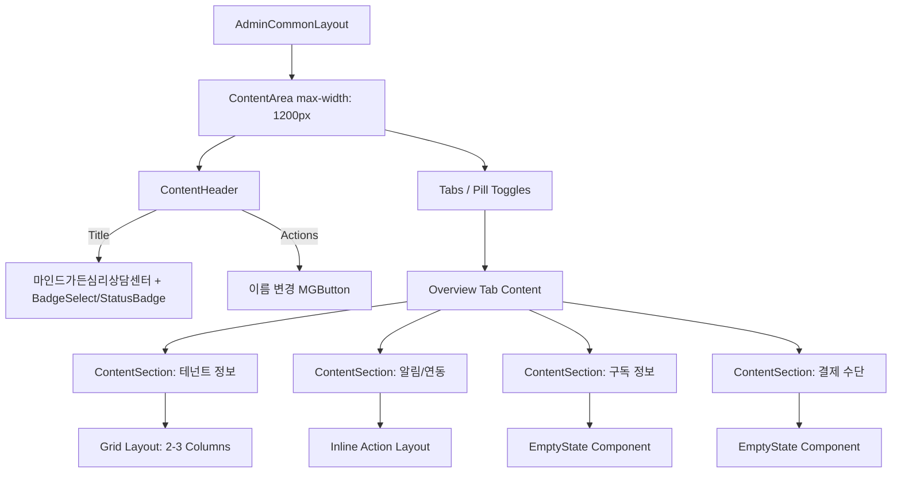

# 테넌트 프로필 UI/UX 개선 플랜

## 1. 개요 및 배경
- **배경**: 사용자가 "어드민 테넌트 프로필 페이지"(`mg-v2-tenant-profile`)의 UI/UX가 다른 어드민 페이지(SSOT) 레이아웃과 불일치한다고 보고.
- **목표**: 어드민 공통 레이아웃(B0KlA) 및 디자인 토큰 SSOT와의 GAP을 식별하고, `core-designer`, `core-coder` 등 서브에이전트를 통해 이를 교정하기 위한 오케스트레이션 계획 수립.

## 2. 범위 및 제약
- **대상**: `frontend/src/components/tenant/TenantProfile.js`, `TenantProfile.css`
- **SSOT 기준**: 
  - 페이지 헤더: `ContentHeader`
  - 카드: `ContentSection`
  - 빈 상태: `EmptyState`
  - 디자인 토큰: `unified-design-tokens.css` (B0KlA palette)
- **제약 사항**:
  - `mind_garden/` 디렉터리 미접촉.
  - 통합 deployer (PR #5/#13/#19/#20) 와 충돌을 피하기 위해 배포 완료 후 별도 PR로 진행.
  - 메인 에이전트는 코드 직수정을 금지하며 문서화/기획 위임만 수행.
  - UI/UX 개선 시 모든 색상, spacing, 문구는 하드코딩 없이 디자인 토큰 및 i18n SSOT를 통과해야 함(게이트 §17, §1.3).

## 3. GAP 분석 (현행 vs SSOT 매트릭스)

| 항목 | 현행 (Current) | 개선안 (SSOT) | GAP 영향도 |
|------|--------------|-------------|-----------|
| **페이지 헤더 정합** | `ContentHeader` actions 영역에 "활성" 배지 표시. "이름 변경" 버튼은 하단 카드에 존재. | 배지는 Title/Subtitle 옆에 뱃지로 붙이고, actions 영역에 "이름 변경" 액션 배치. | MED |
| **탭 스타일 정합** | 커스텀 `MGButton`을 나열한 `mg-v2-ad-b0kla__pill-toggle` 클래스 사용. | 공통 `Tabs` (ui/tabs.jsx) 사용하거나, B0KlA 표준 Pill 탭 스타일을 정확히 따름. 탭 위의 큰 공백 제거. | MED |
| **카드 Vertical Accent Bar** | `.mg-v2-content-section--card`에 `border-left: 4px solid var(--ad-b0kla-green)` 하드코딩. | Accent bar 제거. `ContentSection`의 기본 SSOT 스타일 적용. | HIGH |
| **빈 상태 (Empty State)** | `
` 하드코딩 + 과도한 높이. | `common/EmptyState` 컴포넌트 도입. 적절한 일러스트와 높이 정책 적용. | HIGH |
| **4 컬럼 Grid (1200px)** | `minmax(250px, 1fr)` 자동 줄바꿈. 1200px에서 내용 대비 여백이 큼 (Sparse). | 정보 그룹화 후, 2단 혹은 3단 그리드로 조정하거나 Layout 재배치. | MED |
| **알림·연동 카드 버튼** | 라벨 아래에 outlined 버튼 배치. | 토글 방식(Switch) 도입 혹은 우측 정렬 Inline Action으로 폼 레이아웃 정합성 향상. | MED |
| **CSS 하드코딩 제거** | `TenantProfile.css`에 다수의 커스텀 여백/컬러 하드코딩. | CSS 커스텀 클래스 제거 후 `var(--mg-spacing-*)` 및 공통 Layout Wrapper 재활용. | CRIT |

## 4. 개선안 화면 설계 와이어프레임 (SSOT 컴포넌트 조합)

- **적용 SSOT 컴포넌트**: `ContentHeader`, `ContentSection`, `EmptyState`, `StatusBadge`
- **반응형 Break points**: 
  - `≥1280px` : 데스크탑 뷰 (Grid 분산 최소화)
  - `≥1024px` : 태블릿 뷰 (2 컬럼 대응)
  - `<768px` : 모바일 뷰 (1 컬럼 스택, 탭 스크롤)
- **접근성(a11y)**: `role="region"`, `aria-label`, button focus states 준수.
- **i18n 인벤토리**: `admin/ko` (빈 상태 텍스트, 카드 타이틀 등 신규 키 추가)
- **하드코딩 체크**: `PRE_PRODUCTION_GO_LIVE_CHECKLIST.md` 준수.

## 5. 분배실행 표 (실행 위임 명세)

아래 명세를 따라 부모 에이전트(메인)는 서브에이전트를 호출하여 순차적(혹은 병렬적)으로 실행합니다. (현재 기획 단계에서는 작성 및 계획만 함)

| Phase | 담당 에이전트 | 전달 프롬프트 (요약) |
|-------|------------|-----------------|
| **Phase 1** | `core-designer` | **[UI/UX 시안 설계]** `frontend/src/components/tenant/TenantProfile.js`의 GAP을 분석하여 SSOT(`ContentHeader`, `ContentSection`, `EmptyState`) 기반 개선 화면설계 명세서 및 필요 신규 토큰(Hex)을 §C 형식으로 산출하라. "빈 상태"의 일러스트 및 높이 정책을 명확히 하고, "이름 변경" 버튼은 Header 우측으로 이동, 카드의 좌측 green border는 제거할 것. (모델: gemini-3.1-pro 권장) |
| **Phase 2** | `core-coder` | **[코드 구현]** Phase 1의 설계 명세에 따라 `TenantProfile.js` 및 `TenantProfile.css`를 수정하라. `EmptyState` 컴포넌트를 import하여 적용하고 하드코딩된 `.no-data`를 제거하라. `ContentHeader` actions 위치에 "이름 변경" 액션을 올리고, grid-template을 수정하라. i18n 번역 키를 연동하고 하드코딩 게이트(§17, §1.3) 조건을 만족할 것. |
| **Phase 3** | `core-tester` | **[테스트 및 시각 검수]** `TenantProfile.js` 수정 사항에 대한 반응형 브레이크포인트(1280, 1024, 768) 시각 검수를 수행하고, Empty State 상태와 Data 존재 상태 각각의 매트릭스 테스트(단위 테스트 스냅샷 갱신 등)를 작성·실행하라. |
| **Phase 4** | `core-deployer` | **[배포 준비]** 운영 통합 배포 완료 이후, 별도의 PR을 생성하여 UI 개선 건을 develop 및 main으로 FF(Fast-Forward) 반영 및 Production 환경 배포 절차를 요약 보고하라. |

## 6. 사용자 확인 (컨펜) 질문
본격적인 서브에이전트 위임 전, 아래 항목에 대한 사용자 결정이 필요합니다.
1. **카드 레이아웃 옵션**: 현재 4-컬럼이 sparse한데, "2-컬럼 좌우 분할" 방식과 "3-컬럼 압축" 방식 중 선호하시는 방향이 있습니까?
2. **빈 상태(Empty State) 일러스트**: 구독/결제 수단 빈 상태 렌더링 시, 텍스트와 아이콘만 표시할까요, 아니면 일러스트레이션(그래픽)을 함께 추가할까요?
3. **이름 변경 액션 위치**: "이름 변경" 액션을 `ContentHeader` 최상단 우측으로 올리는 개선안에 동의하십니까? (현재는 하단 카드 우측상단에 위치)

---
*End of Document*