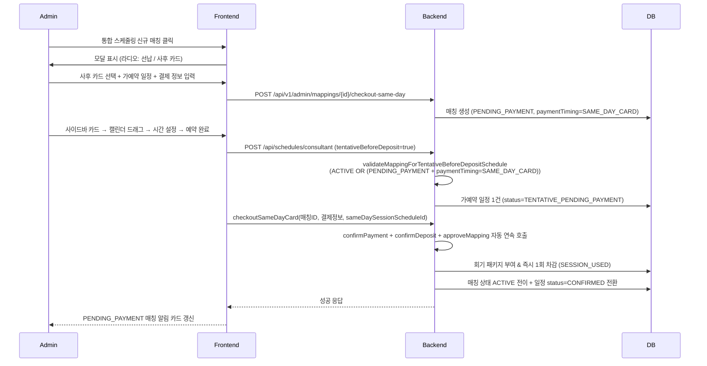

# 옵션 B (예약 우선 → 당일 결제·회기 즉시 차감) 합의서 v1.0

## §0 TL;DR — v1.0 결정 요약
| 항목 | 사용자 결정 사항 |
|---|---|
| **Q1 매칭 진입 시점** | 매칭 즉시 생성 (`PENDING_PAYMENT`) → 결제 완료 후 `ACTIVE` 전이 |
| **Q2 회기 차감 정책** | 단회기(1회) = 결제 시 생성 1 + 즉시 차감 1 = 잔여 0 n회 패키지 = 결제 시 생성 n + 즉시 1회 차감 = 잔여 n-1 |
| **Q3 노쇼·결제 없음** | 어드민이 디러티 `PENDING_PAYMENT` 매칭 목록 보고 수동 정리 |
| **Q4 UI 분기** | 단일 모달 + 라디오 [결제 방식: 선납 입금 / 사후 카드] |

- **핵심 발견**: 70% 인프라 이미 존재 (`TENTATIVE_PENDING_PAYMENT` + `finalizeTentativeSchedulesAfterDepositConfirmed`)
- 본 합의서 v1.0 채택 완료.

## §1 비즈니스 동기 및 현행 페인포인트
당일 방문 카드 결제 운영 패턴이 잦으나, 현재 통합 스케줄링은 선납을 강제하여 마찰이 발생하고 있습니다. E1/E2 인벤토리에서 분석된 바와 같이, 기존 선납 흐름에 의존하기보다 "예약 우선 후 사후 결제(옵션 B)"를 공식 지원함으로써 예약 편의성을 개선하고 프론트데스크 운영을 효율화합니다.

## §2 옵션 B 전체 시퀀스

### §2.1 매칭 상태 가드 SAME_DAY_CARD 분기 (P0 핫픽스 2026-05-28)
일정 생성 가드(`ScheduleServiceImpl.validateMappingForTentativeBeforeDepositSchedule` /
`validateRemainingSessions`)는 옵션 B 시퀀스의 «가예약 일정 1건 생성» 단계에서 다음 매트릭스로 분기한다.

| 매핑 상태 | paymentTiming | 회기수 | tentativeBeforeDeposit | 결과 |
|---|---|---|---|---|
| `ACTIVE` | (any) | > 0 | false | 확정 예약 + 회기 차감 |
| `ACTIVE` | (any) | 0 | true | 가예약 (회기 부여 후 차감 대기) |
| `PENDING_PAYMENT` | `SAME_DAY_CARD` | 0 / NULL | true (또는 자동 강제 분기) | **가예약 허용** (옵션 B) |
| `PENDING_PAYMENT` | `ADVANCE` / NULL | (any) | (any) | **차단** — 입금 대기 매칭은 일정 생성 불가 |
| `DEPOSIT_PENDING` | (any) | (any) | (any) | 차단 — 관리자 승인 전 |
| `TERMINATED` / `INACTIVE` / `SUSPENDED` | (any) | (any) | (any) | 차단 |

#### 백엔드 자동 강제 분기 (fallback)
프론트가 `tentativeBeforeDeposit` 플래그를 누락한 채 일정 생성을 호출하더라도, 매핑이
`PENDING_PAYMENT` + `paymentTiming=SAME_DAY_CARD` 인 경우 백엔드(`createConsultantSchedule`
진입부 `resolveEffectiveTentativeBeforeDeposit`)가 자동으로 가예약 분기로 강제 진입한다.
프론트 페이로드 누락에 따른 500 오류를 방지한다.

## §3 신규 매칭 + 즉시 차감 트랜잭션 시퀀스
E2 §4.2 의사코드에 따라, 단일 `@Transactional` 및 `@Version` 낙관적 잠금을 적용하여 회기 부여와 즉시 차감을 안전하게 처리합니다.
- 단회기(1회): 부여와 동시에 1회 차감되어 잔여 회기가 0이 됩니다.
- n회 패키지: n회 부여 후 즉시 1회 차감되어 잔여 회기가 n-1이 됩니다.
- 주의사항:
  a. 결제와 입금 확인은 단일 트랜잭션 묶음으로 자동 연속 호출 권장
  b. 입금 확인 후 `approveMapping`도 자동 호출하여 즉시 ACTIVE 상태 진입 권장
  e. `consultant_client_mapping_history.SESSION_USED` 기록 필수
  f. **(P0 핫픽스 2026-05-28)** 회기 부여 전 가예약 일정 생성 단계에서
     `validateRemainingSessions` 는 `PENDING_PAYMENT` + `paymentTiming=SAME_DAY_CARD`
     매핑에 한해 `remaining > 0` 검사를 우회한다. 회기 차감(R7 정책)은 결제 확정 시점
     `checkoutSameDayCard` 트랜잭션에서만 수행된다(현행 유지).

## §4 사용자 추가 결정 필요 항목 (R1~Rn)
- **R1**: `confirmPayment + confirmDeposit` 옵션 B 흐름 자동 연속 호출 — **권장: 자동 연속** (단일 트랜잭션 묶음 + 옵션 B-card 흐름에서 RECEIVABLE row 거의 즉시 INCOME 상쇄)
- **R2**: `confirmDeposit` 후 `approveMapping` 자동 호출 — **권장: 자동** (옵션 B 신규 매칭이 ACTIVE 진입해야 다음 일반 예약 가능)
- **R3**: `consultant_client_mapping_history.SESSION_USED` wiring 본 PR 에 포함 여부 — **권장: 포함** (정책 SSOT v1.1 §W1 요구사항, 단일 트랜잭션)
- **R4**: 디러티 `PENDING_PAYMENT` 정리 어드민 UI 본 PR 포함 여부 — **권장: 별도 후속 PR** (본 PR 은 옵션 B 진입 기능에 집중)
- **R5**: `ScheduleStatus.TENTATIVE_PENDING_PAYMENT` UI 라벨 변경 여부 — **권장: 맥락 친화적 라벨로 변경** (현행 "결제 대기 (가예약)" 대신)
- **R6**: KPI/통계 "예약 매칭" vs "결제 완료 매칭" 분리 카운트 — **권장: 후속 PR**
- **R7**: `useSessionForSpecificMapping` ACTIVE 가드 추가 여부 — **권장: 추가 enum 없이 진행** (현행 그대로 사용 가능)
- **R8**: 환영 알림톡 timing — **권장: 결제 전후 변경 없이 결제 완료(ACTIVE) 시 발송**

## §5 코더 위임 명세 (단일 PR)
- **변경 범위**:
  - **백엔드**:
    - 새 API: `POST /api/v1/admin/mappings/{id}/checkout-same-day` (또는 기존 `confirm-deposit` 확장 — coder 판단). 본문에 `paymentMethod`, `paymentReference`, `paymentAmount`, `sameDaySessionScheduleId` (옵션) 포함
    - Service: `AdminServiceImpl.checkoutSameDayCard(...)` 단일 진입점 — confirmPayment + confirmDeposit + (R2) approveMapping 자동 연속 호출 + (R3) SESSION_USED history wiring
    - 자동 종료 정책 가드 (E1 §2 GAP) — PENDING_PAYMENT/PAYMENT_CONFIRMED 매칭은 새 매칭 생성 시 자동 TERMINATED 대상에서 **제외**
    - `consultant_client_mapping_history` SESSION_USED 이벤트 wiring (`ScheduleServiceImpl.useSessionForSpecificMapping` 직후)
  - **프론트엔드**:
    - `MappingCreationModal.js` step 4 결제 분기 — 라디오 [선납 입금 / 사후 카드] (Q4)
    - 사후 카드 선택 시: step 4 결제 정보는 "당일 방문 카드 결제" 안내 + 가예약 일정 선택 또는 신설 + `checkoutSameDayCard` 호출
    - 선납 선택 시: 현행 흐름 그대로 유지
    - `IntegratedMatchingSchedule.js` PENDING_PAYMENT 매칭 알림 카드 추가 (디러티 정리 UI 별도 PR R4)
    - i18n 키 신설 (모달 라디오 + 사후 카드 안내 + 가예약 라벨)
  - **DB**: 마이그레이션 신설 여부 — coder 판단. 새 enum/컬럼 신설 없이 진행 가능 (E2 §1.3 enum 활용 + history wiring 만)
- **테스트 매트릭스**:
  - 백엔드: `checkoutSameDayCard` 단위 테스트 (1회 단발 / n회 패키지 / `@Version` 동시 차감 OptimisticLock / tenantId 누락 / PENDING_PAYMENT → ACTIVE 전이 / history SESSION_USED row 검증)
  - 프론트: `MappingCreationModal` 라디오 분기 RTL 테스트 (선납/사후 카드 페이로드 분기) + IntegratedMatchingSchedule 알림 카드
- **게이트** (DoD):
  - `./gradlew test --tests "*Mapping*" --tests "*Schedule*" --tests "*Session*"` PASS
  - `npm run check:i18n-seed` PASS
  - `config/shell-scripts/check-hardcode.sh` PASS
  - D11 가드 PASS
- **브랜치명**: `feature/option-b-reservation-first-matching`
- **PR 베이스**: `develop`
- **PR 타이틀**: `feat(matching): 옵션 B 예약 우선 매칭 + 회기 부여+즉시 1회 차감 단일 트랜잭션 (P1)`
- **머지 정책**: 사용자 결재 후. 본 task 는 PR 작성·검수 통과까지.

## §6 후속 위임 명세 (별도 PR)
- ~~R4 디러티 PENDING_PAYMENT 정리 어드민 UI~~ **(R4_PENDING_PAYMENT_CLEANUP_UI_PLAN.md 합의서로 활성화 완료)**
  - dev DB 매칭 #91~97 잔존 (paymentTiming=NULL, status=PENDING_PAYMENT, remaining=0)
    옵션 A 미완 이탈 추정. R4 UI 도입 시 수동 정리.
- R6 KPI/통계 분리 (옵션 B 매출 인식 정책 + DailyStatistics 컬럼 추가)
- (선택) 노쇼 / 24h 취소 회기 보호 정책 wiring (E2 §3.5)

## §7 운영 영향 평가
- DB 마이그레이션 신설 여부 (예상 없음)
- 운영 데이터 영향 (PENDING_PAYMENT 매칭 자동 종료 가드로 기존 데이터 손실 0)
- 롤백 시나리오

## §8 cross-link
- USER_LIFECYCLE_TERMINATION_POLICY v1.1 (`docs/standards/`) — 매칭 종료/탈퇴 시 cleanup
- E3 매출 인식 정책 (별도 합의서) — 회기 차감 매출 분개 분배 검토
