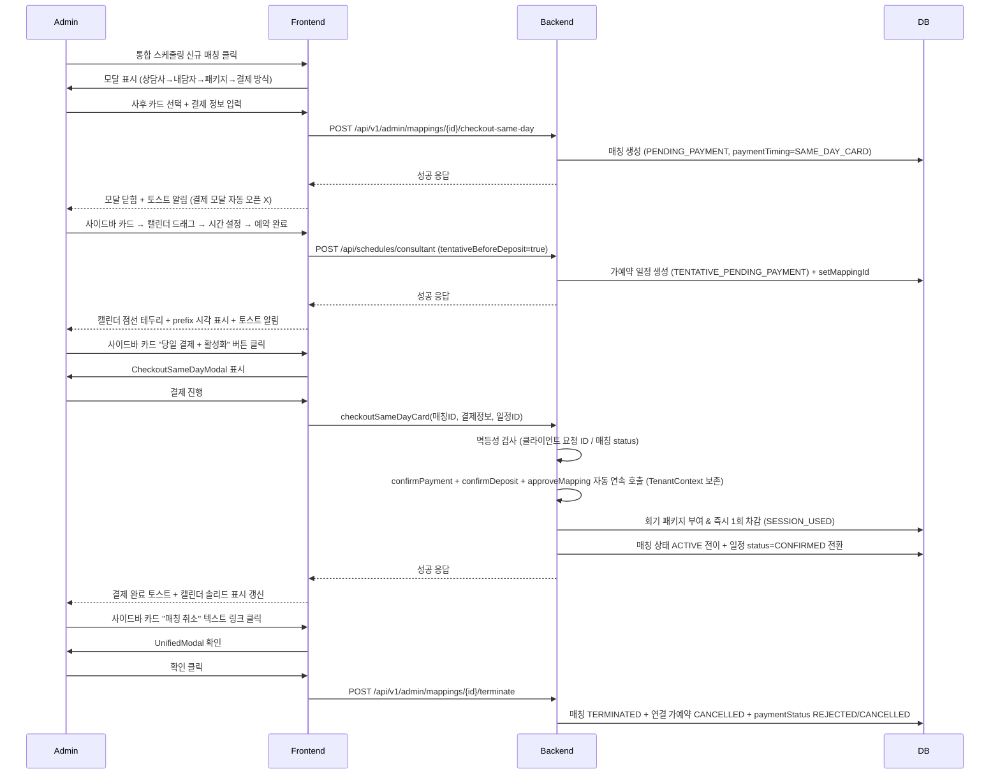

# 옵션 B (예약 우선 → 당일 결제·회기 즉시 차감) 합의서 v2.0

**작성일**: 2026-05-28
**작성자**: core-planner
**목적**: 옵션 B v1.0 출시 이후 누적된 핫픽스(PR #34, #47, #50, #52, #54, #57, #58)와 최근 발견된 P0/P1 결함을 종합하여 전체 흐름의 일관성을 재정립하는 v2.0 합의서.

> **사용자 강력 요구 (2026-05-28 14:43 KST)**: "통합 스케줄링은 우리 시스템의 꽃이야. 절대 오류 있으면 안 돼. 과할 정도로 테스트가 진행이 되어야 해."
> → §7 위임 명세에 **80+ 케이스 테스트 매트릭스** + **core-tester 게이트 강제** + **사용자 dev 검증 체크리스트** 추가. 별첨 `OPTION_B_V2_TEST_MATRIX.md` 신설.

---

## §1 v1.0 대비 변경점 매트릭스 (인벤토리)

| 항목 | v1.0 초기 상태 | v2.0 변경/정착 상태 | 분류 |
|---|---|---|---|
| **매칭 생성 단계 순서** | 내담자→상담사→패키지 | **상담사→내담자→패키지** (PR #47) | 정착 |
| **사이드바 알림 카드** | PENDING_PAYMENT 알림 카드 노출 | **알림 카드 제거** (PR #50) | 정착 |
| **사이드바 드래그** | 일반 캘린더 드래그와 동일 | **라벨 분기 및 캘린더 시각 차이 적용** (PR #50) | 정착 |
| **클라이언트 삭제 가드** | 옵션 B 매칭 고려 미비 | **옵션 B 매칭 영향 가드 추가** (PR #52) | 정착 |
| **paymentTiming 유지** | 누락 위험 존재 | **paymentTiming persist 적용** (PR #54) | 정착 |
| **일정 가드 SAME_DAY_CARD 분기** | 우회 로직 불완전 | **SAME_DAY_CARD 분기 완벽 적용** (PR #58) | 정착 |
| **결제 모달 자동 오픈** | 일정 생성 직후 자동 오픈 | **일정 생성 직후 자동 오픈 제거** (사용자 의도 충돌 해소) | UX 핫픽스 대기 |
| **결함 A: 테넌트 401 오류** | `runInNewTransaction` finally에서 무조건 clear | **save/restore 패턴으로 교체 및 멱등성 가드 필요** (P0 결함) | 결함 |
| **결함 B: 캘린더 점선 미적용** | `createConsultantSchedule`에서 `setMappingId` 미호출 | **일정 생성 시 매핑 ID resolve 및 setMappingId 호출 필요** (P1 결함) | 결함 |
| **R4 디러티 매칭 취소 UI** | 어드민 수동 정리 (API만 존재) | **사이드바 카드에 "매칭 취소" 텍스트 링크 추가** (별도 트랙) | 누락 보완 |

---

## §2 정정 흐름 v2.0

---

## §3 화면별 UX 명세

| 화면/컴포넌트 | UX 명세 |
|---|---|
| **MappingCreationModal** | - 단계 순서: 상담사 → 내담자 → 패키지 → 결제 방식 - 라디오 버튼: 선납 입금 / 사후 카드 - 사후 카드 선택 시 결제 정보 분기 제공 - 검증 가드: 필수 정보 누락 방지 |
| **사이드바 카드** (`MappingScheduleCard` + `MappingMatchActions`) | - 상태 분기: `PENDING_PAYMENT` vs `ACTIVE` - 노출 버튼 (`PENDING_PAYMENT`): "일정 등록", "당일 결제 + 활성화", "매칭 취소" (텍스트 링크) - 시각 효과: 점선 border 또는 색 톤 차이 적용 |
| **캘린더 이벤트** | - `TENTATIVE_PENDING_PAYMENT`: 점선 테두리 + prefix 아이콘 표시 - `CONFIRMED`: 솔리드 테두리 표시 - `mapping_id` wiring에 의존하여 올바른 클래스 부여 |
| **CheckoutSameDayModal** | - 진입: 사이드바 카드 "당일 결제 + 활성화" 버튼 클릭 시에만 진입 (자동 오픈 제거) - 표시 정보: 결제 방법, 승인번호, 금액, 가예약 일정 ID - 멱등성 가드: 사용자 재시도 차단 로직 적용 |
| **알림 카드** | - PR #50 결정에 따라 유지 (노출하지 않음) |

---

## §4 백엔드 정책 SSOT

1. **테넌트 propagation (결함 A 해결)**:
   - `TenantContextHolder` save/restore 패턴 적용.
   - `AdminServiceImpl.runInNewTransaction`의 `finally` 블록에서 무조건 `clear()` 하는 로직을 제거하거나, 진입 시점의 context를 백업하고 복원하도록 수정.
2. **상태 전이 (Mapping)**:
   - `PENDING_PAYMENT` → `ACTIVE`: `checkoutSameDayCard` 트랜잭션 내에서 `approveMapping` 호출 시 전이.
   - `PENDING_PAYMENT` → `TERMINATED`: R4 매칭 취소 흐름에서 `terminateMapping` 호출 시 전이.
3. **상태 전이 (Schedule)**:
   - `TENTATIVE_PENDING_PAYMENT` → `CONFIRMED`: `checkoutSameDayCard` 트랜잭션 성공 시 자동 전이.
4. **회기수 부여 및 차감 시점 (현행 유지)**:
   - 결제 확정 시점에 회기 부여 및 즉시 1회 차감 (R7 정책).
   - 일정 status가 `BOOKED` (또는 `CONFIRMED`)로 전환될 때 `SESSION_USED` history 기록.
5. **mapping_id wiring (결함 B 해결)**:
   - `ScheduleServiceImpl.createConsultantSchedule`의 모든 오버로드에서 일정 생성 시점에 매핑 ID를 resolve하고 `setMappingId`를 반드시 호출.
6. **멱등성 보장**:
   - `checkoutSameDayCard` 진입 시 클라이언트 요청 ID (Idempotency Key) 또는 `mapping.status == PENDING_PAYMENT`를 검사하여 중복 결제/처리를 차단.

---

## §5 캘린더 시각 명세

- **TENTATIVE_PENDING_PAYMENT**:
  - `border: 1.5px dashed --mg-v2-warning-500`
  - prefix icon 추가
- **CONFIRMED + SAME_DAY_CARD**:
  - 일반 솔리드 테두리 (기존 `CONFIRMED`와 동일)
  - (선택 사항) 작은 결제 완료 뱃지 추가
- **사이드바 카드 (PENDING_PAYMENT)**:
  - 점선 border 또는 색 톤 차이 적용 (디자이너 결정에 따름)
- **다크 모드**:
  - 기존 다크 모드 cascade 규칙 준수

---

## §6 사용자 컴펜 (결정 필요 항목)

| ID | 질문 | 권장안 (Default) |
|---|---|---|
| **Q1** | 결함 A(테넌트 401)와 B(캘린더 점선) 핫픽스를 분리할 것인가, 묶어서 처리할 것인가? | **분리 PR** (A는 긴급 P0, B는 시각 보완 P1) |
| **Q2** | 멱등성 가드 위치는 어디로 할 것인가? | **둘 다 적용** (클라이언트 요청 ID + 매칭 status 검사) |
| **Q3** | 결제 모달 자동 오픈 제거 후, 다른 진입 경로를 추가할 것인가? | **추가 안 함** (사이드바 "당일 결제 + 활성화" 버튼으로만 진입) |
| **Q4** | R4 트랙(디러티 매칭 취소 UI)은 v2.0과 별도 트랙으로 유지할 것인가? | **별도 트랙 유지** (v2.0 영향 검증만 수행 후 머지) |
| **Q5** | dev DB의 매칭 #91~97(옵션 A 미완 잔존)은 어떻게 처리할 것인가? | **R4 UI로 수동 정리** |
| **Q6** | 사용자 재시도 차단 시 노출할 토스트 메시지 카피는? | **"이미 처리 중입니다. 새 매칭 카드로 확인하세요."** |
| **Q7** | 멱등성 보장 후 회계 거래(transactionId=109) 중복 방지 추가 검증을 수행할 것인가? | **dev DB 추가 검증 수행** |
| **Q8** | v2.0 패치를 일괄 PR로 할 것인가, 분리 PR로 할 것인가? | **분리 PR** (긴급도에 따라 Path 1, 2, 3 분리) |
| **Q9** | E2E 자동화 도구는 무엇으로 할 것인가? | **기존 도구 점검 후 보강**. Cypress/Playwright 신규 도입은 별도 위임 (옵션 B v2.0 자체는 기존 자동화 + 수동 사용자 체크리스트로 커버) |
| **Q10** | 운영 반영 전 staging 단계 도입할 것인가, blue/green 슬롯 검증 모드로 갈 것인가? | **blue 슬롯 검증 모드** (외부 트래픽 격리 + 내부 테스트 데이터 commit + cutover) |
| **Q11** | 멱등성 가드 위치 (Q2 재확인) | **둘 다 적용** — 클라이언트 요청 ID(Idempotency Key) + 매칭 status 검사 (백엔드 fail-safe) |
| **Q12** | 사용자 dev 검증 체크리스트 8~10 시나리오를 사용자가 직접 PASS 확인 후에만 운영 반영할 것인가? | **그렇다** (별첨 `OPTION_B_V2_TEST_MATRIX.md` §9 사용자 검증 체크리스트 PASS 필수) |

---

## §7 위임 명세 (코더/디자이너/테스터) — **테스트 매트릭스 강화 v2.0**

> **별첨**: 80+ 케이스 전수 매트릭스는 `docs/project-management/2026-05-28/OPTION_B_V2_TEST_MATRIX.md` 참조. 본 §7 은 Path 별 게이트 강제 사항만 정착.

### §7.1 백엔드 단위 테스트 매트릭스 (50건+) — 매트릭스 §1~§4
- `checkoutSameDayCard` 단독 (A 결함 + 멱등성): 케이스 1~15
- `createConsultantSchedule` (B 결함 + mapping_id wiring): 케이스 16~24
- `terminateMapping` (R4 + 회귀): 케이스 25~29
- 멀티테넌트 격리 (필수): 케이스 30~32
- Repository / DTO 직렬화: 케이스 33~36

### §7.2 프론트 RTL 테스트 매트릭스 (30건+) — 매트릭스 §5~§9
- `IntegratedMatchingSchedule`: 케이스 37~42 (UX 핫픽스 회귀 포함)
- `MappingMatchActions` + `CardActionGroup`: 케이스 43~47
- `MappingCancelModal`: 케이스 48~52
- `sameDayPendingEventDecorator`: 케이스 53~56 (B 결함 fix 시각 검증)
- `CheckoutSameDayModal`: 케이스 57~60

### §7.3 E2E 시나리오 (10~15건) — 매트릭스 §10
- 옵션 B 전체 흐름 (DB 수준 검증): 케이스 61
- 매칭 취소 흐름 (R4): 케이스 62
- 옵션 A 회귀 0: 케이스 63
- 동시 어드민 2명 결제 시도: 케이스 64
- 네트워크 끊김 재시도 (멱등성): 케이스 65
- 세션 만료 후 재로그인: 케이스 66
- 다중 테넌트 격리 E2E: 케이스 67
- 모바일 반응형 (사이드바 280-320px): 케이스 68

### §7.4 회귀 + 성능 — 매트릭스 §11
- 옵션 A ADVANCE 흐름 회귀 0: 케이스 69
- ACTIVE 매칭 일반 예약 회귀 0: 케이스 70
- 멀티테넌트 격리 회귀 0: 케이스 71
- 동시 요청 100건 stress test: 케이스 72
- DailyStatistics 카운트 정합 (R6): 케이스 73

### §7.5 운영 시뮬레이션 — 매트릭스 §12
- dev DB 매칭 #91~98 회계 거래 transactionId=109 중복 검증: 케이스 74
- dev 매칭 #98 의 부분 commit + 401 응답 정합 검증: 케이스 75
- PROD 반영 전 staging-like dev 검증 체크리스트 발행: 케이스 76

### §7.6 디버그/장애 시나리오 — 매트릭스 §13
- 케이스 77~82 (tenant_id NULL fail-safe / 결제 금액 != packagePrice 경고 / 가예약 다수 정책 / 결제 승인번호 중복 / ACTIVE 전이 실패 보상 / SMS_GATE tenant=null 회귀)

### §7.7 core-tester 게이트 강화 (PASS 필수)

| Path | 필수 PASS 케이스 | 디자이너 검수 |
|---|---|---|
| **Path 1 (A 핫픽스 P0)** | 단위 §1~§4 (1~36) + E2E 61, 64, 65 + 회귀 69 + 운영 시뮬 74·75 | — |
| **Path 2 (B 핫픽스 P1)** | 단위 §1~§4 케이스 16~24, 33~36 + E2E 61 + 회귀 70 + 점선 시각 회귀 | **필수** (점선 + prefix 시각 검수) |
| **Path 3 (UX 핫픽스)** | RTL 케이스 37~42 + E2E 61 | — |
| **Path 4 (R4)** | 단위 25~29 + RTL 43~52 + E2E 62 + 회귀 70 | **필수** (Danger 텍스트 링크 + UnifiedModal) |

### §7.8 테스터 보고서 산출물

- `docs/project-management/2026-05-28/OPTION_B_V2_REGRESSION_REPORT.md` 신설
  - 모든 매트릭스 PASS/FAIL 표 + 측정 시점·환경
  - 사용자 검증 시나리오 체크리스트 8~10 (별첨 `OPTION_B_V2_TEST_MATRIX.md` §9)
  - dev DB 검증 결과 (회계 거래 중복 단건 확인 + 매칭 #98 부분 commit 정합)

### §7.9 Path 별 위임 명세 (요약)

#### Path 1 — A 단독 핫픽스 (긴급 P0)
- **core-coder**: `AdminServiceImpl.runInNewTransaction`에 TenantContext save/restore 패턴 적용 + `checkoutSameDayCard`에 멱등성 가드 추가 (Q11 권장 — 클라이언트 요청 ID + 매칭 status 둘 다)
- **core-tester**: 매트릭스 §1~§4 + E2E 61·64·65 + 운영 시뮬 74·75 — **모두 PASS 필수**
- **core-deployer**: 사용자 dev 검증 PASS 후 dev 배포 → blue 슬롯 검증 모드 → 운영

#### Path 2 — B 단독 핫픽스 (시각 보완 P1)
- **core-coder**: `ScheduleServiceImpl.createConsultantSchedule` 3개 오버로드 `setMappingId` 호출 + 신규 헬퍼 (resolve 정책 SSOT)
- **core-tester**: 매트릭스 케이스 16~24, 33~36 + 점선 시각 회귀 — **모두 PASS 필수**
- **core-designer**: 점선 + prefix 검수

#### Path 3 — UX 핫픽스 흡수
- **core-coder**: 동결된 `hotfix/option-b-no-auto-checkout-after-schedule` 흡수 또는 재작업 (일정 등록 직후 결제 모달 자동 오픈 제거 — handleScheduleCreated 게이트)
- **core-tester**: RTL 37~42 — **모두 PASS 필수**

#### Path 4 — R4 디러티 정리 UI
- **core-coder + core-designer**: 진행 중 `feature/r4-pending-payment-cleanup-ui` v2.0 정합 검증 후 머지
- **core-tester**: 단위 25~29 + RTL 43~52 + E2E 62 — **모두 PASS 필수**

---

## §8 운영 영향 평가 + 롤백 — **검증·모니터링 강화 v2.0**

### §8.1 dev 단계 검증 (필수)
- core-coder + core-tester 게이트 PASS 후 **사용자 dev 검증 체크리스트 8~10 시나리오 발행** (별첨 `OPTION_B_V2_TEST_MATRIX.md` §9)
- 사용자가 직접 체크리스트 PASS 확인 후 운영 반영 (Q12 권장)
- 사용자 미통과 케이스가 1건이라도 존재하면 운영 반영 차단

### §8.2 staging 또는 blue/green 사전 검증 (Q10 권장)
- 운영 blue 슬롯에 검증 모드 배포 → 외부 트래픽 격리 + 내부 테스트 데이터 commit
- 정합 검증 PASS 후 green 슬롯으로 cutover
- cutover 직후 30분간 회계 거래 중복·401 응답률 모니터링 강화

### §8.3 운영 데이터 회복 시나리오 (결함 A)
- dev 매칭 #98 의 회계 거래 transactionId=109 + 분개 + 원장 + 시스템 알림(alertId=78) 부분 commit + 401 응답 — **운영에서도 동일 발생 가능 가정**
- 운영 발생 시 회복 절차:
  1. 부분 commit 회계 거래 식별 (`SELECT FROM financial_transactions WHERE created_at + 인접 시간 + amount`)
  2. 사용자 통지 + 분개·원장 rollback (회계팀 협의 후 보정 거래 입력)
  3. 멱등성 가드 도입 후 재시도
- 결함 A 핫픽스 머지 전까지 **운영 사용자에게 "결제 후 재시도하지 말 것" 안내 권장**

### §8.4 모니터링 강화
- `SMS_GATE tenant=null` 메트릭 알람
- `checkoutSameDayCard` 401 응답률 알람 (>0.1% 5분 sustained → 알람)
- 회계 거래 중복 알람 (같은 매칭 ID + 같은 일자 + 같은 amount → 자동 검출)
- `TENTATIVE_PENDING_PAYMENT` → `CONFIRMED` 전환 실패율 알람
- 매칭 #91~98 같은 PENDING_PAYMENT + remaining=0 디러티 매칭 일별 카운트 추세 (R4 UI 사용량 가늠)

### §8.5 결함 B (캘린더 점선 미적용)
- 시각적 결함만으로 운영 데이터 영향 0
- 운영 점선 미표시 시 어드민이 가예약/확정 일정을 시각적으로 구분 못해 잘못된 일정에 결제 진행할 risk 잠재
- 롤백 시나리오: 단순 코드 롤백 — `setMappingId` 호출 제거 시 기존 v1.0 동작 복원
