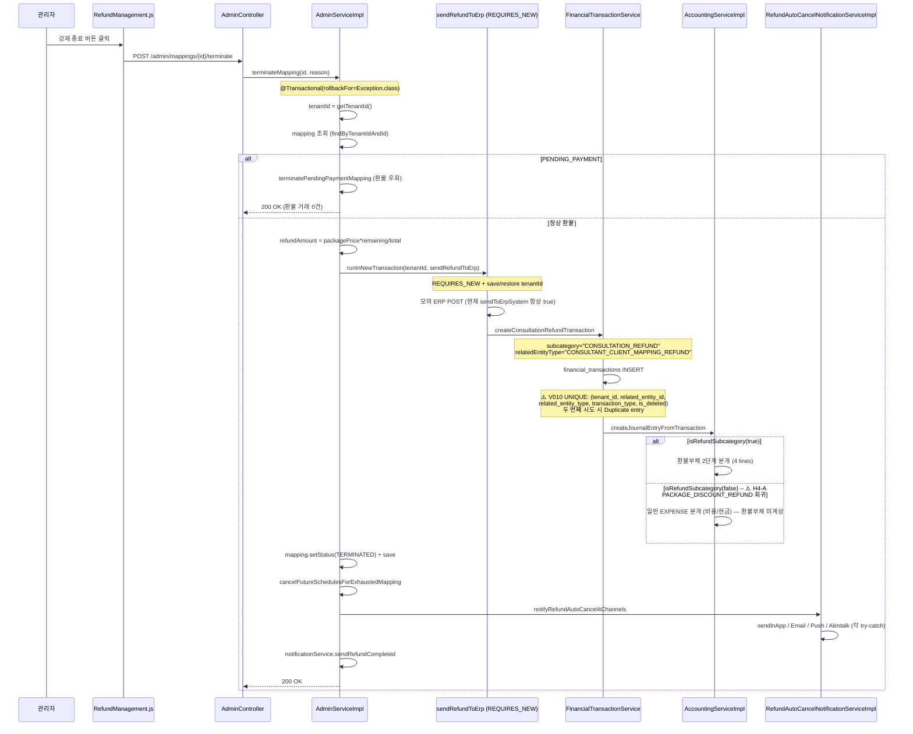
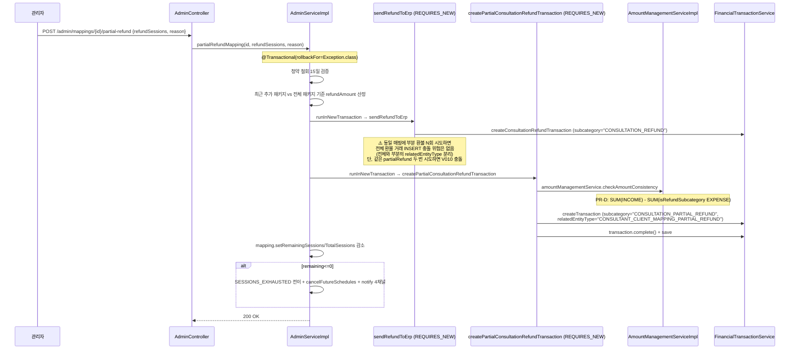
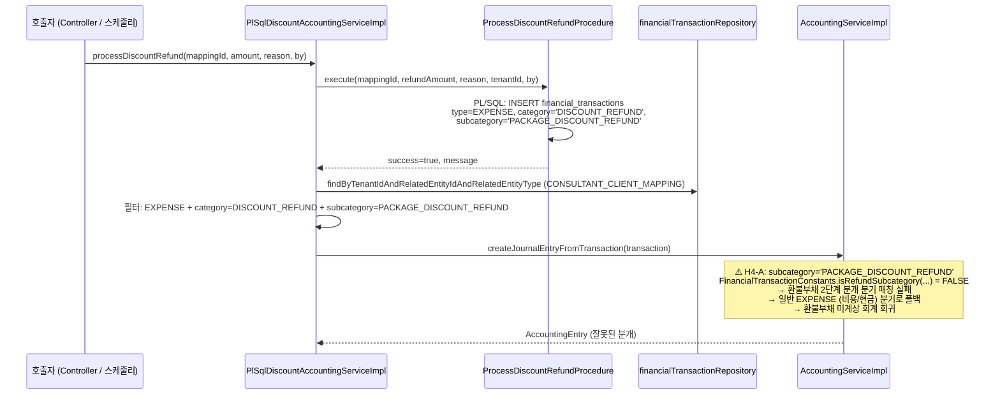
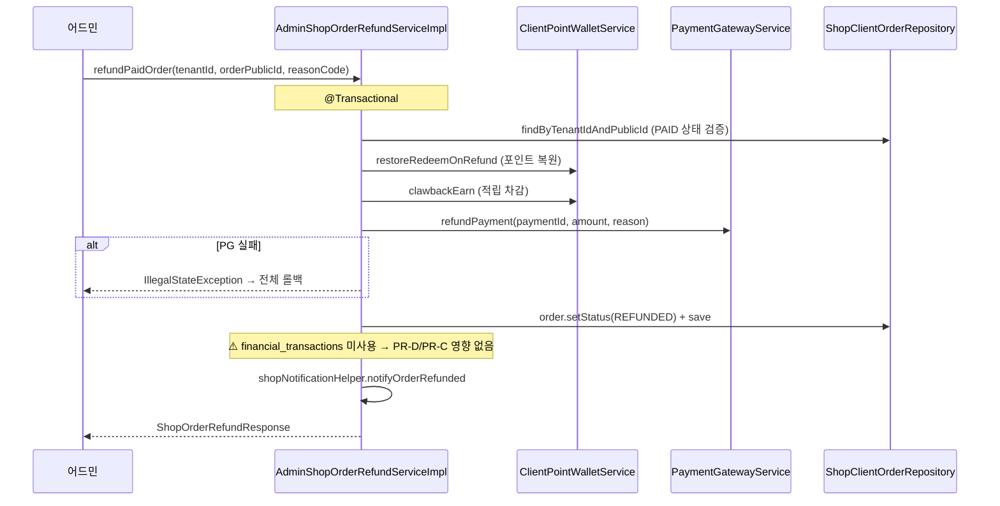

# 환불 관련 오류 광역 진단 보고서

- 작성일: 2026-05-28
- 작성자: `core-debugger` (분석 전용, 코드 수정 없음)
- 적용 스킬: `/core-solution-debug` + `/core-solution-erp` + `/core-solution-multi-tenant` + `/core-solution-server-status`
- 범위: **운영(main `eb4ccbed8`)** + **개발(develop `1a5dc89df`)** 양측
- 사용자 보고: "환불 관련 로직이 오류 나고 있는 듯, 원인 진단" — 구체 에러 메시지/스크린샷 미확보 → 광역 가설 매트릭스 → top suspect 좁힘.

> ⚠️ 본 문서는 분석·진단·SQL/grep 가이드만 포함합니다. 코드 수정은 후속 `core-coder` 위임 사항이며, 운영 DB 변경은 일절 포함하지 않습니다 (조회 SELECT 한정).

---

## 0. Executive Summary (TL;DR)

- **Top suspect #1 (P0, 양 환경 공통)**: `PACKAGE_DISCOUNT_REFUND` 서브카테고리가 `FinancialTransactionConstants.REFUND_SUBCATEGORIES` SSOT에 누락 → ① `AccountingServiceImpl.createJournalEntryFromTransaction` 가 할인 환불 거래를 환불부채 2단계 분개가 아닌 일반 EXPENSE 분개로 처리 (회계 회귀), ② PR-D 적용된 dev에서는 `checkAmountConsistency` 가 할인 환불을 차감하지 않아 `isConsistent` 오탐 가능.
- **Top suspect #2 (P1, dev 한정)**: V20260606_010 복합 UNIQUE (`tenant_id, related_entity_id, related_entity_type, transaction_type, is_deleted`) — 동일 매핑에 같은 `transaction_type` + 같은 `relatedEntityType` 으로 두 번 INSERT 시 `Duplicate entry … for key 'uk_financial_transactions_dedupe'` → SQLIntegrityConstraintViolationException → 500. 부분환불 재시도·terminate 더블 클릭 시 발현 가능.
- **Top suspect #3 (P0, 운영 한정)**: `financial_transactions.id=30` soft-delete=1 잔존 (PR-C `V20260606_009` 미적용) → `accounting_entries.id=30` 과 80만원 dangling → amount-info 조회 시 ERP 합계 불일치 → 환불 화면 경고/장애 보고로 보일 수 있음.
- 운영(`main`) 은 PR-C/D/E (`V20260606_009/010`, `checkAmountConsistency` 식 변경, PlSqlFinancialService prepareCall fix) **미적용**. dev(`develop`) 는 적용. **→ 운영/개발에서 보이는 오류 양상이 다를 수밖에 없음**. 진단은 환경별 분기 필수.

---

## 1. 환불 관련 코드 path 인벤토리 + 책임 매트릭스

### 1.1 백엔드 환불 path 매트릭스

| Path | 트리거 (API endpoint / scheduler) | 트랜잭션 보호 | tenant_id 격리 | REFUND/PARTIAL_REFUND subcategory 사용 | PR-D (`checkAmountConsistency` 환불 차감) 영향 | PR-C (`V009 id=30 복원`) 영향 |
|---|---|---|---|---|---|---|
| `AdminServiceImpl.terminateMapping(id, reason)` | `POST /api/v1/admin/mappings/{id}/terminate` | `@Transactional(rollbackFor=Exception.class)`, REQUIRES_NEW 분기 (`sendRefundToErp`, `notifyRefundAutoCancel4Channels`) | `getTenantId()` + `getTenantIdFromMapping(mapping)` + 새 트랜잭션 save/restore (`peekTenantId` / `setTenantIdOrClear`) | 내부에서 `createConsultationRefundTransaction` 호출 → `subcategory="CONSULTATION_REFUND"`, `relatedEntityType="CONSULTANT_CLIENT_MAPPING_REFUND"` | ✅ 환불 차감식이 amount-info `isConsistent` 결과에 직접 반영 | ❌ id=30 데이터 보정과 무관 |
| `AdminServiceImpl.partialRefundMapping(id, refundSessions, reason)` | `POST /api/v1/admin/mappings/{id}/partial-refund` | `@Transactional(rollbackFor=Exception.class)`, REQUIRES_NEW 분기 | 동일 (save/restore) | 내부에서 `createPartialConsultationRefundTransaction` 호출 → `subcategory="CONSULTATION_PARTIAL_REFUND"`, `relatedEntityType="CONSULTANT_CLIENT_MAPPING_PARTIAL_REFUND"` | ✅ 동일 | ❌ |
| `AdminServiceImpl.terminatePendingPaymentMapping(...)` (R4 분기) | `terminateMapping` 내부 분기 — 결제 미발생 매칭 | 부모 트랜잭션 | 부모와 동일 | **환불 트리거 우회** (R4 합의서 §) — financial_transactions INSERT 없음 | ❌ | ❌ |
| `AdminServiceImpl.sendRefundToErp(mapping, sessions, amount, reason)` | `terminateMapping`/`partialRefundMapping` 내부 REQUIRES_NEW | REQUIRES_NEW (save/restore) | 호출자가 `tenantIdForErp` 인자로 전달 | `createConsultationRefundTransaction` 위임 — 직접 subcategory 사용 없음 (ERP 모의 전송 후 위임만) | ⚠️ 간접 — 위임 메서드의 subcategory 가 PR-D SSOT 와 정합되어야 함 (현재 OK) | ❌ |
| `FinancialTransactionServiceImpl.createTransaction(request, ...)` | 위 메서드들의 공통 종점 | 부모 트랜잭션 (REQUIRES_NEW 안) | `request.tenantId` 사용 | request.subcategory 그대로 영속화 | ❌ (저장만) | ❌ |
| `AccountingServiceImpl.createJournalEntryFromTransaction(transaction)` | 분개 자동 생성 — `createTransaction` 후 호출 추정 | 부모 트랜잭션 | `transaction.tenantId` 사용 | **EXPENSE + `isRefundSubcategory(...)` 분기로 환불부채 2단계 분개 (line 440~461)** — 매칭 안 되면 일반 EXPENSE 분기 (line 462~471) | ⚠️ 간접 — `isRefundSubcategory` SSOT 가 동일 위치에서 사용됨 | ❌ |
| `PlSqlDiscountAccountingServiceImpl.processDiscountRefund(mappingId, refundAmount, reason, processedBy)` | `POST /api/v1/plsql-discount-accounting/refund` (Controller 별도 — `PlSqlDiscountAccountingController`) | `@Transactional` (StoredProcedure 호출) | `TenantContextHolder.getRequiredTenantId()` | **PL/SQL 프로시저가 생성하는 EXPENSE 의 subcategory = `PACKAGE_DISCOUNT_REFUND` — SSOT 누락** ⚠️⚠️ | ⚠️ PR-D `checkAmountConsistency` 에서 할인 환불 거래는 차감 안 됨 → `isConsistent` 오탐 | ❌ |
| `AdminShopOrderRefundServiceImpl.refundPaidOrder(tenantId, orderPublicId, reasonCode)` | `POST /api/v1/admin/shop/orders/{publicId}/refund` (별도 Shop 어드민) | `@Transactional` | 명시적 `tenantId` 인자 + `clientPointWalletService` / `paymentService` 위임 | **`financial_transactions` 직접 INSERT 없음** (포인트 원장 + PG + ShopClientOrder 만 처리). | ❌ 직접 영향 없음 | ❌ |
| `SubscriptionRefundServiceImpl.calculateRefundAmount / processRefund` | `core/billing` 도메인 (BO 관리자용 구독 환불) | `@Transactional` | `TenantContextHolder` (SubscriptionRefundService 인터페이스) | **`financial_transactions` 직접 INSERT 없음** (TenantSubscription·PricingPlan 정정만, PG 콜은 옵션) | ❌ | ❌ |
| `RefundAutoCancelNotificationServiceImpl.dispatchRefundAutoCancelNotification(...)` | `notifyRefundAutoCancel4Channels` 가 호출 | 채널별 try-catch 격리 | `tenantId` 인자 + null/blank 가드 | financial_transactions 미사용 — Alert·Email·Push·Alimtalk 만 | ❌ | ❌ |
| `RefundRequest` (academy `core/dto/academy/RefundRequest.java`) | Academy 도메인 외부 — Core Solution 환불 흐름과 분리 | N/A | N/A | N/A | ❌ | ❌ |
| `PaymentRefundResponse` / `PaymentRefundRequest` | DTO만 (PaymentGatewayService 응답 wrapper) | N/A | N/A | N/A | ❌ | ❌ |
| `PaymentFailureService` | 결제 실패 처리 — 환불 path 아님 | — | — | — | ❌ | ❌ |

### 1.2 프론트엔드 환불 path 매트릭스

| Path | 호출 API | 영향 |
|---|---|---|
| `frontend/src/components/erp/refund/RefundFilters.js`, `RefundHistoryTable.js`, `RefundStatsCards.js`, `RefundReasonStats.js`, `RefundAccountingStatus.js` | `GET /admin/refund-statistics`, `GET /admin/refund-history` | 표시 전용 — PR-D `amountBreakdown` 신규 키 (`erpIncomeAmount`, `erpRefundAmount`) 미사용 시 영향 없음 (기존 키 보존) |
| `frontend/src/components/erp/refund-management/RefundFilterBlock.js`, `RefundHistoryTableBlock.js`, `RefundErpSyncBlock.js`, `RefundAccountingBlock.js`, `RefundReasonStatsBlock.js`, `RefundKpiBlock.js` | 동일 + `amount-info` API | `RefundAccountingBlock`/`RefundErpSyncBlock` 에서 amount-info `isConsistent` 값 노출 시, PR-D 식 변경 → dev 일관성 표시 변경 가능 |
| `frontend/src/components/erp/RefundManagement.js` | 위 컴포넌트 통합 | 동일 |
| `ClientComprehensiveManagement` / `MappingCreationModal` 등 매칭 관리 화면의 환불 버튼 | `/admin/mappings/{id}/terminate`, `/partial-refund` | UNIQUE 충돌·400/500 응답 발생 시 사용자 경고 노출 |

### 1.3 핵심 호출 그래프 (관리자 매칭 환불)

```
[관리자 클릭]
  └─ POST /admin/mappings/{id}/terminate (or /partial-refund)
       └─ AdminServiceImpl.terminateMapping / partialRefundMapping
            ├─ R4 분기: terminatePendingPaymentMapping (환불 우회)
            ├─ runInNewTransaction (REQUIRES_NEW, save/restore tenant)
            │    └─ sendRefundToErp(...)
            │         ├─ 모의 ERP POST
            │         └─ createConsultationRefundTransaction(...)  ← subcategory="CONSULTATION_REFUND"
            │              └─ FinancialTransactionServiceImpl.createTransaction
            │                   └─ AccountingServiceImpl.createJournalEntryFromTransaction
            │                        └─ EXPENSE + isRefundSubcategory(true) → 환불부채 2단계 분개
            ├─ runInNewTransaction → createPartialConsultationRefundTransaction(...)  ← subcategory="CONSULTATION_PARTIAL_REFUND"
            ├─ cancelFutureSchedulesForExhaustedMapping(...)
            ├─ notifyRefundAutoCancel4Channels(...)
            │    └─ RefundAutoCancelNotificationServiceImpl.dispatchRefundAutoCancelNotification
            │         ├─ sendInApp / sendEmail / sendPush / sendAlimtalk (각 try-catch 격리)
            ├─ notificationService.sendRefundCompleted(client, ...)
            └─ mapping.save()
```

---

## 2. 가설 매트릭스 H1 ~ H10

| ID | 가설 | 영향 범위 | 확정 조건 | falsification 조건 | 운영 vs dev 차이 |
|---|---|---|---|---|---|
| **H1** | V20260606_010 복합 UNIQUE (`uk_financial_transactions_dedupe`) 위반 — 동일 매핑에 같은 `(transaction_type, related_entity_type, is_deleted)` 로 두 번 INSERT 시 충돌 (재시도 레이스 / 더블 클릭 / `terminate` 후 재처리). | dev 한정, dev only DB-level. | `journalctl` 또는 `error.log` 에 `Duplicate entry … for key 'uk_financial_transactions_dedupe'` 또는 `SQLIntegrityConstraintViolationException` 1건 이상. | 24h 윈도에서 위 패턴 0건 + dev DB `flyway_schema_history` 에 V20260606_010 success=1 + 아래 §4 H1 쿼리 0건. | **운영 미적용 (V010 없음) → 발생 불가**. dev 만 영향. |
| **H2** | PR-D `checkAmountConsistency` 식 변경 (`SUM(INCOME) − SUM(REFUND EXPENSE)`) 으로 인한 amount-info `isConsistent` 표시 회귀 — 기존 데이터에서 REFUND 거래가 있던 매핑은 합산 결과가 달라짐. | dev. 운영은 미적용. | dev `error.log` 또는 admin UI 의 amount-info `isConsistent=false` + `consistencyMessage` 가 PR-D 적용 후 갑작스럽게 증가 (D-1 vs D+0 비교). | dev 에 `amountBreakdown.erpRefundAmount > 0` 인 매핑이 0건이면 식 변경의 가시적 영향 없음 → 회귀 가능성 낮음. | **dev 한정**. 운영은 기존 식 (`SUM(INCOME)` only). |
| **H3** | `getAccurateTransactionAmount` `packagePrice=0 \| null & paymentAmount>0` fallback 명확화로 환불 금액 계산 회귀 — 환불 금액 자체는 `terminateMapping` / `partialRefundMapping` 에서 별도 식 (`packagePrice * sessions / totalSessions`) 사용. | dev. | dev `error.log` 에 `유효한 거래 금액을 결정할 수 없습니다` 또는 환불 금액 = 0 으로 표시되는 매핑이 새롭게 발생. | 환불 자체는 mapping.packagePrice/totalSessions 만 사용하므로 fallback 변경 영향 약함 → 0건 확인 시 탈락. | dev 한정 영향 (운영은 기존 식). |
| **H4-A** | **`PACKAGE_DISCOUNT_REFUND` SSOT 누락 (P0)** — `PlSqlDiscountAccountingServiceImpl.processDiscountRefund` 가 PL/SQL 프로시저로 생성한 EXPENSE 거래의 subcategory = `PACKAGE_DISCOUNT_REFUND` 인데, `FinancialTransactionConstants.REFUND_SUBCATEGORIES` 에는 `{CONSULTATION_REFUND, CONSULTATION_PARTIAL_REFUND, SESSION_REFUND, PARTIAL_SESSION_REFUND}` 만 등록. → ① `AccountingServiceImpl.createJournalEntryFromTransaction:441` 환불부채 2단계 분개 분기 매칭 실패 → 일반 EXPENSE (비용/현금) 분기 → 환불부채 미계상 회계 회귀. ② PR-D `checkAmountConsistency` 가 할인 환불을 차감하지 않아 amount-info `isConsistent` 오탐. | **양 환경 공통**. ①은 운영부터 존재 (회계 회귀). ②는 dev 한정. | DB 에 `transaction_type='EXPENSE' AND category='DISCOUNT_REFUND' AND subcategory='PACKAGE_DISCOUNT_REFUND'` 1건 이상 + 해당 매핑의 `accounting_entries.line_descriptions` 에 "환불부채" 라벨 없음 (단일 비용/현금 분개). | 운영 + dev 모두에서 `processDiscountRefund` 호출 이력 0건이면 발현 없음 (단, 코드 결함은 잔존). | 양측 동일 — `isRefundSubcategory` 는 양측 동일 (PR-D 머지본의 isRefundSubcategory 도 변경 없이 4개 그대로). |
| **H4-B** | 신규/외부 subcategory (예: `SESSION_PARTIAL_REFUND`, `CONSULTATION_CANCEL`, `MAPPING_REFUND` 등) 가 새로 생성되는 path 가 있는데 SSOT 미등록 — H4-A 와 같은 메커니즘. | 양측. | DB 에 `EXPENSE` 거래 중 `subcategory` 가 위 4종 외 + "환불"·"REFUND" 문자열을 description에 포함하는 행 발견. | DB 조회 0건이면 탈락. | 양측 동일. |
| **H5** | `runInNewTransaction(tenantId, action)` 의 save/restore 패턴이 옵션 B v2.0 PR #65 (`ced70b081`) 로 운영 main 에도 이미 머지됨 — 단, `tenantIdForErp = getTenantIdFromMapping(mapping)` 가 null 이고 `getTenantIdOrNull()` 도 null 인 케이스에서는 `setTenantId` 호출이 스킵되어, REQUIRES_NEW 콜백 내 `TenantContextHolder.getTenantId()` 가 null → `financialTransactionRepository.findByTenantId(null, ...)` → IllegalStateException 또는 500. | 양측. | `error.log` 에 `IllegalStateException` + 메시지 `tenantId` 또는 `TENANT_ID_REQUIRED` 또는 `Tenant context not set` 1건 이상 (환불 path 내). | 환불 path 에서 tenant 격리 예외 0건이면 탈락. mapping.tenantId 가 항상 채워져 있다면 발현 불가. | 양측 동일 — opt B v2.0 적용 후도 잠재 결함 남음. |
| **H6** | `AdminShopOrderRefundServiceImpl` 또는 `SubscriptionRefundServiceImpl` 에서 별도 환불 path — 두 서비스 모두 `financial_transactions` 직접 INSERT 없음 → PR-D/PR-C UNIQUE/식 변경 무관. | 양측. | Shop/Subscription 환불 path 의 stack trace 가 PR-D 변경 파일을 참조 → 직접 회귀 신호. | 매트릭스 §1.1 에서 financial_transactions INSERT 없음 확인 → **사실상 탈락**. | 양측 동일 — 회귀 신호 약함. |
| **H7** | PlSqlFinancialServiceImpl PR-E (`prepareCall @session_variable → ?`) 이후 환불 회계 흐름 회귀. 단, 변경 파일은 `PlSqlFinancialServiceImpl` 이고 환불 회계는 `PlSqlDiscountAccountingServiceImpl` 가 담당 — 영향 path 분리. | dev. | dev 04:00 스케줄러 후 환불 관련 분개 실패 로그 또는 `ArrayIndexOutOfBoundsException` 환불 path 에서 잔존. | PR-E 회귀 보호 테스트 PASS + dev 04:00 로그에 0건이면 탈락. | dev 한정. |
| **H8** | `RefundAutoCancelNotificationServiceImpl` 의 4채널 통지에서 NPE/IllegalState — SMS 차단 후 fallback 회귀 또는 `safeCommonCode` 누락. 단, 각 채널 try-catch 격리 + `RESULT_FAIL(...)` 정상 반환되도록 설계됨. | 양측. | `error.log` 에 `NotificationFailedException` 또는 `RefundAutoCancelNotification.*Exception` 1건 이상. | 0건이면 탈락. SMS 미지원 — 4채널 = 인앱·이메일·푸시·알림톡 (SMS 없음). | 양측 동일. |
| **H9** | **운영 vs dev Flyway 차이 (진단 핵심)** — 운영 main `eb4ccbed8` = V20260606_008 까지, dev `1a5dc89df` = V20260606_010 + V20260606_009 적용. 운영은 `financial_transactions.id=30 is_deleted=1` 잔존 + 대응 `accounting_entries.id=30` POSTED → amount-info ERP 합계 80만원 dangling → 환불 화면 경고 노출. dev 는 V009 적용으로 복원됨. | 운영 한정 (id=30 dangling). dev 는 fix 완료. | 운영 `SELECT id, is_deleted, deleted_at FROM financial_transactions WHERE id=30` → `is_deleted=1`. amount-info 조회 시 `isConsistent=false`. | dev 에서 `is_deleted=0` 확인 + 운영에서도 `is_deleted=0` 이면 탈락. | **핵심 진단 차이점** — 운영 = id=30 dangling + PR-D 식 미적용, dev = id=30 복원 + PR-D 식 적용. 동일 매핑에서도 양측 응답이 달라짐. |
| **H10** | 프론트 `RefundManagement` / `RefundAccountingBlock` 등이 PR-D 신규 `amountBreakdown` 키 (`erpIncomeAmount`, `erpRefundAmount`) 미참조 — 기존 `erpTotalAmount` 키 보존되므로 호환성 회귀 가능성 낮음. | dev 한정 (운영 미적용). | dev 브라우저 콘솔에 `undefined` 또는 `null` 표시 회귀. | 기존 키 (`packagePrice`, `paymentAmount`, `erpTotalAmount`) 그대로 사용 시 무영향 → 탈락. | dev 한정. |

### 2.1 가설 → 우선순위 종합

| 우선순위 | 가설 | 확정 시 즉시 hotfix 필요 |
|---|---|---|
| **P0** | H4-A (PACKAGE_DISCOUNT_REFUND SSOT 누락) | ✅ 양 환경 모두 즉시 hotfix (회계 회귀) |
| **P0** | H9 (운영 id=30 dangling, PR-C 미적용) | ✅ 운영 — PR-C/D/E `develop → main` 머지 + 표준 배포 |
| **P1** | H1 (V010 UNIQUE 위반 — 재시도 레이스) | ✅ dev 한정. 재시도/멱등 가드 강화 + UNIQUE 충돌 명시 핸들링 |
| **P1** | H5 (tenant 격리 — REQUIRES_NEW null 가드) | ✅ 양 환경. `sendRefundToErp` / `createPartial*` 호출 전 tenantId 강제 검증 |
| **P2** | H2 (PR-D 식 변경 회귀) | ⚠ dev — UI 표시 영향 정도 확인 후 결정 |
| **P2** | H8 (RefundAutoCancelNotification NPE) | ⚠ 양 환경. 실패 빈도 확인 후 |
| **P3** | H3, H4-B, H6, H7, H10 | 가능성 낮음 — 모니터링만 |

---

## 3. 환불 흐름 시퀀스 다이어그램 (Mermaid)

### 3.1 매칭 강제 종료 환불 (`terminateMapping`)



### 3.2 매칭 부분 환불 (`partialRefundMapping`)



### 3.3 PL/SQL 할인 환불 (`processDiscountRefund`) — H4-A 핵심



### 3.4 상점 환불 (`AdminShopOrderRefundServiceImpl.refundPaidOrder`) — 영향 없음



### 3.5 구독 환불 (`SubscriptionRefundServiceImpl`) — 영향 없음

- `calculateRefundAmount`: PricingPlan + TenantSubscription 기반 일할 계산만, DB 변경 없음.
- `processRefund` (있다면): TenantSubscription 상태 변경 + PaymentGatewayService 옵션 호출.
- `financial_transactions` 직접 INSERT 없음 → PR-D/PR-C 영향 없음.

---

## 4. 운영 DB + dev DB 조회 SQL 가이드 (shell 위임용, SELECT only)

> 실제 실행은 shell 서브에이전트 책임. 본 디버거는 가이드만 작성. SSH/DB 비밀번호는 `core-solution-server-status` 스킬 절차대로 `systemctl cat` 으로 확인 후 환경변수 사용.

| 가설 | 환경 | SQL | 기대 결과 (가설 확정 시) |
|---|---|---|---|
| **H1** | dev (운영은 V010 없음, skip) | `SELECT tenant_id, related_entity_id, related_entity_type, transaction_type, is_deleted, COUNT(*) AS dup_cnt FROM financial_transactions GROUP BY tenant_id, related_entity_id, related_entity_type, transaction_type, is_deleted HAVING dup_cnt > 1;` | 1행 이상 = 이미 중복 잔존 (V010 ABORT 트리거 발현) 또는 인덱스 생성 후 신규 INSERT 시 충돌 발생 신호. 0행 = 현 시점 정상, 다만 재시도 레이스 시 발생 가능. |
| **H1 보조** | dev | `SELECT INDEX_NAME, COLUMN_NAME, SEQ_IN_INDEX FROM INFORMATION_SCHEMA.STATISTICS WHERE TABLE_SCHEMA = DATABASE() AND TABLE_NAME = 'financial_transactions' AND INDEX_NAME = 'uk_financial_transactions_dedupe';` | 5행 (tenant_id / related_entity_id / related_entity_type / transaction_type / is_deleted) 반환 = V010 적용 확인. 0행 = V010 미적용 → H1 발현 불가. |
| **H2** | dev | `SELECT mapping.id AS mapping_id, mapping.package_price, (SELECT COALESCE(SUM(amount),0) FROM financial_transactions ft WHERE ft.tenant_id = mapping.tenant_id AND ft.related_entity_id = mapping.id AND ft.related_entity_type LIKE 'CONSULTANT_CLIENT_MAPPING%' AND ft.transaction_type = 'INCOME' AND ft.is_deleted = 0) AS sum_income, (SELECT COALESCE(SUM(amount),0) FROM financial_transactions ft WHERE ft.tenant_id = mapping.tenant_id AND ft.related_entity_id = mapping.id AND ft.related_entity_type LIKE 'CONSULTANT_CLIENT_MAPPING%' AND ft.transaction_type = 'EXPENSE' AND ft.subcategory IN ('CONSULTATION_REFUND','CONSULTATION_PARTIAL_REFUND','SESSION_REFUND','PARTIAL_SESSION_REFUND') AND ft.is_deleted = 0) AS sum_refund FROM consultant_client_mappings mapping WHERE mapping.is_deleted = 0 LIMIT 100;` | `sum_income - sum_refund` ≠ `package_price` 인 행이 PR-D 머지 후 갑자기 증가 → 일관성 표시 회귀 신호. |
| **H4-A** | 양 환경 | `SELECT id, tenant_id, related_entity_id, category, subcategory, amount, transaction_type, is_deleted, created_at FROM financial_transactions WHERE transaction_type = 'EXPENSE' AND (subcategory = 'PACKAGE_DISCOUNT_REFUND' OR category = 'DISCOUNT_REFUND') ORDER BY created_at DESC LIMIT 50;` | 1행 이상 = H4-A 발현 케이스 존재. 해당 transaction id 로 `accounting_entries` 조회 (아래) 시 환불부채 라인이 없으면 회귀 확정. |
| **H4-A 보조** | 양 환경 | `SELECT ae.id AS entry_id, ae.related_transaction_id, ael.account_id, ael.debit_amount, ael.credit_amount, ael.description FROM accounting_entries ae JOIN accounting_entry_lines ael ON ael.entry_id = ae.id WHERE ae.related_transaction_id IN (...위 쿼리 결과 id 목록...) ORDER BY ae.id, ael.id;` | 라인 수 = 2 (비용/현금) → H4-A 회귀 확정. 라인 수 = 4 + description 에 "환불부채" 포함 → 회귀 아님. |
| **H5** | 양 환경 (로그 직접 확인) | `SELECT id, tenant_id, related_entity_id, related_entity_type, transaction_type, subcategory, created_at FROM financial_transactions WHERE tenant_id IS NULL OR tenant_id = '' ORDER BY created_at DESC LIMIT 50;` | 1행 이상 = tenant 격리 누락된 INSERT 잔존 → H5 발현 이력 확정. 0행 = 잠재 결함만 (실 발현 없음). |
| **H8** | 양 환경 | `SELECT type, status, COUNT(*) AS cnt FROM alerts WHERE type IN ('REFUND_AUTO_CANCEL', 'REFUND_COMPLETED') AND created_at >= NOW() - INTERVAL 7 DAY GROUP BY type, status;` | OK 행만 있고 실패 0건이면 탈락. 알림 INSERT 자체가 없는데 환불 거래는 발생 → sendInApp 측 catch 됐을 가능성. |
| **H9** | 양 환경 | `SELECT version, description, success, installed_on, execution_time FROM flyway_schema_history WHERE version LIKE '202606%' ORDER BY installed_rank DESC LIMIT 20;` | 운영 = `V20260606_008` 까지. dev = `V20260606_010, V20260606_009` 까지 + `success=1`. 운영에 V009/010 보이면 정보 갱신 필요. |
| **H9 핵심** | 운영 한정 | `SELECT id, tenant_id, related_entity_id, related_entity_type, transaction_type, amount, is_deleted, deleted_at, created_at FROM financial_transactions WHERE id = 30;` | `is_deleted=1` + `amount=800000` 확인 시 H9 확정. `is_deleted=0` 이면 운영에 PR-C 머지 이력 확인 필요. |

---

## 5. 운영 + dev 로그 grep 가이드 (shell 위임용)

> SSH 접속: 운영 `ssh root@beta74.cafe24.com`, dev `ssh root@beta0629.cafe24.com`.

| 카테고리 | 패턴 | 윈도우 | 기대 신호 | 매칭 가설 |
|---|---|---|---|---|
| 환불 path ERROR | `journalctl -u mindgarden.service --since '24 hours ago' \| grep -iE 'refund.*error\|환불.*실패\|RefundException\|cannot.*refund\|sendRefundToErp.*실패\|환불 데이터 전송 실패\|환불 거래 자동 생성 실패\|환불 분개를 위해 LIABILITY 계정이 필요'` | 24h | 1건 이상 → 환불 직접 실패. 특히 `환불 분개를 위해 LIABILITY` 매칭 시 → AccountingServiceImpl line 443 분기로 LIABILITY 계정 미설정 회귀. | H4-A, H6, 일반 |
| UNIQUE 위반 (dev 한정 P0) | `journalctl -u mindgarden-dev.service --since '24 hours ago' \| grep -iE 'Duplicate entry.*uk_financial_transactions_dedupe\|SQLIntegrityConstraintViolationException.*financial_transactions\|ConstraintViolation.*financial'` | 24h | 1건 이상 → **H1 확정** (V010 UNIQUE 위반). 어떤 매핑/시점에서 발생했는지 stack trace 로 확인. | H1 |
| AmountConsistency 회귀 | `journalctl -u mindgarden-dev.service --since '24 hours ago' \| grep -iE 'TaxIntegrityException\|AmountIntegrityException\|checkAmountConsistency\|금액 일관성 문제\|일관성 검사.*실패'` | 24h | 1건 이상 → H2 검토 신호 (단, 경고 로그만으로는 회귀 아님). | H2, H4-A |
| Tenant 격리 (양측) | `journalctl -u mindgarden.service --since '24 hours ago' \| grep -iE 'TENANT_ID_REQUIRED\|tenant.*context.*(null\|not set)\|IllegalStateException.*tenant\|TenantContextHolder.*null\|findByTenantId.*null'` | 24h | 1건 이상 + 호출 path 가 환불 → **H5 확정**. | H5 |
| PL/SQL 환불 회귀 | `journalctl -u mindgarden-dev.service --since '24 hours ago' \| grep -iE 'PlSqlDiscountAccounting\|processDiscountRefund\|할인 환불 처리 실패\|ProcessDiscountRefundProcedure\|ArrayIndexOutOfBoundsException'` | 24h | 1건 이상 → H4-A 또는 H7 신호. | H4-A, H7 |
| 4채널 알림 환불 | `journalctl -u mindgarden.service --since '24 hours ago' \| grep -iE 'RefundAutoCancelNotification\|dispatchRefundAutoCancelNotification\|FAIL\\(.*KakaoAlimTalk\|인앱 알림 저장 실패'` | 24h | 1건 이상 → H8. 채널별 어디서 실패하는지 분리 필요. | H8 |
| Flyway 적용 이력 (양측 비교용) | `journalctl -u mindgarden.service --since '7 days ago' \| grep -iE 'Flyway.*V202606\|Migrating.*V202606\|Successfully applied.*V202606'` | 7d | 운영 = V008 까지, dev = V010 까지 → H9 확인. | H9 |

### 5.1 핵심 grep 6건 요약 (shell 위임에 우선 실행 권장)

1. `ssh root@beta74.cafe24.com "journalctl -u mindgarden.service --since '24h ago' --no-pager | grep -iE '환불.*실패|RefundException|환불 분개를 위해 LIABILITY|sendRefundToErp.*실패' | tail -30"`
2. `ssh root@beta0629.cafe24.com "journalctl -u mindgarden-dev.service --since '24h ago' --no-pager | grep -iE 'Duplicate entry.*uk_financial_transactions_dedupe|SQLIntegrityConstraintViolationException.*financial_transactions' | tail -30"`
3. `ssh root@beta74.cafe24.com "journalctl -u mindgarden.service --since '24h ago' --no-pager | grep -iE 'IllegalStateException.*tenant|TENANT_ID_REQUIRED|findByTenantId.*null' | tail -30"` (운영)
4. `ssh root@beta0629.cafe24.com "journalctl -u mindgarden-dev.service --since '24h ago' --no-pager | grep -iE 'IllegalStateException.*tenant|TENANT_ID_REQUIRED|findByTenantId.*null' | tail -30"` (dev)
5. `ssh root@beta0629.cafe24.com "journalctl -u mindgarden-dev.service --since '24h ago' --no-pager | grep -iE 'PlSqlDiscountAccounting|processDiscountRefund|할인 환불 처리 실패' | tail -30"`
6. `ssh root@beta74.cafe24.com "journalctl -u mindgarden.service --since '24h ago' --no-pager | grep -iE 'RefundAutoCancelNotification|dispatchRefundAutoCancelNotification|FAIL\\(' | tail -30"`

### 5.2 핵심 SQL 4건 요약 (shell 위임에 우선 실행 권장)

> 운영 DB / dev DB 접속 정보는 `systemctl cat mindgarden.service` 또는 `systemctl cat mindgarden-dev.service` 의 `EnvironmentFile=` 에서 `DB_HOST/DB_PORT/DB_NAME/DB_USERNAME/DB_PASSWORD` 확인. 비밀번호는 명령어에 직접 노출 금지.

1. **H4-A**: `SELECT id, tenant_id, category, subcategory, amount, is_deleted FROM financial_transactions WHERE transaction_type='EXPENSE' AND (subcategory='PACKAGE_DISCOUNT_REFUND' OR category='DISCOUNT_REFUND') ORDER BY created_at DESC LIMIT 20;`  → 양 환경 실행, 매칭 시 즉시 hotfix.
2. **H1**: `SELECT tenant_id, related_entity_id, related_entity_type, transaction_type, is_deleted, COUNT(*) AS dup FROM financial_transactions GROUP BY 1,2,3,4,5 HAVING dup > 1;` → dev 만 실행.
3. **H9 (운영)**: `SELECT id, is_deleted, deleted_at FROM financial_transactions WHERE id=30;` → 운영 = `is_deleted=1` 이면 PR-C 운영 머지 필요.
4. **H9 양측**: `SELECT version, description, success FROM flyway_schema_history WHERE version LIKE '202606%' ORDER BY installed_rank DESC LIMIT 15;` → 양 환경 비교, 마이그 차이 확인.

---

## 6. 재현 절차 (가설별 5~10 케이스)

### Case 1 — H1 dev V010 UNIQUE 위반 (재시도 레이스)

- 사전 조건: dev DB, 활성 매핑 1건 (예: tenant_id='dev-tenant-a', mapping_id=X), V20260606_010 적용 완료.
- 실행 단계:
  1. 어드민 UI 에서 매칭 X 의 "강제 종료" 버튼 클릭 → 200 OK 응답 + `financial_transactions` 에 `EXPENSE/CONSULTATION_REFUND/CONSULTANT_CLIENT_MAPPING_REFUND` 1건 INSERT.
  2. 같은 매칭 X 의 동일 행위 (DB 정합 도구로 status 복원 후) 또는 별도 시뮬레이션 — 같은 transaction_type + relatedEntityType 두 번 INSERT 시도.
- 기대 vs 실제: 두 번째 INSERT 시 `Duplicate entry … for key 'uk_financial_transactions_dedupe'` → 500 응답.
- 격리: 운영(V010 미적용)에서는 발생 불가.

### Case 2 — H4-A PACKAGE_DISCOUNT_REFUND 회계 회귀 (양 환경)

- 사전 조건: 양 환경, `mapping_id=Y` 에 할인 적용 이력 존재.
- 실행 단계:
  1. `POST /api/v1/plsql-discount-accounting/refund {mappingId, refundAmount, reason, processedBy}` 호출.
  2. PL/SQL 프로시저가 `financial_transactions` INSERT (EXPENSE/DISCOUNT_REFUND/PACKAGE_DISCOUNT_REFUND).
  3. `createJournalEntryFromTransaction` 호출 → `isRefundSubcategory("PACKAGE_DISCOUNT_REFUND")` = false → 일반 EXPENSE 분기.
- 기대 vs 실제: 분개에 환불부채 라인 누락 (2 라인 = 비용/현금만, 정상은 4 라인 = 비용·환불부채·환불부채·현금).
- 격리: 양 환경 동일.

### Case 3 — H5 tenant 격리 (REQUIRES_NEW + mapping.tenantId=null)

- 사전 조건: 양 환경. mapping 의 `tenant_id` 컬럼이 null 인 레거시 매핑 1건 (`SELECT id FROM consultant_client_mappings WHERE tenant_id IS NULL` 확인).
- 실행 단계:
  1. 위 매핑에 대해 `POST /admin/mappings/{id}/terminate` 호출.
  2. `tenantIdForErp = getTenantIdFromMapping(mapping)` = null + `getTenantIdOrNull()` = null (헤더 누락 시).
  3. `runInNewTransaction(null, sendRefundToErp)` → `setTenantId` 스킵 → 새 트랜잭션 내 `getRequiredTenantId()` 호출 시 IllegalStateException.
- 기대 vs 실제: 환불 실패 + log 에 `IllegalStateException: tenantId is required`.
- 격리: mapping 의 tenant_id 가 항상 채워져 있다면 발생 불가 → 사전 확인 필수.

### Case 4 — H9 운영 id=30 dangling (운영 한정)

- 사전 조건: 운영 main `eb4ccbed8`, `financial_transactions.id=30 is_deleted=1`, `accounting_entries.id=30 POSTED+APPROVED`.
- 실행 단계:
  1. 어드민 UI 에서 매칭 9 의 amount-info 조회 (`GET /admin/amount-management/mappings/9/amount-info`).
  2. ERP 거래 합산 시 id=30 (800,000원) 제외 → `erpTotalAmount` 가 분개 합 (`13,147,680`) 보다 80만원 작음.
- 기대 vs 실제: `isConsistent=false`, `consistencyMessage="패키지 가격…과 ERP 거래 금액…이 일치하지 않습니다."` 표시.
- 격리: dev 는 PR-C 적용으로 복원 → 정상.

### Case 5 — H8 4채널 알림 실패 폴백 (양 환경)

- 사전 조건: 양 환경. 강제 종료 처리 시 KakaoAlimTalk 발송 실패 (운영 알림톡 키 미설정 등).
- 실행 단계:
  1. `terminateMapping` → `notifyRefundAutoCancel4Channels`.
  2. `sendAlimtalk` 실패 → catch 후 `RESULT_FAIL("…")` 반환.
- 기대 vs 실제: 환불 자체는 200 OK, 알림 로그에 채널별 결과 ("alimtalk":"FAIL(...)") 기록. 환불 직접 실패는 아님.
- 격리: 양 환경 동일.

### Case 6 — H1 dev V010 + isDuplicateTransaction app-level 가드 우회

- 사전 조건: dev. 동시 두 개의 요청이 동일 매핑에 대해 `confirmDeposit` (INCOME INSERT) 실행.
- 실행 단계:
  1. 두 스레드가 동시에 `isDuplicateTransaction` 체크 → 둘 다 false → 둘 다 INSERT 시도.
  2. DB-level UNIQUE 가 첫 번째만 허용, 두 번째는 SQLIntegrityConstraintViolationException.
- 기대 vs 실제: 두 번째 요청은 500, V010 의 목표 (race 차단) 가 정상 작동 — 단, 호출자가 이를 사용자 친화 메시지로 변환하지 않으면 UI 에 500 노출.
- 격리: dev 만 영향.

### Case 7 — H2 PR-D 식 변경 회귀 (UI 표시만)

- 사전 조건: dev. PR-D 적용 후 amount-info 조회 매핑 중 환불 거래가 1건 이상 존재.
- 실행 단계: `GET /admin/amount-management/mappings/{id}/amount-info` 호출.
- 기대 vs 실제: `amountBreakdown.erpIncomeAmount`, `erpRefundAmount`, `erpTotalAmount` 신규 키 응답. UI 가 기존 `erpTotalAmount` 만 사용하면 영향 없음.
- 격리: dev 한정. 회귀 신호 약함.

---

## 7. 우선순위 + 후속 core-coder 위임 초안

### 7.1 P0 — H4-A PACKAGE_DISCOUNT_REFUND SSOT 누락 (양 환경)

```
[core-coder 위임 초안]

다음 수정을 적용해주세요. 작업 전 반드시 `docs/project-management/2026-05-28/REFUND_ERROR_DIAGNOSIS.md` §1.1, §3.3, §6 Case 2 인용.

## 목표
`FinancialTransactionConstants.REFUND_SUBCATEGORIES` SSOT 에 `PACKAGE_DISCOUNT_REFUND` 누락 → `AccountingServiceImpl.createJournalEntryFromTransaction` 가 PL/SQL 할인 환불 거래를 환불부채 2단계 분개로 처리하지 못하는 회계 회귀 fix.

## 파일 / 라인
- `src/main/java/com/coresolution/consultation/constant/FinancialTransactionConstants.java:59-64`
  - REFUND_SUBCATEGORIES Set 에 `"PACKAGE_DISCOUNT_REFUND"` 추가.
  - (선택) `category` 까지 매칭하려면 별도 `isRefundCategory` SSOT 신설 검토 (현재는 subcategory only).

## 검증 (core-tester 게이트)
1. 단위 테스트: `FinancialTransactionConstantsTest` 신설/보강 — `isRefundSubcategory("PACKAGE_DISCOUNT_REFUND")` = true.
2. 통합 테스트: `PlSqlDiscountAccountingServiceImplTest` 또는 `AccountingServiceImplTest` 에 H4-A 회귀 케이스 추가 — `PACKAGE_DISCOUNT_REFUND` EXPENSE 거래에 대해 환불부채 2단계 4 라인 분개 생성 확인.
3. 회귀: 기존 4종 subcategory 가 여전히 true 반환.

## 위험 / 영향
- AccountingServiceImpl line 441 분기에 PACKAGE_DISCOUNT_REFUND 가 들어오므로 환불부채 LIABILITY 계정이 테넌트에 매핑되어 있어야 함 (없으면 line 444 warn + null return → 분개 미생성). `ensureErpAccountMappingForTenant` 또는 `ERP_ACCOUNT_TYPE=LIABILITY` 점검 필요.
- 기존에 일반 EXPENSE 분개로 누적된 데이터는 본 fix 이후에도 그대로 — 데이터 보정 별도 PR 검토.
```

### 7.2 P0 — H9 운영 PR-C/D/E 머지 (`develop → main`)

```
[core-coder 위임 — 실은 core-deployer 위임이 더 적합]

운영 main 에 PR-C (V20260606_009 데이터 보정) + PR-D (V20260606_010 UNIQUE + checkAmountConsistency) + PR-E (PlSqlFinancialServiceImpl prepareCall fix) 일괄 머지 후 표준 배포.

## 절차 (core-deployer)
- `.github/workflows/deploy-production.yml` 트리거 또는 `develop → main` merge PR 생성.
- Flyway 자동 적용 (운영 `application-prod.yml` 의 `spring.flyway.enabled=true`).
- 배포 후 검증: §4 H9 SQL 실행.

## 사전 가드
- §4 H1 보조 SQL 로 dev 에서 V010 UNIQUE 충돌 없음 확인 (운영에 적용 전 dev 안정성 재검).
- 운영에 미리 `financial_transactions` 중복 분개 0건 확인 (V010 ABORT 트리거 회피).
```

### 7.3 P1 — H1 dev V010 UNIQUE 위반 핸들링 강화

```
[core-coder 위임 초안]

V010 UNIQUE 충돌 발생 시 SQLIntegrityConstraintViolationException 을 사용자 친화 메시지로 변환 + 멱등 가드 강화.

## 파일 / 라인
- `src/main/java/com/coresolution/consultation/exception/GlobalExceptionHandler.java` — UNIQUE 충돌 매핑 (`org.springframework.dao.DataIntegrityViolationException` + 메시지에 `uk_financial_transactions_dedupe`) 시 400 + "이미 처리된 거래입니다." 반환.
- `src/main/java/com/coresolution/consultation/service/impl/AmountManagementServiceImpl.java:102` `isDuplicateTransaction` — `transactionType` 외 `relatedEntityType` 도 인자에 추가하여 INSERT 전 정확한 중복 체크 (현재는 `CONSULTANT_CLIENT_MAPPING` 하드코딩).

## 검증
- `FinancialTransactionUniqueConstraintTest` (PR-D 신설) 에 H1 충돌 핸들링 케이스 추가.
- `AmountManagementServiceImplTest.isDuplicateTransactionTest` 보강.
```

### 7.4 P1 — H5 tenant 격리 강화 (양 환경)

```
[core-coder 위임 초안]

`runInNewTransaction(tenantId, action)` 호출 직전에 `tenantId == null` 인 경우 `IllegalStateException("환불 처리에 필요한 테넌트 컨텍스트가 없습니다.")` 명시적 throw — 새 트랜잭션 내에서 묵시적 null 사용 차단.

## 파일 / 라인
- `src/main/java/com/coresolution/consultation/service/impl/AdminServiceImpl.java:3666-3668`, `:4057-4060`, `:4068` — `sendRefundToErp` / `createPartialConsultationRefundTransaction` 호출 전.
- (선택) `AdminServiceImpl.runInNewTransaction(String, Runnable)` 시그니처 내부에서도 null 인 경우 `log.error + throw` 검토.

## 검증
- `AdminServiceImplPartialRefundTenantNullTest` 신설 — mapping.tenantId=null + TenantContextHolder=null 시 명시적 에러.
- 회귀: 정상 tenantId 케이스 영향 없음.
```

### 7.5 P2 — H2, H8 모니터링 후 결정

- H2: dev UI 표시 영향 (RefundAccountingBlock isConsistent 표시) 1~2일 관측 후 결정.
- H8: 4채널 알림 실패율 (dashboards 또는 alerts 테이블 SELECT) 1주 관측 후 결정.

---

## 8. 운영 게이트 회고

### 8.1 운영(main) = PR-D 미적용 측면

- 기존 식 (`SUM(INCOME) only`) 으로 동작 — 회계 환불 차감이 amount-info `isConsistent` 에 반영되지 않아, **환불 후 매핑이 일관성 PASS 로 잘못 표시**. 사용자 보고의 "환불 관련 오류" 가 이 표시 회귀를 가리킬 가능성 있음.
- `financial_transactions.id=30 dangling` (PR-C 미적용) 으로 amount-info 80만원 차이 노출.
- V20260606_010 UNIQUE 인덱스 부재 → 재시도 레이스 시 중복 INSERT 잔존 가능 (단, M2 측정 시 0건).
- PR-E (PlSqlFinancialServiceImpl prepareCall fix) 미적용 → 04:00 통계 스케줄러 ArrayIndexOutOfBoundsException 잔존 가능 (환불 자체와 분리, 다만 사용자가 04:00 직후 환불 시도하면 비즈니스 연쇄 영향 검토).

### 8.2 dev(develop) = PR-D 적용 측면

- `checkAmountConsistency` 식 정상화 → 정상 isConsistent 판정.
- V20260606_010 UNIQUE 보호 → 재시도 레이스 안전. 단, 호출자(부분환불 두 번 등) 가 명시적 멱등 처리 안 하면 500 노출.
- `financial_transactions.id=30` 복원 → 80만원 dangling 해소.
- 다만 **H4-A (PACKAGE_DISCOUNT_REFUND SSOT 누락) 는 PR-D 머지 후에도 그대로** — 할인 환불 path 사용 시 회계 회귀 + amount-info 오탐.

### 8.3 양측 공통 잠재 결함

- **H4-A** — `FinancialTransactionConstants.REFUND_SUBCATEGORIES` SSOT 가 PL/SQL 할인 환불 path 의 `PACKAGE_DISCOUNT_REFUND` 를 누락. 양 환경 동일 회귀.
- **H5** — mapping.tenantId 가 null 인 레거시 데이터 시 REQUIRES_NEW 콜백 내 tenant 격리 누락. 옵션 B v2.0 save/restore 도 이를 막지 못함.
- **H8** — 4채널 알림 실패가 환불 자체에 영향 주지 않도록 격리되어 있으나, 모니터링 부재.

### 8.4 진단 방법론 권고

- 양 환경에서 같은 SQL/grep 을 평행 실행하고 **결과 차이** 를 비교한다 (단순히 한쪽만 보면 H9 진단 실패).
- 사용자 보고가 "운영" 인지 "개발" 인지 확정될 때까지 양쪽 모두 광역 진단 유지.
- H4-A 는 환경 무관 결함이므로 양쪽 모두에서 §4 H4-A SQL 즉시 실행 권장 (가장 큰 ROI).
- H1 은 dev 한정이지만 운영에 PR-D 머지 후 동일 위험이 옮겨가므로, dev 안정 확인 → 운영 머지 게이트 검토.

---

## 9. 참조 문서

- `docs/project-management/2026-05-28/ERP_AUTOMATION_AUDIT_REPORT.md` §G3 (UNIQUE), §G4 (환불 차감)
- `docs/project-management/2026-05-28/ERP_AUTOMATION_DB_MEASUREMENT.md` §M1·M2·M4·M7·M8
- `docs/project-management/2026-05-28/PLSQL_ARRAY_INDEX_DEBUG.md` (PR-E 디버그)
- `docs/project-management/2026-05-28/OPTION_B_V2_DEV_CHECKOUT_FAILURE_DEBUG.md` (옵션 B v2.0 save/restore 패턴 근거)
- `docs/standards/SCHEDULER_E3_FINANCIAL_TENANT_MIGRATION_PLAN.md` v2.0 (시나리오 C)
- `.cursor/agents/core-debugger.md` (분석 범위)
- `.cursor/skills/core-solution-debug/SKILL.md`, `.cursor/skills/core-solution-erp/SKILL.md`, `.cursor/skills/core-solution-multi-tenant/SKILL.md`, `.cursor/skills/core-solution-server-status/SKILL.md`

## 10. 안전 가드 준수 (본 보고서)

- 코드 수정 0건 (보고서만).
- 운영 DB 변경 0건 (모든 SQL = SELECT only, 가이드 형식).
- 비밀번호/토큰 출력 0건 (systemctl cat 으로 확인하라는 안내만).
- 본 브랜치 (`docs/refund-error-diagnosis`) 는 origin/develop 기반 신규 분기, 본 문서 단일 파일만 추가.
