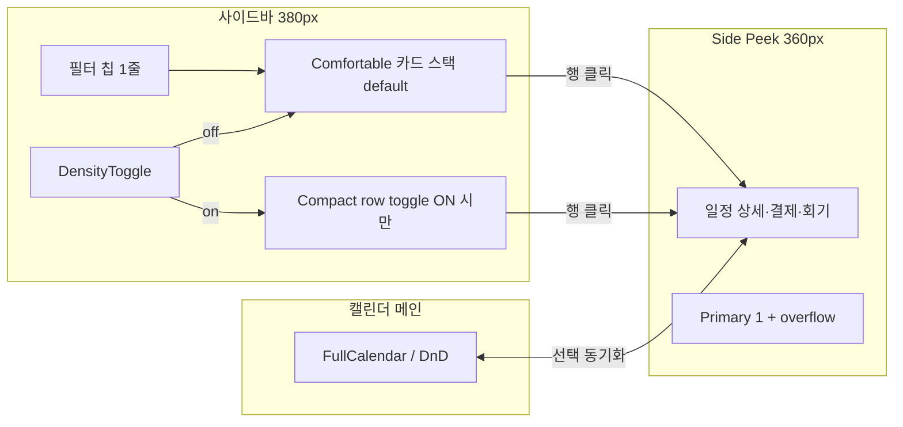

# MindGarden 어드민 — 화면별 상용화 UX 분석 (B 문서)

**작성일**: 2026-07-01  
**담당**: core-planner + core-designer 의견 통합  
**상위 문서**: [`ADMIN_COMMERCIAL_UX_SYSTEMIC_ANALYSIS_V2.md`](./ADMIN_COMMERCIAL_UX_SYSTEMIC_ANALYSIS_V2.md)  
**참조**: `ADMIN_UI_DENSITY_AUDIT_20260627.md`, `ADMIN_DESIGNER_PER_PAGE_OPINIONS.md`  
**시각화 맵**: [`ADMIN_PAGE_REGION_VISUALIZATION.md`](./ADMIN_PAGE_REGION_VISUALIZATION.md) (화면별 영역 구성 참고)  
**코드 변경**: 없음

---

## 목차

1. [G1~G5 그룹 요약](#1-g1g5-그룹-요약)  
2. [G1 — 고빈도 운영 코어](#g1--고빈도-운영-코어)  
3. [G2 — 사용자·계정 관리](#g2--사용자계정-관리)  
4. [G3 — ERP·결제·재무](#g3--erp결제재무)  
5. [G4 — 콘텐츠·커뮤니티·쇼핑](#g4--콘텐츠커뮤니티쇼핑)  
6. [G5 — 시스템·설정](#g5--시스템설정)

---

## 1. G1~G5 그룹 요약

| 그룹 | 화면 수 | P0 | P1 | P2 | P3 | 공통 갭 |
|------|---------|----|----|----|-----|---------|
| **G1** 고빈도 운영 | 7 | 1 | 2 | 3 | 1 | 밀도 토글·side peek 부재; card-default; UnifiedModal 과다 |
| **G2** 사용자·계정 | 9 | 3 | 2 | 3 | 1 | smallCard default; 인라인 4~5버튼; EntityRowActions 미확산 |
| **G3** ERP·결제 | 7 | 0 | 3 | 2 | 2 | card/largeCard default; billing ajax 레거시; PG 카드 다중 CTA |
| **G4** 콘텐츠·쇼핑 | 7 | 0 | 0 | 2 | 5 | 대부분 table-default 양호; side peek·핫키 기회 |
| **G5** 시스템·설정 | 5 | 0 | 0 | 5 | 0 | API 레거시; AdminCommonLayout 불일치; 폼 밀도 |
| **합계** | **35** | **4** | **7** | **15** | **9** | — |

**우선순위 집행 순서**: G1-01(통합일정) → G2 P0 3화면 → G1-04/G3 P1 → G5 API 표준화

---

## G1 — 고빈도 운영 코어

### G1-01. 통합 일정 관리 (IntegratedMatchingSchedule)

| 필드 | 내용 |
|------|------|
| **Route / 파일** | `/admin/integrated-schedule` · `frontend/src/components/admin/mapping-management/IntegratedMatchingSchedule.js` |
| **역할·사용자** | 운영자·스태프가 **3초 안에** “오늘 누가·언제·결제/회기 상태”를 스캔 |
| **현재 UI 상태** | `AdminCommonLayout` + 좌측 **380px** `sidebar_card_stack`; `CardActionGroup` 인라인 CTA; `viewMode` 없음; compact row 실험 롤백 후 comfortable 카드 스택 |
| **갭 (L1/L2/L3)** | L1: good SHA `93c39c35b` 문서화 미완; L2: **밀도 토글 0건**, side peek 0건, saved filter 0건; L3: 3칩 고정 필터, 이름 ellipsis 가독성 리스크 |
| **벤치마크 레퍼런스** | HubSpot Default/Compact; Notion side peek; TherapyNotes Agenda; Jane 일정 패널 |
| **디자이너 의견** | 1순위 정보는 내담자명·예약시간·회기/결제 배지이며, 상담사·센터는 2순위로 카드에 유지한다. Comfortable 뷰를 **기본값**으로 두고 Compact는 **사용자 토글 ON** 시에만 허용한다. 사이드바 인라인에는 Primary 1개(결제 확인·출석)만 두고 나머지는 overflow(⋯) 또는 side peek로 이관한다. 캘린더 맥락 유지를 위해 행 클릭 시 **Side peek**가 필수이며 UnifiedModal 전체 화면 전환은 금지한다. **Must fix(P0)**: 밀도 토글 + side peek. **Can wait(P2)**: Saved View. compact row는 **G-01 완료 후**에만 재도입하며 default는 반드시 off이다. 2026-06-30형 “토글 없이 compact 기본값 강제”는 재발 금지한다. |
| **P0/P1/P2** | **P0** · effort **L** |
| **변경 원칙** | comfortable **default 유지**; compact **토글** (default off); side peek **신규**; compact row **G-01 선행 후만** |
| **good SHA / 롤백** | good: `93c39c35b` (+ `61e6bb82d` 폭/필터); 롤백: `0676dfa2d` (5건 묶음 — 금지) |
| **완료 조건 (DoD)** | comfortable default + DensityToggle; side peek prototype; 380px·필터 1줄 유지; 20+ row 이름 가시성 0% 손실; DnD·#130 gate; good SHA 문서·태그 |
| **연관 공통 컴포넌트** | `AdminCommonLayout`, `CardActionGroup`, `MappingScheduleCard`, `MatchingScheduleSidebar`, `UnifiedModal`(축소), `MGButton`, `DensityToggle`(신규), `SidePeekPanel`(신규) |
| **권장 시각화** | L-B: SessionProgress, L-C: SidePeekShell, DensityToggle Preview, Region Overlay (dev) |

#### 통합일정 레이아웃 와이어 (Side Peek + 밀도 토글)

```text
┌──────────────────────────────────────────────────────────────────────────────┐
│ AdminCommonLayout — 통합 스케줄                                    [밀도 ▼] │
│                                              Comfortable ○  Compact ○ (off)   │
├──────────────────┬───────────────────────────────────────┬───────────────────┤
│ SIDEBAR 380px    │           CALENDAR (main)             │ SIDE PEEK 360px   │
│ ┌──────────────┐ │                                       │ ┌───────────────┐ │
│ │필터 칩 1줄    │ │                                       │ │ 내담자: 김○○  │ │
│ │[전체][오늘]…  │ │                                       │ │ 14:00 상담    │ │
│ └──────────────┘ │                                       │ │ 회기 3/10     │ │
│ ┌──────────────┐ │                                       │ │ 결제: 미결제  │ │
│ │■ Comfortable │ │         (드래그·드롭 영역)            │ ├───────────────┤ │
│ │  카드 스택    │ │                                       │ │ [결제확인] ⋯  │ │
│ │  이름 8자+   │ │                                       │ │ 상세 탭…      │ │
│ ├──────────────┤ │                                       │ └───────────────┘ │
│ │□ Compact     │ │                                       │      (닫기 ✕)     │
│ │  (토글 ON시)  │ │                                       │                   │
│ │  1줄 72px    │ │                                       │                   │
│ └──────────────┘ │                                       │                   │
└──────────────────┴───────────────────────────────────────┴───────────────────┘
```



**compact row 재도입 조건**: G-01 밀도 토글 배포 완료 + G-02 side peek prototype 완료 + R7 팀 합의 + core-tester 20+ row gate.

---

### G1-02. 어드민 대시보드 (AdminDashboard)

| 필드 | 내용 |
|------|------|
| **Route / 파일** | `/admin/dashboard` · `frontend/src/components/admin/AdminDashboard/` |
| **역할·사용자** | 관리자가 **3초 안에** 금일 핵심 지표(예약·미결제·노쇼) 파악 |
| **현재 UI 상태** | AdminDashboard V2; 일부 위젯 ProfileCard compact; `AdminCommonLayout` 부분 미적용 |
| **갭** | L2: 셸 불일치(G-14); L3: 휴가 위젯 등 table→card 전환 흔적 |
| **벤치마크** | HubSpot 대시보드; Linear Home |
| **디자이너 의견** | 대시보드 1순위는 금일 핵심 KPI·경고 뱃지이며 개인정보는 숫자로만 요약한다. 위젯은 **Compact 밀도**로 viewport 내 최대 노출이 맞다. 행별 인라인 버튼은 제거하고 ‘전체 보기’ 링크 1개만 둔다. Side peek는 부적합 — 상세는 전용 페이지 라우팅이 구조적으로 맞다. Must fix: ProfileCard 목록형 위젯을 Table/List로 롤백한다. Can wait: 위젯 DnD 커스터마이즈. 좁은 위젯에 다중 카드·버튼을 넣어 복잡도만 높이지 말 것. |
| **P0/P1/P2** | P2 · effort **M** |
| **변경 원칙** | 위젯 compact **유지**; 목록형 위젯은 table **default**; AdminCommonLayout **통일** |
| **good SHA / 롤백** | — |
| **DoD** | AdminCommonLayout 적용; 위젯당 CTA ≤1; #130 0건; 1280px 스크롤 없이 KPI 4블록 노출 |
| **연관 컴포넌트** | `AdminCommonLayout`, `ProfileCard`, `ListTableView`, `ContentHeader` |
| **권장 시각화** | L-B: Count badge / sparkline (KPI 추이) |

---

### G1-03. 알림·메시지 (Notifications)

| 필드 | 내용 |
|------|------|
| **Route / 파일** | `/admin/notifications` · `frontend/src/components/notifications/UnifiedNotifications.js`, `AdminNotificationsPage` |
| **역할·사용자** | 운영자가 **3초 안에** 미처리 알림·발송 실패 건 식별 |
| **현재 UI 상태** | 통합 알림 페이지; `StandardizedApi`/`safeDisplay` 부분 미적용 |
| **갭** | L2: API·표시 경계(L2-8); L3: 읽음/필터 persist 미흡 |
| **벤치마크** | HubSpot Inbox; Intercom |
| **디자이너 의견** | 1순위는 미읽음·실패·긴급 채널 구분이며 본문 전문은 목록에서 숨긴다. Table(Comfortable) 또는 분할 Inbox 레이아웃이 적합하다. Primary는 ‘읽음 처리’ 또는 ‘재발송’ 1개, 위험 액션은 overflow에 둔다. Side peek로 알림 본문·수신자 이력을 우측에 띄우면 목록 스캔이 유지된다. Must fix: StandardizedApi 전환 및 safeDisplay 적용. Can wait: 채널별 Saved View. React #130 유발 가능 필드를 방어하지 않은 채 배포하지 말 것. |
| **P0/P1/P2** | P2 · effort **M** |
| **변경 원칙** | list/table **default**; API 표준화 **필수**; side peek **토글(선택)** |
| **DoD** | StandardizedApi 100%; safeDisplay 전 필드; 미읽음 필터 persist; #130 0건 |
| **연관 컴포넌트** | `UnifiedNotifications`, `StandardizedApi`, `ListTableView`, `BadgeSelect` |
| **권장 시각화** | L-B: Empty / zero state visual |

---

### G1-04. 매칭 목록 (MappingListBlock)

| 필드 | 내용 |
|------|------|
| **Route / 파일** | `/admin/mapping-management` · `mapping-management/organisms/MappingListBlock.js` |
| **역할·사용자** | 운영자가 **3초 안에** 대기/처리 필요 매칭 건 식별 |
| **현재 UI 상태** | `useState('card')` default; table·calendar 보유; `ViewModeToggle` 있음 |
| **갭** | L3: card-default; MappingCard 4~5버튼 |
| **벤치마크** | HubSpot Deals list; Jane matching queue |
| **디자이너 의견** | 1순위는 매칭 상태·내담자·상담사·신청일이다. Table List(Comfortable)를 default로 20+ 행 스캔이 가능해야 한다. ‘매칭 확정’ Primary 1개 외 모든 액션은 overflow(⋯)로 통합한다. Side peek로 내담자 요구사항·상담사 일정을 대조하는 워크플로에 최적이다. Must fix(P0급 P1): card default→table 전환. Can wait: 캘린더 양방향 DnD. MappingCard에 5 ActionButton 나열 금지. |
| **P0/P1/P2** | P1 · effort **M** |
| **변경 원칙** | table **default**; card **토글 optional**; EntityRowActions **확산** |
| **DoD** | default=table; overflow 100%; viewMode persist; 20+ row gate |
| **연관 컴포넌트** | `MappingListBlock`, `MappingCard`, `ViewModeToggle`, `EntityRowActions`, `CardActionGroup` |
| **권장 시각화** | L-B: Progress Pipeline, L-C: SidePeekShell |

---

### G1-05. 매칭 카드 (MappingCard)

| 필드 | 내용 |
|------|------|
| **Route / 파일** | `frontend/src/components/ui/Card/MappingCard.js` (컴포넌트 SSOT) |
| **역할·사용자** | 카드 뷰 fallback 시 **3초 안에** 상태·당사자 파악 |
| **현재 UI 상태** | 상태별 최대 **5개** ActionButton; overflow 없음 |
| **갭** | L2: 컴포넌트 SSOT; L3: 인라인 다중 CTA |
| **벤치마크** | Stripe Connect row actions |
| **디자이너 의견** | 카드는 table fallback·모바일 전용으로 격하한다. Primary 1 + overflow가 row action SSOT이다. 5버튼 인라인은 클릭 실수·시각 피로를 유발한다. MappingListBlock table cell renderer로 흡수하는 방향이 맞다. 상태별 버튼 노출 조건은 overflow 메뉴 내부로 이관한다. 신규 ActionButton 슬롯 추가는 예외 승인 없이 금지한다. |
| **P0/P1/P2** | P1 · effort **S** |
| **변경 원칙** | table row **우선**; 카드 variant **deprecate(admin)** |
| **DoD** | 인라인 버튼 ≤1; overflow 연동; MappingListBlock table default와 정합 |
| **연관 컴포넌트** | `MappingCard`, `CardActionGroup`, `EntityRowActions` |

---

### G1-06. 결제 대기 정리 (AdminPendingPaymentCleanupPage)

| 필드 | 내용 |
|------|------|
| **Route / 파일** | `/admin/mappings/pending-payment-cleanup` · `admin/mapping/AdminPendingPaymentCleanupPage.js` |
| **역할·사용자** | 채권 담당이 **3초 안에** 만료 임박 건 식별 |
| **현재 UI 상태** | `ListTableView` + `CardActionGroup`; table-default ✓ |
| **갭** | L3: 만료 시급성 뱃지 미흡 |
| **벤치마크** | HubSpot overdue deals |
| **디자이너 의견** | 1순위는 대기자·만료 기한·서비스이다. 기한순 Table(Comfortable)이 직관적이다. ‘결제 링크 재발송’ Primary 1개, 강제 취소는 overflow. Side peek로 미수금 메모·SMS 이력 대조가 유용하다. Must fix: 만료 D-day 뱃지 시각화. Can wait: ARS 스케줄러. 시급성 없이 평면 나열 금지. |
| **P0/P1/P2** | P3 · effort **S** |
| **변경 원칙** | table **default 유지**; 뱃지 **추가** |
| **DoD** | D-day 뱃지; Primary 1 + overflow; 20+ row 정렬 검증 |
| **연관 컴포넌트** | `ListTableView`, `CardActionGroup`, `EntityRowActions` |

---

### G1-07. 예약 상세 모달 (ScheduleDetailModal)

| 필드 | 내용 |
|------|------|
| **Route / 파일** | `schedule/ScheduleDetailModal.js` (참여자 패널) |
| **역할·사용자** | 스태프가 모달 내 **3초 안에** 참여자·출석 상태 확인 |
| **현재 UI 상태** | 4× `ProfileCard variant="compact"`; 모달 내 과밀 |
| **갭** | L3: compact card 4개로 모달 레이아웃 붕괴 |
| **벤치마크** | Jane appointment detail |
| **디자이너 의견** | 1순위는 참여자명·역할·출석 상태이다. 모달 내부는 List Compact 밀도가 맞다. 출석 체크 아이콘 1개만 인라인, 나머지 생략. Side peek 추가 금지 — Z-index·인지 계층 붕괴. Must fix: ProfileCard 4개→단순 리스트 아이템. Can wait: 그룹 채팅 숏컷. 제한된 모달에 ProfileCard 재사용 금지. |
| **P0/P1/P2** | P2 · effort **S** |
| **변경 원칙** | compact list **default**; ProfileCard **금지(모달 내)** |
| **DoD** | 참여자 리스트 단순화; 모달 스크롤 정상; 터치 영역 44px |
| **연관 컴포넌트** | `UnifiedModal`, `ProfileCard`, `MGButton` |

---

## G2 — 사용자·계정 관리

### G2-01. 내담자 종합 관리 (ClientComprehensiveManagement)

| 필드 | 내용 |
|------|------|
| **Route / 파일** | `/admin/user-management?type=client` · `admin/ClientComprehensiveManagement.js`, `ClientOverviewTab.js` |
| **역할·사용자** | 운영자가 **3초 안에** 내담자명·연락처·서비스 상태 파악 |
| **현재 UI 상태** | `useState('smallCard')` default; list 보유; compact 4버튼(상세·수정·비번·삭제); `mg-v2-client-actions` 3 variant |
| **갭** | L3: **P0** card-default + 인라인 4버튼 |
| **벤치마크** | HubSpot Contacts; Jane Clients |
| **디자이너 의견** | 1순위는 내담자명·연락처·활성 서비스 뱃지이다. Table Comfortable(48~56px) default가 B2B에 맞다. ‘프로필 보기’ Primary 1 + overflow로 4버튼 인라인을 제거한다. Side peek로 결제·예약 이력을 가볍게 확인한다. Must fix(P0): smallCard→list/table default + EntityRowActions. Can wait: 그룹 SMS. Compact 카드에 4버튼 욱여넣기 금지. |
| **P0/P1/P2** | **P0** · effort **L** |
| **변경 원칙** | list/table **default**; smallCard **토글 optional**; EntityRowActions **필수** |
| **DoD** | default=list; overflow 100%; 20+ row; viewMode persist; ClientModal 회귀 테스트 |
| **연관 컴포넌트** | `ListTableView`, `ViewModeToggle`, `EntityRowActions`, `ProfileCard`(deprecate admin list) |
| **권장 시각화** | L-B: 상태 Pipeline, L-C: SidePeekShell |

---

### G2-02. 상담사 종합 관리 (ConsultantComprehensiveManagement)

| 필드 | 내용 |
|------|------|
| **Route / 파일** | `/admin/user-management?type=consultant` · `admin/ConsultantComprehensiveManagement.js` |
| **역할·사용자** | 운영자가 **3초 안에** 상담사명·활성 상태·가동률 파악 |
| **현재 UI 상태** | `smallCard` default; `ConsultantCard` admin-list/admin-compact 이중체계 |
| **갭** | L3: **P0**; admin-compact variant |
| **벤치마크** | HubSpot Users; Linear People |
| **디자이너 의견** | 1순위는 상담사명·활성 상태이다. Table Comfortable로 다수 비교가 가능해야 한다. ‘프로필 상세’ Primary 1, 권한/휴면은 overflow. Side peek로 자격증·일정 대조에 유리하다. Must fix(P0): admin-compact **deprecate** + list default. Can wait: 다중 태그 일괄 수정. Compact에 3~4버튼 인라인 금지. |
| **P0/P1/P2** | **P0** · effort **L** |
| **변경 원칙** | list **default**; admin-compact **금지·deprecate** |
| **DoD** | G2-01과 동일 패턴; ConsultantCard admin variant 제거 계획 |
| **연관 컴포넌트** | `ConsultantCard`, `EntityRowActions`, `ListTableView` |
| **권장 시각화** | L-B: 가동률 Sparkline, L-C: SidePeekShell |

---

### G2-03. 스태프 관리 (StaffManagement)

| 필드 | 내용 |
|------|------|
| **Route / 파일** | `/admin/user-management` (staff 탭) · `admin/StaffManagement.js` |
| **역할·사용자** | 관리자가 **3초 안에** 스태프명·역할·접속 상태 파악 |
| **현재 UI 상태** | `smallCard` default; 4~5버튼 인라인; `renderStaffActionBar` Client 복붙 |
| **갭** | L3: **P0**; logic duplicate |
| **벤치마크** | HubSpot Team; Stripe Dashboard users |
| **디자이너 의견** | 1순위는 스태프명·시스템 역할이다. 보안 도메인이므로 Table Comfortable 고정. ‘권한 설정’ Primary 1 + overflow. Side peek로 권한 트리 토글이 유리하다. Must fix(P0): EntityRowActions 추상화. Can wait: 접속 시간대 통계. Action Bar 무심코 복붙하여 셀 너비 붕괴 금지. |
| **P0/P1/P2** | **P0** · effort **M** |
| **변경 원칙** | list **default**; `renderStaffActionBar` **금지** → EntityRowActions |
| **DoD** | EntityRowActions 100%; default=list; StaffManagement test 통과 |
| **연관 컴포넌트** | `EntityRowActions`, `ListTableView`, `MGButton` |
| **권장 시각화** | L-B: 권한 레벨 뱃지, L-C: SidePeekShell |

---

### G2-04. 사용자 권한 관리 (UserManagement)

| 필드 | 내용 |
|------|------|
| **Route / 파일** | `/admin/user-management` · `admin/UserManagement.js` |
| **역할·사용자** | 관리자가 **3초 안에** 사용자 ID·역할·활성 상태 파악 |
| **현재 UI 상태** | card grid only; ViewModeToggle·ListTableView **없음** |
| **갭** | L3: P1; 확장성 없는 그리드 |
| **벤치마크** | HubSpot Users table |
| **디자이너 의견** | 1순위는 ID·이름·활성 상태이다. 수천 명 스캔에 Table Comfortable 필수. 위험 액션은 전면 overflow. Side peek로 접속 로그 훑기 적합. Must fix: ListTableView 이식. Can wait: 코호트 분석. card grid로 스크롤 지옥 금지. |
| **P0/P1/P2** | P1 · effort **M** |
| **변경 원칙** | table **default**; card grid **토글 optional** |
| **DoD** | ViewModeToggle + ListTableView; default=table; persist |
| **연관 컴포넌트** | `ListTableView`, `ViewModeToggle`, `EntityRowActions` |

---

### G2-05. 상담사용 내담자 목록 (ConsultantClientList)

| 필드 | 내용 |
|------|------|
| **Route / 파일** | `/consultant/clients` · `consultant/ConsultantClientList.js` |
| **역할·사용자** | 상담사가 **3초 안에** 담당 내담자·다음 예약 파악 |
| **현재 UI 상태** | `ClientCard variant="detailed"` grid only |
| **갭** | L3: P1; table 없음 |
| **벤치마크** | Jane My Clients |
| **디자이너 의견** | 1순위는 내담자명·다음 예약이다. Table List가 스캔에 유리하다. ‘차트 작성’ Primary, 메시지는 overflow. Side peek로 Progress Note 프리뷰. Must fix: table 옵션 추가. Can wait: Saved View. 거대 ProfileCard 강제 금지. |
| **P0/P1/P2** | P1 · effort **M** |
| **변경 원칙** | table **default**; detailed card **mobile fallback** |
| **DoD** | ListTableView 도입; 20+ row; consultant role 회귀 |
| **연관 컴포넌트** | `ClientCard`, `ListTableView`, `EntityRowActions` |

---

### G2-06. 휴면 사용자 (DormantUsersList)

| 필드 | 내용 |
|------|------|
| **Route / 파일** | `/admin/lifecycle/dormant-users` · `admin/lifecycle/DormantUsersList.js` |
| **역할·사용자** | 관리자가 **3초 안에** 휴면 전환일·사유 파악 |
| **현재 UI 상태** | native `<table>`; PII 마스킹 ✓; 행 액션 3개 분산 |
| **갭** | L3: P3 모범; EntityRowActions 미적용 |
| **벤치마크** | HubSpot inactive contacts |
| **디자이너 의견** | Table Comfortable **모범 사례** — 기조 유지. ‘휴면 해제’ Primary 1 + overflow. Side peek 불필요. Must fix: EntityRowActions 일원화. Can wait: D-day 카운트다운. 우수한 table을 card로 퇴행 금지. |
| **P0/P1/P2** | P3 · effort **S** |
| **변경 원칙** | table **default 유지**; 구조 변경 **금지** |
| **DoD** | EntityRowActions 적용; 마스킹 유지; overflow |
| **연관 컴포넌트** | `EntityRowActions`, `ListTableView` |

---

### G2-07. 계좌 관리 (AccountManagement)

| 필드 | 내용 |
|------|------|
| **Route / 파일** | `/admin/accounts` · `admin/AccountManagement.js` |
| **역할·사용자** | 재무 담당이 **3초 안에** 계좌번호·잔액·연동 상태 파악 |
| **현재 UI 상태** | native table; **fetch raw** (StandardizedApi 미적용) |
| **갭** | L2: API 레거시; L3: EntityRowActions 없음 |
| **벤치마크** | Stripe Balance; QuickBooks accounts |
| **디자이너 의견** | 숫자·계좌 도메인은 Table Comfortable 고정이 맞다. ‘상세 보기’ Primary 1, 삭제·동기화는 overflow. Side peek로 거래 내역 크로스체크 가능. Must fix: StandardizedApi 전환. Can wait: 은행 API 실시간 잔액. raw fetch로 #130·tenant 경계 위반 금지. |
| **P0/P1/P2** | P2 · effort **M** |
| **변경 원칙** | table **default 유지**; API **표준화 필수** |
| **DoD** | StandardizedApi; safeDisplay; EntityRowActions; tenantId gate |
| **연관 컴포넌트** | `StandardizedApi`, `EntityRowActions`, `MGButton` |

---

### G2-08. 내담자 대시보드 위젯 (ConsultantClientWidget)

| 필드 | 내용 |
|------|------|
| **Route / 파일** | `/consultant/dashboard` 위젯 · `dashboard/widgets/consultation/ConsultantClientWidget.js` |
| **역할·사용자** | 상담사가 **3초 안에** 다가오는 예약 3건 파악 |
| **현재 UI 상태** | compact preview; 카드 테두리 과다 |
| **갭** | L3: P2; truncation·tooltip 부재 |
| **벤치마크** | Linear My Issues widget |
| **디자이너 의견** | 1순위는 내담자명·시간·뱃지이다. Compact flat 리스트가 위젯에 맞다. ‘전체 목록 보기’ 링크만; 행별 버튼 제거. Side peek 불필요 — 메인 페이지 라우팅. Must fix: 카드 테두리 제거·flat UI. Can wait: 핀 뷰. truncation 시 tooltip 필수. |
| **P0/P1/P2** | P2 · effort **S** |
| **변경 원칙** | compact **유지**; 카드 chrome **축소** |
| **DoD** | flat list; tooltip on truncate; 라우팅 링크 1개 |
| **연관 컴포넌트** | `ProfileCard`, `MGButton` |

---

### G2-09. 내담자 관리 리뉴얼 (ConsultantClientManagementRenewal)

| 필드 | 내용 |
|------|------|
| **Route / 파일** | `consultant/ConsultantClientManagementRenewal.js` |
| **역할·사용자** | 상담사가 실험 UI에서 **3초 안에** 성과 지표·이름 파악 |
| **현재 UI 상태** | 로컬 `ClientCard` duplicate; 디자인 토큰 이탈 위험 |
| **갭** | L3: P2; SSOT 분열 |
| **벤치마크** | Jane outcomes dashboard |
| **디자이너 의견** | Table+Card 혼합 Data Grid(Comfortable) 권장. ‘성과 리포트’ Primary, 나머지 overflow. Side peek로 지표 그래프 즉시 피드백. Must fix: 로컬 ClientCard 폐기→ListTableView 합류. Can wait: Gamification. 리뉴얼 명분으로 하드코딩 색상 금지. |
| **P0/P1/P2** | P2 · effort **M** |
| **변경 원칙** | ListTableView **SSOT**; 로컬 card **금지** |
| **DoD** | 글로벌 컴포넌트만 사용; 토큰 100%; renewal→main 합류 계획 |
| **연관 컴포넌트** | `ListTableView`, `ClientCard`(deprecate local) |

---

## G3 — ERP·결제·재무

### G3-01. 거래·정산 (FinancialManagement)

| 필드 | 내용 |
|------|------|
| **Route / 파일** | `/erp/financial` · `erp/FinancialManagement.js` |
| **역할·사용자** | 재무가 **3초 안에** 거래일시·금액·승인 상태 파악 |
| **현재 UI 상태** | `useState('card')` default; `ViewModeToggle`; compact/card/table 3분기 CSS |
| **갭** | L3: P1; ERP인데 card default |
| **벤치마크** | QuickBooks; Stripe Payments |
| **디자이너 의견** | 숫자 중심 Table Comfortable 필수. ‘전표 보기’ Primary, 환불·재발급 overflow. Side peek로 에러 로그 대조. Must fix: table default. Can wait: 엑셀 커스텀. 카드 default로 소수점 정렬 불가 금지. |
| **P0/P1/P2** | P1 · effort **S** |
| **변경 원칙** | table **default**; card **토글 optional** |
| **DoD** | transactionViewMode default=table; RefundManagement 패턴 정합 |
| **연관 컴포넌트** | `ViewModeToggle`, `ListTableView`, `EntityRowActions` |

---

### G3-02. 급여 관리 (SalaryManagement)

| 필드 | 내용 |
|------|------|
| **Route / 파일** | `/erp/salary` · `erp/SalaryManagement.js` |
| **역할·사용자** | 재무가 **3초 안에** 상담사·정산액·지급 상태 파악 |
| **현재 UI 상태** | `largeCard` default; card 3-mode |
| **갭** | L3: P1; 공간 낭비 |
| **벤치마크** | Gusto payroll list |
| **디자이너 의견** | Table Comfortable로 다수 정산 검토. ‘명세서 발행’ Primary, 이의제기 overflow. Side peek로 월별 상담 건 검증. Must fix: largeCard→table. Can wait: 시뮬레이션. B2C 카드 UI 금지. |
| **P0/P1/P2** | P1 · effort **M** |
| **변경 원칙** | table **default**; largeCard **deprecate** |
| **DoD** | default=list/table; 20+ row; 금액 정렬 |
| **연관 컴포넌트** | `ListTableView`, `ConsultantCard`(salary variant 축소) |

---

### G3-03. 환불 관리 (RefundManagement)

| 필드 | 내용 |
|------|------|
| **Route / 파일** | `/erp/refunds` (또는 mapping 내 환불) · `erp/RefundManagement.js` |
| **역할·사용자** | 재무가 **3초 안에** 환불 요청일·금액·상태 파악 |
| **현재 UI 상태** | `refundViewMode` default `'table'` — **모범 사례** |
| **갭** | L3: P3; 필터 UX 개선 여지 |
| **벤치마크** | Stripe Refunds |
| **디자이너 의견** | Table Comfortable **유지** — 타 화면 벤치마크 SSOT. ‘환불 승인’ Primary, 거절 overflow. Side peek로 PG 영수증 크로스체크. Must fix: 1줄 세그먼트 Chip 필터. Can wait: 부분 환불 계산기. 모범 table을 카드로 통합 시도 금지. |
| **P0/P1/P2** | P3 · effort **S** |
| **변경 원칙** | table **default 유지**; 구조 통합 **금지** |
| **DoD** | Chip 필터; overflow; 다른 ERP 화면 참조 문서화 |
| **연관 컴포넌트** | `ListTableView`, `BadgeSelect`, `EntityRowActions` |

---

### G3-04. 결제/구독 (Billing Subscriptions)

| 필드 | 내용 |
|------|------|
| **Route / 파일** | `/admin/billing/subscriptions` · `admin/billing/SubscriptionsPage.js` |
| **역할·사용자** | 운영자가 **3초 안에** 구독 상태·다음 결제일 파악 |
| **현재 UI 상태** | **ajax 레거시**; billingService 직접 호출 |
| **갭** | L2: API 레거시; L3: table/list 패턴 미정립 |
| **벤치마크** | Stripe Billing; HubSpot Subscriptions |
| **디자이너 의견** | 구독 목록은 Table Comfortable이 표준이다. ‘구독 관리’ Primary 1, 취소·환불은 overflow+danger 내부. Side peek로 결제 이력·인보이스 프리뷰. Must fix: StandardizedApi 전환. Can wait: MRR 대시보드. ajax 레거시 유지 금지. |
| **P0/P1/P2** | P2 · effort **M** |
| **변경 원칙** | table **default**; ajax **금지** |
| **DoD** | StandardizedApi; ListTableView; tenantId; #130 0건 |
| **연관 컴포넌트** | `StandardizedApi`, `ListTableView`, `billingService`(deprecate) |

---

### G3-05. 결제 수단 (Billing PaymentMethods)

| 필드 | 내용 |
|------|------|
| **Route / 파일** | `/admin/billing/payment-methods` · `admin/billing/PaymentMethodsPage.js` |
| **역할·사용자** | 운영자가 **3초 안에** 등록 카드·기본 수단 파악 |
| **현재 UI 상태** | ajax 레거시; 카드형 UI 혼재 |
| **갭** | L2: API; L3: 행 액션 정리 필요 |
| **벤치마크** | Stripe Payment Methods |
| **디자이너 의견** | 마스킹된 카드번호·브랜드·만료일 Table이 적합하다. ‘기본 설정’ Primary, 삭제는 overflow+danger. Side peek 불필요 — 폼은 모달. Must fix: API 표준화 + table. Can wait: 3DS 재인증 UI. 파괴적 삭제 버튼 인라인 노출 금지. |
| **P0/P1/P2** | P2 · effort **M** |
| **변경 원칙** | table **default**; ajax **금지** |
| **DoD** | StandardizedApi; Primary 1 + overflow; PCI 마스킹 유지 |
| **연관 컴포넌트** | `StandardizedApi`, `UnifiedModal`, `EntityRowActions` |

---

### G3-06. PG 설정 (PgConfigurationList)

| 필드 | 내용 |
|------|------|
| **Route / 파일** | `/tenant/pg-configurations` · `tenant/PgConfigurationList.js` |
| **역할·사용자** | 테넌트 관리자가 **3초 안에** PG 연동 상태 파악 |
| **현재 UI 상태** | card only; footer **4~5버튼** |
| **갭** | L3: P1; table 없음 |
| **벤치마크** | Stripe Connect settings |
| **디자이너 의견** | 기술 설정은 Table Comfortable. ‘설정 수정’ Primary, 연동 해제 overflow+danger. Side peek 불필요 — 전용 폼/모달. Must fix: table 추가. Can wait: 헬스 체크. 카드 하단 파괴 버튼 나열 금지. |
| **P0/P1/P2** | P1 · effort **M** |
| **변경 원칙** | table **default**; card **optional** |
| **DoD** | table view; overflow; 4~5버튼 제거 |
| **연관 컴포넌트** | `ListTableView`, `EntityRowActions`, `UnifiedModal` |

---

### G3-07. PG 승인 운영 (PgApprovalManagement)

| 필드 | 내용 |
|------|------|
| **Route / 파일** | `/admin/ops/pg-approval` · `admin/ops/PgApprovalManagement.js` (또는 동등) |
| **역할·사용자** | 운영(Ops)이 **3초 안에** 승인 대기·테넌트·PG사 파악 |
| **현재 UI 상태** | Ops 전용; table 위주 양호 |
| **갭** | L3: P3; 필터·bulk action 여지 |
| **벤치마크** | Stripe Review queue |
| **디자이너 의견** | 승인 큐는 Table(Comfortable~Compact)가 맞다. ‘승인’ Primary, 거절·보류 overflow. Side peek로 테넌트 PG 설정 스냅샷 대조. Must fix: bulk 승인 안정화. Can wait: SLA 뱃지. STAFF 권한 노출 경계 유지. |
| **P0/P1/P2** | P3 · effort **S** |
| **변경 원칙** | table **default 유지** |
| **DoD** | Ops 권한 gate; overflow; bulk 선택 |
| **연관 컴포넌트** | `ListTableView`, `EntityRowActions`, `MGButton` |

---

## G4 — 콘텐츠·커뮤니티·쇼핑

### G4-01. 상담 일지 (ConsultationLogTableBlock)

| 필드 | 내용 |
|------|------|
| **Route / 파일** | `/admin/consultation-logs` · `consultation-log-view/ConsultationLogTableBlock.js` |
| **역할·사용자** | 관리자가 **3초 안에** 상담일시·내담자·작성 상태 파악 |
| **현재 UI 상태** | ListTableView only; table-default ✓ |
| **갭** | L3: P3; 일지 열람 시 full page routing |
| **벤치마크** | TherapyNotes Progress Notes |
| **디자이너 의견** | Table Comfortable **유지**. ‘일지 열람’ Primary, 인쇄·수정이력 overflow. Side peek로 본문 스크롤 읽기 최적. Must fix: routing→side peek. Can wait: AI 키워드. ListTableView에 card 토글 추가 금지. |
| **P0/P1/P2** | P3 · effort **M** |
| **변경 원칙** | table **default 유지**; side peek **추가** |
| **DoD** | side peek 일지 본문; overflow; #130 0건 |
| **연관 컴포넌트** | `ListTableView`, `SidePeekPanel`(신규) |

---

### G4-02. 심리검사 (PsychDocumentListBlock)

| 필드 | 내용 |
|------|------|
| **Route / 파일** | `/admin/psych-assessments` · `psych-assessment/organisms/PsychDocumentListBlock.js` |
| **역할·사용자** | 관리자가 **3초 안에** 내담자·검사명·상태 파악 |
| **현재 UI 상태** | default table; card toggle ✓ |
| **갭** | L3: P3; 다운로드 로딩 UX |
| **벤치마크** | Jane Assessments |
| **디자이너 의견** | Table **유지**. ‘결과 보기’ Primary, 재발송·취소 overflow. Side peek로 T-score 프리뷰. Must fix: 행 단위 인라인 로딩. Can wait: 병합 리포트. 행당 다중 인라인 버튼 추가 금지. |
| **P0/P1/P2** | P3 · effort **S** |
| **변경 원칙** | table **default 유지** |
| **DoD** | 인라인 로딩; overflow; 스펙 `DESIGN_SPEC_FINAL` 정합 |
| **연관 컴포넌트** | `ListTableView`, `ViewModeToggle` |

---

### G4-03. 온라인 주문 (AdminShopOrdersPage)

| 필드 | 내용 |
|------|------|
| **Route / 파일** | `/admin/shop/orders` · `admin/AdminShopOrdersPage.js` |
| **역할·사용자** | 운영자가 **3초 안에** 주문번호·금액·배송 상태 파악 |
| **현재 UI 상태** | ListTableView; table-default ✓ |
| **갭** | L3: P3; bulk 배송·클릭 영역 |
| **벤치마크** | Shopify Orders |
| **디자이너 의견** | 커머스 표준 Table(Comfortable~Compact). ‘배송 처리’ Primary, 취소·교환 overflow. Side peek로 배송지·송장 폼. Must fix: checkbox bulk 안정화. Can wait: 송장 엑셀 파서. 행 클릭 vs 복사 영역 겹침 금지. |
| **P0/P1/P2** | P3 · effort **S** |
| **변경 원칙** | table **default 유지** |
| **DoD** | bulk 배송; side peek 송장; 클릭 영역 분리 |
| **연관 컴포넌트** | `ListTableView`, `CardActionGroup` |

---

### G4-04. 콘텐츠 마스터 (AdminContentMasterPage)

| 필드 | 내용 |
|------|------|
| **Route / 파일** | `/admin/content-master` · `admin/AdminContentMasterPage.js` |
| **역할·사용자** | 운영자가 **3초 안에** 제목·발행 상태·조회수 파악 |
| **현재 UI 상태** | ListTableView; 썸네일 컬럼 비율 불균일 |
| **갭** | L3: P3; row height 제어 |
| **벤치마크** | HubSpot CMS |
| **디자이너 의견** | 썸네일+텍스트 Table Comfortable. ‘수정’ Primary, 통계·숨기기 overflow. Side peek 불필요 — 에디터 전체 화면. Must fix: 16:9 썸네일 래퍼. Can wait: 버저닝. row height 폭주 금지. |
| **P0/P1/P2** | P3 · effort **S** |
| **변경 원칙** | table **default 유지** |
| **DoD** | 16:9 wrapper; row height cap; overflow |
| **연관 컴포넌트** | `ListTableView`, `EntityRowActions` |

---

### G4-05. 커뮤니티 검수큐 (AdminCommunityModerationQueuePage)

| 필드 | 내용 |
|------|------|
| **Route / 파일** | `/admin/community-moderation` · `admin/AdminCommunityModerationQueuePage.js` |
| **역할·사용자** | 모더레이터가 **3초 안에** 신고 요약·누적 수 파악 |
| **현재 UI 상태** | ListTableView; **Compact 예외** 허용 화면 |
| **갭** | L3: P3; 핫키·버튼 배치 |
| **벤치마크** | Reddit mod queue; Linear triage |
| **디자이너 의견** | 대량 처리에 Compact Table **예외 허용**. ‘승인’·‘차단’ 2인라인은 CardActionGroup으로만. Side peek로 원문·댓글 문맥 필수. Must fix: 핫키 연동. Can wait: AI 하이라이트. 버튼 분산으로 마우스 이동 증가 금지. |
| **P0/P1/P2** | P3 · effort **M** |
| **변경 원칙** | compact table **예외 유지**; 2-primary **한정 예외** |
| **DoD** | 핫키; side peek; 승인/차단 reach ≤1 |
| **연관 컴포넌트** | `ListTableView`, `CardActionGroup`, `SidePeekPanel` |

---

### G4-06. 회기/세션 관리 (SessionManagement)

| 필드 | 내용 |
|------|------|
| **Route / 파일** | `/admin/sessions` · `admin/SessionManagement.js` |
| **역할·사용자** | 운영자가 **3초 안에** 회기 ID·내담자·일시·상태 파악 |
| **현재 UI 상태** | quick/search 탭; `ProfileCard compact` grid |
| **갭** | L3: P2; 검색 결과 compact grid |
| **벤치마크** | Jane Sessions |
| **디자이너 의견** | 검색·필터 도메인은 Table Comfortable. ‘상세 일지’ Primary, 환불 연계 overflow. Side peek로 노트·결제 점검. Must fix: compact grid→table. Can wait: 일괄 취소. 수십 건을 카드로 뿌리기 금지. |
| **P0/P1/P2** | P2 · effort **M** |
| **변경 원칙** | table **default**; compact grid **deprecate** |
| **DoD** | search 결과 table; 20+ row; overflow |
| **연관 컴포넌트** | `ProfileCard`, `ListTableView`, `EntityRowActions` |

---

### G4-07. 휴가 통계 (VacationStatistics)

| 필드 | 내용 |
|------|------|
| **Route / 파일** | `/admin/statistics` (휴가) · `admin/VacationStatistics.js` |
| **역할·사용자** | 관리자가 **3초 안에** 상담사·잔여 휴가일 파악 |
| **현재 UI 상태** | ProfileCard list; 통계 목적에 부적합 |
| **갭** | L3: P2; 횡비교 불가 |
| **벤치마크** | BambooHR time off |
| **디자이너 의견** | 부서/개인 비교에 Table Comfortable. ‘상세 내역’ Primary, 승인 강제 변경 overflow. Side peek로 연간 타임라인. Must fix: ProfileCard→table. Can wait: 인터랙티브 필터. ProfileCard 무의미 나열 금지. |
| **P0/P1/P2** | P2 · effort **M** |
| **변경 원칙** | table **default**; ProfileCard list **deprecate** |
| **DoD** | table 전환; AdminCommonLayout; 드릴다운 링크 |
| **연관 컴포넌트** | `ProfileCard`, `ListTableView`, `AdminCommonLayout` |

---

## G5 — 시스템·설정

### G5-01. 공통코드 (CommonCodeManagement)

| 필드 | 내용 |
|------|------|
| **Route / 파일** | `/admin/common-codes` · `admin/CommonCodeManagement.js` |
| **역할·사용자** | 시스템 관리자가 **3초 안에** 코드그룹·사용 여부 파악 |
| **현재 UI 상태** | 트리+테이블 혼합; API 레거시 혼용 |
| **갭** | L2: API; L3: 폼·목록 밀도 |
| **벤치마크** | HubSpot Properties |
| **디자이너 의견** | 코드 목록은 Table Comfortable. ‘수정’ Primary, 삭제 overflow+danger. Side peek로 코드 사용처 프리뷰 유용. Must fix: StandardizedApi·safeDisplay. Can wait: 코드 import/export. page-specific compact CSS 추가 금지. |
| **P0/P1/P2** | P2 · effort **M** |
| **변경 원칙** | table **default 유지**; API **표준화** |
| **DoD** | StandardizedApi; #130 0건; EntityRowActions |
| **연관 컴포넌트** | `StandardizedApi`, `ListTableView`, `UnifiedModal` |

---

### G5-02. 테넌트 공통코드 (TenantCommonCodeManager)

| 필드 | 내용 |
|------|------|
| **Route / 파일** | `/admin/tenant-common-codes` · `admin/TenantCommonCodeManager.js` |
| **역할·사용자** | 테넌트 관리자가 **3초 안에** 오버라이드 코드·상태 파악 |
| **현재 UI 상태** | `tenantCommonCodeApi` 전용; G5-01과 UI 패턴 불일치 |
| **갭** | L2: API 분리; L3: SSOT 불일치 |
| **벤치마크** | HubSpot custom properties |
| **디자이너 의견** | G5-01과 **동일 Table 패턴**으로 수렴. Primary 1 + overflow. Side peek로 글로벌 코드 대비 diff 표시. Must fix: UI·API 패턴 G5-01 정합. Can wait: bulk override. 별도 카드 UI 신설 금지. |
| **P0/P1/P2** | P2 · effort **M** |
| **변경 원칙** | G5-01과 **동일 SSOT** |
| **DoD** | ListTableView 공유; tenantId gate; overflow |
| **연관 컴포넌트** | `tenantCommonCodeApi`, `ListTableView`, `StandardizedApi` |

---

### G5-03. 시스템 설정 (SystemConfigManagement)

| 필드 | 내용 |
|------|------|
| **Route / 파일** | `/admin/system-config` · `admin/SystemConfigManagement.js` |
| **역할·사용자** | 관리자가 **3초 안에** 섹션·키 설정값·위험도 파악 |
| **현재 UI 상태** | 섹션 폼; AI·웰니스 등 서브섹션 분리; AdminCommonLayout △ |
| **갭** | L2: 셸; L3: 긴 폼 스캔 |
| **벤치마크** | Linear Settings; Notion Settings |
| **디자이너 의견** | 설정은 **폼 중심** — 목록형 키는 Table, 값 편집은 인라인 또는 모달. 위험 토글은 danger overflow. Side peek 불필요. Must fix: AdminCommonLayout 통일. Can wait: 설정 검색. 세션 race로 빈 폼 노출 금지(테스트 가드 유지). |
| **P0/P1/P2** | P2 · effort **M** |
| **변경 원칙** | 폼 레이아웃 **유지**; 셸 **통일** |
| **DoD** | AdminCommonLayout; AI 섹션 회귀 테스트; safeDisplay |
| **연관 컴포넌트** | `AdminCommonLayout`, `UnifiedModal`, `MGButton`, `BadgeSelect` |

---

### G5-04. 테넌트 프로필 (TenantProfile)

| 필드 | 내용 |
|------|------|
| **Route / 파일** | `/tenant/profile` · `tenant/TenantProfile.js` (또는 동등) |
| **역할·사용자** | 테넌트 관리자가 **3초 안에** 사업자명·플랜·연락처 파악 |
| **현재 UI 상태** | 멀티섹션 폼; 일러스트·카드 혼재 |
| **갭** | L3: 정보 계층 분산 |
| **벤치마크** | HubSpot Account defaults |
| **디자이너 의견** | 1순위 필드(사업자명·플랜)를 상단 고정.summary. 나머지는 아코디언 섹션. 목록형 하위 데이터는 Table. Side peek 불필요. Must fix: 핵심 필드 visual hierarchy. Can wait: 다국어 프로필. B2C 카드로 필수 필드 숨기기 금지. |
| **P0/P1/P2** | P2 · effort **M** |
| **변경 원칙** | 폼 **default**; decorative card **축소** |
| **DoD** | summary 블록; 토큰 100%; 저장 피드백 |
| **연관 컴포넌트** | `AdminCommonLayout`, `UnifiedModal`, `MGButton` |

---

### G5-05. 브랜딩 (BrandingManagement)

| 필드 | 내용 |
|------|------|
| **Route / 파일** | `/admin/branding` · `admin/BrandingManagement.js` |
| **역할·사용자** | 테넌트 관리자가 **3초 안에** 로고·파비콘·테마 적용 상태 파악 |
| **현재 UI 상태** | 업로드 폼 + 프리뷰; AdminCommonLayout △ |
| **갭** | L3: 프리뷰·폼 밀도 |
| **벤치마크** | HubSpot Branding; Notion Site settings |
| **디자이너 의견** | 좌측 폼·우측 live preview 2열이 적합. 업로드 CTA 1개, 초기화는 overflow+danger. Side peek 불필요. Must fix: AdminCommonLayout + 토큰 기반 프리뷰. Can wait: 다크모드 프리뷰. 하드코딩 HEX 금지. |
| **P0/P1/P2** | P2 · effort **S** |
| **변경 원칙** | 2열 폼 **유지**; `var(--mg-*)` **필수** |
| **DoD** | AdminCommonLayout; 토큰 프리뷰; 업로드 회귀 |
| **연관 컴포넌트** | `BrandingManagement`, `AdminCommonLayout`, `MGButton` |

---

## 12. 시각화 플랫폼 스펙 연동 (Visualization Platform Spec)

본 문서는 `ADMIN_VISUALIZATION_PLATFORM_SPEC.md`와 연동되어 있습니다. 각 화면의 UI 개선 시, 단순 레이아웃 변경을 넘어 **업무 판단을 돕는 시각화(Actionable Visualization)** 요소(L-B 인앱 정보 시각화, L-C 인앱 구조 시각화)를 적극 도입할 것을 권장합니다.

- **통합일정**: L-B(SessionProgress), L-C(SidePeekShell, DensityToggle Preview)
- **내담자/상담사/스태프 관리**: L-B(상태 Pipeline, 가동률 Sparkline), L-C(SidePeekShell)
- **ERP/결제**: L-B(Mini Sparkline, Status Pill), L-C(SidePeekShell)

자세한 시각화 Taxonomy 및 Phase 로드맵은 `ADMIN_VISUALIZATION_PLATFORM_SPEC.md`를 참조하세요.

| 날짜 | 내용 |
|------|------|
| 2026-07-01 | 초版 — G1~G5 요약표; 35화면 필수 템플릿; 통합일정 ASCII·mermaid; core-designer 의견 통합; audit #1~24 전부 포함 |
