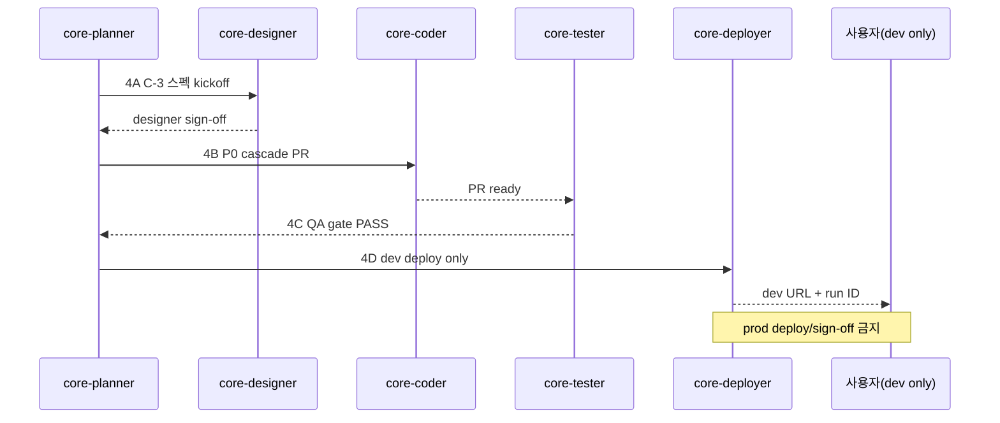

# Admin Dark Mode C-3 — Phase 4 Global Rollout Roadmap

**작성일**: 2026-07-07  
**담당**: core-planner (Phase 4A-1 문서)  
**거버넌스**: [`ADMIN_IMPLEMENTATION_GOVERNANCE.md`](./ADMIN_IMPLEMENTATION_GOVERNANCE.md) · [`ADMIN_IMPLEMENTATION_PROGRESS_CHECKLIST.md`](./ADMIN_IMPLEMENTATION_PROGRESS_CHECKLIST.md)  
**baseline**: develop `4b79e752`  
**상태 범례**: ☐ pending · ◐ in_progress · ☑ done

---

## 1. 개요

Admin Dark Mode **C-3**는 C-2(헤더·GNB)·C-2b(LNB·ContentArea·B0KlA 카드/테이블)·G-14 Phase 3(ComingSoon·Wellness·BranchDeprecation) 완료를 전제로, **모달·필터 툴바·테이블·폼**에 `[data-theme="dark"]` cascade를 **전역 rollout**한다.

| Phase | 코드 | 범위 | PR / 산출 |
|-------|------|------|-----------|
| C-2 | 1차 | ContentHeader · B0KlA container · GNB/NavIcon/SearchInput tokens | #484 · #486 |
| C-2b | 2차 | LNB · ContentArea · B0KlA Cards & Tables | #491 |
| G-14 P3 | 셸 통합 | ComingSoon · BranchDeprecation · WellnessManagement B0KlA | #492 |
| **C-3** | **Phase 4** | **모달 · 필터툴바 · 테이블 · 폼 dark cascade 전역** | **본 로드맵 (4A→4D)** |

**참조 스펙**

- [`SCREEN_SPEC_ADMIN_DARK_MODE_C2B_LNB_CONTENT_B0KLA.md`](../../design-system/SCREEN_SPEC_ADMIN_DARK_MODE_C2B_LNB_CONTENT_B0KLA.md)
- [`SCREEN_SPEC_G14_PHASE3_COMING_SOON_B0KLA_WELLNESS_BRANCHES.md`](../../design-system/SCREEN_SPEC_G14_PHASE3_COMING_SOON_B0KLA_WELLNESS_BRANCHES.md)

---

## 2. Phase 3 완료 현황

| 항목 | 값 |
|------|-----|
| **PR** | #492 — G-14 Phase 3 (ComingSoon · BranchDeprecation · WellnessManagement) |
| **develop good SHA** | `4b79e752` |
| **dev FE deploy run** | `28844920543` SUCCESS |
| **체크리스트** | `g14-p3` ☑ (선행 완료) |

C-2 · C-2b · G-14 P3 merge 및 dev 배포 완료. **C-3 착수 게이트 충족.**

---

## 3. 선행 조건 (모두 ☑)

| Seq | 작업 | PR | 상태 |
|-----|------|-----|------|
| dark-c2 | Dark mode C-2 1차 (ContentHeader + B0KlA + GNB) | #484 · #486 | ☑ done |
| dark-c2b | Dark mode C-2b (LNB · ContentArea · B0KlA Cards/Tables) | #491 | ☑ done |
| g14-p3 | G-14 Phase 3 — ComingSoon · BranchDeprecation · Wellness | #492 | ☑ done |

**착수 금지**: 위 3건 중 하나라도 미완이면 C-3 coder(4B) 착수 불가.

---

## 4. Phase 4 C-3 목표

### 4.1 Cascade 대상 (전역 SSOT)

| 컴포넌트 계층 | 대상 | 토큰·셀렉터 원칙 |
|---------------|------|------------------|
| **모달** | `UnifiedModal` 및 admin 모달 본문 | `[data-theme="dark"]` 하위 `var(--mg-dark-*)` only; 커스텀 오버레이 금지 |
| **필터 툴바** | SavedViewControls · 필터 칩 · BadgeSelect · 검색 행 | C-2b content/card 토큰 재사용; 하드코딩 hex 0건 |
| **테이블** | B0KlA table · list row · compact row | `--mg-dark-table-*` · hover/focus-visible |
| **폼** | input · select · textarea · label · field error | `--mg-dark-form-*` (신규 alias는 `unified-design-tokens.css` SSOT) |

### 4.2 Must not

- 라이트 모드 회귀 (기존 `[data-theme="light"]` / 미설정 동작 변경 금지)
- 컴포넌트 CSS에 dark 전용 hex 직접 기입
- `UnifiedModal` 우회 커스텀 오버레이/래퍼
- 1 PR = 1 가설 위반 (P0 라우트 묶음 revert 유발 패턴 `0676dfa2d` 재발 금지)

### 4.3 산출물

1. **4A (designer)**: C-3 component cascade 스펙 — 모달·툴바·테이블·폼 토큰 표 + P0 6라우트 와이어
2. **4B (coder)**: CSS/token PR + 화면별 cascade 적용 (P0 우선)
3. **4C (tester)**: Jest gate + P0 6라우트 dark 시각 회귀 + Must not grep
4. **4D (deployer)**: **dev 배포만** — run ID 기록 · 스크린 아카이브

---

## 5. P0 — 6라우트 (1차 rollout)

| # | Route | 주요 컴포넌트 | Cascade 포인트 |
|---|-------|---------------|----------------|
| 1 | `/admin/dashboard` | AdminDashboard · KPI zone · pending lists | 카드 · 테이블 · 모달 |
| 2 | `/admin/user-management` | Client/Consultant/Staff comprehensive | 필터툴바 · SavedView · 테이블 · SidePeek · 모달 |
| 3 | `/admin/mapping-management` | MappingListBlock · MappingCard | 필터툴바 · table/card view · 모달 |
| 4 | `/admin/integrated-schedule` | IntegratedMatchingSchedule sidebar | 필터 칩 · sidebar 카드 · DnD row |
| 5 | `/admin/consultation-logs` | ConsultationLogView · table block | 테이블 · 필터 · 모달 |
| 6 | `/erp/financial` | FinancialManagement | 필터툴바 · SavedView · table/card · 모달 |

**4B coder 분할 권장**: 라우트 2~3개 / PR (의존 토큰 PR 선행 1건 허용).

---

## 6. P1 — 후속 화면 (P0 sign-off 후)

| 우선순위 | Route | 화면 | 비고 |
|----------|-------|------|------|
| P1-a | `/admin/sessions` | SessionManagement | 회기·결제 모달 다수 |
| P1-b | `/admin/wellness` | WellnessManagement | G-14 P3 셸 적용 완료 — 폼·테이블 cascade만 |
| P1-c | `/admin/common-codes` | CommonCodeManagement | B0KlA 테이블 |
| P1-d | `/admin/permissions` | PermissionManagement | 트리·폼 |
| P1-e | `/admin/schedule` · `/admin/schedules` | SchedulePage | 캘린더·필터 |
| P1-f | `/admin/notifications` | AdminNotificationsPage | 리스트·모달 |
| P1-g | `/admin/lifecycle/dormant-users` | DormantUsersPage | AdminCommonLayout 적용됨 |
| P1-h | `/admin/system-config` · `/admin/settings` | 설정 계열 | 폼 집중 |
| P1-i | ERP 잔여 | `/erp/dashboard` · `/erp/budget` 등 | Financial P0 이후 |

P1은 **dev 사용자 검수(4D) + planner synthesis** 후 병렬 착수 가능.

---

## 7. prod deploy · sign-off 금지

> **본 Phase 4 C-3 배치 전체에 prod cherry-pick · prod FE deploy · 사용자 prod sign-off 금지.**

| 허용 | 금지 |
|------|------|
| develop merge | main / prod cherry-pick |
| dev FE deploy (4D) | prod FE workflow_dispatch |
| dev 환경 사용자 검수 | prod smoke · prod sign-off 체크리스트 기록 |

prod 반영은 **별도 Phase(사용자 명시 승인 + C-2/C-2b dev 검수 완료 후)** 로만 개시한다. [`PRE_PRODUCTION_GO_LIVE_CHECKLIST.md`](../../운영반영/PRE_PRODUCTION_GO_LIVE_CHECKLIST.md) § 하드코딩 게이트 준수.

---

## 8. 분배표 (4A → 4D)

| Sub-phase | 담당 | 모델(권장) | 입력 | 출력 · DoD |
|-----------|------|------------|------|------------|
| **4A design** | core-designer | `gemini-3.1-pro` | C-2b 토큰 · G-14 P3 스펙 · P0 6라우트 | `SCREEN_SPEC_ADMIN_DARK_MODE_C3_*` — 모달/툴바/테이블/폼 토큰 표 · Must not · P0 와이어 |
| **4B coder** | core-coder | default | 4A 스펙 · develop `4b79e752+` | 토큰 alias PR + P0 라우트 cascade PR; 1 PR = 1 가설; Jest 해당 범위 green |
| **4C tester** | core-tester | default | 4B merge | P0 6라우트 Jest + dark grep gate + 1280/768 시각 회귀; Must not 0건 |
| **4D dev deploy** | core-deployer | — | 4C ☑ | dev FE deploy run ID · 스크린 아카이브 · **prod 금지** 명시 |

### 4A→4D 시퀀스

---

## 9. 완료 기준 체크리스트 (C-3 Phase 4)

### 9.1 4A — Design

- [ ] 모달 · 필터툴바 · 테이블 · 폼 dark 토큰 SSOT 표 확정
- [ ] P0 6라우트 와이어 · Must not · `R-PARTIES` 검토
- [ ] designer sign-off

### 9.2 4B — Coder (P0)

- [ ] `unified-design-tokens.css` / extension CSS에 C-3 alias 추가 (hex 직접 사용 0건)
- [ ] UnifiedModal dark cascade 적용
- [ ] P0 6라우트 필터툴바 · 테이블 · 폼 · 모달 cascade 적용
- [ ] 라이트 모드 회귀 0건
- [ ] Jest 해당 범위 PASS

### 9.3 4C — Tester

- [ ] P0 6라우트 dark mode Jest / snapshot gate PASS
- [ ] Must not grep (hardcoded dark hex · custom modal overlay) 0건
- [ ] 1280px · 768px 시각 회귀 PASS
- [ ] tester sign-off

### 9.4 4D — Dev deploy

- [ ] develop merge
- [ ] dev FE deploy run ID 기록
- [ ] P0 6라우트 dev 스크린 아카이브
- [ ] **prod deploy 미실행** 확인

### 9.5 Phase 4 종료 (planner)

- [ ] [`ADMIN_IMPLEMENTATION_PROGRESS_CHECKLIST.md`](./ADMIN_IMPLEMENTATION_PROGRESS_CHECKLIST.md) `dark-c3` ☑
- [ ] P1 착수 여부 planner synthesis
- [ ] prod 일정은 **별도 승인** 전까지 pending 유지

---

## 10. 변경 이력

| 날짜 | 변경 |
|------|------|
| 2026-07-07 | Phase 4A-1 초안 — C-3 roadmap · baseline `4b79e752` · PR #492 · dev run `28844920543` |
