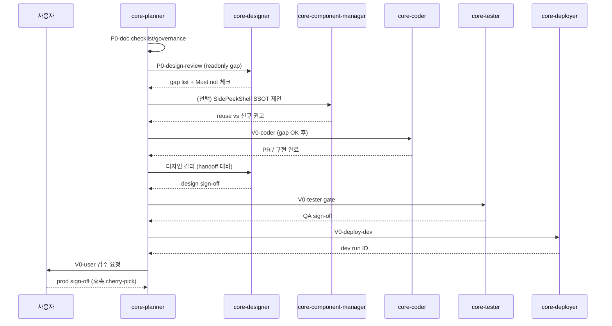
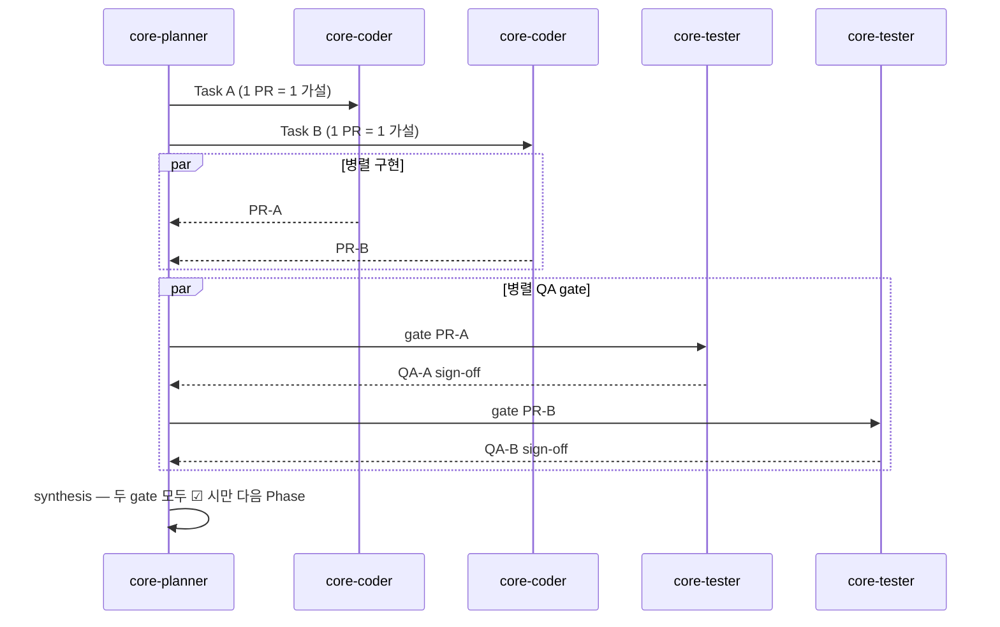

# MindGarden 어드민 UX/시각화 — 구현 감리·감독 체계 (Governance)

**작성일**: 2026-07-01  
**담당**: core-planner (총괄 감독·분배)  
**SSOT**: 본 문서 + [`ADMIN_IMPLEMENTATION_PROGRESS_CHECKLIST.md`](./ADMIN_IMPLEMENTATION_PROGRESS_CHECKLIST.md)  
**참조**: [`CORE_PLANNER_DELEGATION_ORDER.md`](../CORE_PLANNER_DELEGATION_ORDER.md), [`ADMIN_COMMERCIAL_UX_SYSTEMIC_ANALYSIS_V2.md`](./ADMIN_COMMERCIAL_UX_SYSTEMIC_ANALYSIS_V2.md)

---

## 1. 목적

어드민 UX/시각화 개선을 **순차 Phase**로 진행하며, 감리·감독 역할·sign-off·병렬 검증 규칙을 단일 SSOT로 고정한다. 2026-06-30 compact row 사고(묶음 revert `0676dfa2d`) 재발 방지가 1차 목표다.

---

## 2. Good SHA · Rollback 기준

| 환경 | SHA | 설명 |
|------|-----|------|
| **develop good** | `93c39c35b` | compact row **미포함**; 380px·필터 1줄·여백·중앙정렬·풀스택·헤더 복원 baseline |
| **develop 보조** | `61e6bb82d` | 380px·필터 1줄 유지 (good와 함께 참조) |
| **prod good** | `488b0dc0f` | 운영 baseline (cherry-pick·롤백 기준점) |
| **rollback 금지 패턴** | `0676dfa2d` | **5커밋 묶음 revert** — 재사용 금지; 단일 가설 단일 revert만 허용 |

**실험 브랜치**: `feat/integrated-schedule-density-toggle` — baseline `93c39c35b`에서 분기.  
**태그 권장**: `ux-good/integrated-schedule/YYYY-MM-DD` → `93c39c35b`

---

## 3. RACI — 감리·감독 역할 (SSOT)

| 역할 | 담당 서브에이전트 | R (실행) | A (최종 책임/sign-off) | C (자문) | I (통보) |
|------|-------------------|----------|------------------------|----------|----------|
| **총괄 감독·분배** | **core-planner** | Phase 순서·위임·진행표 갱신·병렬 조율·사용자 보고 | Phase 게이트 합류(synthesis) 후 다음 Phase 개시 | 전 서브에이전트 | 사용자 |
| **디자인 감리** | **core-designer** (`gemini-3.1-pro`) | handoff 대비 구현 적합성 검토; `R-PARTIES` hide·Must not 위반 여부 | **V0/V1+ UI 변경 PR** 디자인 sign-off | core-component-manager | core-planner |
| **구현** | **core-coder** | 코드만; 스펙·good SHA 준수 | — (구현 완료 보고) | core-designer, core-component-manager | core-planner |
| **품질 감리 (QA gate)** | **core-tester** | Jest·DoD·dev 시각 회귀; Must not grep; **병렬 coder 1건당 gate 1건** | **배포 전 QA sign-off** (테스터 서명) | core-debugger (#130 등) | core-planner |
| **컴포넌트 중복 감리** | **core-component-manager** | 신규 vs 기존 SSOT (`SidePeekShell`, `EntityRowActions` 등) — 문서·제안만 | 중복 신규 컴포넌트 **승인/기각** 권고 | core-designer | core-coder, core-planner |
| **배포** | **core-deployer** | dev/prod 반영, cherry-pick, run ID 기록 | dev 배포 완료 보고 | core-tester (gate 통과 확인) | core-planner, 사용자 |
| **사용자 최종 검수** | **사용자** | prod 전 스크린샷·운영 시나리오 검수 | **prod cherry-pick sign-off** | core-planner | — |

### Sign-off 한 줄 요약

> **planner**가 Phase를 열고 닫으며, **designer**가 UI 적합성, **tester**가 QA gate, **component-manager**가 SSOT 중복, **deployer**가 환경 반영, **사용자**가 prod 최종 승인을 각각 sign-off한다.

---

## 4. 순차 Phase 규칙

```text
P0-doc → P0-design-review → V0-coder → V0-tester → V0-deploy-dev → V0-user
                                                              ↓
                                                    (사용자 sign-off 후)
                                                              ↓
                                                    V1+ (checklist에만 존재, V0 완료 전 시작 금지)
```

| 규칙 | 내용 |
|------|------|
| **순차** | 상위 Phase sign-off 없이 하위 Phase coder 착수 금지 |
| **V0 블로커** | V1+ 항목은 checklist에 기재하되 **V0-user ☑ 전까지 `pending` 고정** |
| **병렬** | 의존성 없는 **탐색·문서·디자인 감리(readonly)** 만 병렬 허용 |
| **합류** | 병렬 coder N개 종료 시 → tester N gate → **planner synthesis** → 다음 Phase |

---

## 5. 병렬 배치 시퀀스 (Mermaid)

### 5.1 단일 스트림 (V0 기본 — 권장)



### 5.2 병렬 coder 시 (V1+ 이후 예시 — gate 필수)



---

## 6. 롤백·PR 정책

| # | 정책 | Must Not |
|---|------|----------|
| 1 | **1 PR = 1 가설** (밀도 토글 / side peek / SessionProgress 등 분리) | 한 PR에 패딩·헤더·layout·밀도 실험 **혼합** |
| 2 | revert는 **단일 커밋·단일 가설**만 | `0676dfa2d`형 **묶음 revert** |
| 3 | prod 반영은 **cherry-pick -x** 커밋 단위 | tester·사용자 sign-off 없이 prod |
| 4 | 실패 시 **good SHA 태그**로 단일 revert 커밋 | 수동 파일 복원만으로 운영 반영 |
| 5 | comfortable **default**; compact는 **토글 ON** 시만 | compact row **기본값** 강제 |

---

## 7. Must / Must Not (감리 grep 대상)

시스템ic v2 §5 및 handoff Must not — tester·designer 공통 gate.

| 구분 | 항목 |
|------|------|
| **R-PARTIES** | 참여자 이름·연락처 가시성 — ellipsis로 정보 소실 금지 (`ADMIN_PAGE_REGION_VISUALIZATION.md` §금지 영역) |
| **밀도** | comfortable default; compact는 localStorage 토글 ON 시만 |
| **Side peek** | 목록·캘린더 컨텍스트 유지; UnifiedModal만으로 상세 전환 금지 (통합일정) |
| **액션** | Primary 1 + overflow; 인라인 MGButton 3~5개 금지 |
| **토큰** | `var(--mg-*)` only |
| **React** | 콘솔 #130 0건 |
| **시각화** | Progress stripe 패턴 금지; zebra row 금지 (handoff §3.1, §3.2) |

---

## 8. 문서·체크리스트 연동

| 문서 | 용도 |
|------|------|
| [`ADMIN_IMPLEMENTATION_PROGRESS_CHECKLIST.md`](./ADMIN_IMPLEMENTATION_PROGRESS_CHECKLIST.md) | Phase별 실행·상태·run ID |
| [`ADMIN_INAPP_VISUALIZATION_DESIGN_HANDOFF.md`](./ADMIN_INAPP_VISUALIZATION_DESIGN_HANDOFF.md) | V0 coder 입력 스펙 |
| [`ADMIN_COMMERCIAL_UX_PER_PAGE_ANALYSIS.md`](./ADMIN_COMMERCIAL_UX_PER_PAGE_ANALYSIS.md) | G1-01 DoD §7 |
| [`ADMIN_VISUALIZATION_PLATFORM_SPEC.md`](./ADMIN_VISUALIZATION_PLATFORM_SPEC.md) | L-B/L-C taxonomy |

---

## 9. 변경 이력

| 날짜 | 변경 |
|------|------|
| 2026-07-01 | 초안 — RACI, 병렬 시퀀스, good SHA, 롤백 정책 |
