# MindGarden 어드민 — 페이지 영역별 시각화 (Region Visualization)

**작성일**: 2026-07-01  
**담당**: core-designer + core-planner  
**목적**: 재작업 방지를 위한 어드민 페이지별 영역 맵 시각화 및 밀도/상호작용 기준 정의  
**참조**: `ADMIN_COMMERCIAL_UX_PER_PAGE_ANALYSIS.md`, `ADMIN_DESIGNER_PER_PAGE_OPINIONS.md`

---

## §0. 공통 영역 사전 (모든 어드민 페이지)

B0KlA 어드민 레이아웃을 구성하는 표준 영역과 명명 규칙입니다.

### DesktopLayout (AdminCommonLayout)

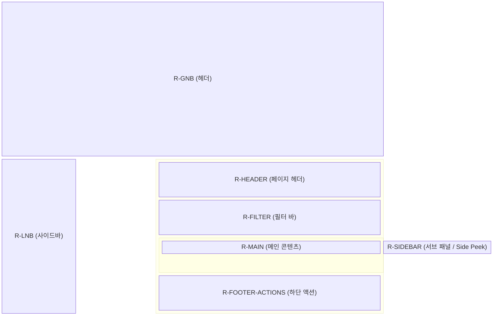

| 영역 ID | 역할 | 수정 금지 / 주의 사항 |
|---|---|---|
| `R-GNB` | 글로벌 네비게이션, 사용자 메뉴 | 페이지별 임의 수정 절대 금지 |
| `R-LNB` | 좌측 주요 메뉴 (260px) | `AdminCommonLayout`에서 주입, 임의 너비 변경 금지 |
| `R-HEADER` | 브레드크럼, 페이지 타이틀, Primary CTA | `ContentHeader` 공통 모듈 필수 사용 |
| `R-FILTER` | 검색, 필터링, 정렬 | 밀도 팽창 주의 (최대 1~2줄 유지) |
| `R-MAIN` | 본문 (Table, Grid, Form 등) | 밀도 토글의 핵심 적용 영역 (Comfortable / Compact) |
| `R-SIDEBAR` | 부가 정보, Side Peek 뷰 | 모달 남용을 막기 위한 우측 패널. 본문 가림 금지 |
| `R-FOOTER-ACTIONS`| Bulk 액션, 페이지네이션 | 인라인 버튼 남용 시 이 영역으로 이관 (선택형) |

---

## §1. G1~G5 그룹별 대표 레이아웃

### G1. 고빈도 운영 코어 (Split View + Table)
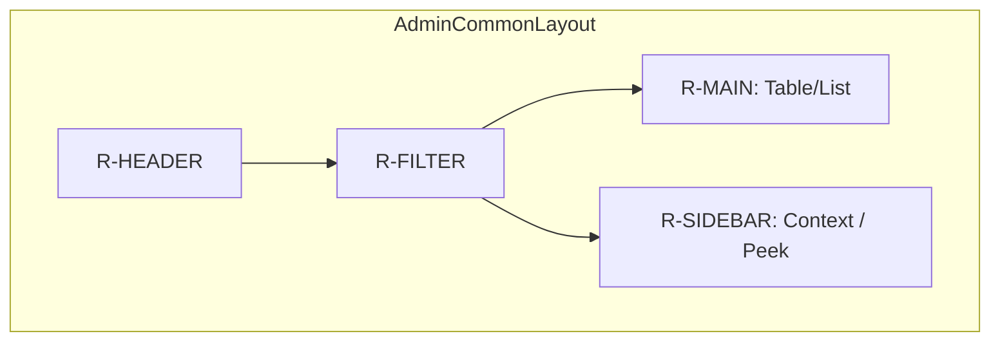

### G2. 사용자·계정 관리 (List + Detail Peek)
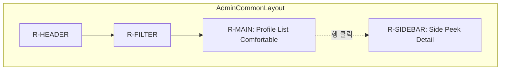

### G3. ERP·결제·재무 (Data Table)
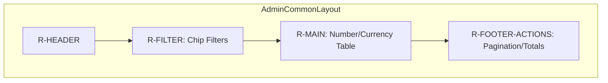

### G4. 콘텐츠·커뮤니티·쇼핑 (Table/Grid + Modal/Full)
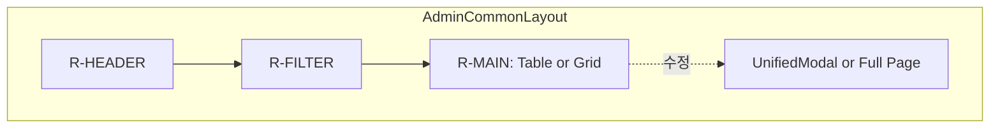

### G5. 시스템·설정 (Sectioned Form)
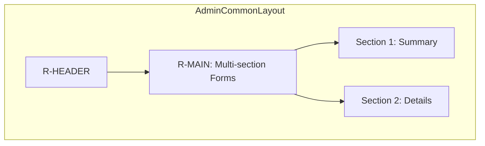

---

## §2. 화면별 영역 맵

> 총 35화면 중 P0·P1급 10개 화면과 그룹 대표 5개 화면은 상세 와이어프레임으로, 나머지는 Compact 와이어프레임으로 제공합니다.

### 2.1. 상세 분석 15화면 (P0·P1 + 대표)

#### 1) G1-01. 통합 일정 관리 (P0)
1. **ASCII Wireframe**
```text
┌────────────────────────────────────────────────────────┐
│ R-HEADER: 통합 스케줄                     [R-FILTER]   │
├────────────────────┬─────────────────────────┬─────────┤
│ R-SIDEBAR          │ R-MAIN                  │ R-PEEK  │
│ [필터 칩]          │                         │         │
│ ┌────────────────┐ │                         │ ┌─────┐ │
│ │1순위(이름,배지)│ │       CALENDAR          │ │상세 │ │
│ │2순위(상담사)   │ │                         │ │결제 │ │
│ └────────────────┘ │                         │ └─────┘ │
└────────────────────┴─────────────────────────┴─────────┘
```
2. **Mermaid Layout**
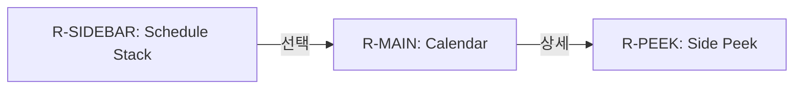
3. **정보 계층 Overlay**: 1순위(**내담자명, 예약시간, 결제 배지**), 2순위(상담사, 센터), Overflow(상세 변경, 취소)
4. **Side Peek 위치**: `R-MAIN`의 우측 (캘린더 밀어내기 방식, 가림 X)
5. **밀도 토글 영향 영역**: `R-SIDEBAR` 카드 스택만 변환 (Comfortable ↔ Compact).

#### 2) G2-01. 내담자 종합 관리 (P0)
1. **ASCII Wireframe**
```text
┌────────────────────────────────────────────────────────┐
│ R-HEADER: 내담자 관리                     [R-FILTER]   │
├────────────────────────────────────────────┬───────────┤
│ R-MAIN (Table/List)                        │ R-PEEK    │
│ [이름] [연락처] [상태] [액션]              │ [내담자]  │
│ ────────────────────────────────────────── │ [예약]    │
│  김ㅇㅇ 010-...  활성   [프로필] [⋯]       │ [결제]    │
└────────────────────────────────────────────┴───────────┘
```
2. **Mermaid Layout**
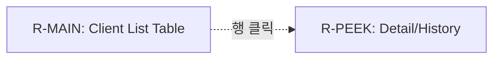
3. **정보 계층 Overlay**: 1순위(**이름, 연락처, 서비스 배지**), 2순위(최근 접속일), Overflow(수정, 비밀번호, 삭제)
4. **Side Peek 위치**: `R-MAIN` 우측 분할 (Y)
5. **밀도 토글 영향 영역**: `R-MAIN` 전체 (Comfortable 기본, 토글 시 Compact Row 적용)

#### 3) G2-02. 상담사 종합 관리 (P0)
1. **ASCII Wireframe**
```text
┌────────────────────────────────────────────────────────┐
│ R-HEADER: 상담사 관리                     [R-FILTER]   │
├────────────────────────────────────────────┬───────────┤
│ R-MAIN (Table/List)                        │ R-PEEK    │
│ [이름] [활성상태] [가동률] [액션]          │ [상담사]  │
│ ────────────────────────────────────────── │ [자격증]  │
│  박ㅇㅇ   활성     85%     [상세] [⋯]      │ [일정]    │
└────────────────────────────────────────────┴───────────┘
```
2. **Mermaid Layout**
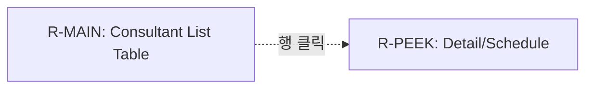
3. **정보 계층 Overlay**: 1순위(**이름, 활성상태**), 2순위(가동률, 소속), Overflow(권한, 휴면, 삭제)
4. **Side Peek 위치**: `R-MAIN` 우측 분할 (Y)
5. **밀도 토글 영향 영역**: `R-MAIN` 행 높이 변경

#### 4) G2-03. 스태프 관리 (P0)
1. **ASCII Wireframe**
```text
┌────────────────────────────────────────────────────────┐
│ R-HEADER: 스태프 관리                     [R-FILTER]   │
├────────────────────────────────────────────┬───────────┤
│ R-MAIN (Table/List)                        │ R-PEEK    │
│ [이름] [역할] [접속상태] [액션]            │ [권한트리]│
│ ────────────────────────────────────────── │           │
│  최ㅇㅇ ADMIN   온라인   [권한설정] [⋯]    │           │
└────────────────────────────────────────────┴───────────┘
```
2. **Mermaid Layout**
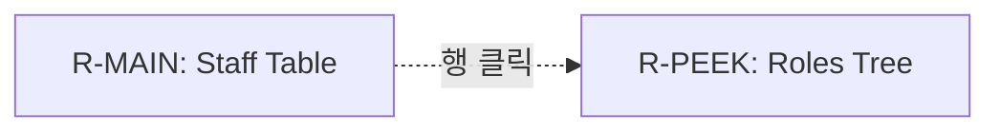
3. **정보 계층 Overlay**: 1순위(**이름, 시스템 역할**), 2순위(최근 접속), Overflow(삭제, 수정)
4. **Side Peek 위치**: `R-MAIN` 우측 분할 (Y)
5. **밀도 토글 영향 영역**: `R-MAIN` (토글 불가, Comfortable 고정 권장)

#### 5) G1-04. 매칭 목록 (P1)
1. **ASCII Wireframe**
```text
┌────────────────────────────────────────────────────────┐
│ R-HEADER: 매칭 대기열                     [R-FILTER]   │
├────────────────────────────────────────────┬───────────┤
│ R-MAIN (Table/List)                        │ R-PEEK    │
│ [상태] [내담자] [상담사] [액션]            │ [요구사항]│
│ ────────────────────────────────────────── │ [일정대조]│
│  대기   김ㅇㅇ   지정요청 [매칭확정] [⋯]   │           │
└────────────────────────────────────────────┴───────────┘
```
2. **Mermaid Layout**
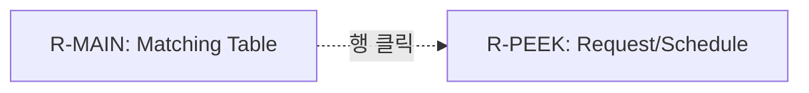
3. **정보 계층 Overlay**: 1순위(**상태, 내담자, 상담사**), 2순위(신청일), Overflow(거절, 보류, 재지정)
4. **Side Peek 위치**: `R-MAIN` 우측 분할 (Y)
5. **밀도 토글 영향 영역**: `R-MAIN` (Card ↔ Table 토글 시 구조 변화)

#### 6) G2-04. 사용자 권한 관리 (P1)
1. **ASCII Wireframe**
```text
┌────────────────────────────────────────────────────────┐
│ R-HEADER: 사용자 관리                     [R-FILTER]   │
├────────────────────────────────────────────┬───────────┤
│ R-MAIN (Table/List)                        │ R-PEEK    │
│ [ID] [이름] [활성상태] [액션]              │ [접속로그]│
│ ────────────────────────────────────────── │           │
│  user1 김ㅇㅇ   활성   [상세] [⋯]          │           │
└────────────────────────────────────────────┴───────────┘
```
2. **Mermaid Layout**
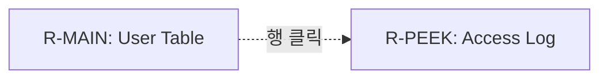
3. **정보 계층 Overlay**: 1순위(**ID, 이름, 활성상태**), 2순위(가입일), Overflow(비밀번호 리셋, 강제로그아웃)
4. **Side Peek 위치**: `R-MAIN` 우측 분할 (Y)
5. **밀도 토글 영향 영역**: `R-MAIN` (Grid ↔ Table 토글)

#### 7) G2-05. 상담사용 내담자 목록 (P1)
1. **ASCII Wireframe**
```text
┌────────────────────────────────────────────────────────┐
│ R-HEADER: 나의 내담자                     [R-FILTER]   │
├────────────────────────────────────────────┬───────────┤
│ R-MAIN (Table/List)                        │ R-PEEK    │
│ [이름] [다음예약] [액션]                   │ [진행노트]│
│ ────────────────────────────────────────── │ [프리뷰]  │
│  김ㅇㅇ 7/2 14:00  [차트작성] [⋯]          │           │
└────────────────────────────────────────────┴───────────┘
```
2. **Mermaid Layout**
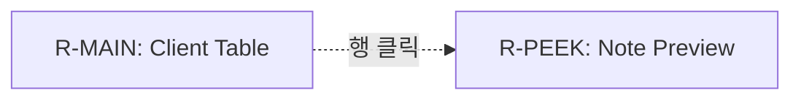
3. **정보 계층 Overlay**: 1순위(**내담자명, 다음 예약**), 2순위(최근 회기), Overflow(메시지 전송)
4. **Side Peek 위치**: `R-MAIN` 우측 분할 (Y)
5. **밀도 토글 영향 영역**: `R-MAIN` 행 높이 및 내용

#### 8) G3-01. 거래·정산 (P1)
1. **ASCII Wireframe**
```text
┌────────────────────────────────────────────────────────┐
│ R-HEADER: 거래 내역                       [R-FILTER]   │
├────────────────────────────────────────────┬───────────┤
│ R-MAIN (Table)                             │ R-PEEK    │
│ [일시] [내용] [금액] [상태] [액션]         │ [PG에러]  │
│ ────────────────────────────────────────── │ [로그]    │
│  7/1   회기결제 50,000 승인  [전표보기] [⋯]│           │
└────────────────────────────────────────────┴───────────┘
```
2. **Mermaid Layout**
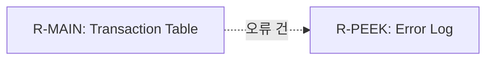
3. **정보 계층 Overlay**: 1순위(**일시, 금액, 상태**), 2순위(결제수단), Overflow(환불, 재발급)
4. **Side Peek 위치**: `R-MAIN` 우측 분할 (Y)
5. **밀도 토글 영향 영역**: `R-MAIN` (Table 고정 권장)

#### 9) G3-02. 급여 관리 (P1)
1. **ASCII Wireframe**
```text
┌────────────────────────────────────────────────────────┐
│ R-HEADER: 급여 정산                       [R-FILTER]   │
├────────────────────────────────────────────┬───────────┤
│ R-MAIN (Table)                             │ R-PEEK    │
│ [상담사] [정산액] [상태] [액션]            │ [월별건수]│
│ ────────────────────────────────────────── │ [내역]    │
│  박ㅇㅇ  3,000k  지급완료 [명세서] [⋯]     │           │
└────────────────────────────────────────────┴───────────┘
```
2. **Mermaid Layout**
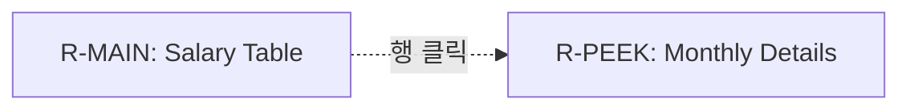
3. **정보 계층 Overlay**: 1순위(**상담사, 정산액, 지급상태**), 2순위(은행명), Overflow(이의제기)
4. **Side Peek 위치**: `R-MAIN` 우측 분할 (Y)
5. **밀도 토글 영향 영역**: `R-MAIN` (LargeCard 폐기, Table 고정)

#### 10) G3-06. PG 설정 (P1)
1. **ASCII Wireframe**
```text
┌────────────────────────────────────────────────────────┐
│ R-HEADER: PG 설정                         [R-FILTER]   │
├────────────────────────────────────────────────────────┤
│ R-MAIN (Table)                                         │
│ [PG사] [상태] [API Key] [액션]                         │
│ ────────────────────────────────────────────────────── │
│  Toss   연동됨  sk_live_... [수정] [해제]              │
└────────────────────────────────────────────────────────┘
```
2. **Mermaid Layout**
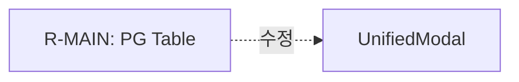
3. **정보 계층 Overlay**: 1순위(**PG사, 상태**), 2순위(API Key 일부), Overflow(없음)
4. **Side Peek 위치**: 불필요 (N, 폼은 모달 활용)
5. **밀도 토글 영향 영역**: 없음

#### 11) G1-02. 대시보드 (대표)
1. **ASCII Wireframe**
```text
┌────────────────────────────────────────────────────────┐
│ R-HEADER: 대시보드                                     │
├────────────────────────────────────────────────────────┤
│ R-MAIN (Grid)                                          │
│ ┌──────────────┐┌──────────────┐┌──────────────┐     │
│ │KPI: 신규예약 ││KPI: 미결제  ││KPI: 노쇼    │     │
│ │     12       ││     3        ││     1        │     │
│ └──────────────┘└──────────────┘└──────────────┘     │
│ ┌────────────────────────┐ ┌───────────────────────┐ │
│ │최근 알림 (Table)       │ │다가오는 일정 (Table)  │ │
│ └────────────────────────┘ └───────────────────────┘ │
└────────────────────────────────────────────────────────┘
```
2. **Mermaid Layout**
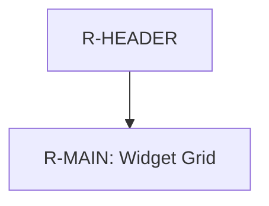
3. **정보 계층 Overlay**: 1순위(**KPI 수치, 배지**), 2순위(리스트 항목)
4. **Side Peek 위치**: 불필요 (N, 상세 페이지 라우팅)
5. **밀도 토글 영향 영역**: 각 위젯 내부 리스트 (Compact 고정)

#### 12) G3-03. 환불 관리 (대표)
1. **ASCII Wireframe**
```text
┌────────────────────────────────────────────────────────┐
│ R-HEADER: 환불 관리          [R-FILTER: Chip Filters]  │
├────────────────────────────────────────────┬───────────┤
│ R-MAIN (Table)                             │ R-PEEK    │
│ [요청일] [내담자] [금액] [액션]            │ [PG영수증]│
│ ────────────────────────────────────────── │           │
│  7/1     김ㅇㅇ   50k   [승인] [거절]      │           │
└────────────────────────────────────────────┴───────────┘
```
2. **Mermaid Layout**
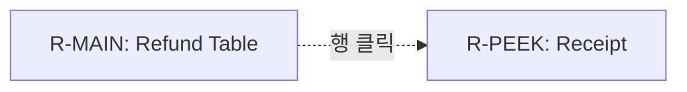
3. **정보 계층 Overlay**: 1순위(**요청일, 금액, 상태**), 2순위(내담자명), Overflow(상세사유)
4. **Side Peek 위치**: `R-MAIN` 우측 분할 (Y)
5. **밀도 토글 영향 영역**: Table Comfortable 고정

#### 13) G4-01. 상담 일지 (대표)
1. **ASCII Wireframe**
```text
┌────────────────────────────────────────────────────────┐
│ R-HEADER: 상담 일지                       [R-FILTER]   │
├────────────────────────────────────────────┬───────────┤
│ R-MAIN (Table)                             │ R-PEEK    │
│ [일시] [내담자] [작성상태] [액션]          │ [본문]    │
│ ────────────────────────────────────────── │ [프리뷰]  │
│  7/1   김ㅇㅇ   작성완료 [열람] [⋯]        │           │
└────────────────────────────────────────────┴───────────┘
```
2. **Mermaid Layout**
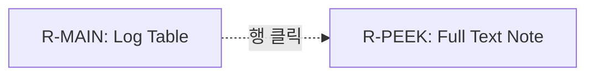
3. **정보 계층 Overlay**: 1순위(**일시, 작성상태**), 2순위(내담자), Overflow(인쇄, 수정이력)
4. **Side Peek 위치**: `R-MAIN` 우측 분할 (Y)
5. **밀도 토글 영향 영역**: 없음

#### 14) G5-01. 공통코드 (대표)
1. **ASCII Wireframe**
```text
┌────────────────────────────────────────────────────────┐
│ R-HEADER: 공통코드 관리                   [R-FILTER]   │
├────────────────────┬───────────────────────────────────┤
│ R-SIDEBAR (Tree)   │ R-MAIN (Table)                    │
│ ├ 그룹 A           │ [코드] [이름] [상태] [액션]       │
│ └ 그룹 B           │  C01   상태1  활성  [수정] [⋯]    │
└────────────────────┴───────────────────────────────────┘
```
2. **Mermaid Layout**
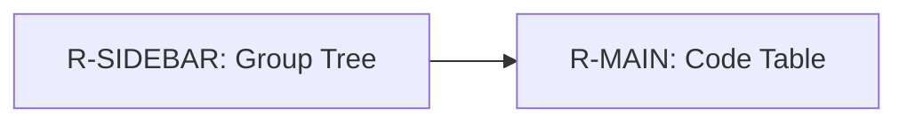
3. **정보 계층 Overlay**: 1순위(**코드명, 사용상태**), 2순위(설명), Overflow(삭제)
4. **Side Peek 위치**: 불필요 (N, 폼 모달 활용)
5. **밀도 토글 영향 영역**: 없음

#### 15) G5-03. 시스템 설정 (대표)
1. **ASCII Wireframe**
```text
┌────────────────────────────────────────────────────────┐
│ R-HEADER: 시스템 설정                                  │
├────────────────────────────────────────────────────────┤
│ R-MAIN (Form Sections)                                 │
│ [일반 설정]                                            │
│ 기본 언어 [ Select ▼ ]                                │
│ [알림 설정]                                            │
│ 메일 알림 [ Toggle ]                                   │
└────────────────────────────────────────────────────────┘
```
2. **Mermaid Layout**
```mermaid
flowchart TD
  H[R-HEADER] --> M[R-MAIN: Form Layout]
```
3. **정보 계층 Overlay**: 1순위(**설정명, 값**), 2순위(도움말)
4. **Side Peek 위치**: 불필요 (N)
5. **밀도 토글 영향 영역**: 없음

---

### 2.2. 기타 20화면 (Compact Wireframes)

| 화면 ID | 영역 맵 (R-MAIN 기준) | Side Peek | 
|---|---|---|
| **G1-03. 알림** | Table (미읽음/채널/액션) | Y (알림 본문) |
| **G1-05. 매칭 카드** | 카드내 Inline 1 + Overflow | N |
| **G1-06. 결제 대기** | Table (대기자/만료/D-day배지) | Y (미수금 메모) |
| **G1-07. 예약 상세** | Modal (List Compact) | N |
| **G2-06. 휴면 사용자**| Table (휴면일/사유/마스킹) | N |
| **G2-07. 계좌 관리** | Table (계좌번호/잔액/동기화) | Y (거래 내역) |
| **G2-08. 내담자 위젯**| Widget (Compact Flat List) | N |
| **G2-09. 내담자 리뉴얼**| Table/Card Grid (지표/이름) | Y (지표 그래프) |
| **G3-04. 결제/구독** | Table (구독상태/다음결제일) | Y (결제 이력) |
| **G3-05. 결제 수단** | Table (카드마스킹/기본여부) | N |
| **G3-07. PG 승인** | Table (승인대기/테넌트) | Y (설정 스냅샷) |
| **G4-02. 심리검사** | Table (검사명/상태/인라인로딩) | Y (T-score) |
| **G4-03. 온라인 주문**| Table (주문번호/금액/배송상태) | Y (송장 폼) |
| **G4-04. 콘텐츠 마스터**| Table (썸네일/제목/조회수) | N (전체화면) |
| **G4-05. 커뮤니티 검수**| Table Compact 예외 (신고내용) | Y (원문/댓글) |
| **G4-06. 회기 관리** | Table (회기ID/내담자/상태) | Y (노트/결제) |
| **G4-07. 휴가 통계** | Table (상담사/잔여일수) | Y (타임라인) |
| **G5-02. 테넌트 공통코드**| Table (오버라이드코드) | Y (글로벌 Diff) |
| **G5-04. 테넌트 프로필**| Form (Summary 상단, 하위 Table) | N |
| **G5-05. 브랜딩** | 2열 Form (좌:업로드, 우:프리뷰) | N |

---

## §3. 통합일정 심화 (P0)

G1-01 `IntegratedMatchingSchedule`의 과거·목표 레이아웃 및 영역별 제약 사항입니다.

### 3.1. 과거 레이아웃 (Good SHA: `93c39c35b`)
```text
┌──────────────────────────────────────────────┐
│ [헤더]                                       │
├───────────────┬──────────────────────────────┤
│ 380px 사이드바│ 캘린더 메인                  │
│ [필터 칩]     │                              │
│ ┌───────────┐ │                              │
│ │내담자명   │ │                              │
│ │14:00 상담 │ │                              │
│ └───────────┘ │                              │
└───────────────┴──────────────────────────────┘
```

### 3.2. 목표 레이아웃 (Side Peek 도입)
- **과제**: 목록 클릭 시 캘린더의 맥락(날짜/시간 뷰)을 유지하면서 상세 정보를 제공.
```text
┌────────────────────────────────────────────────────────┐
│ [헤더]                                    [밀도 토글]  │
├───────────────┬────────────────────────────┬───────────┤
│ R-SIDEBAR     │ R-MAIN                     │ R-PEEK    │
│ 380px         │ (캘린더 폭 유동적 축소)    │ 360px     │
│ [필터 칩]     │                            │           │
│ ┌───────────┐ │                            │ [상세정보]│
│ │내담자명   │ │       CALENDAR             │ 결제: 미결│
│ │14:00 상담 │ │                            │ [결제확인]│
│ └───────────┘ │                            │           │
└───────────────┴────────────────────────────┴───────────┘
```

**Mermaid Sequence**
```mermaid
sequenceDiagram
    participant User
    participant Sidebar as R-SIDEBAR (List)
    participant Calendar as R-MAIN (Calendar)
    participant Peek as R-PEEK (Detail)
    
    User->>Sidebar: 특정 일정 카드 클릭
    Sidebar->>Calendar: 선택된 일정 하이라이트 (이동 안함)
    Sidebar->>Peek: 우측 패널 오픈 (정보 Load)
    User->>Peek: [결제 확인] 액션 수행
    Peek->>Sidebar: 배지 상태 업데이트
    Peek->>Calendar: 색상 상태 업데이트
```

### 3.3. Compact Row 제약 구역
- **금지 영역**: `R-PARTIES` (참여자 이름, 연락처). 어떠한 경우에도 **이름의 가시성(ellipsis로 인한 정보 소실)**을 잃어서는 안 됩니다.
- **축소 허용 영역 (토글 ON 시만)**: `R-SIDEBAR-CARD-BODY` (버튼부, 부가 메타데이터), Padding.

---

## §4. PER_PAGE_ANALYSIS 연동 완료

본 문서는 `ADMIN_COMMERCIAL_UX_PER_PAGE_ANALYSIS.md`의 최상단 헤더 앵커를 통해 각 화면 스펙과 시각적으로 연결되어 있습니다. 화면의 UI 수정 및 컴포넌트 교체 작업 전 본 영역 맵을 최우선으로 확인해야 합니다.
