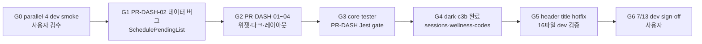

# MindGarden 개선 WBS v2026-07-07

**작성일**: 2026-07-07  
**담당**: core-planner (오케스트레이션 SSOT)  
**목표 마일스톤**: **2026-07-13 (KST)** — design/UI/UX **dev 완료** + **사용자 sign-off** (prod 반영은 별도 Phase)  
**baseline develop**: `5f1e478f5` (PR #540 ADM-01 dark-c3b · prior #541 DASH-02 · #539 P0-6 Consultant) · **prod sign-off 없음 · prod 금지**  
**참조 SSOT**: [`GATE_02_DEV_INTEGRATION_CHECKLIST_20260713.md`](../../guides/testing/GATE_02_DEV_INTEGRATION_CHECKLIST_20260713.md) · [`ADMIN_IMPLEMENTATION_PROGRESS_CHECKLIST.md`](../2026-06-30/ADMIN_IMPLEMENTATION_PROGRESS_CHECKLIST.md) · [`ADMIN_IMPLEMENTATION_GOVERNANCE.md`](../2026-06-30/ADMIN_IMPLEMENTATION_GOVERNANCE.md) · [`SCREEN_SPEC_ADMIN_DASHBOARD_G1-02_FULL.md`](../../design-system/SCREEN_SPEC_ADMIN_DASHBOARD_G1-02_FULL.md) · [`CLIENT_DASHBOARD_REBUILD_HANDOFF_v1.3.md`](../../design-system/CLIENT_DASHBOARD_REBUILD_HANDOFF_v1.3.md) · [`SCREEN_SPEC_CONSULTANT_DASHBOARD_V2_ENHANCED.md`](../../design-system/SCREEN_SPEC_CONSULTANT_DASHBOARD_V2_ENHANCED.md)

---

## 최종 디자인 패스 (2026-07-07)

- **이후 design rework Out-of-scope**: 7/13 개편이 마지막 디자인·UI/UX 개선 창구이며 이후 시각/UX 부채 연기(defer)는 금지됨.
- **P2 visual → P0 승격**: 7/13 범위 내에서 P2 시각적 개선 사항은 P0로 승격됨.
- **DoD (Definition of Done)**: `admin-dashboard-sample` 정합, 레거시 CSS 0, Must-not 0.

---

## Executive Summary

| 축 | 비중(노력) | 7/13 포함 | 비고 |
|----|------------|-----------|------|
| **(A) 어드민 UX** | ~65–70% | ☑ | P0: Admin Dashboard G1-02 · parallel-4 잔여 · dark-c3b |
| **(B) Role Dashboards** | ~10–15% | ☑ | Client v1.3 freeze · **Consultant Enhanced** (웹+앱 · ROLE-03) |
| **(C) 미사용 페이지 정리** | ~5% | ◐ | orphan inventory · `/admin/sessions` 등 **사용자 결정 후** |
| **(D) Public Phase 3 / Go-Live / App** | ~15–20% | ☐ | 7/13 **범위 외** · 별도 Phase 7 |

**Out-of-scope (본 WBS 7/13 게이트에 미포함)**  
G-10 BE(회기·결제 상태 정합) · Saved View BE · parallel-4 **prod** without sign-off · rollback 금지 패턴 `0676dfa2d` 재사용 · **7/13 이후 design rework** · **대규모 리팩터·cycle fix 외 구조 변경** (§1 P-01)

**상위 프로토콜**: 7/13 ~ prod 전 모든 coder/tester/deployer는 **§1 신중 수정 프로토콜** 우선 준수.

---

## App/Web 분리 (DEC-02 확정 — 문서 SSOT)

> **사용자 확정 (2026-07-07)**: 「앱과 웹은 링크 하면 안 돼 디자인 깨져」 + **「API 연동은 가능하잖어」** · DEC-02 권고 **(C) 문서만 분리**

| 구분 | 허용 | 금지 |
|------|------|------|
| **UI / 네비 / 라우트** | 플랫폼별 독립 SSOT (웹 LNB vs 앱 AppShell) | 앱↔웹 경로 parity, 크로스 deep link, 화면 구조 강제 통합 |
| **API / 데이터** | `StandardizedApi`, `/api/v1/*`, `tenantId`, 동일 BE·DTO | — |

- **웹 UI SSOT**: `ClientDashboard.js` · `ConsultantDashboardV2.js` · `frontend/src/constants/clientDashboardRoutes.js`
- **앱 UI SSOT**: `expo-app/app/(client)/*` · `expo-app/app/(consultant)/*` — cross-import 금지
- **상담사 Enhanced SSOT**: [`SCREEN_SPEC_CONSULTANT_DASHBOARD_V2_ENHANCED.md`](../../design-system/SCREEN_SPEC_CONSULTANT_DASHBOARD_V2_ENHANCED.md)
- **상세**: [`CLIENT_DASHBOARD_REBUILD_HANDOFF_v1.3.md`](../../design-system/CLIENT_DASHBOARD_REBUILD_HANDOFF_v1.3.md) §1

---

## Critical Path (→ 2026-07-13)



| 순서 | Work Package | 일정 | 블로커 |
|------|--------------|------|--------|
| **CP-1** | `GATE-01` parallel-4 dev smoke (사용자) | 07-07 ~ 07-08 | 없음 — **즉시** |
| **CP-2** | `DASH-02` SchedulePendingList 데이터 와이어링 | 07-07 ~ 07-09 | CP-1 피드백 반영 가능 병렬 |
| **CP-3** | `DASH-01`~`04` 위젯 UI·다크·safeDisplay | 07-08 ~ 07-11 | designer spec ☑ |
| **CP-4** | `DASH-08` Jest·Must-not gate | 07-11 ~ 07-12 | CP-3 merge |
| **CP-5** | `ADM-01` dark-c3b 완료 | 07-09 ~ 07-11 | CP-1 dark P1-j~l 피드백 |
| **CP-6** | `HF-02` header title hotfix dev 검증 | 07-08 ~ 07-10 | ☑ run `28858525028` · SHA `aaa9ff883` |
| **CP-7** | `GATE-03` 7/13 dev 통합 sign-off | **07-13** | CP-2~6 |

**슬랙(버퍼)**: Role Dashboard freeze 검수(`ROLE-01`) · orphan 결정 대기 항목은 CP 실패 시 7/13에서 **범위 축소** 가능.

---

## 병렬 트랙 (7/13까지)

| 트랙 ID | 명칭 | 담당 Phase | 병렬 규칙 | 7/13 DoD |
|---------|------|------------|-----------|----------|
| **T-ADMIN-DASH** | Admin Dashboard G1-02 전면 | §3 `DASH-*` | PR 1건 = 1 가설; `AdminDashboard/`·`dashboard-v2/` 파일 집합 단일 coder · **§1 프로토콜 준수** | PR-DASH-01~10 dev 반영 + Jest PASS |
| **T-ROLE-C** | Client / Consultant Dashboard | §4 `ROLE-*` | `ClientDashboard.js` vs `ConsultantDashboardV2.js` **파일 분리** — 동시 coder 가능 · PR #534는 cycle/hotfix green 후(`SAFE-03`) | HANDOFF v1.3 freeze + **UI/UX Quality Gate** · [`SCREEN_SPEC_CONSULTANT_DASHBOARD_V2_ENHANCED.md`](../../design-system/SCREEN_SPEC_CONSULTANT_DASHBOARD_V2_ENHANCED.md) freeze · dev 스모크 0 blocking |
| **T-CLEANUP** | 미사용·orphan 정리 | §6 `CLN-*` | **사용자 결정 후** 착수; 라우트 삭제는 단독 PR | inventory 확정 + P0 redirect 1건 이상 착수 또는 명시 defer |
| **T-GATE** | 거버넌스·검수·배포 | §0·§1·§2 `GATE-*`·`HF-*`·`SAFE-*` | tester는 coder merge 후; deployer는 tester gate 후 dev only · **CI green 전 merge 금지** | parallel-4 smoke ☑ · 7/13 sign-off 증적 |

**동시 착수 허용 (충돌 없음)**  
`T-ADMIN-DASH` + `T-ROLE-C` + `T-GATE(HF-02 deploy)` · `dark-c3b`는 `SessionManagement` CSS만 — `DASH-*`와 **일정 조율** 후 병렬.

---

## 사용자 결정 필요 항목

| ID | 주제 | 선택지 | 권고 | 7/13 영향 | 결정 주체 |
|----|------|--------|------|-----------|-----------|
| **DEC-01** | `/admin/sessions` 처리 | (A) 유지+Table 개선 (B) `/admin/integrated-schedule` redirect (C) LNB 숨김+deprecated | **B 또는 A** — 통합일정 SSOT와 중복 최소화 | `CLN-01`·`ADM-01` 착수 블로커 | 사용자 |
| **DEC-02** | AppShell SSOT (웹 vs Expo) | (A) 웹 `ClientDashboard`/`ConsultantDashboardV2` 독립 (B) Expo AppShell을 SSOT로 웹 정렬 (C) 문서만 분리·구현 동기화 없음 | **C** 단기 · **B** 중장기 | `ROLE-02` 범위 | 사용자 + designer |
| **DEC-03** | Client Dashboard v1.1 freeze 범위 | (A) 현 상태 freeze만 (B) `/client/*` 2차 B0KlA (C) Expo client 홈 동기화 | **A** for 7/13 | `ROLE-01` | 사용자 |
| **DEC-04** | parallel-4 prod 타이밍 | (A) 7/13 dev sign-off 후 cherry-pick (B) 추가 dev 스프린트 (C) 보류 | **A** — governance 준수 | Phase 7 | 사용자 |
| **DEC-05** | Statistics 페이지 삭제 후 redirect | (A) `/admin/dashboard` (B) 404+공지 (C) LNB만 제거 | **A** | `CLN-02` | 사용자 |
| **DEC-06** | G-10 BE / Saved View BE | (A) Q3 이후 (B) 7/13 전 착수 | **A** — 명시 out-of-scope | 없음 | 사용자 |
| **DEC-07** | dark-c3b vs PR-DASH-03 우선순위 | (A) DASH-03 먼저 (B) c3b 먼저 (C) 병렬 | **C** — 파일 겹침 최소화 시 | `ADM-01`·`DASH-03` | planner |

---

## WBS 트리

```
MindGarden 개선 WBS v2026-07-07
├── 0. 거버넌스·게이트
├── 1. 신중 수정 프로토콜 (7/13 ~ prod 전) ← **신규 SSOT**
├── 2. Hotfix·안정화 (즉시)
├── 3. Admin Dashboard (P0)
├── 4. Role Dashboards — Client/Consultant (P0)
├── 5. Admin 화면 잔여 UX (Parallel-4·Dark·Commercial)
├── 6. 미사용 페이지 정리 (P1)
├── 7. Public Phase 3 (P2, 시간 허용)
└── 8. 상용화·Go-Live·App (별도 Phase)
```

---

## 0. 거버넌스·게이트

| ID | Work Package | 담당 | 일정 | 선행 | 완료 정의 (DoD) | prod/dev |
|----|--------------|------|------|------|------------------|----------|
| `GOV-01` | Progress checklist·WBS 동기화 | core-planner | 07-07 | — | 본 문서 + checklist 교차 링크 · good SHA 갱신 | dev |
| `GATE-01` | parallel-4 dev smoke 사용자 검수 | **사용자** | 07-07~08 | dev deploy `28855153365` ☑ | dark P1-j~l · G5-02/G1-02 · header P2 6라우트 스크린 · **smoke base `https://{tenant}.dev.core-solution.co.kr` 필수** (`E2E_TENANT_ID` 또는 `mindgarden`) · bare `dev.core-solution.co.kr` 단독 접속 → wrong-path expected (**smoke FAIL 아님**) · blocking 0 또는 이슈 티켓화 | **dev only** |
| `GATE-02` | 7/13 dev 통합 검수 체크리스트 ☑ | core-planner + core-tester | 07-07 | DASH-08 | [`GATE_02_DEV_INTEGRATION_CHECKLIST_20260713.md`](../../guides/testing/GATE_02_DEV_INTEGRATION_CHECKLIST_20260713.md) — `SEQ_28` 형식 · CP 5건 evidence · PR-DASH-05 · **prod 금지** | dev |
| `GATE-03` | **7/13 사용자 sign-off** | **사용자** | **07-13** | GATE-02 · DASH-09 | Admin G1-02 · parallel-4 잔여 · dark-c3b · header hotfix dev 확인 · **prod 승인 아님** | dev |
| `GATE-04` | prod 배포 금지 게이트 유지 | core-planner | 상시 | governance | parallel-4 without sign-off → prod workflow 미실행 | prod 금지 |

---

## 1. 신중 수정 프로토콜 (7/13 ~ prod 전)

> **사용자 지시 (최우선 — 모든 coder / tester / deployer)**  
> 「코드 수정 신중하길 바래 — 시간이 너무 없어서 오류가 나오면 힘들어져」  
> 본 절은 **7/13 dev sign-off ~ prod 반영 전**까지 모든 코드·배포·테스트 작업의 **상위 SSOT**이다. §2~§8 Work Package는 본 절을 **선행 준수**한다.

### 1.1 운영 원칙

| # | 원칙 | 적용 대상 | 위반 시 조치 |
|---|------|-----------|--------------|
| **P-01** | **최소 diff** — cycle fix 등은 **import 한 링크만** 끊기; `dashboardPathUtils.js` 분리 등 **최소 패턴만**; 대규모 리팩터·파일 이동·일괄 rename **금지** | core-coder | PR reject · revert 1커밋 |
| **P-02** | **PR 분리** — `hotfix` / `cycle` / `PR-D`(기능) **각각 독립 PR**; 한 PR에 섞지 않음 | core-coder · core-planner | merge 보류 |
| **P-03** | **merge 전 게이트** — `npm run build`(또는 `build:ci`) + **해당 PR Jest** + ESLint `import/no-cycle` **전부 PASS** | core-coder → core-tester | **CI green 전 merge 금지** |
| **P-04** | **불확실하면 코드 안 건드림** — 동작·원인 불명확 시 **문서·smoke URL만** 수정 | 전 서브에이전트 | debugger 위임 후 착수 |
| **P-05** | **rollback 준비** — revert **1커밋** 가능한 단위로 커밋; behavior 변경 **0** 명시 | core-coder · core-deployer | squash merge 금지(핫픽스·cycle) |

### 1.2 즉시 적용 대상

| ID | 항목 | 담당 | 선행 | 완료 정의 (DoD) | 상태 |
|----|------|------|------|------------------|------|
| `SAFE-01` | `import/no-cycle` — `1e747737` 계열 · **`dashboardPathUtils.js` 분리 등 최소 패턴만** · behavior 변경 **0** | core-coder | — | `frontend` `npm run build` PASS · ESLint `import/no-cycle` 0 · **1 PR = cycle 전용** | ◐ 착수 |
| `SAFE-02` | hotfix merge 게이트 — **CI green 전 merge 보류** | core-deployer · core-tester | P-03 | PR #533·#535 등 hotfix: build + Jest + no-cycle green 후 merge | ☑ #535 merged · 이후 동일 규칙 |
| `SAFE-03` | **PR #534** (`feat/pr-d-consultant-v2-app-web`) merge | core-deployer | `SAFE-01`·`SAFE-02` green | cycle·hotfix green 후 merge · prod **금지** | ☐ 대기 |
| `SAFE-04` | `GATE-01` smoke URL SSOT (코드 대신 문서) | core-planner | — | smoke base `https://{tenant}.dev.core-solution.co.kr` · bare host wrong-path = FAIL 아님 | ☑ |
| `SAFE-05` | cycle fix 패턴 SSOT 문서화 | core-planner | `SAFE-01` | 본 절 + coder PR 설명에「한 링크 끊기·유틸 분리·인라인 상수」3패턴 중 택1 기록 | ◐ |

### 1.3 merge 전 체크리스트 (coder → tester 게이트)

- [ ] diff ≤ **필요 최소** (리뷰어가 “왜 이 파일?” 질문 없음)
- [ ] PR 라벨/제목에 트랙 명시: `hotfix` | `cycle` | `PR-D` | `PR-DASH`
- [ ] `cd frontend && npm run build` (또는 CI 동등 `build:ci`) PASS
- [ ] 해당 PR Jest suite PASS
- [ ] `import/no-cycle` ESLint **0건**
- [ ] 커밋 단위 revert 가능 (1 가설 = 1 커밋 권장)
- [ ] behavior 변경 없음 — 있으면 **별도 PR**·사용자 승인

### 1.4 분배실행 (프로토콜 즉시)

| Phase | subagent_type | 병렬 | 전달 prompt 요약 | 스킬 |
|-------|---------------|------|------------------|------|
| P0 Cycle | **core-coder** | — | `SAFE-01`: ESLint `import/no-cycle` 잔여 — **최소 패턴만** · behavior 0 · cycle 전용 PR | frontend, encapsulation |
| P0 Gate | **core-tester** | Cycle PR 후 | `SAFE-01` PR: build·Jest·`import/no-cycle` 게이트 | testing |
| P0 Merge | **core-deployer** | Tester green 후 | `SAFE-03` PR #534 cycle/hotfix green 확인 후 merge · prod **미실행** | deployment |
| P0 Doc | **core-planner** | ☑ | `SAFE-04`·`SAFE-05` WBS·checklist 동기화 | planning |

---

## 2. Hotfix·안정화 (즉시)

| ID | Work Package | 담당 | 일정 | 선행 | 완료 정의 (DoD) | prod/dev |
|----|--------------|------|------|------|------------------|----------|
| `HF-01` | 상담일지 누적·매칭 큐 hotfix 회귀 | core-tester | 07-07 | Seq 27b ☑ | dashboard KPI 회귀 0 · Jest smoke | prod ☑ 유지 |
| `HF-02` | G-14 header title hotfix (16파일) | core-deployer → core-coder | 07-07~10 | PR #515+#522 ☑ | ACL `title` SSOT · 6+α 라우트 이중 헤더 0 · dev deploy run **`28858525028`** · SHA **`aaa9ff883`** | **dev** (prod 금지) |
| `HF-03` | session Saved View Error Boundary | core-debugger → core-coder | 07-08~09 | 28g-p9-jest pending | `/admin/sessions` Error Boundary 재현·수정·Jest | dev |
| `HF-04` | React #130·safeDisplay 스캔 (admin dashboard) | core-tester | 07-10 | DASH-04 | grep gate 0건 · 콘솔 스모크 | dev |

---

## UI/UX Quality Gate (최고 품질 기준)

모든 디자인 개편(Admin/Client/Consultant) 작업은 최대한의 품질 상향을 위해 아래의 게이트를 통과해야 합니다 (7/13 WBS 및 PR-D 필수 사항).

1. **B0KlA 토큰 100% 매핑**: 하드코딩된 hex/rgba 색상 완전 배제. 오직 `var(--mg-*)` 및 사전에 정의된 공통 클래스 사용.
2. **타이포그래피 및 Grid**: ContentHeader G-14 h1 SSOT 준수, 8px grid 시스템 기반의 일관된 여백(margin/padding).
3. **Dark Mode Cascade**: 변경되는 화면의 다크모드(`dark-c3b`) 토글 시 완벽한 호환성 유지.
4. **반응형 회귀 0건**: 모바일(414px) 및 데스크톱(1280px) 환경에서 겹침, 잘림 없는 완벽한 반응형 보장.
5. **A11y (접근성)**: 탭 포커스 링 표시, 텍스트가 없는 컴포넌트에 `aria-label` 지정, WCAG AA 명도 대비 준수.
6. **Must-not (금지)**: 레거시 CSS 잔존, 이중 제목 표출, `MGButton` 및 `ActionBar` SSOT 위반 (커스텀 스타일링 금지).
7. **시각적 정합성**: `admin-dashboard-sample`의 부드러운 서페이스 중심, Flat UI 톤앤매너와 정합성 100%.

**역할별 품질 DoD (요약)**

| 역할 | WP | 품질 체크리스트 (5~8항) |
|------|-----|-------------------------|
| **Admin** | `DASH-01`~`07` | B0KlA 100% · G-14 h1 SSOT · 8px grid · dark cascade · 414/1280 회귀 0 · a11y AA · Must-not 0 |
| **Client** | `ROLE-01` | HANDOFF v1.3 §9 Quality Gate · App/Web UI 분리 · `clientDashboardRoutes.js` SSOT · API-only Must link |
| **Consultant** | `ROLE-02`·`ROLE-03` | B0KlA · ListTableView(Compact) · ContentKpiRow·QuickActionBar · **API-only Must link** · App/Web UI 분리 · Quality Gate 7항 · App parity 경로 0 |
| **QA** | `DASH-08`·`ROLE-04` | Visual smoke + D11 KPI + headerDedup + dark cascade PASS |

---

## 3. Admin Dashboard (P0) — T-ADMIN-DASH

**스펙**: [`SCREEN_SPEC_ADMIN_DASHBOARD_G1-02_FULL.md`](../../design-system/SCREEN_SPEC_ADMIN_DASHBOARD_G1-02_FULL.md)

| ID | Work Package | 담당 | 일정 | 선행 | 완료 정의 (DoD) | prod/dev |
|----|--------------|------|------|------|------------------|----------|
| `DASH-01` | PR-DASH-01 위젯 ListTableView·CTA≤1 | core-coder | 07-08~10 | designer spec ☑ | ManualMatchingQueue·Deposit·Schedule pending — ProfileCard 0 · 단일 CTA · **UI/UX Quality Gate §7항** | dev |
| `DASH-02` | PR-DASH-02 데이터 와이어링·데드코드 | core-coder | **07-07~09** | — | SchedulePendingList ≠ pendingDepositList · 휴가 dead fetch 제거 | dev |
| `DASH-03` | PR-DASH-03 Dark cascade (KPI·Chart.js) | core-coder | 07-09~11 | DASH-01 | KpiFlipCard·Pipeline·Chart theme toggle · hex 0 · dark cascade | dev |
| `DASH-04` | PR-DASH-04 레이아웃·safeDisplay·1280px | core-coder | 07-09~11 | DASH-01 | KPI 4-grid 1280 노출 · safeDisplay 전 위젯 · Header actions ≤Primary1 · 414px 회귀 0 | dev |
| `DASH-05` | PR-DASH-05 parallel-4 smoke 체크리스트 이행 | 사용자 + core-tester | 07-11~12 | DASH-01~04 | 스펙 §PR-DASH-05 체크박스 전부 ☑ 또는 waivable 문서화 | dev |
| `DASH-06` | PR-DASH-06 AdminDashboardV2 셸·위젯 zone 정합 | core-coder | 07-10~12 | DASH-01 | `AdminCommonLayout` children · B0KlA section 클래스 일치 | dev |
| `DASH-07` | PR-DASH-07 CoreFlowPipeline·metrics 시각화 | core-coder | 07-10~12 | DASH-02 | Pipeline 클릭 44px · 데이터 기간·rank pulse 정합 | dev |
| `DASH-08` | PR-DASH-08 Jest·Must-not QA gate | core-tester | 07-11~12 | DASH-01~07 | **[QA GATE] Visual smoke + D11 KPI + headerDedup + dark cascade PASS** · Must-not grep | dev |
| `DASH-09` | PR-DASH-09 dev FE deploy 패키지 | core-deployer | 07-12 | DASH-08 | workflow_dispatch SUCCESS · bundle SHA 기록 | **dev only** |
| `DASH-10` | PR-DASH-10 sign-off evidence pack | core-planner | **07-13** | DASH-09 · GATE-03 | 스크린·run ID·good SHA 단일 표 · **Design Freeze Sign-off** | dev |

---

## 4. Role Dashboards — Client/Consultant (P0) — T-ROLE-C

| ID | Work Package | 담당 | 일정 | 선행 | 완료 정의 (DoD) | prod/dev |
|----|--------------|------|------|------|------------------|----------|
| `ROLE-01` | Client Dashboard v1.3 freeze 문서화 | core-planner + 사용자 | 07-08~09 | DEC-03 | [`CLIENT_DASHBOARD_REBUILD_HANDOFF_v1.3.md`](../../design-system/CLIENT_DASHBOARD_REBUILD_HANDOFF_v1.3.md) 고정 · **§9 Quality Gate** · App/Web 분리 · 변경 freeze | dev |
| `ROLE-02` | ConsultantDashboardV2 B0KlA·Content 블록 정합 | core-designer → core-coder | 07-09~12 | DEC-02 | ContentKpiRow·QuickActionBar·`clientDashboardRoutes.js` 정합 · **UI/UX Quality Gate (B0KlA, spacing, ListTableView)** · App parity 경로 0 · [`SCREEN_SPEC_CONSULTANT_DASHBOARD_V2_ENHANCED.md`](../../design-system/SCREEN_SPEC_CONSULTANT_DASHBOARD_V2_ENHANCED.md) §4 API 매트릭스 정합 | dev |
| `ROLE-03` | Consultant 대시보드 3축 (App/Web 분리) | core-planner → core-coder | 07-10~14 | `SAFE-03` (#534 merge) · ROLE-02 | **순서 고정**: (1) **P0-6 Web V2 polish** `ConsultantDashboardV2` B0KlA Quality Gate → (2) **P0-3~4 Expo P1** 홈 (`SCREEN_SPEC_CONSULTANT_MOBILE_HOME`) 별도 PR → (3) **P0-2 Renewal API 교정** `ConsultantDashboardRenewal` StandardizedApi 정합. 스펙 SSOT: [`SCREEN_SPEC_CONSULTANT_DASHBOARD_V2_ENHANCED.md`](../../design-system/SCREEN_SPEC_CONSULTANT_DASHBOARD_V2_ENHANCED.md). **코드 착수는 #534 merge + develop CI green 후** · App/Web UI 크로스 링크 0 | dev |
| `ROLE-04` | Role dashboard Jest/E2E smoke | core-tester | 07-11~12 | ROLE-01~02 | **[QA GATE] Visual smoke + headerDedup + dark cascade PASS** · `/client`·`/consultant` 스모크 · #130 0 | dev |

**ROLE 트랙 P0 매핑 (Consultant — explore 21c0fb39)**

| P0 | 항목 | 담당 | 선행 |
|----|------|------|------|
| P0-6 | Web V2 B0KlA polish | core-coder | SAFE-03 |
| P0-3~4 | Expo API 훅 + 홈 P1 UI | core-coder | P0-6 또는 병렬(별도 PR) |
| P0-2 | Renewal API 교정 | core-coder | P0-6 |
| P0-1,7~10 | SSOT·경로·E2E | planner/tester | 문서·#534 후 |

---

## 5. Admin 화면 잔여 UX (Parallel-4·Dark·Commercial) — T-ADMIN-DASH 연계

| ID | Work Package | 담당 | 일정 | 선행 | 완료 정의 (DoD) | prod/dev |
|----|--------------|------|------|------|------------------|----------|
| `ADM-01` | dark-c3b P1 (sessions·wellness·common-codes) | core-coder | 07-07~11 ◐ | dark-c3 ☑ | 3라우트 dark cascade · Jest P1 확장 PASS | dev |
| `ADM-02` | dark P1-d~i 잔여 (roadmap 4C) | core-designer → core-coder | 07-13+ | ADM-01 · GATE-03 | [`ADMIN_DARK_MODE_C3_ROADMAP.md`](../2026-06-30/ADMIN_DARK_MODE_C3_ROADMAP.md) Phase 4C 잔여 | dev 우선 |
| `ADM-03` | Commercial G5-02 ListTableView SSOT 확산 | core-coder | 07-12+ | parallel-4 B ☑ | tenant-common-codes 외 1화면 pilot | dev |
| `ADM-04` | G-14 AdminCommonLayout 미적용 잔여 | core-component-manager → core-coder | 07-13+ | UI-01 inventory | 잔여 라우트 표 + 1 PR | dev |
| `ADM-05` | Saved View named UI dev 검수 (session/budget) | 사용자 | 07-08~10 | 28g-p9 ☑ | F5 restore · session EB `HF-03` | dev |

---

## 6. 미사용 페이지 정리 (P1) — T-CLEANUP

| ID | Work Package | 담당 | 일정 | 선행 | 완료 정의 (DoD) | prod/dev |
|----|--------------|------|------|------|------------------|----------|
| `CLN-00` | Orphan route·LNB inventory | explore | 07-08~09 | — | `/admin/*`·`/erp/*` dead link·미참조 컴포넌트 표 | 문서 |
| `CLN-01` | `/admin/sessions` 정책 실행 | core-coder | 07-10~13 | **DEC-01** | redirect 또는 Table P0 개선 · LNB 정합 | dev |
| `CLN-02` | Statistics 삭제 후 redirect | core-coder | 07-10 | **DEC-05** · #476 ☑ | `/admin/statistics` → dashboard 또는 410 | dev |
| `CLN-03` | i18n orphan namespace 정리 | core-coder | 07-13+ | CLN-00 | [`I18N_ORPHAN_NAMESPACE_POLICY.md`](../2026-05-26/I18N_ORPHAN_NAMESPACE_POLICY.md) 잔여 | dev |
| `CLN-04` | 레거시 backup·미참조 CSS 삭제 | core-coder | 07-13+ | CLN-00 | orphan 파일 0 (스피너·MGLoading 등) | dev |

---

## 7. Public Phase 3 (P2, 시간 허용)

| ID | Work Package | 담당 | 일정 | 선행 | 완료 정의 (DoD) | prod/dev |
|----|--------------|------|------|------|------------------|----------|
| `PUB-01` | 온보딩 Public API hardening 잔여 | core-coder | 07-14+ | SEC-01 | [`TODO_ONBOARDING_PUBLIC_API_HARDENING.md`](../2026-03-31/TODO_ONBOARDING_PUBLIC_API_HARDENING.md) 엣지·Trinity | dev→prod 별도 |
| `PUB-02` | Trinity 온보딩 UI 정합 | core-designer → core-coder | 07-14+ | PUB-01 | `SCREEN_SPEC_TRINITY_APPLY_ONBOARDING` 구현 검증 | dev |
| `PUB-03` | Nginx rate limit·public API 문서 | core-deployer | 07-14+ | PUB-01 | [`NGINX_RATE_LIMIT_PUBLIC_API.md`](../../deployment/NGINX_RATE_LIMIT_PUBLIC_API.md) 운영 반영 증적 | prod 별도 |

---

## 8. 상용화·Go-Live·App (별도 Phase)

| ID | Work Package | 담당 | 일정 | 선행 | 완료 정의 (DoD) | prod/dev |
|----|--------------|------|------|------|------------------|----------|
| `OPS-01` | PRE_PRODUCTION 체크리스트 실행 | core-planner + shell | GATE-03 후 | 7/13 sign-off | [`PRE_PRODUCTION_GO_LIVE_CHECKLIST.md`](../../운영반영/PRE_PRODUCTION_GO_LIVE_CHECKLIST.md) 증적 | prod |
| `OPS-02` | parallel-4 prod cherry-pick | core-deployer | 사용자 승인 후 | GATE-03 · DEC-04 | prod FE run SUCCESS · rollback SHA 기록 | **prod** |
| `OPS-03` | 하드코딩·LNB 손오프 게이트 | core-tester | OPS-01 | OPS-01 | `check-hardcode` · handoff §17 | prod |
| `APP-01` | Expo App Store·EAS prod profile | core-deployer | 07-14+ | OPS-01 | [`MOBILE_PUSH_EXPO_DEPLOYMENT_CHECKLIST.md`](../MOBILE_PUSH_EXPO_DEPLOYMENT_CHECKLIST.md) | prod |
| `APP-02` | ZERO-DT 로드맵 착수 | core-planner | Q3 | OPS-01 | [`ZERO_DOWNTIME_GAP_AND_ROADMAP.md`](../../deployment/ZERO_DOWNTIME_GAP_AND_ROADMAP.md) | — |

---

## 즉시 착수 Top 5 (서브에이전트 위임 1줄)

| # | WP | subagent | 위임 prompt (1줄) |
|---|-----|----------|-------------------|
| 1 | `GATE-01` | **사용자** (검수) | dev `c65d9f326`에서 parallel-4 3트랙(dark P1-j~l·G5-02/G1-02·header P2 6라우트) 스크린 검수 후 blocking 이슈만 티켓 ID로 회신. |
| 2 | `DASH-02` | **core-coder** | `SCREEN_SPEC_ADMIN_DASHBOARD_G1-02_FULL.md` PR-DASH-02: `SchedulePendingList` pendingDepositList 복붙 버그 수정·휴가 dead fetch 제거·Jest 추가·develop only·1 PR. |
| 3 | `ADM-01` | **core-coder** | `ADMIN_DARK_MODE_C3_ROADMAP.md` dark-c3b: `/admin/sessions`·`/admin/wellness`·`/admin/common-codes` dark cascade 완료·Jest adminDarkMode P1 확장·prod 금지. |
| 4 | `HF-02` | **core-deployer** | develop `aaa9ff883` header title hotfix 16파일 dev FE deploy·run **`28858525028`** 기록·6라우트 이중 헤더 스크린 아카이브·prod 금지. |
| 5 | `DASH-08` | **core-tester** | PR-DASH-08: DASH-01~04 merge 후 KpiFlipCard·DepositPendingList·Pipeline Jest gate + PR-DASH-05 체크리스트 자동화 가능 항목 실행·blocking 0 보고. |

---

## 분배실행 표 (부모 에이전트 호출용)

| Phase | subagent_type | 병렬 | 전달 prompt 요약 | 스킬 |
|-------|---------------|------|------------------|------|
| **P0 Protocol** | **core-coder** | — | `SAFE-01` §1.2: `import/no-cycle` 최소 패턴만 · behavior 0 · cycle 전용 PR | frontend, encapsulation |
| P0 Protocol QA | core-tester | Cycle PR 후 | `SAFE-01` PR 게이트: build·Jest·`import/no-cycle` | testing |
| P0 Protocol Merge | core-deployer | QA green 후 | `SAFE-03` PR #534 merge — cycle/hotfix green 확인 · prod 금지 | deployment |
| P0 Gate | 사용자 | ☑ | `GATE-01` parallel-4 dev smoke · smoke base `https://{tenant}.dev.core-solution.co.kr` 필수 | — |
| P0 Dash | core-coder | ☑ `ADM-01` | `DASH-02` → `DASH-01`~`04` 순 · **§1 프로토콜 준수** | frontend, unified-modal, design-system-css |
| P0 Dark | core-coder | ☑ Dash | `ADM-01` dark-c3b | design-system-css |
| P0 Deploy | core-deployer | ☑ | `HF-02` · 이후 `DASH-09` · **CI green 전 merge 금지** | deployment |
| P0 QA | core-tester | Dash merge 후 | `DASH-08` · `HF-04` | testing |
| P1 Explore | explore | ☑ | `CLN-00` orphan inventory | — |
| P1 Role | core-coder | ☑ Dash | `ROLE-02` ConsultantDashboardV2 · `ROLE-03` P0-6→P0-3~4→P0-2 · PR #534는 `SAFE-03` 후 | frontend, atomic-design |
| Post 7/13 | core-planner | — | `GATE-03` evidence · Phase 8 kickoff | planning, deployment |

**진행 중 subagent (유지)**  
PR-DASH **core-coder** · header hotfix **core-deployer** · designer specs **완료** — 본 WBS `DASH-*`·`HF-02`와 ID 매핑.

---

## 7/13 완료 체크리스트 (요약)

- [ ] **Design Freeze Sign-off**: no defer on visual (모든 시각/UX 부채 해소 확인)
- [ ] **UI/UX Quality Gate**: Admin·Client·Consultant §7항 전부 PASS
- [ ] **§1 신중 수정 프로토콜** — cycle PR(`SAFE-01`) green · PR #534 merge 게이트(`SAFE-03`) 또는 defer 명시
- [ ] `GATE-01` parallel-4 dev smoke ☑ (`https://{tenant}.dev.core-solution.co.kr` 필수; bare `dev.core-solution.co.kr` wrong-path expected) 또는 waivable 이슈 문서화
- [ ] `DASH-02` SchedulePendingList 데이터 버그 수정 ☑
- [ ] `DASH-01`~`04` PR-DASH 구현 ☑ (최소 P0 갭 0)
- [ ] `DASH-08` Jest gate PASS
- [ ] `ADM-01` dark-c3b ☑
- [ ] `HF-02` header hotfix dev 검증 ☑ (run `28858525028` · SHA `aaa9ff883`)
- [ ] `HF-03` session Error Boundary ☑ 또는 7/13 defer 명시
- [ ] `ROLE-01` Client v1.3 freeze ☑ (`CLIENT_DASHBOARD_REBUILD_HANDOFF_v1.3.md`)
- [ ] `ROLE-03` Consultant 3축 — P0-6 Web → P0-3~4 Expo → P0-2 Renewal ([`SCREEN_SPEC_CONSULTANT_DASHBOARD_V2_ENHANCED.md`](../../design-system/SCREEN_SPEC_CONSULTANT_DASHBOARD_V2_ENHANCED.md))
- [ ] `GATE-03` 사용자 dev sign-off ☑
- [ ] prod deploy **미실행** 확인 (`GATE-04`)

---

## 변경 이력

| 날짜 | 변경 |
|------|------|
| 2026-07-07 | 초안 — 종합 개선 WBS 수립 (core-planner) |
| 2026-07-07 | f81beaa6 — UI/UX Quality Gate · App/Web 분리 SSOT · ROLE DoD · HF-02 run `28858525028` · Design Freeze (core-planner) |
| 2026-07-07 (2차) | GATE-01 smoke tenant subdomain URL SSOT 반영 — bare `dev.core-solution.co.kr` wrong-path expected (smoke FAIL 아님) |
| 2026-07-07 (3차) | **§1 신중 수정 프로토콜** 신설 — `SAFE-01`~`05` · PR #534 merge 게이트 · WBS §2~§8 재번호 |
| 2026-07-07 (4차) | #531+#537 merge · ROLE-03 3축 시퀀스 · ENHANCED API 매트릭스 SSOT (explore 21c0fb39) |
