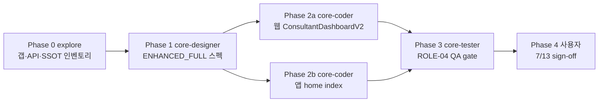

# 상담사 대시보드 Enhanced — 기획·오케스트레이션 (ROLE-03 / T-ROLE-C)

| 항목 | 내용 |
|------|------|
| 작성일 | 2026-07-07 |
| 작성 | core-planner |
| WBS | [`COMPREHENSIVE_IMPROVEMENT_WBS.md`](./COMPREHENSIVE_IMPROVEMENT_WBS.md) · `ROLE-03` · 트랙 **`T-ROLE-C`** |
| 마일스톤 | **2026-07-13 (KST)** — Design Freeze · dev 완료 · 사용자 sign-off (prod 별도) |
| 우선순위 | **P0** (P2 visual → P0 승격) |
| 범위 | **웹 + 앱 병행** · API-only Must link · UI 분리 (DEC-02) |

---

## 1. 목표 (1~2문장)

상담사 대시보드를 **웹 `ConsultantDashboardV2`와 Expo `(consultant)/(home)`에서 병행 개선**하되, **UI·라우트는 플랫폼별 독립**, **API·데이터만 공유**한다. 7/13 Design Freeze 전 **explore → designer spec → coder** 순서를 준수한다.

---

## 2. 범위

### 포함

| 영역 | 경로·산출 |
|------|-----------|
| **웹 대시보드** | `frontend/src/components/dashboard-v2/consultant/ConsultantDashboardV2.js` · CSS · 하위 organism |
| **앱 홈** | `expo-app/app/(consultant)/(home)/index.tsx` · `consultantHomeCopy.ts` · 홈 전용 훅 |
| **API-only Must link** | §[`CONSULTANT_DASHBOARD_ENHANCED_HANDOFF_v1.0.md`](../../design-system/CONSULTANT_DASHBOARD_ENHANCED_HANDOFF_v1.0.md) §7 |
| **문서** | 본 오케스트레이션 · Enhanced HANDOFF · Phase 2 `SCREEN_SPEC_CONSULTANT_DASHBOARD_ENHANCED_FULL.md` |
| **QA** | WBS `ROLE-04` — `/consultant`·앱 홈 스모크 · Quality Gate 7항 |

### 제외 (7/13)

| 항목 | 사유 |
|------|------|
| BE 신규 API·스키마 | WBS DEC-06 · 기존 API 확장만 |
| 앱↔웹 deep link·UI parity | DEC-02 |
| 주간 차트 앱 홈 이식 | 앱 Could — 웹 only |
| prod deploy | GATE-04 |

### ROLE-02와 관계

| WP | 내용 | 상태 |
|----|------|------|
| `ROLE-02` | 웹 B0KlA 1차 Content 블록 (#530 merge) | ☑ 1차 merge |
| **`ROLE-03`** | **Enhanced** — 잔여 갭·앱 P0·품질 게이트·Design Freeze 문서·**explore/design/coder 파이프라인** | 본 문서 |

---

## 3. 의존성·순서



| 선행 | 후행 |
|------|------|
| DEC-02 App/Web 분리 확정 ☑ | explore |
| ROLE-02 웹 1차 (#530) ☑ | designer (웹 잔여 갭 반영) |
| `CLIENT_DASHBOARD_REBUILD_HANDOFF_v1.3` §1 정책 | 본 HANDOFF v1.0 |
| explore 산출 | designer `SCREEN_SPEC_*_ENHANCED_FULL` |
| designer spec freeze | coder (웹·앱 **병렬 가능**) |
| coder merge | core-tester `ROLE-04` |

**병렬 허용**: Phase 2a(웹) + Phase 2b(앱) · `T-ADMIN-DASH`와 파일 충돌 없음.

---

## 4. Phase 목록 및 분배실행

### Phase 0 — 탐색 (explore)

| 항목 | 내용 |
|------|------|
| **담당** | `explore` |
| **목표** | 웹·앱·API 갭 인벤토리 — coder/designer 입력용 단일 표 |
| **병렬** | `T-ADMIN-DASH`·`CLN-00`과 동시 가능 |

**전달 prompt (요약)**:

```
Full Repository Path: /Users/mind/mindGarden
목적: Consultant Enhanced (ROLE-03) Phase 0 인벤토리.

조사 범위:
1. 웹: frontend/src/components/dashboard-v2/consultant/**, menuItems.js CONSULTANT_*
2. 앱: expo-app/app/(consultant)/(home)/index.tsx, consultantHomeCopy.ts, useConsultantMobileDashboard 등
3. API: ConsultantDashboardV2 fetch 목록 vs expo hooks — API-only Must link 매트릭스
4. 기존 문서: CONSULTANT_DASHBOARD_PHASE1_*, SCREEN_SPEC_CONSULTANT_MOBILE_HOME.md, CONSULTANT_MOBILE_HOME_CONTENT_ENHANCEMENT_ORCHESTRATION.md

산출 (markdown 표):
- 섹션별 웹 구현 Y/N · 앱 Y/N · API 엔드포인트 · P0/P1
- App parity / UI Must link 위반 후보 (grep)
- 레거시 ConsultantDashboardRenewal 참조
- consultantDashboardRoutes 부재 시 menuItems vs consultantHomeCopy 대칭 표

저장 제안: docs/project-management/2026-07-07/CONSULTANT_ENHANCED_GAP_INVENTORY.md
코드 수정 금지.
```

**완료 기준**: 갭 표 · API 매트릭스 · P0 목록 · Must-not 위반 후보 — designer Phase 1 입력 가능.

**완료 ☑ (explore `21c0fb39`)**: 갭·API 매트릭스 SSOT는 explore 세션 보고서 — 별도 `CONSULTANT_ENHANCED_GAP_INVENTORY.md` 파일 없음 · WBS `ROLE-03` P0-1~10 매핑 반영.

---

### Phase 1 — 화면설계 (core-designer)

| 항목 | 내용 |
|------|------|
| **담당** | `core-designer` |
| **모델** | **`gemini-3.1-pro`** (디자인·비주얼 배치) |
| **선행** | Phase 0 explore 산출 |
| **목표** | 웹+앱 통합 화면설계서 (UI 분리 명시) |

**전달 prompt (요약)**:

```
Full Repository Path: /Users/mind/mindGarden
입력 SSOT:
- docs/design-system/CONSULTANT_DASHBOARD_ENHANCED_HANDOFF_v1.0.md (§1~§6)
- Phase 0: CONSULTANT_ENHANCED_GAP_INVENTORY.md
- 웹 참조: admin-dashboard-sample, CONSULTANT_DASHBOARD_PHASE1_DESIGN_SPEC.md
- 앱 참조: SCREEN_SPEC_CONSULTANT_MOBILE_HOME.md, (client)/(home) 벤치마크

산출: docs/design-system/SCREEN_SPEC_CONSULTANT_DASHBOARD_ENHANCED_FULL.md
포함: §0.4 사용성·정보노출·레이아웃(웹/앱 각각), 블록 순서, 토큰, 반응형 1280/414·SafeArea,
      P0/P1 표, Quality Gate §10, Must-not, 와이어 ASCII.
코드 작성 없음.
```

**완료 기준**: 코더가 PR 1건씩 구현 가능한 수준 · HANDOFF v1.0과 모순 없음.

**완료 ☑ (PR #531)**: [`SCREEN_SPEC_CONSULTANT_DASHBOARD_V2_ENHANCED.md`](../../design-system/SCREEN_SPEC_CONSULTANT_DASHBOARD_V2_ENHANCED.md) — Design Freeze · explore `21c0fb39` API SSOT 반영.

---

### Phase 2a — 웹 구현 (core-coder)

| 항목 | 내용 |
|------|------|
| **담당** | `core-coder` |
| **선행** | Phase 1 designer spec freeze |
| **병렬** | Phase 2b와 동시 |

**전달 prompt (요약)**:

```
Consultant Enhanced 웹 only.
Spec: SCREEN_SPEC_CONSULTANT_DASHBOARD_ENHANCED_FULL.md (웹 섹션)
Policy: CONSULTANT_DASHBOARD_ENHANCED_HANDOFF_v1.0.md §1·§8
Files: ConsultantDashboardV2.js, ConsultantDashboard.css, 하위 organism
Skills: /core-solution-frontend, /core-solution-atomic-design, /core-solution-design-system-css
DoD: HANDOFF §9.2 · UI/UX Quality Gate §10 · App parity 경로 0 · 1 PR · develop only · prod 금지
```

---

### Phase 2b — 앱 구현 (core-coder)

| 항목 | 내용 |
|------|------|
| **담당** | `core-coder` |
| **선행** | Phase 1 designer spec freeze |
| **병렬** | Phase 2a와 동시 |

**전달 prompt (요약)**:

```
Consultant Enhanced Expo home only.
Spec: SCREEN_SPEC_CONSULTANT_DASHBOARD_ENHANCED_FULL.md (앱 섹션) + SCREEN_SPEC_CONSULTANT_MOBILE_HOME.md
Policy: HANDOFF v1.0 §1·§6·§8
Files: expo-app/app/(consultant)/(home)/index.tsx, consultantHomeCopy.ts, 홈 훅
필독: docs/project-management/EXPO_APP_METRO_ALIAS_AND_MMKV_HANDOFF.md §5
Skills: /core-solution-frontend, /core-solution-api, /core-solution-encapsulation-modularization
DoD: HANDOFF §9.3 · verify:bundle:ci · COMPLETED 일지 CTA 0 · 1 PR · prod 금지
```

---

### Phase 3 — QA (core-tester)

| 항목 | 내용 |
|------|------|
| **담당** | `core-tester` |
| **선행** | Phase 2a·2b merge |
| **WBS ID** | `ROLE-04` |

**전달 prompt (요약)**:

```
ROLE-04 Consultant Enhanced QA gate.
대상: /consultant/dashboard (web), expo consultant home
체크: Visual smoke · headerDedup · dark cascade(web) · #130 0 · HANDOFF §10 7항
Jest: ConsultantDashboardV2.smoke.test.js, consultantHomeKpi.test.ts
blocking 0 보고.
Skill: /core-solution-testing
```

---

### Phase 4 — Design Freeze sign-off (사용자)

| 항목 | 내용 |
|------|------|
| **담당** | **사용자** |
| **일정** | **2026-07-13** |
| **선행** | Phase 3 PASS · WBS GATE-03 |

**체크**: 웹·앱 P0 섹션 스크린 · no defer on visual · prod 미실행.

---

## 5. 분배실행 표 (부모 에이전트 호출용)

| Phase | subagent_type | 병렬 | 전달 prompt | 스킬 |
|-------|---------------|------|-------------|------|
| **0** | `explore` | ☑ Admin Dash | §Phase 0 전문 | — · **완료 `21c0fb39`** |
| **1** | `core-designer` | explore 후 | §Phase 1 전문 | atomic-design, design-handoff · **model: gemini-3.1-pro** · **완료 #531** |
| **2a** | `core-coder` | ☑ 2b | §Phase 2a 전문 | frontend, design-system-css |
| **2b** | `core-coder` | ☑ 2a | §Phase 2b 전문 | frontend, api, EXPO MMKV handoff |
| **3** | `core-tester` | 2 merge 후 | §Phase 3 전문 | testing |
| **4** | **사용자** | — | GATE-03 sign-off | — |

**실행 순서 (필수)**: `explore` → `core-designer` → (`core-coder` 웹 ∥ 앱) → `core-tester` → 사용자.

**금지**: designer spec 없이 coder 착수 · UI Must link 구현.

---

## 6. 리스크·제약

| ID | 리스크 | 완화 |
|----|--------|------|
| R-01 | 7/13 일정 — 앱 P1(다음 상담·긴급 내담) 미완 | P0만 freeze · P1은 waivable 문서화 |
| R-02 | 웹·앱 coder 동시 merge conflict | 파일 집합 분리 · 2 PR |
| R-03 | API 실패 시 KPI 빈값 | partial render · 「-」 fallback (앱 스펙) |
| R-04 | Metro alias 회귀 (앱) | EXPO handoff §5 · verify:bundle:ci |
| R-05 | ROLE-02와 중복 작업 | explore가 #530 이후 잔여만 P0화 |

---

## 7. 7/13 DoD 체크리스트 (ROLE-03)

- [x] Phase 0 explore `21c0fb39` ☑ (갭·API 매트릭스 — explore 보고서 SSOT)
- [x] Phase 1 [`SCREEN_SPEC_CONSULTANT_DASHBOARD_V2_ENHANCED.md`](../../design-system/SCREEN_SPEC_CONSULTANT_DASHBOARD_V2_ENHANCED.md) ☑ (#531)
- [ ] 웹 Enhanced PR merge · Quality Gate PASS
- [ ] 앱 Enhanced P0 PR merge · Metro CI PASS
- [ ] `ROLE-04` tester gate PASS
- [ ] App parity / UI Must link **0건**
- [ ] API-only Must link §7 유지
- [ ] Design Freeze — no defer on visual (P0)
- [ ] prod deploy **미실행**

---

## 8. 즉시 착수 (문서 완료 후)

| # | Phase | subagent | 1줄 위임 |
|---|-------|----------|----------|
| 1 | 0 | **explore** | HANDOFF v1.0·웹 V2·앱 home·API 훅 갭 표 → `CONSULTANT_ENHANCED_GAP_INVENTORY.md` |
| 2 | 1 | **core-designer** | explore 산출 + HANDOFF → `SCREEN_SPEC_CONSULTANT_DASHBOARD_ENHANCED_FULL.md` (gemini-3.1-pro) |
| 3 | 2a | **core-coder** | designer spec 웹 섹션 · ConsultantDashboardV2 · 1 PR · prod 금지 |
| 4 | 2b | **core-coder** | designer spec 앱 섹션 · (consultant)/(home) · MMKV handoff §5 · 1 PR |
| 5 | 3 | **core-tester** | ROLE-04 smoke · blocking 0 |

---

## 9. 참조·교차 링크

| 문서 | 역할 |
|------|------|
| [`CONSULTANT_DASHBOARD_ENHANCED_HANDOFF_v1.0.md`](../../design-system/CONSULTANT_DASHBOARD_ENHANCED_HANDOFF_v1.0.md) | 정책·DoD·API Must link |
| [`CLIENT_DASHBOARD_REBUILD_HANDOFF_v1.3.md`](../../design-system/CLIENT_DASHBOARD_REBUILD_HANDOFF_v1.3.md) | App/Web 분리 템플릿 |
| [`SCREEN_SPEC_CONSULTANT_MOBILE_HOME.md`](../../design-system/SCREEN_SPEC_CONSULTANT_MOBILE_HOME.md) | 앱 홈 기존 스펙 |
| [`CONSULTANT_MOBILE_HOME_CONTENT_ENHANCEMENT_ORCHESTRATION.md`](../CONSULTANT_MOBILE_HOME_CONTENT_ENHANCEMENT_ORCHESTRATION.md) | 앱 갭 (2026-05) |
| [`COMPREHENSIVE_IMPROVEMENT_WBS.md`](./COMPREHENSIVE_IMPROVEMENT_WBS.md) | 마일스톤·트랙 |

---

## 변경 이력

| 날짜 | 변경 |
|------|------|
| 2026-07-07 | 초안 — ROLE-03 Consultant Enhanced · explore→designer→coder · 7/13 P0 Design Freeze (`core-planner`) |
| 2026-07-07 (2차) | Phase 0 ☑ explore `21c0fb39` · Phase 1 ☑ #531 `SCREEN_SPEC_CONSULTANT_DASHBOARD_V2_ENHANCED.md` · coder 착수는 #534 merge 후 |
