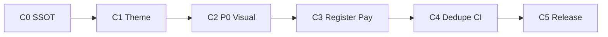

# Admin Mobile — MVP → 상용화 오케스트레이션 (SSOT)

**작성일**: 2026-05-18  
**작성자**: core-planner (C0 문서 SSOT)  
**상태**: **ACTIVE (C3)** — 병렬 배치 **5/5** · C2 **G2 PASS** · G1/G3/G4 **CONDITIONAL** · coder C3 `@e52678ab7`+`2643b8852` 반영 · **C3-06·푸시 UAT human · EAS `cbae858a` queue** 잔여  
**범위**: 단일 Expo 앱 `app/(admin)/` · ADMIN/STAFF 모바일 — **문서·분배·게이트 SSOT** (구현은 본 문서 이후 Phase별 위임)  
**선행**: [`EXPO_NATIVE_APP_PLAN.md`](./EXPO_NATIVE_APP_PLAN.md) §2.4 · [`ADMIN_MOBILE_MVP_TEST_PLAN.md`](./ADMIN_MOBILE_MVP_TEST_PLAN.md)  
**위임 규칙**: [`CORE_PLANNER_DELEGATION_ORDER.md`](./CORE_PLANNER_DELEGATION_ORDER.md) — 메인·일반 어시스턴트 **코드 직접 수정 금지**, 구현·검증은 표 §9 분배실행

---

## 목차

1. [비전: MVP → 상용화](#1-비전-mvp--상용화)
2. [비목표](#2-비목표)
3. [디자인 SSOT](#3-디자인-ssot)
4. [ADMIN vs STAFF](#4-admin-vs-staff)
5. [화면 인벤토리 P0/P1/P2](#5-화면-인벤토리-p0p1p2)
6. [상용화 디자인 체크리스트](#6-상용화-디자인-체크리스트)
7. [품질 게이트 G1~G4](#7-품질-게이트-g1g4)
8. [10주 Phase 로드맵 C0~C5](#8-10주-phase-로드맵-c0c5)
9. [분배실행 표](#9-분배실행-표)
10. [기존 문서 링크·갱신 목록](#10-기존-문서-링크갱신-목록)

---

## 1. 비전: MVP → 상용화

| 구분 | 정의 | 완료 신호 |
|------|------|-----------|
| **MVP (Phase 1, 완료·유지)** | 현장·이동 중 **조회·검수·알림·운영 탭 진입** — Top 8 화면, 역할별 셸, tenant·JWT hydrate, STAFF 검수 탭 숨김 | [`ADMIN_MOBILE_MVP_TEST_PLAN.md`](./ADMIN_MOBILE_MVP_TEST_PLAN.md) §10.8 자동 게이트 **3/3 PASS** @ `d95768075` |
| **Phase 2 (기능 확장, 진행·병렬)** | **일정 등록·신규 매칭·사용자 create·결제 브릿지/네이티브** — 웹과 **동일 API·검증**, UX는 모바일 IA | [`ADMIN_MOBILE_SCHEDULE_REGISTER_ORCHESTRATION.md`](./ADMIN_MOBILE_SCHEDULE_REGISTER_ORCHESTRATION.md), [`ADMIN_MOBILE_MAPPING_PAYMENT_APPROVAL_ORCHESTRATION.md`](./ADMIN_MOBILE_MAPPING_PAYMENT_APPROVAL_ORCHESTRATION.md) |
| **상용화 (Commercialization)** | ADMIN/STAFF가 **일상 업무의 60%+** 를 앱에서 **신뢰 가능한 시각·터치·오류 표시**로 처리; 스토어·운영 배포 게이트(§17·하드코딩 0) 통과 | 본 문서 §6·§7 **G1~G4 종합 PASS** (또는 CONDITIONAL + 잔여 리스크 문서화) |

**한 줄 정의**: MVP는 「볼 수 있다」; 상용화는 「현장에서 **등록·승인·결제 후속**까지 웹 없이도 되거나, 웹 브릿지가 **1탭·예측 가능**하며, **웹 어드민 샘플과 시각·카피 패리티 60% 이상**」이다.

---

## 2. 비목표

| 비목표 | 이유 | 대안 |
|--------|------|------|
| **ERP 전체** (전표·정산·회계 콘솔) | 모바일 IA·보안·화면 면적 부적합 | 웹 ERP + 필요 시 딥링크만 |
| **FullCalendar 드래그앤드롭** | 제스처·성능·웹 `UnifiedScheduleComponent` 복제 비용 | 일정 **폼 등록** + 목록·날짜 이동 (P0) |
| **웹 어드민 대체** | 데스크톱 LNB·설정·인프라·대시보드 위젯은 웹 SSOT | 모바일은 **운영·검수·메시지** 중심 |
| **설정·시스템 모니터링 편집** | MVP·Phase 2 범위 밖 | `ADMIN_MOBILE_WEB_ROUTES.SYSTEM_CONFIG` 웹 fallback |
| **CONSULTANT/CLIENT 셸 변경** | 회귀 리스크 | 상용화 배치마다 §7 G1 회귀 |

---

## 3. 디자인 SSOT

| 계층 | SSOT | Expo 반영 | 갭·조치 |
|------|------|-----------|---------|
| **시각 기준(웹)** | [어드민 대시보드 샘플](https://mindgarden.dev.core-solution.co.kr/admin-dashboard-sample) · B0KlA (`mg-v2-ad-b0kla`, `AdminDashboardB0KlA.css`) | 레이아웃·카드·탭 **참고만** (픽셀 1:1 아님) | C1: 홈·운영 허브 카드 그리드·통계 타일 스펙 |
| **CSS 토큰(웹)** | `frontend/src/styles/unified-design-tokens.css` (`var(--mg-*)`) | 직접 import 불가 | C1: 토큰 표 → `expo-app/src/theme/tokens.ts` **ADMIN 팔레트** 추가 |
| **Expo 토큰** | `expo-app/src/theme/tokens.ts` — `client` / `consultant` / `common` / `gray` | StyleSheet·`useTheme()` | **adminTheme 없음** — 아래 갭 |
| **ThemeProvider** | `expo-app/src/theme/ThemeProvider.tsx` | `role === 'admin' \| 'staff'` → 현재 **`clientTheme` 폴백** | C1: `adminTheme` (B0KlA 네이비·슬레이트·카드 elevation) 도입, staff는 admin 동일 또는 subtle variant |
| **웹 admin-theme** | `frontend/src/styles/admin-theme.css` (레거시·B0KlA와 병행) | — | 신규 화면은 **unified-design-tokens + B0KlA** 우선; admin-theme 직접 매핑은 지양 |
| **컴포넌트** | 아토믹: `StatCard`, `ContentHeader` 패턴(웹) · Expo `UnifiedModal`, `ApiEnvironmentBanner` | [`core-solution-unified-modal`](../../.cursor/skills/core-solution-unified-modal/SKILL.md) | C2: 운영·스케줄·매칭 화면 **Organism** 추출·중복 제거 — `core-component-manager` |

**adminTheme 갭 (C1 필수 산출)**

- Primary / surface / border를 B0KlA 샘플과 **hex 대조표 1장** (`core-designer`, model: `gemini-3.1-pro`).
- `ThemeProvider`: `admin` \| `staff` → `adminTheme`; consultant/client 회귀 없음.
- 하드코딩: [`ADMIN_LNB_LAYOUT_UNIFICATION_MEETING_HANDOFF.md`](./ADMIN_LNB_LAYOUT_UNIFICATION_MEETING_HANDOFF.md) **§17** — 운영 반영 전 `#hex`·도메인 문자열 0건 (`check-hardcoding-enhanced.js`, expo-app 스코프).

---

## 4. ADMIN vs STAFF

| 항목 | ADMIN (`role: admin`) | STAFF (`role: staff`) |
|------|----------------------|----------------------|
| **진입 셸** | `/(admin)/(home)` | 동일 admin 셸 (별도 `(staff)/` 그룹 없음 — MVP SSOT) |
| **검수 탭** | **표시** — `/(admin)/(review)/*` | **숨김** — 탭·deep link fallback |
| **커뮤니티 API** | `GET/PATCH` moderation | **403** — 호출 UI 없음 |
| **일정 등록·가예약** | ✅ | ✅ (`canRegisterScheduler`) |
| **내담자·상담사 create** | ✅ (권한 코드 동일) | ✅ / 상담사는 `CONSULTANT_MANAGE` 동적 |
| **스태프 create** | ✅ ADMIN only | ❌ |
| **매칭·결제** | 생성·3단계 승인·웹 브릿지 | 생성·승인 (검수 제외) |
| **메시지** | 네이티브 목록 MVP | 동일 |
| **더보기** | 알림 설정·웹 링크 | 동일 (검수 링크 없음) |

역할 게이트 SSOT: [`ADMIN_MOBILE_MVP_TEST_PLAN.md`](./ADMIN_MOBILE_MVP_TEST_PLAN.md) §2·§3.

---

## 5. 화면 인벤토리 P0/P1/P2

**우선순위 정의**

- **P0**: 상용화 차단 — 미충족 시 G3 **FAIL** 가능
- **P1**: Phase 2 핵심 가치(등록·매칭·결제)
- **P2**: 정리·패리티·중복 제거

| 우선순위 | 라우트·화면 | 파일(Expo) | 상용화 목표 |
|----------|-------------|------------|-------------|
| **P0** | 스케줄 허브 | `(operation)/schedule/index.tsx` | 날짜 이동·목록·CTA(등록·매칭·결제) — 웹 통합 스케줄 **정보 밀도 60%** |
| **P0** | 일정 등록 | `(operation)/schedule/create.tsx` | 4스텝 폼·충돌·가예약 — [`ADMIN_MOBILE_SCHEDULE_CREATE_DESIGN_HANDOFF.md`](./ADMIN_MOBILE_SCHEDULE_CREATE_DESIGN_HANDOFF.md) |
| **P0** | 신규 매칭 | `(operation)/schedule/mapping/create.tsx` | 5스텝·`POST /api/v1/admin/mappings` |
| **P0** | 결제 3단계 | **웹 CTA** — `AdminMappingListCard` Secondary (`openAdminWebIntegratedSchedule`) · `PENDING_PAYMENT`/`DEPOSIT_PENDING` · ~~`AdminMappingPaymentConfirmModal`~~ **삭제** · `AdminMappingDepositConfirmModal` **잔존(미연결)** | 웹 통합 스케줄에서 `confirm-payment` → `confirm-deposit` → `approve` — [`ADMIN_MOBILE_MAPPING_PAYMENT_APPROVAL_ORCHESTRATION.md`](./ADMIN_MOBILE_MAPPING_PAYMENT_APPROVAL_ORCHESTRATION.md) |
| **P0** | 홈 | `(home)/index.tsx` | 대시보드 샘플 카드·KPI·`safeDisplay` |
| **P0** | 메시지 | `(messages)/index.tsx` | 네이티브 목록·검색·상세 모달 |
| **P0** | 검수 | `(review)/index.tsx`, `[id].tsx` | ADMIN only · BW-4 `decision` |
| **P0** | 상담일지 | `(operation)/records/index.tsx`, `[id].tsx` | 목록·상세·표시 경계 |
| **P0** | 사용자 관리(신) | `(operation)/user-management/*` | 목록·create 3종 — **SSOT 경로** |
| **P0** | 운영 허브 | `(operation)/index.tsx` | 타일·딥링크·역할별 노출 |
| **P0** | 마음날씨 | `(operation)/mind-weather.tsx` | 관측 카드·요약 |
| **P0** | 더보기 | `(more)/index.tsx`, `notification-settings.tsx` | 웹 fallback·푸시 설정 |
| **P1** | 운영 API hardening | hooks `useAdmin*` | tenant hydrate·`useAdminApiQueryReady` |
| **P1** | Maestro 스모크 | `expo-app/.maestro/flows/admin-mvp-smoke*.yaml` | ADMIN·STAFF 자격 분리 |
| **P2** | **users 중복** | `(operation)/users/*` vs `user-management/*` | **단일 SSOT로 통합** — redirect·탭 제거 (`explore` 인벤토리 후 `core-coder`) |
| **P2** | 주간 캘린더·일괄 처리 | — | 웹 유지 |
| **P2** | 네이티브 결제 100% | — | 1d 완료 시 웹 브릿지 **deprecated** 표시 |

### 부록: C0 explore 인벤토리 요약

> 전체 라우트·API·중복 맵 표는 explore 산출물(별도 인벤토리) 참조 — 본 부록은 **요약 팩트만** 기록한다.

| 항목 | 요약 |
|------|------|
| **라우트** | `app/(admin)/` **17+** 화면·레이아웃. **SSOT**: `(operation)/user-management/*`. **레거시** `(operation)/users/*` — 탭·허브 **미링크**(파일만 잔존) |
| **API hooks** | `useAdmin*` **13개** (`expo-app/src/api/hooks/useAdmin*.ts`) — tenant·`useAdminApiQueryReady`는 P1 hardening |
| **Maestro** | **2 flow**: `expo-app/.maestro/flows/admin-mvp-smoke.yaml`, `admin-mvp-smoke-staff.yaml` (ADMIN·STAFF 자격 분리) |
| **기술부채 (Top)** | ① `users` vs `user-management` **중복** (P2 통합) ② `AdminMobilePlaceholderScreen` **미사용** ③ Maestro **스케줄·매칭** 시나리오 없음 ④ **STAFF** 역할 매트릭스·Maestro 커버리지 **PENDING** ⑤ `adminTheme`·패리티 60% 미착수 (C1) |

**컴포넌트 정리**: [`ADMIN_MOBILE_COMMERCIALIZATION_COMPONENT_AUDIT.md`](./ADMIN_MOBILE_COMMERCIALIZATION_COMPONENT_AUDIT.md) (`core-component-manager`, C0).

---

## 6. 상용화 디자인 체크리스트

배치 완료 시 **core-designer** 검수 + **core-tester** G3 샘플링.

| # | 항목 | 기준 | 참조 |
|---|------|------|------|
| 1 | **아토믹 계층** | Atoms → Molecules → Organisms; 화면 파일에 비즈니스 로직 최소 | [`core-solution-atomic-design`](../../.cursor/skills/core-solution-atomic-design/SKILL.md) |
| 2 | **터치 타깃** | 주요 CTA·리스트 행 **≥ 44pt** (iOS HIG / Material) | 디자인 핸드오프 각 화면 |
| 3 | **Safe Area** | Edge-to-edge·노치·홈 인디케이터 — `SafeAreaView` / inset | Expo SDK 53 기본 |
| 4 | **safeDisplay** | API 필드 JSX 직접 렌더 금지 — `toDisplayString` / `toSafeNumber` | [`COMMON_DISPLAY_BOUNDARY_MEETING_20260322.md`](./COMMON_DISPLAY_BOUNDARY_MEETING_20260322.md) |
| 5 | **§17 하드코딩** | 색·URL·상태 문자열 토큰·상수화; `expo-app` 스캔 0건 목표 | [`ADMIN_LNB_LAYOUT_UNIFICATION_MEETING_HANDOFF.md`](./ADMIN_LNB_LAYOUT_UNIFICATION_MEETING_HANDOFF.md) §17, [`PRE_PRODUCTION_GO_LIVE_CHECKLIST.md`](../운영반영/PRE_PRODUCTION_GO_LIVE_CHECKLIST.md) |
| 6 | **시각 패리티 A (60%)** | 홈·운영 허브·스케줄 허브·등록 폼·결제 모달 — 샘플 대비 **레이아웃·타이포·primary·카드 구조** 6항목 중 **≥4항목** 일치 (designer 체크리스트 1장) | [admin-dashboard-sample](https://mindgarden.dev.core-solution.co.kr/admin-dashboard-sample) |
| 7 | **UnifiedModal** | 확인·오류·로딩 — 커스텀 오버레이 금지 | [`core-solution-unified-modal`](../../.cursor/skills/core-solution-unified-modal/SKILL.md) |
| 8 | **역할별 UI** | STAFF 검수·스태프 create 미노출 | §4 |
| 9 | **접근성** | 라벨·`accessibilityRole`·대비 (WCAG AA는 P2 stretch) | — |
| 10 | **다크모드** | MVP: 라이트 only 문서화; 도입 시 토큰 이중화 | C5 |

---

## 7. 품질 게이트 G1~G4

종합 판정은 **가장 낮은 게이트**를 따른다. 상용화 릴리스 최소: **G1 PASS + G2 PASS + G3 CONDITIONAL 이상 + G4 PASS**.

| 게이트 | 이름 | 검증 내용 | PASS | CONDITIONAL | FAIL |
|--------|------|-----------|------|-------------|------|
| **G1** | 역할·라우팅 | ADMIN/STAFF/CONSULTANT/CLIENT 진입·금지 경로·검수 탭 | §2·§3 체크리스트 전항목 + cold start | 1항목 수동 미검 · 자동 PASS | 잘못된 셸·검수 노출·크래시 |
| **G2** | 자동·API | `npm run test:utils`, `tsc --noEmit`, Maven admin·schedule 스모크 | 0 failures | 1 suite flaky · 재실행 PASS | 컴파일·테스트 실패 |
| **G3** | 디자인·표시 | §6 체크리스트·§17 expo 0건·#130 콘솔 0 | 10/10 또는 패리티 6/6 | 패리티 4/6 · adminTheme 미완이나 일정표만 예외 문서화 | 패리티 &lt;4/6 · placeholder 화면 · 하드코딩 신규 |
| **G4** | 수동·E2E | dev APK · ADMIN·STAFF 스모크 · Maestro (선택) | [`ADMIN_MOBILE_MVP_SMOKE_RUN.md`](./ADMIN_MOBILE_MVP_SMOKE_RUN.md) §6.2 #1–#7 | Maestro skip · 수동 PASS | 결제·등록 핵심 시나리오 실패 |

**현재 스냅샷 (2026-05-20 · C3 진행 · 병렬 배치 **5/5** · `develop` @ `2643b8852`)**

| 게이트 | 판정 | 근거 |
|--------|------|------|
| G1 | **CONDITIONAL** | Jest green; §6.2 수동·Maestro **미검** |
| G2 | **PASS** | `tsc --noEmit` **0 errors**; `test:utils` **33 suites / 192 tests** @ `e52678ab7` |
| G3 | **CONDITIONAL** | 패리티 60%·safeDisplay(일정 raw)·`check-hardcoding` **미실행** · 디자이너 체크리스트 미완 |
| G4 | **CONDITIONAL** | `admin-mvp-smoke-prep` **PASS**; §6.2 #1–#7·U3–U5(웹 CTA) **human 미검**; Maestro **skip** |

> **코드 팩트 (C3 @ `e52678ab7`)**: `AdminMappingPaymentConfirmModal` **삭제** — 결제 1단계는 **`AdminMappingListCard` 웹 Secondary CTA** (`shouldShowWebPaymentCta` · `openAdminWebIntegratedSchedule`). `pushNavigation.ts`·`NotificationService` 연동·Jest **192/192 PASS**. G2: 모달 삭제·FlashList prop 정리 후 **PASS** 유지.

**C3 체크리스트 (W6–W7 · 진행중)**

| # | 항목 | 기준 | 상태 |
|---|------|------|------|
| C3-01 | 일정 등록 4스텝 | `schedule/create` · 충돌·가예약 · AdminWizardShell | 코드 **PASS** · G4 U3 **미검** |
| C3-02 | 신규 매칭 5스텝 | `mapping/create` · `POST /api/v1/admin/mappings` · 완료 후 웹 CTA | 코드 **PASS** · G4 U3 **미검** |
| C3-03 | 결제 웹 CTA | `PENDING_PAYMENT`/`DEPOSIT_PENDING` → ExternalLink Secondary · 통합 스케줄 URL | **`e52678ab7` 반영** · G4 U4 **미검** |
| C3-04 | 네이티브 결제 모달 | ~~PaymentConfirm~~ 삭제 · DepositConfirm **미연결** | 1d **웹 우선** — 네이티브 100%는 P2 |
| C3-05 | G2 회귀 | `tsc` 0 + `test:utils` PASS | **PASS** |
| C3-06 | G4 스모크 | §6.2 #1–#7 + U1–U5 (U4=웹 CTA) | **PENDING** — EAS dev APK·human |
| C3-07 | pushNavigation | `pushNavigation.ts` + Jest · NotificationService 연동 | **코드·Jest PASS** · ADMIN 푸시 E2E **비대상** |

**C3 블로커 1표 (C3-06/07 · EAS · 푸시 UAT · 배치 5 갱신)**

| ID | 블로커 | 담당 | 상태 | 해소 조건 |
|----|--------|------|------|-----------|
| **B-C3-06** | G4 수동 스모크 §6.2 #1–#7 + U3–U5 (U4 웹 CTA) | **human** + **core-tester** | **PENDING** | EAS dev APK 설치 → [`SMOKE_RUN` §6.2](./ADMIN_MOBILE_MVP_SMOKE_RUN.md)·[`TEST_REPORT` §5.4](./ADMIN_MOBILE_COMMERCIALIZATION_TEST_REPORT.md) M7–M10 Pass 기록 |
| **B-C3-07** | pushNavigation·NotificationService (ADMIN 셸) | **core-coder** ✅ → **core-tester** | **코드 PASS** | Jest·`test:utils` green @ `e52678ab7`; 잔여 없음 (ADMIN `payment_completed` E2E **비대상**) |
| **B-EAS** | dev APK / iOS internal-dev @ C3 HEAD | **human** · EAS | **QUEUE** (`cbae858a`) | EAS build **finished** → tester C3-06 착수; Android `android:apk:dev` 또는 iOS Ad Hoc 링크 |
| **B-PUSH-UAT** | 결제·일정 푸시 라이브 E2E (CLIENT) | **human** · QA | **BLOCKED / NOT RUN** | [`PAYMENT_SCHEDULE_NOTIFICATION_PUSH_UAT_REPORT`](./PAYMENT_SCHEDULE_NOTIFICATION_PUSH_UAT_REPORT.md) §8.3 L1–L5: journal `Expo push access token configured: true` · CLIENT register 200 · §8.5 |

> **C3→C4 게이트**: G4 **PASS**(또는 Maestro skip + 수동 Pass 문서화) + C3-06 **해소** 전 **C4(Dedupe CI) 착수 금지**. G1·G3 **CONDITIONAL**은 C4 병렬 가능하나 C5 상용화 판정 전 **PASS** 필요.

상세 체크리스트 부록: [`ADMIN_MOBILE_MVP_TEST_PLAN.md` §11](./ADMIN_MOBILE_MVP_TEST_PLAN.md#11-상용화-품질-게이트-g1g4-부록) · [`ADMIN_MOBILE_COMMERCIALIZATION_TEST_REPORT.md`](./ADMIN_MOBILE_COMMERCIALIZATION_TEST_REPORT.md).

---

## 8. 10주 Phase 로드맵 C0~C5

| Phase | 주차(가이드) | 목표 | 산출·게이트 |
|-------|--------------|------|-------------|
| **C0** | W1 | **SSOT·인벤토리·분배** (본 문서) | ACTIVE; 링크 갱신 §10 |
| **C1** | W2–W3 | **adminTheme·토큰·디자인 핸드오프** | B0KlA 대조표; ThemeProvider; G3 패리티 착수 |
| **C2** | W4–W5 | **P0 화면 시각·표시 경계** | 홈·운영·스케줄 허브; §6 8/10+; G3 CONDITIONAL→PASS |
| **C3** | W6–W7 | **P1 등록·매칭·결제 웹 CTA** | create·mapping/create·`AdminMappingListCard` 웹 Secondary; G2 **PASS**; G4 U3–U4 스모크 |
| **C4** | W8–W9 | **P2 정리·Maestro·하드코딩** | users→user-management 통합; §17; Maestro ADMIN+STAFF |
| **C5** | W10 | **상용화 판정·스토어 준비** | G1~G4 종합 PASS; go-live 체크리스트; PR·릴리스 노트 |

---

## 9. 분배실행 표

| 순서 | 서브에이전트 | model | 입력·산출 | 완료 조건 |
|------|--------------|-------|-----------|-----------|
| 0 | **(문서)** | — | 본 문서 C0 | ACTIVE 표기·§10 링크 |
| 1 | **explore** ✅ | default | P0/P1 라우트·API·`users` 중복 맵 | **완료** — §5 부록 요약 반영 |
| 2 | **core-component-manager** ✅ | default | StatCard·모달·스케줄 피커 중복 | **완료** — [`ADMIN_MOBILE_COMMERCIALIZATION_COMPONENT_AUDIT.md`](./ADMIN_MOBILE_COMMERCIALIZATION_COMPONENT_AUDIT.md) |
| 3 | **core-designer** ✅ | **gemini-3.1-pro** | adminTheme·P0 화면 6종 와이어 | 핸드오프 md; 패리티 체크리스트 — [`ADMIN_MOBILE_COMMERCIALIZATION_DESIGN_HANDOFF.md`](./ADMIN_MOBILE_COMMERCIALIZATION_DESIGN_HANDOFF.md) |
| 4 | **core-coder** C2 ✅ | default | ThemeProvider·화면·hooks | §6·§17; adminTheme·AdminWizardShell·Fab·MappingListCard; Metro [`EXPO_APP_METRO_ALIAS_AND_MMKV_HANDOFF.md`](./EXPO_APP_METRO_ALIAS_AND_MMKV_HANDOFF.md) §5 |
| 5 | **core-tester** C2 ✅ | default | G1~G4 실행·SMOKE_RUN 갱신 | **완료** — G2 **PASS**; G1/G3/G4 **CONDITIONAL**; [`ADMIN_MOBILE_COMMERCIALIZATION_TEST_REPORT.md`](./ADMIN_MOBILE_COMMERCIALIZATION_TEST_REPORT.md) |
| 6 | **core-coder** C3 ✅ | default | 웹 CTA·pushNavigation·G3 잔여 | **`e52678ab7`** — C3-03·C3-07 **코드 PASS**; G3 safeDisplay·Fab 잔여는 C4 병렬 가능 |
| 7 | **core-tester** C3 | default | G4 U3–U5·웹 CTA U4 | §7 C3-06·블로커 B-EAS **완료 후**; FAIL 시 재위임 |
| 8 | **human** | — | EAS `cbae858a` queue → APK 설치 | B-EAS **finished** 신호 → #7 착수 |
| 9 | **core-tester** (푸시) | default | [`PAYMENT_SCHEDULE…UAT_REPORT`](./PAYMENT_SCHEDULE_NOTIFICATION_PUSH_UAT_REPORT.md) §8.5 | B-PUSH-UAT — **CLIENT** APK·운영 journal; C3 ADMIN 스모크와 **병렬 가능** |

**금지**: 메인 채팅 어시스턴트의 **소스 직접 패치** ([`CORE_PLANNER_DELEGATION_ORDER.md`](./CORE_PLANNER_DELEGATION_ORDER.md)).

---

## 10. 기존 문서 링크·갱신 목록

| 문서 | 역할 | C0 갱신 |
|------|------|---------|
| [`EXPO_NATIVE_APP_PLAN.md`](./EXPO_NATIVE_APP_PLAN.md) | Expo 전체 기획 | §2.4 — 상용화 SSOT 링크 1~3줄 |
| [`ADMIN_MOBILE_MVP_TEST_PLAN.md`](./ADMIN_MOBILE_MVP_TEST_PLAN.md) | MVP 테스트 게이트 | §11 G1~G4 부록 또는 링크 |
| [`ADMIN_MOBILE_MVP_SMOKE_RUN.md`](./ADMIN_MOBILE_MVP_SMOKE_RUN.md) | 수동 스모크 로그 | C3~C4 실행 시 §6.2 갱신 |
| [`ADMIN_MOBILE_SCHEDULE_REGISTER_ORCHESTRATION.md`](./ADMIN_MOBILE_SCHEDULE_REGISTER_ORCHESTRATION.md) | Phase 2 일정·사용자 | Sprint 상태만; SSOT는 본 문서 §5·§8 |
| [`ADMIN_MOBILE_MAPPING_PAYMENT_APPROVAL_ORCHESTRATION.md`](./ADMIN_MOBILE_MAPPING_PAYMENT_APPROVAL_ORCHESTRATION.md) | 결제 3단계 | 1c/1d 상세; 상용화 §5 P0 참조 |
| [`ADMIN_MOBILE_SCHEDULE_CREATE_DESIGN_HANDOFF.md`](./ADMIN_MOBILE_SCHEDULE_CREATE_DESIGN_HANDOFF.md) | 일정 create UI | C2 designer |
| [`ADMIN_MOBILE_MAPPING_PAYMENT_DESIGN_HANDOFF.md`](./ADMIN_MOBILE_MAPPING_PAYMENT_DESIGN_HANDOFF.md) | 결제 모달 UI | C3 designer |
| [`COMMON_DISPLAY_BOUNDARY_MEETING_20260322.md`](./COMMON_DISPLAY_BOUNDARY_MEETING_20260322.md) | safeDisplay | §6 #4 |
| [`ADMIN_LNB_LAYOUT_UNIFICATION_MEETING_HANDOFF.md`](./ADMIN_LNB_LAYOUT_UNIFICATION_MEETING_HANDOFF.md) | §17 하드코딩 | §6 #5 |
| [`CORE_PLANNER_DELEGATION_ORDER.md`](./CORE_PLANNER_DELEGATION_ORDER.md) | 위임·테스터 게이트 | 변경 없음 |
| [`EXPO_APP_METRO_ALIAS_AND_MMKV_HANDOFF.md`](./EXPO_APP_METRO_ALIAS_AND_MMKV_HANDOFF.md) | Metro·MMKV | coder 필수 |
| [`ADMIN_MOBILE_COMMERCIALIZATION_COMPONENT_AUDIT.md`](./ADMIN_MOBILE_COMMERCIALIZATION_COMPONENT_AUDIT.md) | 컴포넌트·중복 Top 5·UnifiedModal | C0 `core-component-manager` 산출; §5 부록·C2 coder 입력 |

**docs/README.md**: (선택) project-management 목차에 본 문서 1행 — C5 전 `core-planner` 판단.

---

## 변경 이력

| 날짜 | 변경 |
|------|------|
| 2026-05-18 | **초안 (C0)** — MVP→상용화 SSOT, G1~G4, 10주 C0~C5, 분배실행, §10 링크 목록 |
| 2026-05-18 | **C0 완료** — 상태 `ACTIVE (C1)`; §5 explore 부록; §9 explore·component-manager ✅; §10 컴포넌트 감사 링크 |
| 2026-05-18 | **C2 구현 완료** — adminTheme·AdminWizardShell·AdminFabActionSheet·AdminMappingListCard; §9 core-designer·core-coder C2 ✅; 테스터 게이트 진행중 |
| 2026-05-20 | **C2 테스터 게이트 2/4** — §7 스냅샷: G2 **FAIL** (`tsc` 5); G1/G3/G4 **CONDITIONAL**; [`ADMIN_MOBILE_COMMERCIALIZATION_TEST_REPORT.md`](./ADMIN_MOBILE_COMMERCIALIZATION_TEST_REPORT.md) |
| 2026-05-20 | **C3 전환 (배치 3/4)** — 상태 `ACTIVE (C3)`; §7 C3 체크리스트·웹 CTA 팩트; `AdminMappingPaymentConfirmModal` 삭제 반영; §9 tester C2 ✅ · coder/tester C3 추가 |
| 2026-05-20 | **배치 5/5 (core-planner)** — `@e52678ab7`+`2643b8852`; §7 C3-03/07 **코드 PASS**·C3-06 **PENDING**; **C3 블로커 1표**(EAS `cbae858a` queue·푸시 UAT); §9 coder C3 ✅ · human·푸시 tester 추가; C4 진입 조건 명시 |
