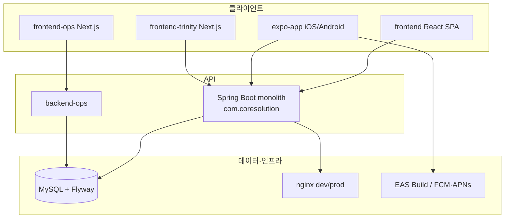

# Core Solution(MindGarden) · 앱 구현 범위 요약 (비용 역산용)

> **목적**: 외주·인력·유지보수 **비용 역산**을 위한 구현 범위·규모·모듈 경계 SSOT.  
> **작성**: 2026-05-20 (코드베이스·기존 기획서 기준)  
> **주의**: 아래 **인일(人日) 구간은 참고용**이며, 단가·생산성·재작업률에 따라 실제 견적은 달라집니다.

---

## 1. 한 줄 요약

**Core Solution**은 멀티테넌트 **상담·일정·매칭·결제·ERP·웰니스·샵·커뮤니티**를 하나의 Spring Boot 모놀리스에 담은 SaaS이고, **웹(React)** 과 **Expo 네이티브 앱**이 동일 `/api/v1/` API를 공유한다. 모바일은 `expo-app`이 SSOT이며, 레거시 `mobile/`(RN CLI)는 CI만 유지 중이다.

---

## 2. 시스템 구성 (역할별)



| 레이어 | 경로 | 기술 | 비고 |
|--------|------|------|------|
| 메인 API | `src/main/java` | Spring Boot 3.2, Java 17 | Controller **~163**, Java **~1,513** |
| 웹 | `frontend/` | React (CRA 계열) | JS/JSX **~1,021**, components **~1,148** |
| 네이티브 앱 | `expo-app/` | Expo SDK 54, RN 0.81, TS | TS/TSX **~392**, 라우트 **~125** |
| 레거시 모바일 | `mobile/` | RN CLI | **~79** files, `deploy-mobile.yml`만 |
| Ops | `backend-ops/`, `frontend-ops/` | Spring + Next 14 | 테넌트·플래그·Ops |
| Trinity | `frontend-trinity/` | Next.js | 온보딩·랜딩·결제 iframe |
| DB | `db/migration/` | Flyway | SQL migration **~209** |

---

## 3. Core Solution 백엔드 — 도메인 모듈 (비용 버킷)

역산 시 **버킷 단위**로 나누면 중복 산정을 줄일 수 있다.

| ID | 도메인 | 구현 범위 (요약) | 규모 신호 | 역산 복잡도 |
|----|--------|------------------|-----------|-------------|
| B0 | **플랫폼·멀티테넌트** | tenantId 격리, 역할·메뉴·권한, 브랜딩, PG 설정, 파일 | core 패키지, RoleTemplate, Flyway 다수 | **XL** |
| B1 | **인증·계정** | JWT, OAuth2, Kakao/Naver, Passkey, SMS 인증, 계정 연동 | Auth, SocialAuth, SmsAuth | **L** |
| B2 | **상담·일정·매칭** | 스케줄, 매칭(PL/SQL 동기), 상담사 가용, 세션 연장, 상담일지 | Schedule, PlSqlMapping, Consultant* | **XL** |
| B3 | **결제·정산** | PortOne/Toss, 웹훅, 금액·할인, ERP 연동 트랜잭션 | Payment, ERP confirm-payment/deposit | **XL** |
| B4 | **ERP·회계** | 원장, 결산, 재무제표, HQ ERP, 급여 배치·설정 | `controller/erp/*`, Salary* | **XL** |
| B5 | **메시지·알림** | 상담 메시지, 시스템 알림, **모바일 Expo Push**, SMS·알림톡 | MobilePush, Solapi, Kakao Alimtalk | **L** |
| B6 | **웰니스** | 마음날씨, 감정일기, 명상, 자가진단, 심리교육, 마음정원, 힐링 | MindWeather, SelfAssessment, … | **L** |
| B7 | **샵·리워드** | 카탈로그 SKU, 썸네일, 주문, 포인트 정책 | ClientShop, AdminShop* | **M** |
| B8 | **커뮤니티·컴플라이언스** | 피드, 검수, 개인정보·동의·파기 | Community, Compliance* | **M** |
| B9 | **관리·통계** | 어드민 대시보드 API, 통계, 심리검사(assessment) | Admin*, Statistics, PsychAssessment | **L** |
| B10 | **아카데미·SaaS 빌링** | 클래스·수강·청구 (테넌트 확장) | Academy*, Billing | **M** |
| B11 | **Ops·모니터링** | HQ Ops, 기능 플래그, AI/스케줄러 모니터링 | `controller/ops/*`, AIMonitoring | **M** |

**복잡도 기준 (참고)**  
- **S**: CRUD 1~2 엔티티, 단순 화면 연동  
- **M**: 테넌트·권한·파일/웹훅 1종 포함  
- **L**: 다역할·다단계 워크플로·외부 연동 2종+  
- **XL**: ERP/결제/프로시저·멀티테넌트·트랜잭션 경계

---

## 4. 웹 프론트엔드 (`frontend/`)

| ID | 영역 | 주요 화면·기능 | 웹 전용·무거운 UI |
|----|------|----------------|-------------------|
| W1 | **Admin** | 대시보드 V2, 통합 스케줄, 매칭, 사용자·ERP, 샵 SKU/주문, 알림톡/SMS 설정, 커뮤니티 검수, 마음날씨 관측 | 위젯 대시보드, ERP 전체 |
| W2 | **Client** | 예약, 상담, 웰니스 허브, 샵(PLP·장바구니·결제), 커뮤니티 | 샵·결제 플로우 |
| W3 | **Consultant** | 스케줄, 내담자, 일지, 가용시간, 급여·KPI, 마음날씨 수신함 | Renewal 셸 |
| W4 | **공통** | 로그인·OAuth, 마이페이지, 설정, StandardizedApi | 디자인 시스템·위젯 표준 |

**역산 팁**: 웹은 Admin(W1)+ERP가 인일 비중 최대. 모바일과 **API는 공유**하므로 백엔드(B2~B5)를 웹·앱에 **이중 전액** 넣지 말 것.

---

## 5. Expo 네이티브 앱 (`expo-app/`)

기획 SSOT: [`EXPO_NATIVE_APP_PLAN.md`](./EXPO_NATIVE_APP_PLAN.md), 어드민 상용화: [`ADMIN_MOBILE_COMMERCIALIZATION_ORCHESTRATION.md`](./ADMIN_MOBILE_COMMERCIALIZATION_ORCHESTRATION.md)

### 5.1 역할·탭

| 역할 | 탭 | 구현 상태 (2026-05 기준) |
|------|-----|-------------------------|
| **Client** | 홈 · 내 상담 · 웰니스 · 더보기 | **광범위 구현** (예약·샵 라우트는 탭 숨김·딥링크 가능) |
| **Consultant** | 홈 · 스케줄 · 내담자 · 일지 · 더보기 | **핵심 플로우 구현** |
| **Admin/STAFF** | 홈 · 검수 · 운영 · 메시지 · 더보기 | **MVP P0** (스케줄·매칭·일지·사용자·검수·메시지·마음날씨) |

### 5.2 앱 모듈 (비용 버킷)

| ID | 모듈 | 화면·기능 | API 훅·네이티브 |
|----|------|-----------|-----------------|
| A0 | **앱 기반** | Expo Router, 테마(역할별), MMKV, TanStack Query, 인증·테넌트 | Metro MMKV, EAS, 푸시 |
| A1 | **인증·온보딩** | 로그인, 테넌트 선택, Kakao/Naver 네이티브, Secure Store | Config Plugin, app.config |
| A2 | **Client 코어** | 세션, 예약(다단계), 메시지, 프로필 | useConsultantSchedules*, useMessages |
| A3 | **Client 웰니스** | 마음날씨, 정원, 명상, 감정일기, 자가진단, 심리교육 | useMindWeather, 로컬+API 혼합 |
| A4 | **Client 샵** | 카탈로그, 장바구니, 결제, 주문, 포인트 | useCommunity·shop hooks |
| A5 | **Consultant** | 일정, 내담자, 일지, 급여·KPI, 커뮤니티, 수신함 | 다수 화면 |
| A6 | **Admin MVP** | 운영 허브, 스케줄·매칭 등록, 일지, 사용자 생성, 검수, 메시지 인박스, 마음날씨 | useAdmin* **~13+** |
| A7 | **푸시·강제업데이트** | expo-notifications, ForceUpdateGate, 시나리오 상수 | EAS projectId, APNs/FCM |
| A8 | **미구현·제외** | ERP, 설정 전체, 웹 대시보드 위젯 | 웹 유지 |

### 5.3 네이티브·배포 (앱만 추가 비용)

| 항목 | 내용 |
|------|------|
| EAS 프로필 | `internal-dev`(dev API APK/IPA), `production`, `development`(dev client) |
| iOS | Ad Hoc, Push Key, 기기 UDID, **TestFlight 아님** (internal 설치 링크) |
| Android | APK dev, `google-services.json`, FCM |
| 문서 | [`MOBILE_PUSH_EXPO_DEPLOYMENT_CHECKLIST.md`](./MOBILE_PUSH_EXPO_DEPLOYMENT_CHECKLIST.md) |

---

## 6. 외부 연동 (통합 버킷 I*)

| ID | 연동 | 용도 | 구현 위치 |
|----|------|------|-----------|
| I1 | Kakao | 로그인, 알림톡 | OAuth, Solapi/bizmsg 분기, Expo SDK |
| I2 | Naver | 로그인 | OAuth, Expo SDK |
| I3 | Solapi | SMS, 알림톡 | `integration/solapi` |
| I4 | PortOne / Toss | 결제·웹훅 | Payment controllers |
| I5 | Expo Push | 모바일 푸시 | `MobilePush*`, 서버 `EXPO_ACCESS_TOKEN` |
| I6 | Flyway + PL/SQL | 스키마·매칭·회계 프로시저 | 209+ migrations, deploy-procedures workflows |

**역산**: 연동 1종당 **분석·키관리·테넌트 설정 UI·스테이징 검증** 인일을 별도로 잡는 것이 안전하다.

---

## 7. 운영·CI/CD (공통 O*)

| ID | 항목 |
|----|------|
| O1 | GitHub Actions **~33** (dev/prod 백엔드·프론트·ops·trinity·E2E·DB) |
| O2 | nginx, systemd, 블루그린 prod, dev `dev.core-solution.co.kr` |
| O3 | 하드코딩·CI/BI 게이트, pre-commit |
| O4 | Playwright E2E (admin shop, client shop 등) |

---

## 8. 규모 지표 (2026-05 코드 카운트)

| 지표 | 수치 |
|------|------|
| Java 소스 파일 | ~1,513 |
| REST Controller | ~163 |
| Flyway migration | ~209 |
| 프론트 JS/JSX | ~1,021 |
| Expo TS/TSX | ~392 |
| Expo 라우트 파일 | ~125 |
| 레거시 mobile | ~79 |

---

## 9. 비용 역산 워크시트 (참고 인일 구간)

**가정 예시** (조정 가능): 1인일 = 1명 × 1일 순개발, 설계·QA·PM 미포함, **이미 구현된 코드 재구축** 기준.

| 버킷 | 참고 인일 (min~max) | 비고 |
|------|---------------------|------|
| B0 플랫폼·멀티테넌트 | 40~80 | 권한·Flyway·브랜딩 |
| B1 인증 | 15~30 | 소셜·Passkey |
| B2 상담·일정·매칭 | 50~100 | PL/SQL·핵심 |
| B3 결제 | 25~50 | PG·웹훅 |
| B4 ERP | 60~120 | 최대 비중 후보 |
| B5 알림·푸시·SMS | 20~40 | Expo+Solapi |
| B6 웰니스 | 25~50 | AI 연동 시 상한 ↑ |
| B7 샵 | 15~30 | SKU·썸네일·주문 |
| B8 커뮤니티·컴플라이언스 | 15~30 | |
| B9~B11 기타 백엔드 | 30~60 | |
| W1~W4 웹 전체 | 80~160 | Admin+ERP UI |
| A0~A7 Expo 앱 | 60~120 | 3역할·네이티브 SDK |
| I1~I6 연동 (패키지) | 25~50 | 중복 제외 후 |
| O1~O4 DevOps·QA | 30~60 | |
| **합계 (참고)** | **~485~980 인일** | **중복·재사용률에 따라 30~50% 조정 흔함** |

### 9.1 역산 공식 예시

```
총비용 ≈ Σ (버킷 인일 × 역할 단가) × (1 + PM/QA%) × (1 + 리스크%)
```

| 변수 | 제안 |
|------|------|
| 역할 단가 | 백엔드 / 프론트 / 모바일 / DevOps 각각 |
| PM/QA% | 15~25% (E2E·Flyway·EAS 포함 시 상한) |
| 리스크% | 멀티테넌트·결제·ERP 있으면 10~20% |
| 조정 | 웹·앱 **공유 API**는 B2~B5를 한 번만 전액 산정 |

### 9.2 유지보수(연간) 역산

| 항목 | 참고 |
|------|------|
| 모놀리스 + Flyway 209 | 스키마 변경·회귀 비용 고정 |
| 이중 모바일 (expo + mobile) | **10~20% 추가** 유지보수 |
| 외부 API 키·EAS·Apple Developer | 인프라 비용 별도 (인건비 외) |

---

## 10. 구현 완료도 (상용화 관점)

| 영역 | 완료도 | 근거 |
|------|--------|------|
| 백엔드 API | **높음** | Controller·migration 풍부, dev 운영 중 |
| 웹 Admin·ERP | **높음** | dashboard-v2, erp, shop |
| Expo Client·Consultant | **중~높음** | 125 라우트, 핵심 플로우 |
| Expo Admin | **MVP** | P0 구현, 웹 대비 **부분 패리티** (상용화 문서 G1~G4) |
| TestFlight/스토어 | **낮음** | internal-dev Ad Hoc 단계 |
| 레거시 mobile | **유지보수만** | expo로 이전 중 |

---

## 11. 관련 문서

| 문서 | 용도 |
|------|------|
| [`EXPO_NATIVE_APP_PLAN.md`](./EXPO_NATIVE_APP_PLAN.md) | Expo 전환·기술 스택 |
| [`ADMIN_MOBILE_COMMERCIALIZATION_ORCHESTRATION.md`](./ADMIN_MOBILE_COMMERCIALIZATION_ORCHESTRATION.md) | 어드민 모바일 P0/P1 |
| [`MOBILE_PUSH_EXPO_DEPLOYMENT_CHECKLIST.md`](./MOBILE_PUSH_EXPO_DEPLOYMENT_CHECKLIST.md) | 푸시·EAS |
| [`archive/AI_COST_MATRIX.md`](./archive/AI_COST_MATRIX.md) | AI/LLM 단가 (플랫폼 전체와 별도) |
| [`docs/standards/`](../standards/) | 코딩·API 표준 |

---

## 12. 역산 시 체크리스트

- [ ] 버킷(B/W/A/I/O) 중 **이중 계상** 없는지 (공유 API)  
- [ ] **ERP·결제** 포함 여부 (비용 급증)  
- [ ] **Expo만** vs **웹+Expo+Ops+Trinity** 전체 범위  
- [ ] **신규 구축** vs **현 코드 유지보수/확장** (인일 30~50% 차이)  
- [ ] AI(마음날씨 등)·외부 SaaS **사용료** 인건비와 분리  
- [ ] Apple/Google/EAS/Solapi **라이선스·트래픽** 별도

---

*이 문서는 코드 인벤토리 스냅샷이며, 견적 확정 시점에 `git` 기준 커밋 해시를 기록하는 것을 권장합니다.*
