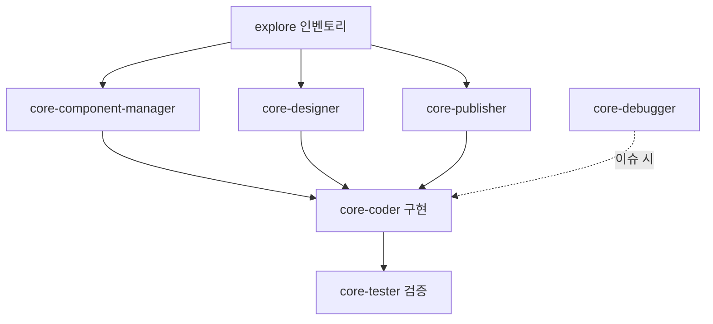

# ERP 도메인 리뉴얼·고도화 마스터 플랜

**문서 버전**: 1.6  
**작성일**: 2026-04-09  
**최종 갱신**: 2026-04-09 (§1.6 디자인 신규·IA 병합)  
**상태**: 진행 기준서(SSOT) — 이후 배치·PR은 본 문서를 전제로 한다.  
**주관**: core-planner(기획 오케스트레이션)  
**구현 원칙**: 일반 채팅 에이전트의 임의 소스 수정 금지 → `docs/project-management/CORE_PLANNER_DELEGATION_ORDER.md` 준수.

---

## 목차

1. [목표 및 배경](#1-목표-및-배경)  
2. [비전·원칙 (한 덩어리 측정 기준)](#2-비전원칙-한-덩어리-측정-기준)  
3. [리뉴얼·고도화 범위](#3-리뉴얼고도화-범위)  
4. [영향 범위 (코드베이스)](#4-영향-범위-코드베이스)  
5. [전체 진행 흐름](#5-전체-진행-흐름) · [5.1 서브에이전트 간 협업](#51-서브에이전트-간-협업-필수)  
6. [페이즈 로드맵](#6-페이즈-로드맵)  
7. [공통 레이어 정의](#7-공통-레이어-정의)  
8. [필요 항목 정의 (체크리스트)](#8-필요-항목-정의-체크리스트)  
9. [리스크·운영 게이트](#9-리스크운영-게이트)  
10. [참조 문서](#10-참조-문서)  
11. [문서 변경 이력](#11-문서-변경-이력)

---

## 1. 목표 및 배경

### 1.1 목표

ERP 영역을 **레거시 화면의 단순 수정**이 아니라, **하나의 일관된 제품 경험**으로 재정의한다.

- **리뉴얼**: 레이아웃·비주얼·정보 구조를 디자인 시스템(B0KlA·토큰·AdminCommonLayout)에 맞춘다.  
- **고도화**: API 클라이언트 일원화(`StandardizedApi`), 권한·에러·Empty·Loading 패턴 통일, 컴포넌트 공통화, 테스트·품질 게이트를 올린다.

### 1.2 배경

- ERP는 MindGarden **핵심 도메인**이며, 사용자 신뢰와 운영 효율에 직결된다.  
- 현재는 화면별로 **부분 개선**이 누적되어 **패턴이 제각각**일 수 있다(ajax/csrf 혼재, 모달·폼·목록 구조 불일치 등).  
- 본 문서는 **전체 흐름·범위·필요 항목**을 한곳에 두고, **explore → 설계 → 구현 → 검증** 배치의 단일 기준으로 쓴다.

### 1.3 제품 관점 — 회계 비전문가 친화·자동화

ERP 리뉴얼·고도화는 **디자인·기술 일관성**만이 아니라, **상담센터·운영 담당 등 회계 전문가가 아닌 사용자**가 매일 쓸 수 있는 수준을 **최우선 제품 목표**로 둔다.

| 방향 | 정의 | 리뉴얼·고도화에의 함의 |
|------|------|------------------------|
| **쉬움 (비전문가)** | 계정과목·분개·세무 용어에 의존하지 않고 **업무 언어(상담료, 환불, 지출, 예산)**로 이해 가능해야 한다. | 화면 카피·라벨·에러 메시지는 **한 줄 설명** 또는 **도움말(툴팁/접기)**로 보완; 전문 용어는 괄호 보조 또는 “고급” 섹션으로 분리. |
| **자동화** | 반복 입력·수동 집계·이중 기록을 줄이고, **시스템이 기본값·연관 금액·요약**을 채운다. | 빠른 지출·연동 데이터·대시보드 요약 등 **자동 채움·검증·후속 제안**을 우선 설계; 수동 분개형 UI는 **필요한 사용자만** 노출. |
| **실수 방지** | 회계 오류를 줄이기 위한 **가이드·검증·확인**이 동반된다. | 저장 전 요약·금액 이상치 힌트·삭제/취소 시 맥락 표시(본 문서 §7·§8과 연계). |
| **학습 비용 최소** | 첫 방문과 30일 뒤 모두 **동일한 mental model**을 유지한다. | P0에서 **정보 구조·네비게이션**을 고정하고, 화면마다 다른 메타포를 두지 않는다. |

**서브에이전트 전달 시**: **core-designer**와 **core-component-manager** 프롬프트에 위 표를 인용하고, **core-coder**는 구현 시 **문구·기본값·자동 계산**이 스펙과 일치하는지 확인한다.

### 1.4 DB·프로시저 실조회 필수 (상상 코딩 금지)

ERP/회계 관련 **코드 변경**은 **Database-First**를 적용한다 (`.cursor/skills/core-solution-database-first/SKILL.md`).

| 규칙 | 내용 |
|------|------|
| **실조회** | 구현 전 **실제 DB**에서 관련 테이블·칼럼·제약·인덱스를 `information_schema`·`SHOW CREATE TABLE` 등으로 확인한다. |
| **프로시저** | 호출 경로에 프로시저가 있으면 `SHOW CREATE PROCEDURE` 또는 저장소 동일 이름 SQL(`database/schema/`, `src/main/resources/sql/procedures/`, Flyway)으로 **본문을 대조**한다. |
| **스키마 변경** | `docs/standards/DATABASE_MIGRATION_STANDARD.md` 및 `src/main/resources/db/migration/` 기준으로만 설계한다. |
| **코드 정합** | Java Entity·API·프론트 필드는 **DB·프로시저에서 확인된 사실**에만 맞춘다. 확인 전 **가정·추측**으로 칼럼·타입·NULL 여부를 채우지 않는다. |
| **explore** | 산출물에 조회 쿼리·결과 요약 또는 **저장소 파일 경로**를 포함한다 (코드만 읽고 DB를 건너뛰지 않도록). |
| **core-coder** | PR 본문에 **DB 검증 완료 선언 한 줄**을 넣는다 (아래 §8.3 참고). |
| **core-tester** | Flyway·프로시저 변경 시 동일 테이블·프로시저를 참조하는 API·집계·E2E를 회귀 범위에 넣는다. |

**금지 예**: 엔티티만 보고 칼럼 가정; 프로시저 이름 추측; Flyway 없이 스키마만 코드에 반영; “관례상 비슷할 것”으로 API 계약 확정.

### 1.5 사용자 노출·상태 문구 — 한글 우선

**목표**: 사용자에게 보이는 **상태 값·라벨·버튼·토스트·Empty·에러·모달 본문**은 **한국어**로 통일한다. (내부 식별자·코드 식별자는 Java/TypeScript 관례에 따라 영문 유지 가능하나, **화면에 직접 노출되는 문자열은 한글**.)

| 구분 | 규칙 |
|------|------|
| **상태 배지·탭·필터** | `PENDING` 등 내부 enum은 **표시용 한글 매핑 테이블**(예: 대기·승인·반려)을 두고, 동일 상태는 ERP 전역에서 **동일 한글 라벨**. |
| **API 메시지** | 사용자에게 전달되는 `message`·검증 오류는 **한글** (기술 코드만 노출 금지). |
| **코드베이스** | 신규 UI 문자열은 **한글 리터럴** 또는 중앙 집중 상수(`erpCopy` 등)로 관리; 영문 디버그 로그는 개발용으로만. |
| **core-coder** | 새 화면·모달 추가 시 **한글 카피**를 스펙과 동일하게 반영; 임의 영문 사용자 문구 금지. |

**병렬 참여**: **core-designer**(시각·토큰·한글 톤), **core-publisher**(마크업·시맨틱·BEM, 한글 자리), **core-component-manager**(공통 배지·상태·Empty 패턴 중복 제거 제안) — 기획이 동시에 위임 가능(§5 참고).

### 1.6 디자인·정보 구조 — 기존 화면 재사용 금지·레이아웃 공통화·메뉴 병합

ERP 리뉴얼에서 **시각·레이아웃·IA**는 “레거시 화면을 그대로 답습”하지 않는다.

| 규칙 | 내용 |
|------|------|
| **기존 디자인 재사용 금지** | 현행 ERP 컴포넌트·카드·테이블 배치를 **그대로 복제·미세 수정**하는 것을 디자인 산출로 인정하지 않는다. **B0KlA·토큰·AdminCommonLayout** 전제 하에 **새 정보 구조·시각 계층**을 정의한다(참고만 가능, 베끼기 불가). |
| **레이아웃 공통화** | 모든 ERP 페이지는 동일 **페이지 셸·섹션 리듬·필터·목록·상세** 슬롯을 쓴다. 화면마다 다른 래퍼·임의 그리드 금지 목표. |
| **메뉴·기능 병합** | LNB에서 **같은 업무 맥락**으로 나뉜 항목은 **한 화면에서 탭·섹션·2단 레이아웃**으로 병합 가능한지 검토한다(예: 요약+목록+빠른 액션). 불필요한 깊이 이동을 줄인다. |
| **core-designer** | 본 절을 **필수 제약**으로 프롬프트에 명시; 산출은 **와이어·정보 구조·병합 후보** 중심. |
| **core-coder** | 병합 시 **라우트 리다이렉트·권한·deep link**를 함께 설계한 뒤에만 구현. |

---

## 2. 비전·원칙 (한 덩어리 측정 기준)

| # | 원칙 | 측정·판정 |
|---|------|-----------|
| 1 | **용어·네이밍** | 동일 개념은 동일 라벨·라우트·API 상수명(용어집 준수). |
| 2 | **레이아웃** | ERP 페이지는 동일 **페이지 셸**(AdminCommonLayout + ERP 서브 레이아웃)을 사용한다. |
| 3 | **API** | 프론트는 **StandardizedApi**·`/api/v1/` 중심, 에러·tenantId·권한 거부 UX가 화면 간 동일 패턴. |
| 4 | **권한 UX** | 숨김 / 비활성 / 안내 문구 정책이 **화면마다 임의로 달라지지 않는다.** |
| 5 | **모달·피드백** | 신규·수정·확인은 **UnifiedModal** 정책; ErpModal은 래핑 또는 단계적 통합. |
| 6 | **표시 경계** | API 필드·숫자·에러는 `safeDisplay`·React #130 방지 규칙 준수. |
| 7 | **검증** | 코드 리뷰 체크리스트 + ERP **핵심 E2E 스모크**로 통과 여부를 판정한다. |
| 8 | **비전문가 언어** | 기본 라벨·플로우는 **업무 용어** 우선; 회계 전문 용어는 보조·고급으로만. |
| 9 | **자동화** | 입력 최소화·기본값·연관 금액·요약 반영; **수동으로만 가능한 단계**를 줄인다. |
| 10 | **가이드** | 빈 화면·첫 입력·오류 시 **다음 행동**이 한눈에 보인다(Empty·에러 톤 통일). |
| 11 | **DB·프로시저 우선** | §1.4 — 상상 코딩 금지; **실조회·Flyway·프로시저 대조** 후 구현. |
| 12 | **한글 UI** | §1.5 — 사용자 노출 문자열·상태·메시지 **한글**; 내부 식별자와 표시 분리. |
| 13 | **신규 IA·시각** | §1.6 — 레거시 디자인 **재사용 금지**; 레이아웃 공통화·메뉴 병합으로 **한 화면 밀도** 극대화. |

---

## 3. 리뉴얼·고도화 범위

### 3.1 포함

| 구분 | 내용 |
|------|------|
| 프론트 | `frontend/src/components/erp/**` 전반 — 페이지·organisms·common·refund 등 |
| API·상수 | `frontend/src/constants/api.js`의 ERP 관련 엔드포인트 정리·일관성 |
| 공통 UX | 목록·폼·모달·Empty·Loading·Error·권한 가드 패턴 |
| 품질 | 단위·통합·E2E(ERP 시나리오), 하드코딩·표시 경계 점검 |

### 3.2 제외 (별 트랙 또는 후속)

| 구분 | 내용 |
|------|------|
| 비ERP 모듈 | 전면 리팩터는 하지 않음(ERP와의 연동·메뉴만 필요 시 참조). |
| 백엔드 도메인 재설계 | 본 플랜의 기본 전제는 **기존 API 계약 유지·점진 개선**; 스키마 대개편은 별 문서. |
| 인프라·배포 파이프라인 | 변경 시 `core-deployer`·`docs/standards/DEPLOYMENT_STANDARD.md` 별도. |

### 3.3 고도화의 의미 (본 문서에서의 정의)

- **구조 고도화**: 공통 레이어(ErpPageShell 등) 도입, 중복 제거.  
- **기술 고도화**: 호출 방식·에러 처리·토큰·접근성·반응형 일관성.  
- **운영 고도화**: 멀티테넌트·권한·감사 가능성·배포 전 체크리스트 준수.  
- **사용자 고도화 (§1.3)**: 회계 비전문가가 **혼자 업무를 끝낼 수 있도록** 문구·가이드·기본값·자동 계산·요약을 단계적으로 강화한다.

---

## 4. 영향 범위 (코드베이스)

### 4.1 디렉터리

- 기준 경로: `frontend/src/components/erp/`

### 4.2 대표 파일 (인벤토리 — explore로 갱신)

현재 트리에 포함된 주요 파일(예시, **전수는 explore 배치에서 갱신**):

- **대시·통합**: `ErpDashboard.js`, `IntegratedFinanceDashboard.js`, `AdminApprovalDashboard.js`, `SuperAdminApprovalDashboard.js`  
- **재무·예산**: `FinancialManagement.js`, `FinancialTransactionForm.js`, `FinancialCalendarView.js`, `BudgetManagement.js`, `QuickExpenseForm.js`, `ImprovedTaxManagement.js`, `TaxManagement.js`  
- **구매·품목**: `PurchaseManagement.js`, `PurchaseRequestForm.js`, `ItemManagement.js`  
- **급여·환불**: `SalaryManagement.js`, `SalaryProfileFormModal.js`, `SalaryConfigModal.js`, `RefundManagement.js` 및 `refund/`, `refund-management/`  
- **공통·오거나니즘**: `common/ErpModal.js`, `ErpHeader.js`, `ErpButton.js`, `ErpCard.js`, `organisms/ErpQuickActionsPanel.js`, `ErpRecentTransactionsTable.js`, `ErpIncomeExpenseSummarySection.js` 등  
- **기타**: `ConsultantProfileModal.js`, `ErpReportModal.js`

### 4.3 연관

- 라우트·메뉴: `frontend/src/App.js`, `frontend/src/components/dashboard-v2/constants/menuItems.js` 등 — 페이즈별로 정리.  
- 기존 기획 참고: `docs/planning/ERP_SECTION_AUDIT_AND_PLANNING.md`, `ERP_LAYOUT_DESIGN_REVIEW.md`, `ERP_TEST_SCENARIOS.md` 등.

### 4.4 DB·백엔드 로직 현황 (별도 SSOT)

- **테이블 맵·엔티티·흐름·개선 후보**: [`ERP_CURRENT_STATE_DB_AND_LOGIC_ANALYSIS.md`](./ERP_CURRENT_STATE_DB_AND_LOGIC_ANALYSIS.md)  
- 리뉴얼·고도화 배치 시 **프론트 인벤토리(explore)**와 위 문서를 **대조**하면 범위가 수렴한다.

---

## 5. 전체 진행 흐름

아래는 **권장 순서**이며, 병렬 가능 구간을 표시한다.

**병렬 트랙 (explore 1차 산출 후 동시 착수 가능)**: **core-designer** · **core-publisher** · **core-component-manager** — **동시에 진행하되 §5.1에 따라 서로 협업**하여 산출물을 맞춘 뒤, **core-coder**가 스펙·마크업·공통화 제안을 취합해 구현한다. 퍼블리셔는 HTML 마크업만; JS/React 연동은 core-coder.

### 5.1 서브에이전트 간 협업 (필수)

서브에이전트는 **각자 독립 과제만 수행하는 것이 아니라**, 동일 배치 안에서 **산출물을 맞추기 위해 서로 협업**해야 한다. 부모 오케스트레이터(기획·메인)는 위임 프롬프트에 **협업 대상·공유할 산출**을 명시한다.

| 협업 쌍(또는 그룹) | 협업 내용 |
|--------------------|-----------|
| **explore → 전원** | 인벤토리·갭·API 목록을 **designer / publisher / component-manager / (이후) coder** 프롬프트에 **동일 요약**으로 붙여, 전제 불일치가 없게 한다. |
| **core-designer ↔ core-publisher** | 시각·토큰·간격·클래스 접두를 **한 세트로 합의**; 퍼블 마크업의 `mg-v2-*`·BEM은 디자이너 스펙과 **충돌 시 먼저 스펙을 수정**하고 마크업을 맞춘다(문서 또는 회신으로 합의). |
| **core-designer ↔ core-component-manager** | 배지·Empty·모달 패턴이 **공통 컴포넌트 제안**과 겹치면, **한글 라벨·variant·배치**를 표로 **공유**하고 중복 제안을 제거한다. |
| **core-component-manager ↔ core-publisher** | 공통 블록의 **DOM 계층·클래스명**이 컴포넌트 추출 후보와 맞는지 검토; 분리 시 **퍼블은 구조만, 매니저는 책임 경로**를 문서화. |
| **병렬 3종 → core-coder** | coder 위임 시 **designer + publisher + component-manager 산출을 한 번에** 인용; 한쪽만 반영된 구현 금지. |
| **core-coder ↔ core-tester** | 구현 범위·시나리오·회귀 목록을 **사전 공유**; 테스터는 스펙·한글 카피·권한 기대값을 기획·디자인 산출과 대조한다. |
| **core-debugger ↔ core-coder** | 디버거는 **원인·재현·로그 포인트**를 정리해 coder에게 넘기고, coder는 수정 후 **동일 시나리오로 재현 불가**를 확인한다. |

**협업 형식 (권장)**

- 위임 프롬프트에 **“선행 산출 요약 붙임”** 또는 **“다음 에이전트에게 전달할 한 단락”** 을 각 서브에이전트 출력에 포함시킨다.  
- 병렬 단계 종료 후 **core-planner(또는 메인)** 가 **1페이지 합본**으로 충돌·누락을 정리한 뒤 **core-coder**에만 넘긴다.

**위임 순서 문서**: `docs/project-management/CORE_PLANNER_DELEGATION_ORDER.md`  
**구현은 core-coder만**, 검증은 **core-tester 게이트** 필수.

| 단계 | 담당 | 산출물 |
|------|------|--------|
| 1 | **explore** | 레거시 패턴 목록, 파일 트리, P0 우선순위 |
| 2a | **core-component-manager** | 중복·공통화 후보, 적재적소 제안(코드 직수정 없음) |
| 2b | **core-designer** | 레이아웃·토큰·반응형·모달·목록 UX 스펙, **§1.5 한글 톤** |
| 2c | **core-publisher** | ERP 공통 블록 **아토믹 HTML 마크업**(BEM·시맨틱), **한글 자리 표시** |
| 3 | **core-coder** | 공통 레이어·페이지 이관·API 정리(필수 문서 인용) |
| 4 | **core-tester** | 테스트 계획·실행·회귀 |
| (선택) | **core-debugger** | 원인 분석·재현 절차(수정은 coder 위임) |

---

## 6. 페이즈 로드맵

| Phase | 이름 | 목표 | 선행 조건 |
|-------|------|------|-----------|
| **P0** | 공통 셸·토큰·ErpLayout | AdminCommonLayout 하위 **ERP 페이지 셸**(가칭 `ErpPageShell`), 섹션·간격·토큰 정렬 | explore 1차 + component-manager 초안 |
| **P1** | 거래·재무 핵심 | Financial·거래·빠른 지출·캘린더 등 **핵심 플로우**를 공통 패턴으로 이관. **§1.3**에 따라 입력·요약·안내 문구를 **비전문가 기준**으로 정리 | P0 + designer 스펙 |
| **P2** | 예산·통합 대시보드·위젯 | Budget, IntegratedFinance, ErpDashboard, organisms 위젯 정합 | P0~P1 안정화 |
| **P3** | 품질·E2E·하드코딩·테넌트 | 전역 점검, E2E 보강, 운영 게이트 | P1~P2 기능 완료 후 |

**병렬**: P0 직후 **designer**와 **component-manager**와 **core-publisher**는 동시 진행 가능하며, **§5.1 협업**으로 산출을 맞춘다.

---

## 7. 공통 레이어 정의

구현 시 **core-coder** 프롬프트에 이 표를 인용한다.

| 레이어 | 정의 |
|--------|------|
| **페이지 템플릿** | AdminCommonLayout + ERP 전용 셸: 제목, (선택) breadcrumb, primary/secondary 액션, 본문 그리드 |
| **헤더/섹션** | ContentHeader·ContentArea·섹션 블록(`mg-v2-*`, B0KlA) 규칙 통일 |
| **테이블/목록** | 토큰 기반 테이블·카드 리스트, 필터·페이지네이션 동작 일관, **safeDisplay** |
| **폼** | 라벨·에러·필수·제출 비활성 규칙 통일; ERP 폼 래퍼 검토. **placeholder·보조 설명**으로 회계 용어 의존도 낮춤(§1.3) |
| **도움말·기본값** | 필드별 짧은 설명, **합리적 기본값**, (해당 시) 자동 계산 결과 표시 영역 |
| **모달** | UnifiedModal 정책; 확인·파괴적 액션은 위험 톤·이중 확인 |
| **Empty/Loading/Error** | 동일 톤·재시도·권한 안내 |
| **권한** | 라우트 가드·컴포넌트·행 액션의 **단일 정책** (숨김/비활성/메시지) |

---

## 8. 필요 항목 정의 (체크리스트)

### 8.0 오케스트레이션 (서브에이전트 협업)

- [ ] **§5.1**: 병렬 단계에서 **designer · publisher · component-manager** 산출이 서로 맞는지 검토하고, **core-planner(또는 메인) 합본 1페이지** 후 **core-coder**에 위임  
- [ ] 위임 프롬프트에 **explore 요약 동일 본**을 각 서브에이전트에 붙였는지 확인

### 8.1 explore 배치 (인벤토리·진단)

- [ ] [`ERP_CURRENT_STATE_DB_AND_LOGIC_ANALYSIS.md`](./ERP_CURRENT_STATE_DB_AND_LOGIC_ANALYSIS.md) §3~5와 화면·API 매핑표 작성  
- [ ] ERP 페이지별 `AdminCommonLayout` / ContentHeader / ContentArea 적용 여부  
- [ ] `StandardizedApi` vs `csrfTokenManager` / raw `fetch` 혼재 목록  
- [ ] `ErpModal` vs `UnifiedModal` vs 커스텀 오버레이 분포  
- [ ] 인라인 스타일·hex 폴백·Bootstrap 잔존 여부  
- [ ] `api.js` ERP 엔드포인트 누락·중복·네이밍 불일치  
- [ ] 권한·Empty·Error 패턴 화면별 차이  
- [ ] 기존 E2E·스모크 커버 범위 (`tests/e2e/...`)

**산출**: 레거시 패턴 3~5가지(파일 경로 예시), **P0 권장 작업 목록**.

### 8.2 설계·컴포넌트 (component-manager + designer + **core-publisher 병렬**)

- [ ] 공통화 후보 표(Atoms/Molecules/Organisms)  
- [ ] 신규·수정 시 사용할 레이아웃·토큰·모바일 전환 규칙  
- [ ] 목록 행 액션·필터·정렬 UX 합의  
- [ ] **§1.3**: 화면별 **주 사용자 문구**(비전문가) vs 고급/전문 용어 구분, Empty/온보딩 카피  
- [ ] **§1.3**: 자동화·기본값이 적용되는 지점(예: 빠른 지출, 세금·합계 표시, 대시보드 요약) 명시  
- [ ] **§1.5**: 상태·버튼·모달·Empty·에러 **한글** 톤·배지 매핑(core-designer 산출)  
- [ ] **§1.5**: ERP 공통 블록 **HTML 마크업**(한글 자리, BEM) — core-publisher 산출 → core-coder가 React/CSS 연동  
- [ ] **§1.5**: `erpStatusLabels`·`ErpStatusBadge` 등 중앙화 경로(core-component-manager 제안) 합의

### 8.3 구현 (core-coder)

- [ ] **§1.4**: 관련 테이블·프로시저를 **실제 DB 또는 저장소 SQL**로 확인한 뒤 착수; `.cursor/skills/core-solution-database-first/SKILL.md` 금지 사항 준수  
- [ ] PR 본문에 **DB 검증 완료 한 줄** 포함 — 예:  
  `이 PR의 ERP/회계 관련 구현은 information_schema/SHOW CREATE TABLE 및(해당 시) SHOW CREATE PROCEDURE 또는 저장소 db/migration·database/schema·sql/procedures 대조로 스키마·프로시저를 확인한 뒤 반영했으며, DATABASE_MIGRATION_STANDARD를 위반하는 임의 가정은 없습니다.`  
- [ ] P0~P2 범위에 맞는 PR 단위·파일 경로  
- [ ] `COMMON_DISPLAY_BOUNDARY_MEETING_20260322.md` 준수  
- [ ] 운영 게이트: `ADMIN_LNB_LAYOUT_UNIFICATION_MEETING_HANDOFF.md`(검사·완료 조건), `SETTINGS_PAGES_LAYOUT_UNIFICATION_ORCHESTRATION.md`(하드코딩), `docs/운영반영/PRE_PRODUCTION_GO_LIVE_CHECKLIST.md`  
- [ ] 멀티테넌트: `tenantId` 누락 불가 — `.cursor/skills/core-solution-multi-tenant/SKILL.md`

### 8.4 검증 (core-tester)

- [ ] ERP 핵심 사용자 시나리오 스모크  
- [ ] 회귀·콘솔 오류·보안 관점 체크리스트 — `/core-solution-testing`  
- [ ] **§1.3**: 회계 지식 없이 **시나리오만 보고** 주요 플로우 완료 가능한지(스크립트 기반) 검토  
- [ ] **§1.4**: 이 PR에 Flyway·프로시저·스키마 변경이 있으면 **동일 테이블·프로시저 참조 API·집계·tenant_id** 회귀를 범위에 포함

---

## 9. 리스크·운영 게이트

| 리스크 | 대응 |
|--------|------|
| 범위 과대 | 페이즈별로 PR 분리; 본 문서 §6 준수 |
| 표시·React #130 | 표시 경계 문서·기존 오케스트레이션 참조 |
| 하드코딩 | 운영 반영 전 스캔·토큰화 — 제외는 문서 합의만 |
| API·권한 불일치 | 백엔드와 계약 확인 후 프론트 반영 |
| 전문 용어 과다·자동화 부족 | §1.3·§8.2·디자인 리뷰에서 **카피·기본값** 재검토; 분개·원장 UI는 단계적·고급으로만 |
| **DB 가정·추측 코딩** | §1.4 — 반드시 실조회·프로시저 대조·Flyway; 리뷰에서 **증거 없는 스키마 변경** PR 반려 |

---

## 10. 참조 문서

| 문서 | 용도 |
|------|------|
| `docs/project-management/CORE_PLANNER_DELEGATION_ORDER.md` | 위임 순서·테스터 게이트 |
| `docs/project-management/COMMON_DISPLAY_BOUNDARY_MEETING_20260322.md` | 표시 경계·safeDisplay |
| `docs/project-management/SETTINGS_PAGES_LAYOUT_UNIFICATION_ORCHESTRATION.md` | 레이아웃·하드코딩 §1.3 |
| `docs/project-management/ADMIN_LNB_LAYOUT_UNIFICATION_MEETING_HANDOFF.md` | LNB·완료 조건 |
| `docs/운영반영/PRE_PRODUCTION_GO_LIVE_CHECKLIST.md` | 운영 반영 전 체크 |
| `docs/planning/ERP_SECTION_AUDIT_AND_PLANNING.md` | 기존 ERP 점검 |
| `docs/planning/ERP_LAYOUT_DESIGN_REVIEW.md` | 레이아웃 검토 |
| `docs/planning/ERP_TEST_SCENARIOS.md` | 테스트 시나리오 |
| [`docs/project-management/ERP_CURRENT_STATE_DB_AND_LOGIC_ANALYSIS.md`](./ERP_CURRENT_STATE_DB_AND_LOGIC_ANALYSIS.md) | DB·로직 현황·개선 후보·마스터 플랜 연계 |
| `docs/design-system/UNIFIED_LAYOUT_SPEC.md` | 레이아웃 스펙 |
| `.cursor/skills/core-solution-frontend/SKILL.md` | 프론트 규칙 |
| `.cursor/skills/core-solution-unified-modal/SKILL.md` | 모달 표준 |
| `.cursor/skills/core-solution-database-first/SKILL.md` | DB·프로시저·Flyway 우선, 상상 코딩 금지(§1.4) |
| `docs/standards/DATABASE_MIGRATION_STANDARD.md` | 마이그레이션 명명·테넌트 규칙 |

---

## 11. 문서 변경 이력

| 버전 | 일자 | 요약 |
|------|------|------|
| 1.0 | 2026-04-09 | 최초 작성 — 리뉴얼·고도화 범위·흐름·필요 항목 SSOT |
| 1.1 | 2026-04-09 | §1.3 제품 관점 추가 — 회계 비전문가 친화·자동화; §2·§3·§6·§7·§8·§9 반영 |
| 1.2 | 2026-04-09 | §4.4 및 §8.1·§10에 `ERP_CURRENT_STATE_DB_AND_LOGIC_ANALYSIS.md` 연계 |
| 1.3 | 2026-04-09 | §1.4 DB·프로시저 실조회 필수·§2 원칙 11번·§8.3·§8.4·§9·§10 갱신 |
| 1.4 | 2026-04-09 | §1.5 한글 UI·상태, §2 원칙 12번, §5 병렬 트랙에 core-publisher·designer·component-manager |
| 1.5 | 2026-04-09 | §5.1 서브에이전트 간 협업 필수·협업 표·합본 절차 |
| 1.6 | 2026-04-09 | §1.6 — 기존 디자인 재사용 금지·레이아웃 공통화·메뉴 병합, §2 원칙 13번 |

---

**다음 액션**: **explore** 배치로 §8.1 체크리스트를 채우고, **§1.3** 기준으로 “전문 용어·수동 단계가 과한 화면”을 목록화해 **P1** 우선순위에 반영한다. 결과를 본 문서에 반영할지(부록) 또는 별도 인벤토리 파일로 둘지 팀에서 결정한다.
