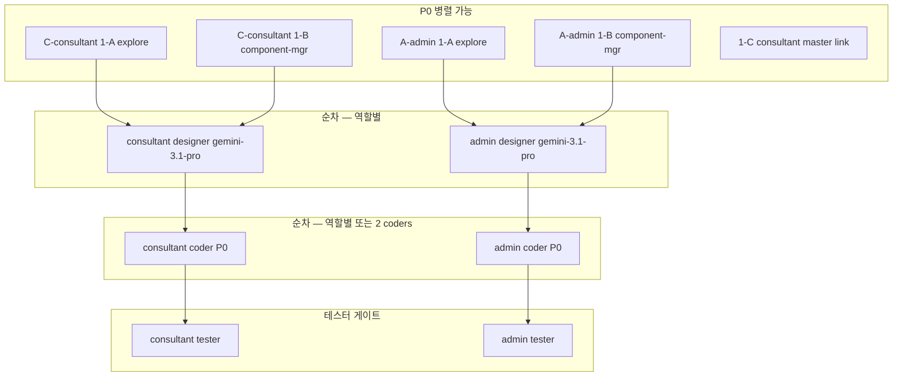

# 모바일 역할별 홈 컨텐츠 강화 — 통합 마스터 오케스트레이션

| 항목 | 내용 |
|------|------|
| 작성일 | 2026-05-22 |
| 작성 | core-planner |
| 범위 | Expo **상담사·어드민·스태프** 홈(`/(consultant)/(home)`, `/(admin)/(home)`) 컨텐츠 강화 |
| 제외 | 내담자 홈(별도 로드맵), 웹 대시보드 전면 개편, 백엔드 스키마 변경(필요 시 별도 Phase) |
| 위임 규칙 | [`CORE_PLANNER_DELEGATION_ORDER.md`](./CORE_PLANNER_DELEGATION_ORDER.md) |

---

## 1. 목표 (한 줄)

**상담사·어드민·스태프** 모바일 홈을 각 역할의 「오늘 해야 할 일」 중심으로 강화하되, **공통 UX·컴ponent·품질 게이트**를 통합하여 중복 구현·시각 불일치·하드코딩을 방지한다.

---

## 2. 역할별 문서 (SSOT)

| 역할 | 오케스트레이션 | 화면설계서 (Phase 2) | 현재 화면 |
|------|----------------|----------------------|-----------|
| **상담사 (CONSULTANT)** | [`CONSULTANT_MOBILE_HOME_CONTENT_ENHANCEMENT_ORCHESTRATION.md`](./CONSULTANT_MOBILE_HOME_CONTENT_ENHANCEMENT_ORCHESTRATION.md) | `docs/design-system/SCREEN_SPEC_CONSULTANT_MOBILE_HOME.md` | `expo-app/app/(consultant)/(home)/index.tsx` |
| **어드민·스태프 (ADMIN/STAFF)** | [`ADMIN_MOBILE_HOME_CONTENT_ENHANCEMENT_ORCHESTRATION.md`](./ADMIN_MOBILE_HOME_CONTENT_ENHANCEMENT_ORCHESTRATION.md) | `docs/design-system/SCREEN_SPEC_ADMIN_MOBILE_HOME.md` | `expo-app/app/(admin)/(home)/index.tsx` |
| **내담자 (CLIENT)** | *(본 배치 범위 외)* | — | `expo-app/app/(client)/(home)/index.tsx` — **벤치마크·패턴 참조용** |

### 후속: 상담사 문서 Master 링크

- [ ] `CONSULTANT_MOBILE_HOME_CONTENT_ENHANCEMENT_ORCHESTRATION.md` §9 연계 문서 표에 **본 Master 문서 링크 1줄** 추가
- 담당: Phase **1-C** (`generalPurpose` + `/core-solution-documentation`) — 어드민 explore 배치와 **병렬** 가능

---

## 3. 공통 원칙 (상담사·어드민·스태프)

| 원칙 | 설명 | SSOT·스킬 |
|------|------|-----------|
| **AppTopBar** | 홈 상단 알림(·프로필) 크롬 통일. 내담자 홈 `AppTopBar` 패턴 | `expo-app/src/components/app-chrome/AppTopBar.tsx` |
| **KPI 스트립** | 가로 ScrollView + `StatCard` 2~4칸. 로딩: `SkeletonCard` | `StatCard`, 역할별 `*HomeKpi.ts` |
| **Pull-to-refresh** | 홈 마운트 쿼리 `refetch`/`invalidate` 일괄 | 역할별 dashboard 훅 `refetchAll` |
| **safeDisplay** | API·스토어 값 UI 바인딩 전 `toDisplayString` | `docs/project-management/COMMON_DISPLAY_BOUNDARY_MEETING_20260322.md` |
| **하드코딩 금지** | copy → `*HomeCopy.ts`, API → `endpoints.ts`, 색 → `theme` | `PRE_PRODUCTION_GO_LIVE_CHECKLIST.md`, §17 게이트 |
| **멀티테넌트** | tenantId·userId 없으면 API skip·empty | `/core-solution-multi-tenant` |
| **기존 API 우선** | 신규 BFF 없이 웹 SSOT 엔드포인트 재사용 | `/core-solution-api`, `/core-solution-database-first` |
| **모바일 라이트** | 웹 대시보드 위젯·차트·ERP **홈 제외** | 어드민: `ADMIN_MOBILE_COMMERCIALIZATION` §2 |
| **웹 브릿지** | 웹 전용 기능은 `Linking` + `buildAdminWebUrl` CTA만 | `ADMIN_MOBILE_WEB_ROUTES`, commercialization 패턴 |
| **역할 게이트** | KPI·CTA는 403·역할 없으면 **숨김**(0 또는 「-」 남발 금지) | `adminRole.ts`, consultant policy utils |
| **Metro/MMKV** | `@/lib/getMmkv` 단일, import 루프 금지 | `EXPO_APP_METRO_ALIAS_AND_MMKV_HANDOFF.md` §5 |

### 역할별 배너 정책 (교차 금지)

| 배너·긴급 UX | 상담사 | 어드민·스태프 |
|--------------|--------|---------------|
| **미작성 일지** | ✅ (`usePendingRecords`) | ❌ **금지** |
| **매칭·결제·입금 대기** | ❌ | ✅ (P1) |
| **커뮤니티 검수 대기** | ❌ | ✅ ADMIN only (P1) |
| **긴급 내담자** | ✅ (P1) | ❌ |

---

## 4. 공통 컴ponent 후보

> 상세 배치·신규 Organism 명명은 각 역할 Phase **1-B** (`core-component-manager`) 산출. 아래는 **통합 검토 후보**.

| 컴ponent / 패턴 | 계층 | 상담사 | 어드민 | 비고 |
|-----------------|------|--------|--------|------|
| `AppTopBar` | organism/chrome | P0 | P0 | 알림 배지 공통 |
| `StatCard` | atom | P0~P1 KPI | P0~P1 KPI | accent bar·onPress |
| `QuickActionBar` | molecule | P0~P1 | P0~P1 | 3~5개, lucide icon |
| `ScheduleCard` | molecule | P0 목록 | P0 미리보기 | admin은 read-only tone |
| `SkeletonCard` / `EmptyState` | atom | P0 | P0 | API 실패·0건 |
| `ContentHeader` 패턴 | — | 요약 문구 only | 요약 문구 only | 웹 Organism **미이식**, copy row로 경량화 |
| `*HomeKpiStrip` (신규) | organism | explore 1-B | explore 1-B | StatCard 가로 ScrollView 래퍼 — **공통 추출 후보** |
| `*HomeCopy` constants | — | `consultantHomeCopy.ts` | `adminHomeCopy.ts` | `clientHomeCopy.ts` 대칭 |
| `*HomeKpi.ts` utils | — | `consultantHomeKpi.ts` | `adminHomeKpi.ts` | selector·normalize pure fn |

**통합 추출 타이밍**: 양 역할 P0 코더 완료 후 diff가 30%+ 중복이면 **follow-up Phase** — `core-component-manager` + `core-coder`로 `MobileHomeKpiStrip` 등 공통화 (본 배치 P0 **블로커 아님**).

---

## 5. Phase 로드맵 — P0 병렬 가능 여부

| 구분 | 상담사 | 어드민·스태프 | 병렬 |
|------|--------|---------------|------|
| **1-A explore** | API·훅 인벤토리 | API·훅·STAFF 권한 | ✅ 서로·Master 1-C |
| **1-B component-manager** | 컴ponent 배치 | 컴ponent 배치 | ✅ |
| **2 designer** | `SCREEN_SPEC_CONSULTANT_*` | `SCREEN_SPEC_ADMIN_*` | ✅ **1-A·1-B 완료 후** (디자이너 2 Task 병렬 가능) |
| **3 coder P0** | consultant home | admin home | ✅ **설계 완료 후** (코더 2 Task 병렬 가능, 파일 충돌 없음) |
| **4 tester** | UAT 8항 | UAT 8항 | ✅ 구현 완료 후 병렬 |
| **P1** | KPI·다음 상담·급여 | 매칭·검수·웹 브릿지 | 역할별 독립 |

**충돌 주의**: `expo-app/src/api/endpoints.ts`, `theme/*`, 공통 `StatCard` 수정 시 — **한 코더가 순차** 또는 PR 분할. P0 기본은 **역할 홈 파일 + 역할 copy/kpi/utils**만 터치하여 병렬 안전.

---

## 6. 통합 분배실행표 (부모 에이전트용)

| Step | subagent | 대상 | 병렬 | 요약 |
|------|----------|------|------|------|
| 0 | — | — | — | 본 Master + 역할별 ORCHESTRATION 사용자 검수 |
| 1 | `explore` ×2 | consultant + admin | ✅ | 각 ORCHESTRATION §7 Phase 1-A |
| 2 | `core-component-manager` ×2 | consultant + admin | ✅ | 각 §7 Phase 1-B; **공통 후보 표 교차 참조** |
| 3 | `generalPurpose` | consultant doc | ✅ 1~2 | Master 링크 1줄 (§2 체크) |
| 4 | `core-designer` ×2 | consultant + admin | ✅ | `model: gemini-3.1-pro`, 각 SCREEN_SPEC |
| 5 | `core-coder` ×2 | consultant + admin P0 | ✅ | 각 §7 Phase 3; Master §3 원칙 |
| 6 | `core-tester` ×2 | consultant + admin | ✅ | 각 UAT §8; `verify:bundle:ci` |
| 7 (optional) | `core-component-manager` + `core-coder` | 공통 strip 추출 | P0 후 | §4 중복 30%+ 시 |

---

## 7. 통합 완료 기준·UAT 요약

### Definition of Done (공통)

- [ ] 상담사·어드민 P0 섹션이 각 SCREEN_SPEC과 일치
- [ ] AppTopBar + KPI + pull-refresh + safeDisplay 전 역할 적용
- [ ] 하드코딩 게이트·tenant 스코프·`verify:bundle:ci` PASS
- [ ] **교차 금지**: 어드민 홈에 미작성 일지 없음 / 상담사 홈에 검수·매칭 큐 없음
- [ ] Master §2 consultant doc 링크 추가 완료

### UAT (역할별 8항 — detail은 각 ORCHESTRATION §8)

| # | 공통 | 상담사 추가 | 어드민 추가 |
|---|------|-------------|-------------|
| 1 | 홈 요약 문구(N건) | 오늘 상담 N건 | 오늘 일정 N건 |
| 2 | TopBar 알림 배지 | — | — |
| 3 | 스케줄 UI | 오늘 FlashList | 1~3건 미리보기 |
| 4 | 빠른 액션 동선 | 일정 추가·근무 | 일정 등록·스케줄·메시지 |
| 5 | 정책 | COMPLETED 일지 CTA 없음 | STAFF 검수 KPI 없음 |
| 6 | P1 KPI | 미읽음 메시지 | 대기 매핑 |
| 7 | P1 강조 | 다음 상담 카드 | ADMIN 검수 대기 |
| 8 | 에러 | partial render, no crash | 동일 |

---

## 8. 리스크·제약 (통합)

| 리스크 | 완화 |
|--------|------|
| 양 역할 동시 coder → endpoints 충돌 | P0 스코프 분리; endpoints 변경은 explore 합의 후 **단일 PR** |
| 디자인 불일치 (consultant vs admin) | 동일 `StatCard`·spacing·`adminTheme`/consultant theme 토큰; designer에 **client home** 벤치 명시 |
| 웹 패리티 기대치 과다 | Master §3 「모바일 라이트」·어드민 commercialization §2 반복 |
| 일지 배너 역할 혼선 | §3 배너 표 + tester 교차 검증 |

---

## 9. 연계 문서

| 문서 | 경로 |
|------|------|
| **본 Master** | `docs/project-management/MOBILE_ROLE_HOME_CONTENT_ENHANCEMENT_MASTER_ORCHESTRATION.md` |
| 상담사 | `docs/project-management/CONSULTANT_MOBILE_HOME_CONTENT_ENHANCEMENT_ORCHESTRATION.md` |
| 어드민 | `docs/project-management/ADMIN_MOBILE_HOME_CONTENT_ENHANCEMENT_ORCHESTRATION.md` |
| 위임·테스터 게이트 | `docs/project-management/CORE_PLANNER_DELEGATION_ORDER.md` |
| 표시 경계 | `docs/project-management/COMMON_DISPLAY_BOUNDARY_MEETING_20260322.md` |
| Expo Metro | `docs/project-management/EXPO_APP_METRO_ALIAS_AND_MMKV_HANDOFF.md` |
| 어드민 MVP·상용화 | `docs/project-management/ADMIN_MOBILE_MVP_*`, `ADMIN_MOBILE_COMMERCIALIZATION_*` |

---

## 10. 실행 요청 (부모 에이전트용)

1. 사용자가 본 Master + 역할별 ORCHESTRATION **검수 승인** 후 진행
2. **병렬 시작**: consultant 1-A + admin 1-A + consultant/admin 1-B + **1-C Master 링크**
3. **병렬 설계**: consultant designer + admin designer (`gemini-3.1-pro`)
4. **병렬 구현**: consultant coder P0 + admin coder P0 (충돌 파일 주의)
5. **병렬 검증**: core-tester ×2 → core-planner 취합 → 사용자 보고

*문서 버전: 1.0 | 코드·커밋 없음 (기획 전용)*
