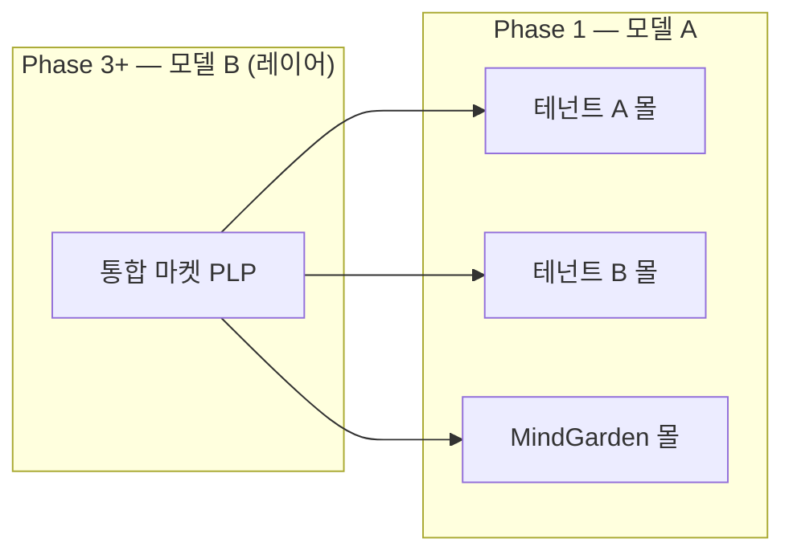
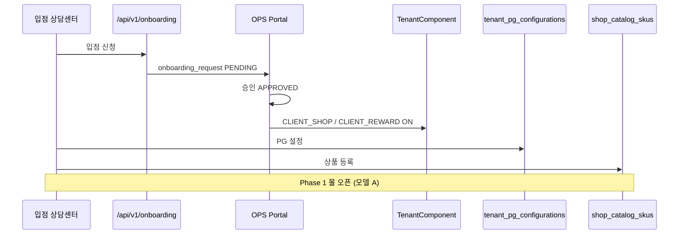
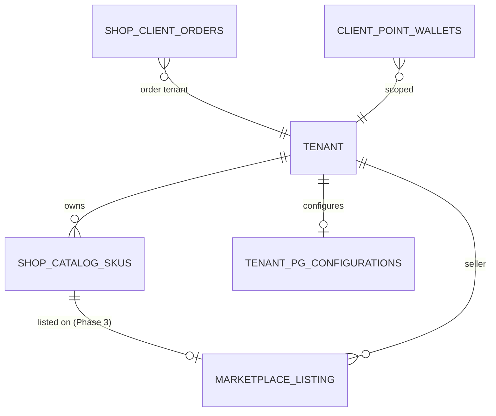
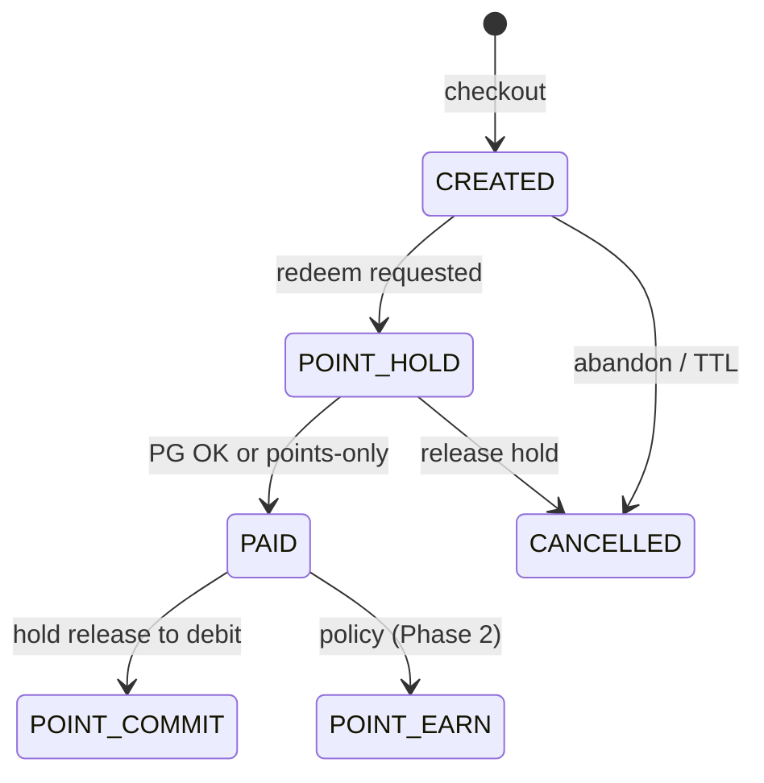
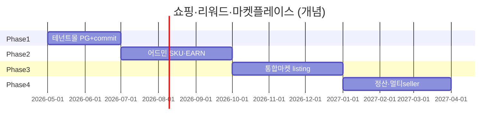

# 멀티테넌트 쇼핑·마켓플레이스 기획 (B2C 상담센터 입점)

| 항목 | 내용 |
|------|------|
| 문서 제목 | 멀티테넌트 쇼핑·마켓플레이스 기획 (B2C 상담센터 입점) |
| 상태 | **SSOT** — 방향성 고정·Phase 1~4 로드맵 |
| 작성일 | 2026-05-19 |
| SSOT 역할 | **입점·테넌트 몰(모델 A)·통합 마켓(모델 B)·데이터·결제·리워드·위임**의 단일 기획 문서 |
| 오케스트레이션 | [SHOP_REWARD_PLATFORM_ORCHESTRATION.md](./SHOP_REWARD_PLATFORM_ORCHESTRATION.md) — 쇼핑·리워드 엔진·MVP·첫 coder 배치 |
| 위임 규칙 | [CORE_PLANNER_DELEGATION_ORDER.md](./CORE_PLANNER_DELEGATION_ORDER.md) — 구현=core-coder, 검증=core-tester 게이트 |

---

## §0 방향성 고정 (불변 원칙)

아래 7원칙은 본 과제·연계 문서·구현 배치에서 **예외 없이** 유지한다. Phase·우선순위가 바뀌어도 **원칙은 변경하지 않는다.**

| # | 원칙 | 요지 |
|---|------|------|
| **P1** | **Core Solution = 플랫폼 엔진** | 코드·DB·API·주문·포인트 원장·PG/ERP 훅은 **플랫폼** 책임. 모든 영속·API에 **`tenant_id` 격리 필수**. |
| **P2** | **MindGarden = 첫 adopter + 브랜드** | MindGarden은 **유일한 테넌트가 아님**. 다른 상담센터 **입점 = 신규 `tenant` 행** + 설정·브랜딩. |
| **P3** | **쇼핑몰 + 리워드 동시 진행** | 체크아웃·PG·hold/commit·적립(EARN)은 **한 파이프라인**으로 설계·위임 ([SHOP_REWARD](./SHOP_REWARD_PLATFORM_ORCHESTRATION.md) §4). |
| **P4** | **테넌트(상담센터)마다 상이** | 상품·상담 프로그램 노출, PG, 리워드 정책, 브랜딩은 **테넌트별 설정** — 하드코딩·MindGarden 전용 포크 금지. |
| **P5** | **구현 순서: 테넌트 몰 → 통합몰** | Phase 1 **테넌트 단위 몰**(모델 A, `shop_catalog_skus.tenant_id` 스코프) 완성 → Phase 3+ **통합 마켓플레이스**(모델 B)는 **추가 레이어**이지 엔진 재작성 아님. |
| **P6** | **금지** | MindGarden 전용 포크, SKU/금액 하드코딩, **tenantId 없는 API·쿼리**. |
| **P7** | **B2B 컴포넌트 마켓과 구분** | [COMPONENT_MARKETPLACE_SYSTEM.md](./2025-12-03/COMPONENT_MARKETPLACE_SYSTEM.md) = **B2B SaaS 컴포넌트 구독**(어드민 ERP·통계 애드온). **본 문서** = **B2C 내담자용 상담센터 입점·상품 마켓**. 용어·API 경로 혼동 금지(§12). |

---

## §1 비즈니스 시나리오

### 1.1 액터

| 액터 | 역할 | 주요 목표 |
|------|------|-----------|
| **입점 상담센터(판매자 테넌트)** | B2C 상품·상담 프로그램 판매 주체 | 온보딩·SKU·PG·리워드 정책·브랜딩 설정 후 자체 몰 운영 |
| **내담자(구매자)** | 해당 테넌트(또는 통합몰)에서 구매·포인트 사용 | 카탈로그 탐색 → 체크아웃 → 결제 → fulfillment(회기·검사) |
| **HQ / 플랫폼 운영(OPS)** | 입점 심사·테넌트 활성화·분쟁·정산 정책 | `onboarding_request` 승인, 컴포넌트 플래그, (Phase 3+) 수수료·정산 |
| **MindGarden 테넌트** | **첫 adopter** — 동일 엔진의 설정·UX 레퍼런스 | Phase 1 MVP 검증·디자인·E2E 기준 테넌트 |

### 1.2 대표 시나리오 (모델 A — Phase 1)

| ID | 시나리오 | 흐름 요약 |
|----|----------|-----------|
| **S-A1** | 신규 상담센터 입점 | 신청 → OPS 승인 → `tenant` 생성 → `CLIENT_SHOP`/`CLIENT_REWARD` 활성화 → PG 설정 → SKU 등록 → 서브도메인/테넌트 컨텍스트로 몰 오픈 |
| **S-A2** | 내담자 단일 테넌트 구매 | 테넌트 A 컨텍스트 PLP → 장바구니 → 체크아웃(hold) → PG 또는 포인트 전액 → `PAID` → commit → (정책) EARN |
| **S-A3** | MindGarden과 동일 엔진, 다른 브랜드 | 테넌트 B는 MindGarden과 **동일 API**·**다른** `shop_catalog_skus`·배너·약관·PG MID |
| **S-A4** | OPS 비활성 | `CLIENT_SHOP` off → API 403 또는 빈 카탈로그 + UI 숨김 ([SHOP_REWARD](./SHOP_REWARD_PLATFORM_ORCHESTRATION.md) §7) |

### 1.3 대표 시나리오 (모델 B — Phase 3+, 설계만)

| ID | 시나리오 | 흐름 요약 |
|----|----------|-----------|
| **S-B1** | 통합 PLP에서 여러 센터 상품 탐색 | 플랫폼 홈/마켓 → `marketplace_listing` 기반 검색·필터 → PDP에 **판매자(테넌트) 표시** |
| **S-B2** | 단일 체크아웃, 단일 판매자 | 장바구니 라인은 **동일 `seller_tenant_id`만** 허용(기본). 결제·원장·PG는 해당 테넌트 스코프 |
| **S-B3** | (후속·미정) 멀티 판매자 한 번에 결제 | Phase 3 **기본 제외** — 분할 PG·정산·주문 분할 설계 별도 의사결정(§9·§13) |

---

## §2 두 가지 노출 모델 비교

| 구분 | **모델 A: 테넌트 단위 몰** | **모델 B: 플랫폼 통합 마켓플레이스** |
|------|---------------------------|-------------------------------------|
| **정의** | 서브도메인·`X-Tenant-Id`·세션 컨텍스트로 **자기 카탈로그만** 노출 | 한 PLP/검색에 **여러 tenant SKU** 노출, **판매자 = tenant** |
| **Phase** | **MVP · Phase 1~2** (현재 DB·API 골격과 정합) | **Phase 3+** (추가 테이블·인덱스·UI 레이어) |
| **카탈로그 API** | `GET /api/v1/clients/me/shop/catalog` (tenant 스코프) | 통합 검색 API + `marketplace_listing` (신규, 설계만) |
| **체크아웃** | 단일 `tenant_id` 주문·단일 PG 설정 | 기본: **주문당 단일 seller**; 멀티 seller 장바구니는 후속 |
| **브랜딩** | 테넌트 전용 로고·카피·약관 | 플랫폼 브랜드 + 판매자 뱃지(미정: MindGarden 허브 vs white-label) |
| **엔진 변경** | **없음** — `shop_catalog_skus.tenant_id` 활용 | **엔진 재작성 없음** — listing·검색·수수료 메타 **추가** |
| **리스크** | 테넌트별 PG·정책 누락 | 크로스 테넌트 포인트·분할정산·검색 품질 |

**권고**: Phase 1~2는 **모델 A만** 구현·검증. 모델 B 착수 전 §9 체크리스트 통과.

---

## §3 입점(Onboarding) 플로우

### 3.1 기존 온보딩 API·OPS 연계

| 단계 | 주체 | 시스템·산출물 |
|------|------|----------------|
| 1. 신청 | 상담센터 담당자 | `POST /api/v1/onboarding/*` — 사업자 정보·서브도메인·요금제(해당 시) |
| 2. 심사 | OPS | `onboarding_request` 상태 `PENDING` → `APPROVED` / `ON_HOLD` |
| 3. 테넌트 프로비저닝 | 플랫폼 | `tenant` 행·기본 RBAC·서브도메인 DNS(운영) |
| 4. 컴포넌트 활성화 | OPS 또는 자동화 | `TenantComponent`: **`CLIENT_SHOP`**, **`CLIENT_REWARD`** (및 Phase 2 `ADMIN_SHOP_CATALOG`) |
| 5. PG 설정 | 테넌트 어드민 | `tenant_pg_configurations` — MID·키·콜백(비밀은 vault/설정, 하드코딩 금지) |
| 6. 카탈로그 | 테넌트 어드민 | `shop_catalog_skus` CRUD·노출 — tenant 스코프 |
| 7. 오픈 | — | 내담자 URL: `{subdomain}.core-solution.co.kr` 또는 앱 내 tenant 컨텍스트 |

### 3.2 입점 완료 정의 (체크리스트)

| # | 항목 | 완료 기준 |
|---|------|-----------|
| O1 | 테넌트 ID 발급 | 모든 후속 API에 tenant 전달 가능 |
| O2 | `CLIENT_SHOP` 활성 | 카탈로그 API 200·빈 목록이 아닌 경우 SKU ≥1 |
| O3 | PG | 스테이징 결제 1건 성공(해당 테넌트 MID) |
| O4 | 리워드(선택) | `CLIENT_REWARD` on 시 정책 키 기본값 시드 |
| O5 | 브랜딩 | 로고·약관 URL 설정(하드코딩 0건) |

---

## §4 데이터 모델

### 4.1 현재 구현·스키마 (Phase 1 기준)

| 테이블·개념 | tenant 스코프 | 용도 |
|-------------|---------------|------|
| `shop_catalog_skus` | **`tenant_id` NOT NULL** | SKU·`unit_price_minor`·노출·fulfillment 타입 |
| `shop_carts` / `shop_cart_lines` | tenant + client | 장바구니 |
| `shop_client_orders` / `shop_client_order_lines` | tenant + client | 주문·스냅샷 |
| `client_point_wallets` / `client_point_ledger_entries` | tenant + client | 포인트 원장·hold/commit |
| `tenant_pg_configurations` | **tenant** | PG MID·프로바이더·활성 플래그 |
| `ComponentCatalog` / `TenantComponent` | tenant | `CLIENT_SHOP`, `CLIENT_REWARD` 등 on/off |

**마이그레이션 참고**: `V20260514_003__client_shop_cart_order_points_mvp.sql` ([SHOP_REWARD](./SHOP_REWARD_PLATFORM_ORCHESTRATION.md) §3.1).

### 4.2 통합 마켓플레이스 추가 개념 (Phase 3 — 설계만, DDL 미확정)

| 개념 | 제안 필드·역할 | 비고 |
|------|----------------|------|
| **`marketplace_listing`** | `id`, `seller_tenant_id`, `sku_id`, `display_rank`, `platform_category`, `is_active` | SKU를 플랫폼 PLP에 **노출할지** 메타 (SKU 자체는 tenant 소유 유지) |
| **`seller_tenant_id`** | 주문·정산·listing에서 **판매 주체** 명시 | 주문 라인에 denormalize 권장 |
| **수수료** | `platform_fee_bps`, `fee_settlement_batch_id` (안) | HQ↔판매자 정산 — §5·§13 의사결정 후 DDL |
| **통합 검색 인덱스** | OpenSearch/DB FTS — `title`, `tenant_display_name`, `category` | 테넌트 경계는 **인덱스 필터**로 유지, 결과는 listing 허용 SKU만 |

---

## §5 결제·정산

### 5.1 결제 모델 비교

| 모델 | 설명 | Phase | 테넌트 PG | 플랫폼 PG | 분할정산 |
|------|------|-------|-----------|-----------|----------|
| **T-PG** | **테넌트 PG** — 결제 대금이 입점 센터 MID로 직접 | **1 (MVP)** | ✅ 주 | — | 센터↔PG 직접; 플랫폼 수수료는 별도 청구(미정) |
| **P-PG** | **플랫폼 PG** — 단일 MID 후 판매자에게 정산 | 3+ 옵션 | — | ✅ | 플랫폼이 seller별 ledger·배치 정산 필요 |
| **SPLIT** | PG **분할정산** (Toss 등 지원 시) | 3+ 옵션 | 부분 | ✅ | 주문 라인별 fee 자동 — 법무·계약 선행 |

### 5.2 Phase 1 권고

- **T-PG(테넌트 PG)** 만 구현·검증. `tenant_pg_configurations` + 기존 `prepare-payment` 경로.
- 통합몰(모델 B) 오픈 시에도 **기본은 주문 단위 단일 seller + 해당 seller의 PG** 유지.

### 5.3 정산·수수료 (의사결정 보류)

| 항목 | Phase 1 | Phase 3+ |
|------|---------|----------|
| 플랫폼 수수료율 | 문서·계약만 | `platform_fee_bps` 테이블화 |
| 환불·차지백 | 테넌트 PG 정책 | 분할정산 시 규칙 별도 |
| ERP INCOME | 기존 `confirm-payment`·주문 연동 ([ONLINE_PAYMENT](./ONLINE_PAYMENT_CATALOG_CHECKOUT_SPEC.md) §5) | seller별 대사 리포트 |

---

## §6 리워드

### 6.1 테넌트별 정책 (모델 A·B 공통)

- 적립률·사용 한도·SKU 블록리스트 등은 **테넌트 정책 테이블**(후속) — [POINT_REWARD](./POINT_REWARD_EARN_AND_REDEEM_SPEC.md) §3.
- 원장·hold/commit은 **주문 `tenant_id`** 와 동일 스코프.

### 6.2 크로스 테넌트 포인트

| 정책 | 내용 |
|------|------|
| **기본** | **크로스 테넌트 포인트 사용·적립·이전 불가** — 지갑은 `(tenant_id, client_id)` 단위 |
| **통합몰(모델 B)** | 다른 seller 상품 결제 시 **타 테넌트 포인트로 할인 불가**(기본). 예외는 §9·§13에서 **미정**으로만 표기 |
| **플랫폼 통합 포인트** | 별도 에픽·법무 검토 — **Phase 3 기본 범위 외** |

### 6.3 쇼핑+리워드 파이프라인 (불변)

상세: [POINT_REWARD §4](./POINT_REWARD_EARN_AND_REDEEM_SPEC.md), [SHOP_REWARD §3 갭](./SHOP_REWARD_PLATFORM_ORCHESTRATION.md).

---

## §7 UX 채널

| 채널 | Phase 1 | Phase 2+ | 비고 |
|------|---------|----------|------|
| **웹 내담자** | PLP·체크아웃·포인트 (`/client/shop-checkout` 등) | PDP·내 구매·정식 디자인 | 테넌트 브랜딩·토큰 |
| **Expo** | 체크아웃 또는 잔액 1화면 | shop 전용 라우트 트리 | [SHOP_REWARD §6](./SHOP_REWARD_PLATFORM_ORCHESTRATION.md) |
| **테넌트 어드민** | — | SKU·가격·노출 CRUD | AdminCommonLayout |
| **OPS** | 온보딩 승인·컴포넌트 토글 | (P3) listing·수수료 | backend-ops |

**모델 B UI**: 통합 PLP·판매자 뱃지·필터 — **core-designer** Phase 3 (`gemini-3.1-pro` 권장).

---

## §8 Phase 로드맵 (1~4)

쇼핑·리워드 **병렬 트랙** — [SHOP_REWARD §4](./SHOP_REWARD_PLATFORM_ORCHESTRATION.md)와 정합.

| Phase | 쇼핑 트랙 | 리워드 트랙 | 마켓플레이스 |
|-------|-----------|-------------|--------------|
| **1** | 테넌트 몰 MVP: 카탈로그·체크아웃·**PG PAID→commit** | hold·포인트 전액·잔액 API | **모델 A만** — 다센터 입점은 **설정·온보딩**으로 가능, UI는 테넌트별 URL |
| **2** | PDP·어드민 SKU·fulfillment·EARN | 정책 CRUD·적립 엔진 | 동일 |
| **3** | **통합 PLP·listing·검색** (모델 B 레이어) | 통합몰에서 포인트 정책 재확인 | **E-AGG** |
| **4** | 분할정산·멀티 seller(선택)·환불 고도화 | clawback·대사 | 운영·법무 완료 후 |

---

## §9 MVP vs 통합몰 의사결정 체크리스트

통합 마켓(모델 B) 착수 전 **모두 Yes** 또는 명시적 예외 승인 필요.

| # | 질문 | Pass 기준 |
|---|------|-----------|
| D1 | Phase 1 테넌트 몰에서 **2개 이상 tenant** 스테이징 E2E(각 PG) 성공? | Yes |
| D2 | `CLIENT_SHOP`·`tenant_pg_configurations` 온보딩 Runbook 문서화? | Yes |
| D3 | PG PAID→hold→commit **멱등** 프로덕션급? | Yes ([SHOP_REWARD §10](./SHOP_REWARD_PLATFORM_ORCHESTRATION.md)) |
| D4 | 크로스 테넌트 포인트 **불가**가 제품·법무에 합의? | Yes ([POINT_REWARD §0.1](./POINT_REWARD_EARN_AND_REDEEM_SPEC.md)) |
| D5 | 통합 PLP **브랜드** (MindGarden 허브 vs white-label) 결정? | §13 |
| D6 | 수수료·정산 모델(T-PG vs P-PG vs SPLIT) 결정? | §13 |
| D7 | 멀티 seller 단일 체크아웃 필요 여부? | 기본 **No** — 필요 시 별도 에픽 |

---

## §10 갭·의존성

### 10.1 SHOP_REWARD §3 갭 연계

| 갭 ID | 설명 | 본 문서 Phase |
|-------|------|---------------|
| G1 | PG PAID → hold→commit | **1** — 입점 센터 공통 |
| G4 | 어드민 SKU CRUD | **2** — 입점 센터 self-service |
| G5 | 테넌트 포인트 정책 | **2** |
| G8 | `CLIENT_SHOP` 시드 | **1** — 온보딩 §3 |
| G9 | Expo shop | **2~3** |
| **G10 (신규)** | `marketplace_listing`·통합 검색 | **3** |
| **G11 (신규)** | 플랫폼 수수료·정산 배치 | **3~4** |

### 10.2 문서·구현 의존성

| 선행 | 후행 |
|------|------|
| [ONLINE_PAYMENT](./ONLINE_PAYMENT_CATALOG_CHECKOUT_SPEC.md) 체크아웃·주문 상태 | 통합몰 체크아웃 분기(Phase 3) |
| [POINT_REWARD](./POINT_REWARD_EARN_AND_REDEEM_SPEC.md) hold/commit | 모든 테넌트 몰 |
| `/api/v1/onboarding` + OPS | 입점 |
| [CORE_PLANNER_DELEGATION_ORDER](./CORE_PLANNER_DELEGATION_ORDER.md) | 모든 coder 배치 |

---

## §11 서브에이전트 분배

위임 규칙: **[CORE_PLANNER_DELEGATION_ORDER.md](./CORE_PLANNER_DELEGATION_ORDER.md)** — 메인/채팅 **직접 코드 수정 금지**, 변경 시 **core-tester** 게이트.

| Phase | 담당 | 목표 | 비고 |
|-------|------|------|------|
| **P1** | **core-coder** | Shop P1: PG PAID→commit ([SHOP_REWARD §10](./SHOP_REWARD_PLATFORM_ORCHESTRATION.md)) | **첫 배치 변경 없음** |
| P1 | core-designer (`gemini-3.1-pro`) | 테넌트 몰 PLP·체크아웃 와이어 | 병렬 가능 |
| P2 | core-coder | 어드민 SKU·다 tenant 시드·온보딩 Runbook 연동 | 입점 self-service |
| **P3** | **core-designer** + **core-coder** | 통합 마켓 PLP·listing API·판매자 UI | **E-AGG** |
| P4 | core-coder + (법무/운영 입력) | 분할정산·정산 배치 | 선택 |
| 전 구간 | **core-tester** | tenant 교차·온보딩→결제 E2E·멱등 | P1 완료 전 착수 |

**입점(E-MKT)**: Phase 1~2는 **온보딩·컴포넌트·PG·SKU** 문서·OPS 절차 중심 — 전용 coder 배치는 P2 어드민 SKU와 묶음.

---

## §12 용어집·문서 충돌 방지

### 12.1 핵심 용어

| 용어 | 정의 |
|------|------|
| **입점** | 신규 **상담센터 tenant** 프로비저닝 + 몰·리워드 활성화 |
| **테넌트(tenant)** | 멀티테넌트 격리 단위; MindGarden 포함 **N≥1** |
| **판매자(seller)** | B2C 상품 판매 주체 = **tenant** (모델 B에서 `seller_tenant_id`) |
| **구매자** | 내담자 `client` — tenant·client 복합 스코프 |
| **테넌트 몰** | 모델 A — 단일 tenant 카탈로그 |
| **통합 마켓플레이스** | 모델 B — 플랫폼 PLP에 복수 tenant SKU |

### 12.2 B2B vs B2C 문서·API 구분 (필수)

| 구분 | B2B 컴포넌트 구독 마켓 | B2C 상담센터 쇼핑 마켓 (본 SSOT) |
|------|------------------------|----------------------------------|
| **문서** | [COMPONENT_MARKETPLACE_SYSTEM.md](./2025-12-03/COMPONENT_MARKETPLACE_SYSTEM.md) | **본 문서** |
| **대상 사용자** | 테넌트 **관리자** (어드민) | **내담자** (웹·Expo) |
| **상품** | ERP·통계·AI 애드온 **구독 패키지** | 상담 패키지·검사·회기 **SKU** |
| **API 예시** | `/api/v1/marketplace/packages` | `/api/v1/clients/me/shop/*` |
| **DB 예시** | `component_packages`, 구독 | `shop_catalog_skus`, `shop_client_orders` |
| **결제** | B2B 청구·구독 | PG·포인트·hold/commit |

---

## §13 기획 산출 — 에픽·우선순위·잔여 의사결정

### 13.1 에픽

| 에픽 ID | 명칭 | Phase | 범위 |
|---------|------|-------|------|
| **E-MKT** | 입점·테넌트 몰 운영 | 1~2 | 온보딩, `CLIENT_SHOP`/`CLIENT_REWARD`, PG, SKU, 테넌트 브랜딩, 모델 A E2E |
| **E-AGG** | 통합 마켓플레이스 | 3+ | `marketplace_listing`, 통합 PLP·검색, seller 표시, (선택) 수수료 |
| *(기존)* **E1~E4** | [SHOP_REWARD §9](./SHOP_REWARD_PLATFORM_ORCHESTRATION.md) | 1~3 | PG·웹·리워드·Expo — **우선순위 유지** |

### 13.2 첫 구현 배치 (변경 없음)

**Shop P1 — PG PAID 웹훅 및 포인트 hold→commit 연동** ([SHOP_REWARD §10](./SHOP_REWARD_PLATFORM_ORCHESTRATION.md)).  
본 SSOT는 **문서 우선**이며, 코드 착수 순서는 기존 오케스트레이션과 동일.

### 13.3 잔여 의사결정 (3~5)

| # | 주제 | 옵션 | 권고 시점 |
|---|------|------|-----------|
| 1 | **플랫폼 수수료율** | % / 고정 / 구독만 | Phase 3 전 |
| 2 | **통합몰 브랜드** | MindGarden 허브 vs 완전 white-label | Phase 3 전 (D5) |
| 3 | **정산 모델** | T-PG 유지 vs P-PG vs SPLIT | Phase 3~4 |
| 4 | **멀티 seller 단일 체크아웃** | 불허(기본) vs 허용 | 필요 시만 별도 에픽 |
| 5 | **통합몰 포인트 예외** | 전부 불가 유지 vs 플랫폼 포인트 | **미정** — 법무·회계 |

---

## §14 개정 이력

| 날짜 | 내용 |
|------|------|
| 2026-05-19 | 초판 — 방향성 7원칙·모델 A/B·입점·데이터·Phase 1~4·에픽 E-MKT/E-AGG (core-planner) |

---

## 참조 링크

| 문서 | 용도 |
|------|------|
| [SHOP_REWARD_PLATFORM_ORCHESTRATION.md](./SHOP_REWARD_PLATFORM_ORCHESTRATION.md) | 엔진·갭·첫 coder 배치 |
| [ONLINE_PAYMENT_CATALOG_CHECKOUT_SPEC.md](./ONLINE_PAYMENT_CATALOG_CHECKOUT_SPEC.md) | 체크아웃·PG·ERP |
| [POINT_REWARD_EARN_AND_REDEEM_SPEC.md](./POINT_REWARD_EARN_AND_REDEEM_SPEC.md) | 포인트·크로스 테넌트 |
| [CORE_PLANNER_DELEGATION_ORDER.md](./CORE_PLANNER_DELEGATION_ORDER.md) | 위임·테스터 게이트 |
| [2025-12-03/COMPONENT_MARKETPLACE_SYSTEM.md](./2025-12-03/COMPONENT_MARKETPLACE_SYSTEM.md) | B2B 구분용 |
