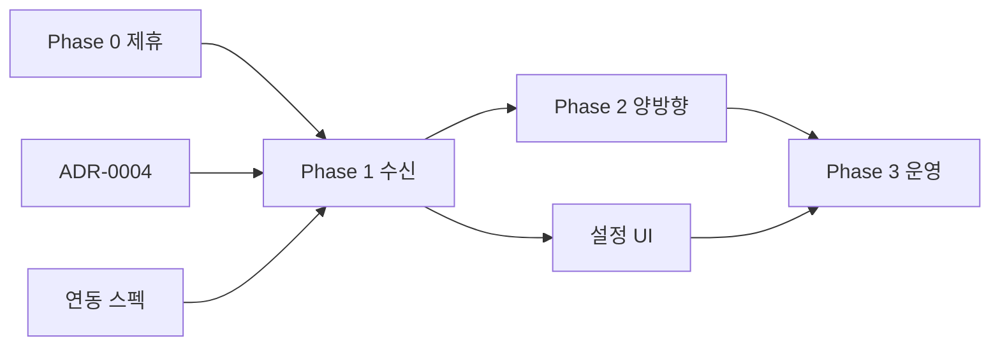

# 네이버 플레이스 예약 연동 — 구현 로드맵

**목적**: 네이버 스마트플레이스 예약 연동을 **Phase 0(제휴 블로커)~Phase 3(운영)** 까지 추적 가능한 단일 로드맵.  
**범위**: 서브에이전트 분배·선행 조건·완료 기준·리스크. 코드 없음.  
**SSOT 쌍**: [ADR-0004](../adr/adr-0004-external-booking-channel-naver-place-adapter.md), [연동 스펙](../standards/EXTERNAL_BOOKING_CHANNEL_ADAPTER_SPEC.md), [제휴 체크리스트](./NAVER_PLACE_BOOKING_PARTNERSHIP_ORCHESTRATION_CHECKLIST.md).

**작성일**: 2026-07-06  
**주관**: core-planner  
**상태**: Proposed

---

## 1. 요약

| Phase | 목표 | 블로커 | MindGarden SSOT |
|-------|------|--------|-----------------|
| **0** | 제휴·API/웹훅 스펙·샌드박스 | **네이버 파트너십** | 문서·ADR만 |
| **1** | 단방향 수신(네이버→일정) | Phase 0 | `schedules` |
| **2** | 양방향(슬롯·취소 푸시) | Phase 1 + 충돌 정책 PO | `schedules` + 채널 미러 |
| **3** | 운영·모니터링·온보딩 | Phase 2(최소 1 테넌트) | + sync logs·가이드 |

---

## 2. Phase 0 — 제휴·스펙 확보 (블로커)

### 목표

네이버 스마트플레이스 **공식 연동 채널** 확보, 웹훅/API 스펙·샌드박스·검수 절차 SSOT화.

### 담당

| 역할 | 서브에이전트 | 산출 |
|------|--------------|------|
| 코드·문서 갭 | explore | 인벤토리(체크리스트 §2) |
| 아키텍처·문서 | core-planner | ADR-0004 Accepted, 본 로드맵, 체크리스트 |
| 제휴·계약 | PO / 법무 | NDA·파트너 계약 |
| UI 요구 | core-planner + 기획 | [설정 UI 요구](../planning/NAVER_PLACE_BOOKING_SETTINGS_UI_REQUIREMENTS.md) |

### 선행 조건

- 없음(프로젝트 착수)

### 완료 기준

- [ ] 네이버 **샌드박스** 웹훅 1건 수신 가능(또는 공식 시뮬레이터)
- [ ] 스펙 문서 URL/PDF 저장소·체크리스트 §1 전항
- [ ] [ADR-0004](../adr/adr-0004-external-booking-channel-naver-place-adapter.md) **Accepted**
- [ ] PO: 가예약 기본값·Phase 1 이중 예약 운영 방침

### 리스크

| 리스크 | 영향 | 완화 |
|--------|------|------|
| 제휴 지연·거절 | 전 Phase 블록 | Phase 0만 문서·인터페이스 skeleton; 대체 채널 검토는 별도 ADR |
| 스펙 변경 | 재작업 | 어댑터 추상화·버전 필드 `metadata_json` |
| 업종 제한 | 일부 테넌트 제외 | 테넌트별 feature flag |

---

## 3. Phase 1 — 단방향 수신 (네이버 → MindGarden)

### 목표

웹훅 **예약 확정(및 취소 최소)** → `createConsultantSchedule` / 취소 API → `external_booking_id` 저장.

### 담당

| 순서 | 서브에이전트 | 작업 |
|------|--------------|------|
| 1 | core-coder | Flyway §4, `InboundWebhookHandler`, NAVER_PLACE, 멱등 |
| 2 | core-tester | 멱등·tenant 격리·422·CONFLICT ([스펙 §7](../standards/EXTERNAL_BOOKING_CHANNEL_ADAPTER_SPEC.md)) |
| 3 | core-designer | 설정 화면 SCREEN_SPEC |
| 4 | core-coder | Admin FE 연동·매핑 CRUD |
| 5 | core-tester | ADMIN/STAFF E2E 스모크 |

### 선행 조건

- Phase 0 완료
- [INTEGRATED_SCHEDULE](../project-management/INTEGRATED_SCHEDULE_RESERVE_FIRST_PAY_LATER_ORCHESTRATION.md) P0 게이트와 **회귀 충돌 없음** 확인

### 완료 기준

- [ ] 샌드박스 웹훅 → `schedules` 1건 + `booking_sync_logs SUCCESS`
- [ ] 중복 웹훅 → 일정 1건 유지
- [ ] 매핑 없음 → 422, 일정 없음
- [ ] 캘린더 **NAVER_PLACE** 뱃지(ADMIN)
- [ ] 하드코딩·tenantId 게이트 Green

### 리스크

| 리스크 | 완화 |
|--------|------|
| **이중 예약**(네이버 오픈 vs 앱 BOOKED) | PO: Phase 1 운영 수동 마감; Phase 2 일정 명시 |
| 내담자 자동 매핑 실패 | CS 플레이북; 신규 client 생성 정책 PO |
| `validateRemainingSessions` 거절 | sync log + 알림; 네이버 쪽 취소는 Phase 2 |

---

## 4. Phase 2 — 양방향 (슬롯 푸시·취소 동기화)

### 목표

앱 가용 슬롯·취소·변경 → `OutboundSlotSync` + 아웃박스; ADR-0004 **충돌 정책** 구현.

### 담당

| 순서 | 서브에이전트 | 작업 |
|------|--------------|------|
| 1 | core-planner | 충돌 정책 PO 워크숍 → ADR-0004 부록 갱신 |
| 2 | core-coder | OutboundSlotSync, outbox worker, cancel/update 연동 |
| 3 | core-debugger | CONFLICT 재현·타임라인(선택) |
| 4 | core-tester | 양방향 E2E·충돌 케이스 1건+ |

### 선행 조건

- Phase 1 Green
- 네이버 **아웃바운드 API** 스펙(Phase 0) + OAuth 스코프 운영

### 완료 기준

- [ ] 앱 BOOKED → 네이버 슬롯 unavailable 반영(샌드박스)
- [ ] 앱 취소 → 네이버 예약 취소 API 성공 1건
- [ ] 충돌 1건 → `sync_status=CONFLICT` + 로그 UI 표시
- [ ] 아웃박스 재시도·dead-letter 알림

### 리스크

| 리스크 | 완화 |
|--------|------|
| Last-write-wins vs 회기([ADR-0002](../adr/adr-0002-session-remaining-and-mapping-status-transitions.md)) | PO 확정 정책 B(우선순위 매트릭스) 권장 |
| 아웃바운드 API 불안정 | 아웃박스·수동 재시도 UI |

---

## 5. Phase 3 — 운영·모니터링·테넌트 온보딩

### 목표

프로덕션 go-live, OPS 대시보드, tenant-guides, 다테넌트 롤아웃.

### 담당

| 순서 | 서브에이전트 | 작업 |
|------|--------------|------|
| 1 | core-deployer | Flyway prod, Secrets, 웹훅 URL, feature flag |
| 2 | core-coder | 모니터링 메트릭·알림 hook |
| 3 | core-planner | `docs/tenant-guides/naver-place-booking-onboarding.md` |
| 4 | core-tester | prod 스모크(제휴 샌드→prod 전환 체크) |

### 선행 조건

- Phase 2 완료 또는 PO 승인 **Phase 1 only go-live**(양방향 off)
- [PRE_PRODUCTION_GO_LIVE_CHECKLIST.md](../운영반영/PRE_PRODUCTION_GO_LIVE_CHECKLIST.md)

### 완료 기준

- [ ] pilot 테넌트 1곳 prod 연동 2주 무장애(정의: CONFLICT 수동 처리 SLA 내)
- [ ] OPS runbook + CS 플레이북 링크
- [ ] ONGOING_WORK 마스터 체크리스트 **Done**

### 리스크

| 리스크 | 완화 |
|--------|------|
| 다테넌트 Secrets 오설정 | connectionId·tenant 유니크 검증 + OPS 더블체크 |
| 웹훅 URL 노출·남용 | 서명 필수·rate limit |

---

## 6. 분배실행 표 (통합)

| ID | Phase | 작업 | 담당 | 선행 | 완료 기준(한 줄) |
|----|-------|------|------|------|------------------|
| N0-1 | 0 | 제휴·NDA | PO | — | 샌드박스 계정 |
| N0-2 | 0 | ADR·스펙·체크리스트 | core-planner | — | ADR Accepted |
| N1-1 | 1 | BE 웹훅·어댑터 | core-coder | N0-1 | 웹훅→일정 1건 |
| N1-2 | 1 | BE 테스트 | core-tester | N1-1 | 멱등·tenant Green |
| N1-3 | 1 | FE 설정·뱃지 | core-coder | N1-1, designer | ADMIN 매핑 CRUD |
| N1-4 | 1 | UI 스펙 | core-designer | N0-2 | SCREEN_SPEC |
| N2-1 | 2 | Outbound·아웃박스 | core-coder | N1-2 | 슬롯 푸시 1건 |
| N2-2 | 2 | 충돌·E2E | core-tester | N2-1 | CONFLICT 케이스 |
| N3-1 | 3 | prod 배포 | core-deployer | N2-2 or PO | go-live 체크 |
| N3-2 | 3 | 온보딩 가이드 | core-planner | N3-1 | tenant-guides |

---

## 7. 의존 관계 (Mermaid)

---

## 8. References

- [ADR-0001~0003](../adr/README.md) — 일정·회기·경계
- [`ScheduleServiceImpl.createConsultantSchedule`](../src/main/java/com/coresolution/consultation/service/impl/ScheduleServiceImpl.java)
- [CORE_PLANNER_DELEGATION_ORDER.md](./CORE_PLANNER_DELEGATION_ORDER.md)
