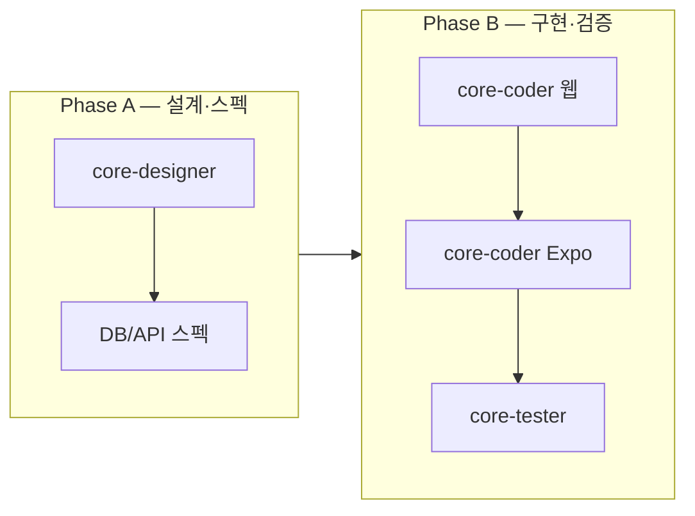

# 쇼핑 카탈로그 UX MVP+ 오케스트레이션

| 항목 | 내용 |
|------|------|
| 문서 제목 | 어드민 상품 등록 UX MVP+ — SKU 자동·전용 화면·이미지·내담자 PLP/PDP 상향 |
| 상태 | **기획 확정 · 구현 대기** — 코드 변경 없음(본 문서만) |
| 작성일 | 2026-05-19 |
| SSOT 역할 | **Phase A/B 분배·서브에이전트 위임·완료 조건·운영 게이트**의 단일 오케스트레이션 |
| 상위 SSOT | [SHOP_REWARD_PLATFORM_ORCHESTRATION.md](./SHOP_REWARD_PLATFORM_ORCHESTRATION.md) · [MULTI_TENANT_SHOP_MARKETPLACE_SPEC.md](./MULTI_TENANT_SHOP_MARKETPLACE_SPEC.md) |
| 위임 규칙 | [CORE_PLANNER_DELEGATION_ORDER.md](./CORE_PLANNER_DELEGATION_ORDER.md) — 구현=`core-coder`, 검증=`core-tester` 게이트 |

---

## §0 목표·배경

### 0.1 사용자 관점 (§0.4 우선)

| 항목 | 현재(MVP) | MVP+ 목표 |
|------|-----------|-----------|
| **사용성** | 어드민이 SKU 코드를 직접 입력·모달 한 화면에서 등록/수정 | **목록 ↔ 등록/수정 전용 화면** 분리, SKU는 **서버 자동 생성**(수정 시 읽기 전용), 대표 이미지 **최소 1장** 필수 |
| **정보 노출** | 내담자 PLP/PDP는 텍스트·가격만 (`SkuCard`, `ShopSkuDetailPage`) | **동일 API 필드**로 웹·Expo PLP/PDP에 썸네일·히어로 이미지 노출; 이미지 없는 SKU는 **어드민 저장 차단**·클라이언트는 placeholder |
| **레이아웃** | `AdminShopCatalogSkusPage` — 테이블 + `UnifiedModal` | **AdminCommonLayout** + 목록(ContentHeader·카드/테이블) + **상세/등록 풀페이지 폼**(이미지 업로드 영역 상단) |

**한 줄**: 입점 상담센터 어드민이 **이미지 있는 상품을 빠르게 등록**하고, 내담자(웹·앱)가 **동일 품질의 PLP/PDP**를 본다.

### 0.2 코드베이스 현황 (2026-05-19 확인)

| 영역 | 경로·사실 |
|------|-----------|
| 어드민 UI | `frontend/src/components/admin/AdminShopCatalogSkusPage.js` — 테이블+모달, `skuCode` 수동 입력 |
| 라우트 | `frontend/src/App.js` — `/admin/shop/catalog-skus` 단일 페이지 |
| 엔티티 | `ShopCatalogSku` — `image` 필드 **없음** (`sku_code`, `title`, `description_text`, 가격·노출·`catalog_category` 등) |
| 어드민 API | `AdminShopCatalogSkuController`, `ShopCatalogSkuUpsertRequest.skuCode` **필수** |
| 내담자 웹 | `frontend/src/components/shop/molecules/SkuCard.js`, `ShopSkuDetailPage.js` — 텍스트 전용 |
| Expo | `expo-app/src/components/shop/molecules/SkuCard.tsx` — 텍스트 전용 |
| E2E | Tier A R10 — admin smoke **PASS**, client catalog→cart **조건부**(OPS·`CLIENT_SHOP` 게이트) |
| 이미지 업로드 선례 | `BrandingController` 로고 업로드, `PsychAssessmentIngestServiceImpl` + `EncryptedFileStorageService` (테넌트 스코프) |

### 0.3 SSOT 링크 (필수 참조)

| 문서 | 역할 |
|------|------|
| [SHOP_REWARD_PLATFORM_ORCHESTRATION.md](./SHOP_REWARD_PLATFORM_ORCHESTRATION.md) | 쇼핑·리워드 엔진·MVP·Flyway·API 골격 |
| [SHOP_REWARD_IMPLEMENTATION_STATUS.md](./SHOP_REWARD_IMPLEMENTATION_STATUS.md) | 구현 현황·R10·Maven/Playwright 게이트 |
| [SHOP_REWARD_CLIENT_UI_DESIGN_HANDOFF.md](./SHOP_REWARD_CLIENT_UI_DESIGN_HANDOFF.md) | 내담자 PLP/PDP Client Theme·와이어 (MVP) — **MVP+ 시안은 본 배치에서 갱신** |
| [SHOP_REWARD_OPS_ACTIVATION_RUNBOOK.md](./SHOP_REWARD_OPS_ACTIVATION_RUNBOOK.md) | Flyway·컴포넌트 activate·시드 |
| [MULTI_TENANT_SHOP_MARKETPLACE_SPEC.md](./MULTI_TENANT_SHOP_MARKETPLACE_SPEC.md) | P1~P7 원칙·`tenant_id`·모델 A |
| [ONLINE_PAYMENT_CATALOG_CHECKOUT_SPEC.md](./ONLINE_PAYMENT_CATALOG_CHECKOUT_SPEC.md) | §6 어드민 상품·가격·노출 |
| [EXPO_SHOP_REWARD_IMPLEMENTATION_STRATEGY.md](./EXPO_SHOP_REWARD_IMPLEMENTATION_STRATEGY.md) | Expo 라우트·API 패리티 |
| [../운영반영/PRE_PRODUCTION_GO_LIVE_CHECKLIST.md](../운영반영/PRE_PRODUCTION_GO_LIVE_CHECKLIST.md) | Go-Live·하드코딩·tenant 게이트 |
| `.cursor/skills/core-solution-multi-tenant` | **tenantId 필수** |
| `.cursor/skills/core-solution-database-first` | DB → API → UI 순 |

---

## §1 범위

### 1.1 포함 (MVP+)

| # | 기능 | 비고 |
|---|------|------|
| F1 | **SKU 코드 자동 생성** | 신규 등록 시 서버 발급; `(tenant_id, sku_code)` UK 유지; 어드민 UI에서 코드 **입력 필드 제거 또는 read-only** |
| F2 | **어드민 목록 + 등록/수정 전용 화면** | 모달 CRUD → 라우트 분리; `AdminCommonLayout`·`AdminTenantComponentGate(ADMIN_SHOP_CATALOG)` 유지 |
| F3 | **대표 이미지 1장 (필수)** | 업로드·미리보기·교체; 저장 시 미등록이면 400; 클라이언트 PLP/PDP 동일 URL |
| F4 | **내담자 웹 PLP/PDP 상향** | `SkuCard` 썸네일, PDP 히어로, placeholder·`safeDisplay` |
| F5 | **Expo PLP/PDP 패리티** | 동일 API·`expo-image`(권장)·테마 토큰 |
| F6 | **Flyway·API·단위·E2E·OPS** | 신규 마이그레이션, admin/client DTO, 시드·런북 갱신 |

### 1.2 제외 (본 배치)

| 항목 | 사유 |
|------|------|
| 다중 이미지 갤러리·동영상 | MVP+는 **대표 1장**만 |
| 재고·일일 처리 한도 UI | [ONLINE_PAYMENT §6](./ONLINE_PAYMENT_CATALOG_CHECKOUT_SPEC.md) 후순위 |
| 통합 마켓(모델 B) | [MULTI_TENANT §8](./MULTI_TENANT_SHOP_MARKETPLACE_SPEC.md) |
| AI 상품 설명·번들·쿠폰 | Tier C / 로드맵 |
| 어드민 외 채널(OPS Portal SKU 일괄) | 테넌트 어드민만 |

### 1.3 영향 영역

| 레이어 | 대상 |
|--------|------|
| DB | `shop_catalog_skus` (+ 이미지 URL/스토리지 메타 컬럼), (선택) Flyway 시드 `seed-shop-demo-catalog.sql` |
| Backend | `AdminShopCatalogSkuServiceImpl`, DTO, (신규) 이미지 업로드 엔드포인트, `ClientShopCatalogServiceImpl` 응답 |
| Web admin | `AdminShopCatalogSkusPage` 분리, 신규 등록/수정 페이지, 상수·서비스 |
| Web client | `SkuCard`, `ShopCatalogPage`, `ShopSkuDetailPage`, CSS·상수 |
| Expo | `SkuCard`, catalog/PDP 화면, API 타입·훅 |
| E2E | `admin-shop-catalog-skus-smoke`, `client-shop-catalog-to-cart` — testid·플로우 갱신 |
| OPS | [SHOP_REWARD_OPS_ACTIVATION_RUNBOOK](./SHOP_REWARD_OPS_ACTIVATION_RUNBOOK.md), 데모 SKU 이미지 |

---

## §2 Phase 개요 — A(설계·스펙) / B(구현·검증)

| Phase | 목표 | 선행 | 병렬 |
|-------|------|------|------|
| **A** | 화면설계서·디자인 핸드오프 + **DB/API 스펙 문서**(DDL·엔드포인트·DTO·검증 규칙) | — | A-1(designer) 완료 후 A-2(DB/API) 착수 권장; explore는 A-2와 **병렬** 가능 |
| **B** | 웹(어드민+내담자) → Expo → 테스트·OPS 문서 | Phase A 산출물 승인 | B-1 내부: BE+FE 동시 가능(coder 1배치); B-2 Expo는 **B-1 API 확정 후** |

**위임 순서 (고정)**: `core-designer` → **DB/API 스펙** → `core-coder`(web admin + client) → `core-coder`(expo) → `core-tester`

---

## §3 Phase A — 설계·DB/API 스펙

### A-1 · core-designer (Task `model: gemini-3.1-pro` 권장)

**산출물**

1. `docs/design-system/SCREEN_SPEC_ADMIN_SHOP_CATALOG_MVP_PLUS.md` — 어드민 목록·등록·수정
2. `docs/design-system/SCREEN_SPEC_CLIENT_SHOP_PLP_PDP_MVP_PLUS.md` — 내담자 웹 PLP/PDP (Expo 공유 IA)
3. (선택) Pencil B0KlA·Client Theme 블록 주석 — 코드 없음

**전달 프롬프트 요약**

- **사용성**: 입점 센터 **ADMIN**이 상품 등록 3분 이내(코드 입력 없음, 이미지 드래그·클릭 업로드, 저장 전 미리보기).
- **정보 노출**: 목록 — 썸네일·상품명·가격·노출·카테고리·정렬; 폼 — SKU 코드(read-only·자동), 필수(title·가격·대표 이미지·catalog_category), 선택(description·sortOrder·active).
- **레이아웃**: 모두 **AdminCommonLayout** children; 목록 `ContentHeader`+[상품 등록]→`/new`; 행 클릭→`/catalog-skus/:id/edit`; 폼 상단 **이미지 업로드 Organism**, 하단 고정 [저장][취소].
- **클라이언트**: [SHOP_REWARD_CLIENT_UI_DESIGN_HANDOFF](./SHOP_REWARD_CLIENT_UI_DESIGN_HANDOFF.md) §2.1·PDP 확장 — 카드 좌측/상단 **16:9 또는 1:1 썸네일**, PDP **히어로**, placeholder 토큰.
- **참조**: B0KlA, `unified-design-tokens.css`, `/core-solution-unified-modal`(목록에서 모달 CRUD **폐기**), `/core-solution-atomic-design`.
- **금지**: 하드코딩 색상·샘플 SKU 코드를 시안에 박지 않기.

**완료 기준**

- [ ] 어드민·클라이언트 화면별 블록·토큰·반응형(카드 그리드) 명시
- [ ] 이미지 없음/로딩/깨짐 placeholder 스펙
- [ ] 코더가 라우트·testid 목록을 추출 가능

---

### A-2 · DB/API 스펙 (explore → generalPurpose 또는 core-coder **문서만**)

**산출물**: `docs/project-management/SHOP_CATALOG_MVP_PLUS_DB_API_SPEC.md`

**explore 선행 (병렬 가능)**

- `ShopCatalogSku`·Flyway `V20260514_003`·`AdminShopCatalogSkuController`·`BrandingController`·`EncryptedFileStorageService` 패턴 인벤토리
- 기존 `shop_catalog_skus` UK·시드 SQL·client/admin DTO 필드 목록

**스펙 문서 필수 항목 (코더가 구현 — 본 Phase는 문서만)**

| 섹션 | 내용 |
|------|------|
| DDL | 신규 Flyway ID(예: `V20260523_001__shop_catalog_sku_hero_image.sql`) — `hero_image_url`(또는 `storage_path`+`public_url`) **NOT NULL은 기존 행 backfill 후** 또는 nullable+앱 검증(합의); **`tenant_id` 유지** |
| SKU 자동 생성 | `POST` 시 `skuCode` 생략 또는 null → 서버 `{PREFIX}-{tenantShort}-{seq\|uuid}`; **멱등·충돌 재시도**; `PUT` 시 skuCode **변경 불가** |
| 이미지 API | `POST /api/v1/admin/shop/catalog-skus/{id}/hero-image` (multipart) + tenant 스코프; 또는 SKU create 전 **임시 업로드** 후 URL 바인딩 — **Branding/assessment 패턴 재사용** 명시 |
| Client API | `GET .../shop/catalog`, `GET .../shop/catalog/{skuCode}` — **`heroImageUrl`** (camelCase) 추가; CDN/상대 경로 규칙 |
| 검증 | 저장 시 hero image 필수; MIME·max size(예: 5MB); tenant 격리 다운로드 |
| 하위 호환 | 기존 SKU backfill: OPS 스크립트 또는 placeholder URL; 시드 갱신 |
| tenantId | 모든 쿼리·업로드·URL 서명에 **`TenantContextHolder.getRequiredTenantId()`** |

**완료 기준**

- [ ] DDL 초안·rollback 주의·Flyway 순서(007·020·021 이후) 명시
- [ ] Request/Response JSON 예시·에러 코드表
- [ ] `check-hardcode`·Go-Live § 하드코딩 항목과 충돌 없음 확인

---

## §4 Phase B — 구현·검증

### B-1 · core-coder — 웹 어드민 + 내담자 + 백엔드

**입력**: Phase A-1 화면설계서, A-2 `SHOP_CATALOG_MVP_PLUS_DB_API_SPEC.md`

**범위**

| 영역 | 작업 |
|------|------|
| Flyway | A-2 DDL·backfill·(필요) 시드 |
| Java | Entity·Repository·Service·Controller·DTO·단위/MvcTest 갱신 |
| Admin FE | 목록 페이지 리팩터; **`/admin/shop/catalog-skus/new`**, **`/admin/shop/catalog-skus/:id/edit`**; 게이트·상수·`StandardizedApi`·multipart |
| Client FE | `SkuCard`·PLP·PDP·placeholder CSS; API 필드 연동 |
| 상수 | `adminShopApi.js`, `clientShopConstants.js`, 카피 클래스 — **문구 하드코딩 금지** |

**참조 스킬**

- `/core-solution-backend`, `/core-solution-frontend`, `/core-solution-api`, `/core-solution-multi-tenant`
- `docs/project-management/COMMON_DISPLAY_BOUNDARY_MEETING_20260322.md` — API 필드·이미지 alt `safeDisplay`
- `docs/project-management/ADMIN_LNB_LAYOUT_UNIFICATION_MEETING_HANDOFF.md` §17 — 운영 게이트
- `docs/운영반영/PRE_PRODUCTION_GO_LIVE_CHECKLIST.md` §1.3 하드코딩

**완료 기준**

- [ ] 신규 SKU: `skuCode` 미입력 → 201 + 서버 코드
- [ ] hero image 없이 POST/PUT → 400
- [ ] 어드민·내담자 동일 `heroImageUrl` 노출
- [ ] Maven: `AdminShopCatalogSku*Test`, `ClientShopControllerMvcTest` PASS
- [ ] `check-hardcode`(저장소 스크립트) Shop/catalog 경로 0건 신규 위반
- [ ] 모달 CRUD 제거 후 admin smoke testid 유지·갱신

---

### B-2 · core-coder — Expo

**입력**: B-1 client API·A-1 클라이언트 화면설계서

**범위**

- `expo-app/src/components/shop/molecules/SkuCard.tsx` — 썸네일
- PLP·PDP 라우트 (`EXPO_SHOP_REWARD_IMPLEMENTATION_STRATEGY` 표 준수)
- `expo-image`·테마·`toDisplayString`
- **`docs/project-management/EXPO_APP_METRO_ALIAS_AND_MMKV_HANDOFF.md` §5** 체크리스트

**선행**: B-1 **`heroImageUrl` API 배포/로컬 기동** 확인

**완료 기준**

- [ ] 웹과 동일 catalog API·동일 필드
- [ ] `npm run verify:bundle:ci` 또는 프로젝트 표준 Expo 검증 PASS
- [ ] placeholder·오프라인 깨짐 없음

---

### B-3 · core-tester — 검증 게이트

**범위**

| 유형 | 대상 |
|------|------|
| 단위·통합 | Maven Shop 관련 suite ([SHOP_P2_INTEGRATION_TEST_REPORT](./SHOP_P2_INTEGRATION_TEST_REPORT.md) 갱신) |
| E2E | `admin-shop-catalog-skus-smoke.spec.ts` — 목록·**전용 등록 화면** 진입; `client-shop-catalog-to-cart.spec.ts` — **카드 이미지 또는 placeholder**·장바구니 |
| 회귀 | Tier A R10 **2 passed** 목표(OPS·8080·`CLIENT_SHOP` 전제) |
| Go-Live | [PRE_PRODUCTION_GO_LIVE_CHECKLIST](../운영반영/PRE_PRODUCTION_GO_LIVE_CHECKLIST.md) Shop·multipart·tenant 항목 |
| 수동 | [SHOP_REWARD_MANUAL_QA_RUN_SHEET](./SHOP_REWARD_MANUAL_QA_RUN_SHEET.md) A2·C1·C2에 **이미지** 행 추가 제안 |

**완료 기준**

- [ ] core-tester 보고서에 passed/failed/skipped·exit code
- [ ] 실패 시 core-debugger → core-coder 루프 1회 명시
- [ ] [SHOP_REWARD_IMPLEMENTATION_STATUS.md](./SHOP_REWARD_IMPLEMENTATION_STATUS.md) §3 갱신 항목 목록

---

### B-4 · OPS·문서 (shell / generalPurpose — 구현 PR 머지 후)

| 작업 | 담당 | 산출 |
|------|------|------|
| Flyway 운영 순서 | shell | [SHOP_REWARD_OPS_ACTIVATION_RUNBOOK](./SHOP_REWARD_OPS_ACTIVATION_RUNBOOK.md) § Flyway 표 +1행 |
| 데모 SKU 이미지 | shell | `scripts/ops/seed-shop-demo-catalog.sql` — hero URL 또는 업로드 절차 |
| 기존 tenant backfill | OPS | placeholder 또는 일괄 업로드 runbook § |
| SSOT 갱신 | generalPurpose | 본 문서 상태→**구현 완료**; PLATFORM_ORCHESTRATION C4 각주 |

---

## §5 분배실행 표

| 순서 | subagent_type | Phase | 전달 프롬프트 요약 | model·스킬 | 병렬 |
|:----:|---------------|-------|-------------------|------------|:----:|
| 1 | **core-designer** | A-1 | §3 A-1 전체; 화면설계서 2종; §0.4 사용성·노출·레이아웃 | `gemini-3.1-pro`, `/core-solution-design-handoff` | — |
| 2 | **explore** | A-2 | ShopCatalogSku·Flyway·Branding upload·admin/client API 인벤토리 → A-2 입력 | readonly | **1과 병렬 가능** |
| 3 | **generalPurpose** | A-2 | explore 결과 + §3 A-2 → `SHOP_CATALOG_MVP_PLUS_DB_API_SPEC.md` 작성(**코드 금지**) | `/core-solution-database-first`, `/core-solution-documentation` | 2 후 |
| 4 | **core-coder** | B-1 | A-1·A-2 + §4 B-1; Flyway·Java·admin·client web | backend·frontend·multi-tenant·Go-Live §17 | 3 후 |
| 5 | **core-coder** | B-2 | B-1 API + A-1 클라이언트 스펙; expo-app shop | EXPO handoff §5 | 4 후 |
| 6 | **core-tester** | B-3 | §4 B-3; Maven·Playwright·Go-Live | `/core-solution-testing` | 5 후 |
| 7 | **shell** | B-4 | Flyway·seed·backfill 실행 절차 | `/core-solution-deployment` | 6 PASS 후 |

**호출 주체**: 부모 에이전트가 위 순서대로 Task 실행. **1·2 병렬** → 3 → 4 → 5 → 6 → 7.

---

## §6 운영·품질 게이트 (필수)

### 6.1 tenantId

- [MULTI_TENANT §0 P1·P6](./MULTI_TENANT_SHOP_MARKETPLACE_SPEC.md): 모든 DDL·INSERT·SELECT·업로드 경로에 **`tenant_id`**
- Admin API: 세션 tenant; Client API: `X-Tenant-Id` / 세션 — **교차 tenant 이미지 URL 403**

### 6.2 Flyway·OPS

- 신규 migration **한 PR**에 DDL·(필요) backfill·Java 동시 또는 DDL 선행 배포 순서 문서화
- [SHOP_REWARD_OPS_ACTIVATION_RUNBOOK](./SHOP_REWARD_OPS_ACTIVATION_RUNBOOK.md) 갱신 후 dev→staging 적용
- `ADMIN_SHOP_CATALOG`·`CLIENT_SHOP` activate — R10·수동 QA 전제

### 6.3 하드코딩·Go-Live

- 이미지 URL·SKU 코드·가격·카피 — **DB·상수 클래스·토큰**만; `check-hardcode` CI 통과
- [PRE_PRODUCTION_GO_LIVE_CHECKLIST](../운영반영/PRE_PRODUCTION_GO_LIVE_CHECKLIST.md): multipart 크기·MIME·저장 경로·Actuator·CORS
- 로컬 pre-commit “개발 중 허용” ≠ 운영 게이트 ([mindgarden-subagents §4](../.cursor/rules/mindgarden-subagents.mdc))

### 6.4 보안

- 업로드: MIME 화이트리스트·크기 상한·virus scan(기존 정책 따름)
- 다운로드: tenant·주문 검증(공개 catalog hero는 **catalogVisible=true** SKU만)
- PII in filename 금지

---

## §7 완료 조건 (MVP+ 배치 종료)

| # | 조건 | 검증 |
|---|------|------|
| G1 | Phase A 산출물 3종(design×2 + DB/API spec) 저장소 merge | 경로 존재·기획 리뷰 |
| G2 | SKU 자동 생성·hero image 필수·client/admin API 필드 | Maven + Postman/스모크 |
| G3 | 어드민 목록/등록/수정 **전용 라우트**, 모달 CRUD 제거 | E2E admin smoke |
| G4 | 웹·Expo PLP/PDP 이미지 패리티 | Expo verify + 수동 1건 |
| G5 | Tier A R10 **2 passed**(환경 전제 충족 시) | core-tester 리포트 |
| G6 | OPS runbook·시드·STATUS 문서 갱신 | PR checklist |
| G7 | Go-Live·hardcode·tenant **0 blocking** | core-tester + checklist tick |

---

## §8 리스크·제약

| 리스크 | 완화 |
|--------|------|
| 기존 SKU hero image 없음 | Flyway backfill placeholder + 어드민 “이미지 미등록” 배지·수정 유도 |
| 저장소 패턴 이중화(Branding vs Encrypted) | A-2에서 **단일 패턴 채택**; coder는 스펙만 따름 |
| E2E flaky (이미지 로드) | placeholder testid·network idle 대신 **DOM assert** |
| Expo Metro·이미지 URI | `expo-image` + HTTPS; handoff §5 |
| 주문 line 스냅샷 | MVP+는 catalog hero만; **주문 시점 스냅샷**은 기존 title/price 유지(이미지 스냅샷은 후속) |

---

## §9 실행 요청문 (부모 에이전트용)

다음 순서로 서브에이전트를 호출한다.

1. **core-designer** — §3 A-1 프롬프트 전문, `model: gemini-3.1-pro`
2. **explore** (§3 A-2 인벤토리) — **1과 병렬**
3. **generalPurpose** — §3 A-2 DB/API 스펙 문서 작성
4. **core-coder** — §4 B-1 웹+백엔드
5. **core-coder** — §4 B-2 Expo
6. **core-tester** — §4 B-3
7. **shell** — §4 B-4 OPS (6 PASS 후)

**코드 수정은 Phase B부터.** 본 문서(§0~§9)는 기획 산출물이며, 구현 착수 전 사용자 승인·Phase A 산출물 리뷰를 권장한다.

---

**작성**: core-planner · 2026-05-19  
**다음 갱신**: Phase A 완료 시 §2 상태·§7 체크 tick
