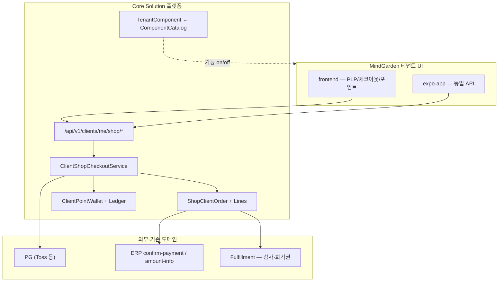

# 쇼핑·리워드 플랫폼 오케스트레이션 (Core Solution × MindGarden 테넌트)

| 항목 | 내용 |
|------|------|
| 문서 제목 | 쇼핑·리워드 플랫폼 오케스트레이션 |
| 상태 | **권장안 확정** — 구현은 서브에이전트 위임만 계획 |
| 작성일 | 2026-05-19 |
| SSOT 역할 | **아키텍처·역할 분리·갭·MVP·위임 순서**의 단일 오케스트레이션 문서 |

---

## §0 결론 — Core Solution vs MindGarden 테넌트

| 구분 | **Core Solution (멀티테넌트 플랫폼)** | **MindGarden 테넌트 (첫 adopter)** |
|------|--------------------------------------|-----------------------------------|
| **책임** | 쇼핑·리워드 **엔진** — API·DB·원장·주문 상태 머신·hold/commit·PG/ERP 훅·멀티테넌트 격리 | **상품·정책·브랜딩·노출** 설정 + **웹/Expo UI** (첫 소비자) |
| **코드 위치** | `com.coresolution.core.*` (컴포넌트 플래그), `com.coresolution.consultation.*` (현재 MVP 도메인), 공통 Flyway | 테넌트 **설정 데이터**·CMS/정책 테이블·디자인 토큰; UI는 `frontend/`·`expo-app/` |
| **SKU·가격** | `shop_catalog_skus` 등 **tenant_id 스코프** 테이블·API; SKU 코드는 테넌트별 행 | MindGarden tenant에 **상담 패키지·검사 SKU 행** 시드/어드민 등록; **하드코딩 SKU·금액 금지** |
| **포인트** | `client_point_wallets`·`client_point_ledger_entries`·hold/commit 서비스 | 적립률·사용 한도 등 **테넌트 정책** (후속 `point_tenant_policies` 등) |
| **UI 노출** | `ComponentCatalog` / `TenantComponent` 로 기능 on/off | LNB·탭·PLP 카피·배너·약관 URL — **토큰·설정**만 |
| **금지** | 테넌트 전용 코드베이스 분리, MindGarden SKU를 Java/JS 상수로 박기 | 플랫폼 엔진을 MindGarden 전용 패키지로 포크 |

**한 줄**: 엔진은 Core, MindGarden은 **설정 + UX의 첫 고객**이다.

**다센터 입점**: 다른 상담센터도 **신규 tenant**로 동일 엔진에 입점·자체 몰(모델 A) 운영 가능 — 상세·통합 마켓(모델 B)은 [MULTI_TENANT_SHOP_MARKETPLACE_SPEC.md](./MULTI_TENANT_SHOP_MARKETPLACE_SPEC.md).

---

## §1 아키텍처

**데이터 흐름 (체크아웃·포인트)**  
1. PLP/장바구니 → 서버 가격 권위(`shop_catalog_skus.unit_price_minor`)  
2. 체크아웃 → `POINT_HOLD` (CREATED)  
3. PG 승인 또는 포인트 전액 → `PAID` → `POINT_COMMIT` + (정책) `POINT_EARN` — **다음 PR**  
4. 상담 SKU → 기존 매핑·ERP INCOME 규칙

---

## §2 기존 SSOT 링크·역할

| 문서 | 역할 |
|------|------|
| [MULTI_TENANT_SHOP_MARKETPLACE_SPEC.md](./MULTI_TENANT_SHOP_MARKETPLACE_SPEC.md) | **입점·테넌트 몰 vs 통합 마켓**·방향성 7원칙·Phase 3+ |
| [ONLINE_PAYMENT_CATALOG_CHECKOUT_SPEC.md](./ONLINE_PAYMENT_CATALOG_CHECKOUT_SPEC.md) | 카탈로그·주문·PG·ERP·fulfillment·어드민 상품 |
| [POINT_REWARD_EARN_AND_REDEEM_SPEC.md](./POINT_REWARD_EARN_AND_REDEEM_SPEC.md) | 원장·hold·적립·환불·ERP 옵션 A/B |
| [WEB_ADMIN_APP_SCOPE_AND_CHECKOUT_FEATURES.md](./WEB_ADMIN_APP_SCOPE_AND_CHECKOUT_FEATURES.md) | WA/EA 채널·Phase P0~P5 매핑 |
| [CORE_PLANNER_DELEGATION_ORDER.md](./CORE_PLANNER_DELEGATION_ORDER.md) | 구현=core-coder, 검증=core-tester 게이트 |
| [../운영반영/PRE_PRODUCTION_GO_LIVE_CHECKLIST.md](../운영반영/PRE_PRODUCTION_GO_LIVE_CHECKLIST.md) | Go-Live·하드코딩·tenant 게이트 |
| `.cursor/skills/core-solution-multi-tenant` | tenantId 필수 |
| `.cursor/skills/core-solution-database-first` | DB → API 순 |
| `.cursor/skills/core-solution-erp` | confirm-payment·amount-info·중복 INCOME 방지 |

---

## §3 현재 구현 갭 (코드베이스 기준, 2026-05-19)

### 3.1 이미 존재 (플랫폼 MVP 골격)

| 영역 | 산출물 |
|------|--------|
| DB | `V20260514_003__client_shop_cart_order_points_mvp.sql` — `shop_catalog_skus`, `shop_carts`, `shop_cart_lines`, `shop_client_orders`, `shop_client_order_lines`, `client_point_wallets`, `client_point_ledger_entries` |
| 엔티티 | `ShopClientOrder`, `ShopClientOrderLine`, `ClientPointWallet` |
| API | `ClientShopController` — `/api/v1/clients/me/shop/catalog`, `cart`, `checkout`, `points/balance`, `orders/{id}/prepare-payment` 등 |
| 서비스 | `ClientShopCheckoutServiceImpl`, `ClientPointWalletServiceImpl` |
| 웹 | `frontend/src/constants/clientShopApi.js`, `ShopCheckoutMvp.js` (`/client/shop-checkout`) |
| 테스트 | `ClientPointWalletServiceImplTest` |

### 3.2 갭 (MVP 완성 전)

| # | 갭 | 비고 |
|---|-----|------|
| G1 | **PG PAID 웹훅 → hold→commit + EARN** | POINT_REWARD 스펙·구현 메모: **다음 PR** |
| G2 | **포인트 + PG 혼합** 체크아웃 | MVP는 전액 포인트 또는 전액 카드만 |
| G3 | **PLP·PDP·내 구매** 정식 화면 (웹·Expo) | 체크아웃 MVP 페이지만 존재 |
| G4 | **어드민 SKU·가격·노출 CRUD** | 스펙 §6, DB는 SKU 테이블만 |
| G5 | **테넌트 포인트 정책** 테이블·API | §3 정책 키 — 설계만 |
| G6 | **ERP 연동** (PAID → INCOME·amount-info 확장) | 온라인 결제 스펙 §5 |
| G7 | **Fulfillment** (검사 슬롯·회기권) | psych-assessment 플랜 연동 |
| G8 | **ComponentCatalog 시드** (`CLIENT_SHOP`, `CLIENT_REWARD` 등) | §7 — 코드·마이그레이션 미등록 |
| G9 | **Expo** shop 라우트·화면 | sessions-payment 인접, 전용 shop 미구현 |

---

## §4 MVP / Phase 범위

### 4.1 MVP (Phase 1 — 쇼핑·리워드 최소 동시 노출)

| 트랙 | 포함 | 제외 |
|------|------|------|
| **쇼핑** | 단일/복수 라인 장바구니, 카탈로그 API, 체크아웃, PG 전액 결제, 주문 목록(최소) | 쿠폰, 복잡 번들, 환불 UI |
| **리워드** | 잔액 조회, 체크아웃 hold, 포인트 전액 결제, commit (PG 연동 PR 포함) | 적립(EARN) 정책 엔진, 만료 배치, 어드민 수기 조정 |
| **MindGarden UI** | 웹 PLP(간소)·체크아웃·포인트 잔액; Expo는 **1화면씩** (체크아웃 또는 잔액 우선) | 어드민 상품 UI (WA-7은 Phase 2) |

### 4.2 Phase 2 (쇼핑 vs 리워드 분리 가능)

| Phase | 쇼핑 | 리워드 |
|-------|------|--------|
| **2a** | PDP·내 구매·prepare-payment E2E·환불 초안 | — |
| **2b** | 어드민 SKU CRUD·가격 이력 | 정책 CRUD·적립(EARN)·clawback |
| **2c** | 심리검사 fulfillment | ERP 옵션 A 대사 리포트 |

**의존성 순서 (구현 배치)**  
`DB(완료)` → `API·원장(확장)` → `PG/ERP 연동` → `hold/commit·EARN` → `웹 PLP/체크아웃` → `Expo`

### 4.3 Phase 3 — 통합 마켓플레이스 (모델 B, 추가 레이어)

| Phase | 쇼핑 | 리워드 | 마켓플레이스 |
|-------|------|--------|--------------|
| **3** | 통합 PLP·`marketplace_listing`·판매자 표시 | 통합몰에서 **크로스 테넌트 포인트 기본 불가** 재확인 | **E-AGG** — 엔진 재작성 없음 ([MULTI_TENANT_SHOP §2·§8](./MULTI_TENANT_SHOP_MARKETPLACE_SPEC.md)) |

**선행**: Phase 1~2 테넌트 몰(모델 A)·§9 의사결정 체크리스트. **착수**: core-designer + core-coder (본 문서 §13).

---

## §5 서브에이전트 분배표

| Phase | 담당 | 목표 | 병렬 |
|-------|------|------|------|
| P0 | **explore** (선택) | ERP·Payment 기존 훅 인벤토리 | — |
| P1 | **core-coder** | PG PAID → commit + 웹훅 멱등 (§B 첫 배치) | P1-design과 스키마 합의 후 |
| P1-design | **core-designer** (`gemini-3.1-pro`) | PLP·체크아웃·포인트 잔액 와이어 | P1과 병렬 가능 |
| P2 | **core-coder** | PLP 페이지·StandardizedApi·라우트 | — |
| P2 | **core-component-manager** | shop 관련 중복·공통 모듈 제안 | P2 코더와 순차 권장 |
| P3 | **core-coder** | Expo shop 화면 | P2 웹 API 안정 후 |
| P4 | **core-coder** | 어드민 SKU·정책 | — |
| 전 구간 | **core-tester** | tenant 교차·멱등·hold TTL·PG 실패 (POINT_REWARD §11 시나리오) | P1 완료 직전 착수 |

위임 규칙: [CORE_PLANNER_DELEGATION_ORDER.md](./CORE_PLANNER_DELEGATION_ORDER.md)

---

## §6 MindGarden 1차 노출 화면 (웹·Expo)

| ID | 화면 | 채널 | API·비고 |
|----|------|------|----------|
| MG-S1 | 카탈로그 PLP | 웹 → Expo | `GET .../shop/catalog` |
| MG-S2 | 장바구니 | 웹 | `GET/PUT .../shop/cart` |
| MG-S3 | 체크아웃 | 웹, Expo(후속) | `POST .../checkout`, `prepare-payment` — 웹에 `ShopCheckoutMvp` 존재 |
| MG-S4 | 내 포인트 잔액·내역 | 웹, Expo | `GET .../points/balance` (+ ledger API 후속) |
| MG-S5 | 주문 완료·내 구매 | 웹, Expo | 주문 목록 API 후속 |
| MG-S6 | (어드민) SKU 목록·노출 | 웹 only | Phase 2 — AdminCommonLayout |

**라우트 힌트 (현재)**  
- 웹: `/client/shop-checkout` (`App.js`)  
- Expo: `(client)/(more)/sessions-payment/*` 인접 — 전용 `(client)/(shop)/` 트리 신설 권장

---

## §7 컴포넌트 플래그 (`TenantComponent` / `ComponentCatalog`)

| component_code (안) | 설명 | 기본(MindGarden) |
|---------------------|------|------------------|
| `CLIENT_SHOP` | 내담자 카탈로그·장바구니·체크아웃 | on (MVP 후) |
| `CLIENT_REWARD` | 포인트 잔액·체크아웃 사용 | on |
| `ADMIN_SHOP_CATALOG` | 어드민 SKU·가격 | off → Phase 2 on |

**전략**  
1. `ComponentCatalog`에 메타 등록 (Flyway 시드)  
2. MindGarden `tenant_id`에 `TenantComponent` 활성화  
3. 프론트: LNB·탭·라우트 가드는 **플래그 API**만 참조 — SKU 문자열 하드코딩 금지  
4. 비활성 테넌트: API 403 또는 빈 카탈로그 + UI 숨김 (정책은 코더 배치에서 확정)

---

## §8 운영·Go-Live 게이트

| 게이트 | 문서·조치 |
|--------|-----------|
| tenantId·PII | [PRE_PRODUCTION_GO_LIVE_CHECKLIST.md](../운영반영/PRE_PRODUCTION_GO_LIVE_CHECKLIST.md), multi-tenant 스킬 |
| 하드코딩 | SKU·금액·PG 키·브랜딩 URL — 설정/비밀만; `check-hardcode` |
| PG·ERP | 스테이징 E2E: 결제 1건 + 원장 commit + (해당 시) INCOME 1건 |
| 컴포넌트 | 신규 테넌트는 `CLIENT_SHOP` off로 기본 출시 가능 |

---

## §9 에픽·스토리 초안 (MVP 우선순위)

### Epic E1 — 플랫폼 결제 완결 (P1 코더)

| 스토리 | 완료 조건 |
|--------|-----------|
| S1.1 PG 승인 웹훅이 `ShopClientOrder`를 `PAID`로 멱등 갱신 | 중복 웹훅 no-op |
| S1.2 `PAID` 시 `ClientPointWalletService` hold→commit | ledger `POINT_COMMIT` 1회 |
| S1.3 포인트 전액 결제 시 PG 스킵·즉시 PAID | cash_due_minor=0 경로 |

### Epic E2 — MindGarden 내담자 웹 (P2)

| 스토리 | 완료 조건 |
|--------|-----------|
| S2.1 PLP가 catalog API·토큰 스타일로 SKU 표시 | 하드코딩 SKU 0건 |
| S2.2 체크아웃 MVP를 디자인 스펙에 맞게 정식 페이지화 | core-tester 스모크 |

### Epic E3 — 리워드 노출 (P2, 리워드 트랙)

| 스토리 | 완료 조건 |
|--------|-----------|
| S3.1 내 포인트 화면 — 잔액·최근 원장 N건 | tenant 격리 |

### Epic E4 — Expo 패리티 (P3)

| 스토리 | 완료 조건 |
|--------|-----------|
| S4.1 Expo 체크아웃이 웹과 동일 API·상태 | 실기기 1건 |

---

## §10 첫 core-coder 배치 (실행은 사용자 승인 후)

**제목**: `Shop P1 — PG PAID 웹훅 및 포인트 hold→commit 연동`

**완료 조건**  
- PG 성공 콜백/웹훅 1경로에서 주문 `PAID` + `POINT_COMMIT` 멱등  
- 실패·취소 시 hold 해제  
- `ClientPointWalletServiceImplTest` + 통합 시나리오 1건 확장  
- POINT_REWARD §4 상태 머신과 일치 문서 한 줄 갱신

**참조**  
- 본 문서 §3~§4  
- [POINT_REWARD_EARN_AND_REDEEM_SPEC.md](./POINT_REWARD_EARN_AND_REDEEM_SPEC.md) §4~§5  
- [ONLINE_PAYMENT_CATALOG_CHECKOUT_SPEC.md](./ONLINE_PAYMENT_CATALOG_CHECKOUT_SPEC.md) §5.2  

**파일 힌트**  
- `ClientShopCheckoutServiceImpl.java`, `ClientPointWalletServiceImpl.java`  
- `ClientShopController.java`, Payment 웹훅/리스너 기존 클래스 (explore로 확정)  
- Flyway: 기존 ledger 타입 enum과 충돌 없는지 확인

---

## §11 core-designer 위임 초안 (실행 선택)

**모델**: Task 호출 시 `gemini-3.1-pro` 권장

**전달 요약**  
- **PLP**: 카테고리 탭(상담/검사), 테넌트 배너 영역, 카드형 SKU, 가격·토큰  
- **체크아웃**: 포인트 입력·전액 사용·금액 요약(상품→포인트→PG), 약관 동의  
- **내 포인트**: 잔액 헤더·최근 내역 리스트·주문 링크  
- 사용성: 내담자 1인칭, 모바일 우선 반응형  
- 정보노출: 타인 잔액·내부 SKU 코드 비노출  
- 참조: [ONLINE_PAYMENT §3](./ONLINE_PAYMENT_CATALOG_CHECKOUT_SPEC.md), [POINT_REWARD §9](./POINT_REWARD_EARN_AND_REDEEM_SPEC.md)

---

## §13 멀티테넌트 마켓플레이스 (입점·통합몰)

**SSOT**: [MULTI_TENANT_SHOP_MARKETPLACE_SPEC.md](./MULTI_TENANT_SHOP_MARKETPLACE_SPEC.md)

| 모델 | 정의 | Phase |
|------|------|-------|
| **A: 테넌트 단위 몰** | 서브도메인·tenant 컨텍스트, **자기 카탈로그만** (`shop_catalog_skus.tenant_id`) | **MVP · 1~2** |
| **B: 플랫폼 통합 마켓** | 한 PLP에 여러 tenant SKU, **판매자 = tenant** | **3+** (listing·검색 레이어 추가) |

- **입점** = 신규 tenant + `/api/v1/onboarding` OPS 승인 + `CLIENT_SHOP`/`CLIENT_REWARD` + `tenant_pg_configurations` + SKU.
- **B2B 구분**: [COMPONENT_MARKETPLACE_SYSTEM.md](./2025-12-03/COMPONENT_MARKETPLACE_SYSTEM.md)는 어드민 **컴포넌트 구독** — 본 과제(B2C 쇼핑)와 API·용어 혼동 금지.
- **첫 coder 배치**: 변경 없음 — Shop P1 PG+commit (§10). 통합몰은 Phase 3 designer/coder.

---

## §12 개정 이력

| 날짜 | 내용 |
|------|------|
| 2026-05-19 | §13 멀티테넌트 마켓플레이스·§4.3 Phase 3 통합몰·MULTI_TENANT SSOT 링크 |
| 2026-05-19 | 권장안 확정 — Core 엔진 / MindGarden adopter, 갭·MVP·위임 초안 |
