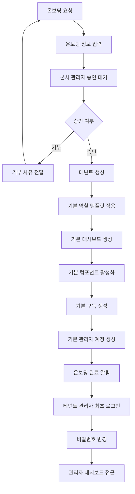
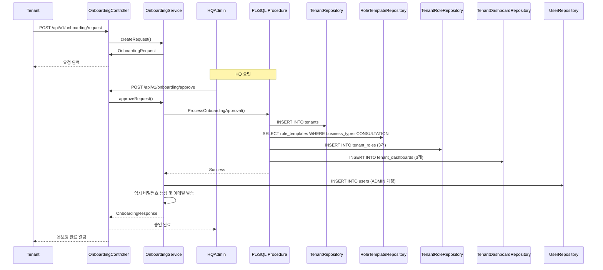

# MindGarden 예시 온보딩

**작성일**: 2025-11-20  
**버전**: 1.0.0  
**상태**: 완료

---

## 📋 개요

MindGarden은 CONSULTATION 업종의 실제 구현 예시입니다. 이 문서는 MindGarden의 온보딩 프로세스를 상세히 정리한 것입니다.

**⚠️ 참고**: MindGarden의 온보딩 프로세스는 CONSULTATION 업종의 예시일 뿐이며, 다른 상담소는 다른 온보딩 프로세스를 가질 수 있습니다.

---

## 🔄 MindGarden 온보딩 프로세스

### 전체 프로세스 흐름



---

## 📝 단계별 상세 프로세스

### 1단계: 온보딩 요청

**입점사가 수행하는 작업:**
- 온보딩 요청서 작성
- 업종 선택: **CONSULTATION**
- 기본 정보 입력
  - 상담소 이름
  - 사업자 정보
  - 대표자 정보
  - 연락처 정보
- 결제 정보 입력
  - 결제 수단 선택
  - 요금제 선택
- 필수 동의 사항 확인

**시스템 처리:**
- 온보딩 요청 저장
- 본사 관리자에게 알림 발송

---

### 2단계: 본사 관리자 승인

**본사 관리자가 수행하는 작업:**
- 온보딩 요청 검토
- 필수 정보 확인
- 승인 또는 거부 결정

**시스템 처리:**
- 승인 시 온보딩 프로세스 시작

---

### 3단계: 기본 역할 템플릿 적용

**시스템 자동 처리:**
- CONSULTATION 업종 기본 역할 템플릿 조회
- 템플릿 기반 테넌트 역할 생성

**생성되는 역할:**

| 역할 코드 | 역할명 | 설명 |
|----------|--------|------|
| CLIENT | 내담자 | 상담 예약, 상담 내역 조회 |
| CONSULTANT | 상담사 | 일정 관리, 상담 기록 작성 |
| ADMIN | 관리자 | 상담사/내담자 관리, 통계 조회 |

---

### 4단계: 기본 대시보드 생성

**시스템 자동 처리:**
- 각 기본 역할에 대해 대시보드 자동 생성

**생성되는 대시보드:**

| 역할 | 기본 대시보드 이름 | dashboard_type |
|------|-------------------|----------------|
| CLIENT | 내담자 대시보드 | CLIENT |
| CONSULTANT | 상담사 대시보드 | CONSULTANT |
| ADMIN | 관리자 대시보드 | ADMIN |

---

### 5단계: 기본 관리자 계정 생성

**시스템 자동 처리:**
- 기본 관리자 계정 생성
  - 이메일: 온보딩 요청 시 입력한 이메일
  - 역할: ADMIN
  - `tenant_id` 설정
- 임시 비밀번호 생성
- 이메일 발송 (임시 비밀번호 안내)

---

### 6단계: 테넌트 관리자 최초 로그인

**테넌트 관리자가 수행하는 작업:**
- 로그인 페이지 접속 (`/login?tenantId={tenantId}`)
- 임시 비밀번호로 로그인
- 최초 로그인 감지 → 비밀번호 변경 화면으로 리다이렉트
- 비밀번호 변경
- 관리자 대시보드 접근 (`/admin/dashboard`)

**시스템 처리:**
- 최초 로그인 감지
- 비밀번호 변경 강제
- 대시보드 라우팅

---

## 🎯 역할별 온보딩 체크리스트

### 관리자 (ADMIN) 온보딩

**온보딩 후 필수 작업:**
- [ ] 비밀번호 변경 (최초 로그인 시)
- [ ] 기본 역할 확인
  - [ ] 내담자 역할 확인
  - [ ] 상담사 역할 확인
  - [ ] 관리자 역할 확인
- [ ] 기본 대시보드 확인
  - [ ] 내담자 대시보드 확인
  - [ ] 상담사 대시보드 확인
  - [ ] 관리자 대시보드 확인
- [ ] 사용자 추가
  - [ ] 상담사 추가
  - [ ] 내담자 추가
- [ ] 시스템 설정 확인
  - [ ] 공통코드 확인
  - [ ] 알림 설정 확인

**권장 작업:**
- [ ] 사용자 관리 기능 탐색
- [ ] 일정 관리 기능 확인
- [ ] 통계 기능 확인
- [ ] 리포트 기능 확인

---

### 상담사 (CONSULTANT) 온보딩

**온보딩 후 필수 작업:**
- [ ] 프로필 정보 확인/수정
- [ ] 비밀번호 변경 (최초 로그인 시)
- [ ] 일정 관리 설정
  - [ ] 상담 가능 시간 설정
  - [ ] 반복 일정 설정 (필요시)
- [ ] 할당된 내담자 확인

**권장 작업:**
- [ ] 일정 관리 기능 탐색
- [ ] 상담 기록 작성 기능 확인
- [ ] 상담 통계 확인

---

### 내담자 (CLIENT) 온보딩

**온보딩 후 필수 작업:**
- [ ] 프로필 정보 확인/수정
- [ ] 비밀번호 변경 (최초 로그인 시)
- [ ] 상담 예약 방법 확인
- [ ] 상담 내역 확인

**권장 작업:**
- [ ] 상담 예약 테스트
- [ ] 상담 메시지 기능 확인
- [ ] 결제 내역 확인

---

## 🔄 온보딩 프로세스 상세 플로우

### 온보딩 요청 → 승인 → 완료 플로우



---

## 📊 MindGarden 온보딩 데이터 구조

### 테넌트 생성 시 자동 생성되는 데이터

```
Tenant (테넌트)
  ├─ tenant_id: "mindgarden-001"
  ├─ tenant_name: "MindGarden"
  ├─ business_type: "CONSULTATION"
  └─ status: ACTIVE
      ↓
TenantRole (테넌트 역할) × 3개
  ├─ CLIENT 역할
  │   ├─ tenant_role_id: "role-client-001"
  │   ├─ name_ko: "내담자"
  │   └─ permissions: [...]
  ├─ CONSULTANT 역할
  │   ├─ tenant_role_id: "role-consultant-001"
  │   ├─ name_ko: "상담사"
  │   └─ permissions: [...]
  └─ ADMIN 역할
      ├─ tenant_role_id: "role-admin-001"
      ├─ name_ko: "관리자"
      └─ permissions: [...]
      ↓
TenantDashboard (테넌트 대시보드) × 3개
  ├─ 내담자 대시보드
  │   ├─ dashboard_id: "dashboard-client-001"
  │   ├─ dashboard_name_ko: "내담자 대시보드"
  │   └─ is_default: true
  ├─ 상담사 대시보드
  │   ├─ dashboard_id: "dashboard-consultant-001"
  │   ├─ dashboard_name_ko: "상담사 대시보드"
  │   └─ is_default: true
  └─ 관리자 대시보드
      ├─ dashboard_id: "dashboard-admin-001"
      ├─ dashboard_name_ko: "관리자 대시보드"
      └─ is_default: true
      ↓
User (기본 관리자 계정) × 1개
  ├─ user_id: 1
  ├─ email: "admin@mindgarden.com"
  ├─ tenant_id: "mindgarden-001"
  ├─ role: ADMIN
  └─ password: 임시 비밀번호
```

---

## ⚠️ 중요 사항

1. **MindGarden은 예시일 뿐**
   - MindGarden의 온보딩 프로세스는 CONSULTATION 업종의 예시
   - 다른 상담소는 다른 온보딩 프로세스를 가질 수 있음

2. **자동 생성 항목**
   - 기본 역할 템플릿 기반 역할 생성
   - 기본 대시보드 자동 생성
   - 기본 관리자 계정 자동 생성

3. **커스터마이징 가능 항목**
   - 역할명 수정
   - 권한 추가/수정
   - 대시보드 이름 수정
   - 대시보드 설정 수정

---

## 🔗 관련 문서

- [온보딩 패턴](./ONBOARDING_PATTERNS.md)
- [역할별 온보딩 가이드](./ONBOARDING_GUIDE_BY_ROLE.md)
- [테넌트 대시보드 관리 시스템](../TENANT_DASHBOARD_MANAGEMENT_SYSTEM.md)

---

**마지막 업데이트**: 2025-11-20

