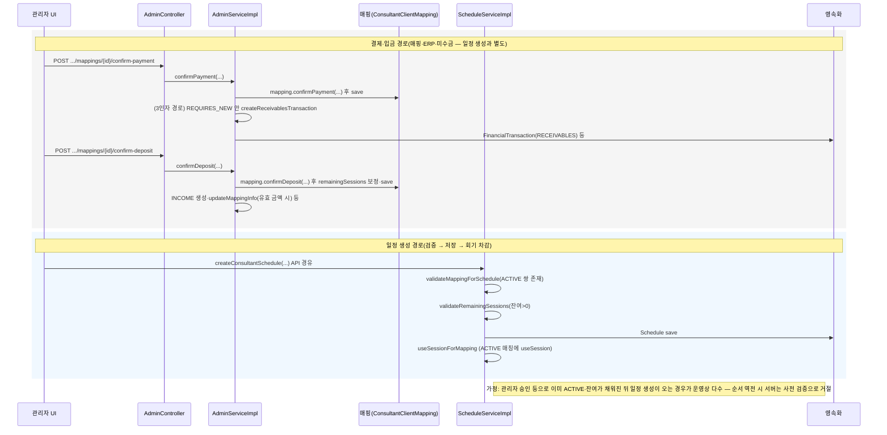

# 검토 메모 — 예약·통합 일정 × 미수금·선예약 후 결제(2026-05-06)

## 1. 한 줄 요약

**현행(코드 기준)**: 상담 일정 생성(`createConsultantSchedule` 계열)은 **매핑 `ACTIVE` + 잔여 회기(`remainingSessions > 0`)**를 저장 전에 검증하고, **스케줄 행 저장 이후** 같은 트랜잭션에서 `useSessionForMapping`으로 회기를 차감한다. **결제 확인·입금 확인**은 `AdminController`의 **`confirm-payment` / `confirm-deposit`** 별 API로 처리되며, **미수금(RECEIVABLES) 자동 생성**은 **3인자 `confirmPayment`** 경로에서 `createReceivablesTransaction`이 호출된다(로그·별도 트랜잭션). 제품·회계·ERP 최종 규칙은 본 문서 범위 밖이다.

---

## 2. 현행 흐름 다이어그램(Mermaid)

아래는 **코드에 직접 대응하는 호출 순서**를 중심으로 한 시퀀스이다. **선예약 후 결제** 같은 비즈니스 라벨이 실제 DB 상태와 1:1인지는 PO·운영 합의가 필요하며, 여기서는 **일정 API가 결제 API를 대체하지 않는다**는 점만 사실으로 둔다.

---

## 3. 표 A — PO·법무·운영 결정 필요

| 질문 | 왜 필요 | 없을 때 리스크 |
|------|---------|----------------|
| **`PAYMENT_CONFIRMED`(미수금)·`DEPOSIT_PENDING`·`ACTIVE` 중 어디까지 “예약 가능” 제품 정의로 둘 것인가?** (ADR-0001·0002와 연동) | 백엔드 일정 생성은 **ACTIVE + 잔여**만 통과하는데, 다른 화면·레거시 상수가 다른 상태를 허용하면 UX·CS 분쟁이 난다. | “가능해 보임 → API 거절” 불일치, 이중 예약·레이스에 대한 책임 공백 |
| **3인자 `confirm-payment`(RECEIVABLES만) vs 4인자(INCOME 등) vs `confirm-deposit`(INCOME+프로시저)** 중 운영·회계가 채택할 **정식 절차**는 무엇인가? | `docs/debug/DEPOSIT_ERP_REFUND_FLOW_ANALYSIS.md`에 **프로시저 누락·경로별 차이** 갭이 정리되어 있다. | ERP·내부장부 불일치, 감사 시 경로별 잔액 설명 불가 |
| **`remainingSessions` 산출·보정(예: 입금 확인 시 0→재계산)** 을 제품·운영이 단일 규칙으로 확정할 것인가? | `confirmDeposit`에 **잔여 0일 때 total-used로 채움** 로직이 있다. | 현장 해석 차이로 회기 과다/과소 차감 분쟁 |
| **선예약(일정 먼저) 후 결제**를 허용할 경우, **일정 롤백 vs ERP 보상**의 오너(운영·CS·배치)를 무엇으로 할 것인가? (ADR-0003) | 현재 코드는 **일정 트랜잭션**과 **ERP/통계 REQUIRES_NEW**가 분리되어 있다. | 부분 성공 시 복구 주체 불명, 2xx 이후 뒤늦은 불일치 |
| **“결제 확인 / 입금확인 / 결재확인” 등 UI·문서 라벨**을 법·운영이 허용하는 용어로 고정할 것인가? | 분석 문서에 **라벨 혼용**이 명시되어 있다. | 동의서·고지 문구와 시스템 상태명 불일치 |

**PO 결정 기입 위치(표 중복 없음):** 아래 체크리스트에 결정을 기입한다 — [`PO_ADR_REVIEW_CHECKLIST_INTEGRATED_SCHEDULE_20260506.md`](./PO_ADR_REVIEW_CHECKLIST_INTEGRATED_SCHEDULE_20260506.md)

---

## 4. 표 B — 엔지니어링 후속(우선순위)

| 우선순위 | 항목 | 파일·API 힌트 | 전제(PO 표 A) |
|:--------:|------|----------------|---------------|
| **P0** | P0 시나리오(A/B/C) **재현 + 증거 4점** 수집 후, “가능 표시 vs 서버 전제” 불일치 목록화 | `INTEGRATED_SCHEDULE_RESERVE_FIRST_PAY_LATER_ORCHESTRATION.md` §2.2, `ScheduleServiceImpl`, 통합 스케줄 E2E | **A1**, **A4** |
| **P0** | `createConsultantSchedule` 실패 시 **클라이언트 메시지·복구 동선** SSOT화(문서 §11 “다음 위임”과 정합) | `ScheduleModal.js`, `standardizedApi.js`, 관련 스펙 | **A1** |
| **P1** | **confirm-payment 4인자 vs confirm-deposit** ERP 프로시저·INCOME 정책을 저장소 갭 문서와 맞춘 **수정 범위·회귀 조건** 확정 | `AdminServiceImpl`, `DEPOSIT_ERP_REFUND_FLOW_ANALYSIS.md` §3 갭 1~3 | **A2** |
| **P1** | **레이스(사전 검증 통과 후 타 요청이 회기 소모)** 대응 방침(낙관적 락·재시도·메시지) — 코드 주석에 “Phase 2 검토”로 남아 있음 | `ScheduleServiceImpl`(일정 생성 주변 주석), 단위·통합 테스트 | **A3**, **A4** |
| **P1** | 통합 일정 **드롭 가드**와 `canScheduleForMapping` **단일 SSOT** 유지·다른 컴포넌트와의 발산 제거 | `integratedScheduleSidebarFilterConstants.js`, `scheduleExternalDropGuards.js`, `IntegratedMatchingSchedule.js` | **A1** |

---

## 5. 다음 위임 한 줄

**`core-debugger`**(§2.2 증거 4점·P0 재현) → **`core-coder`**(표 B·ADR·갭 문서 반영 범위 확정 후 구현) → **`core-tester`**(§4 테스트 게이트·E2E 스모크).

---

## 부록 — 근거 경로·요약(코드·문서 인덱스)

본 절은 **경로 나열 + 한 줄 요약**만 한다(새 회계 주장 없음).

| 경로 | 요약 |
|------|------|
| `src/main/java/com/coresolution/consultation/service/impl/AdminServiceImpl.java` | **`confirmPayment`(3인자)**: 저장 후 `runInNewTransaction` → `createReceivablesTransaction`; 성공 시 “미수금 거래 자동 생성” 로그. **`confirmDeposit`**: 엔티티 `confirmDeposit` 후 `remainingSessions==0`이면 `total-used`로 보정, 유효 금액 시 INCOME·`updateMappingInfo` 등. |
| `src/main/java/com/coresolution/consultation/controller/AdminController.java` | **`POST .../mappings/{mappingId}/confirm-payment`**, **`POST .../mappings/{mappingId}/confirm-deposit`** 엔드포인트가 서비스로 위임. |
| `src/main/java/com/coresolution/consultation/service/impl/ScheduleServiceImpl.java` | **`createConsultantSchedule`**: `validateMappingForSchedule`·`validateRemainingSessions` **저장 전**; **`scheduleRepository.save` 이후 `useSessionForMapping`** 호출로 회기 차감(주석: 실패 시 일정 저장까지 롤백). **`useSessionForMapping`**: 테넌트의 **ACTIVE** 매핑 중 컨설턴트·클라이언트 일치 시 `useSession()`. |
| `frontend/src/components/admin/mapping-management/constants/integratedScheduleSidebarFilterConstants.js` | **`canScheduleForMapping`**: `status === ACTIVE` && `remainingSessions > 0`; 주석으로 백엔드 사전 검증과 정합 명시. |
| `docs/project-management/INTEGRATED_SCHEDULE_RESERVE_FIRST_PAY_LATER_ORCHESTRATION.md` §11 | **구현 스냅샷**: 역할(ADMIN/STAFF 신규 vs CONSULTANT 편집), **`createConsultantSchedule` 사전 검증·트랜잭션**, **`canScheduleForMapping` 축**, 관련 소스·테스트 경로 표. |
| `docs/debug/DEPOSIT_ERP_REFUND_FLOW_ANALYSIS.md` | **용어 혼용**, **confirm-payment 3/4인자 차이**, **confirm-deposit과 프로시저**, **갭 목록**(전액 수령 트리거 없음, 4인자 confirm-payment에 프로시저 없음 등) — 인용 수준. |
| `docs/project-management/attachments/PO_ADR_REVIEW_CHECKLIST_INTEGRATED_SCHEDULE_20260506.md` | ADR 0001~0003별 **검토 질문·결정 칸** — 표 A는 이를 대체하지 않고 링크만 연결. |

### 이미 구현된 것(엔지니어링 스냅샷) vs 합의 필요

- **이미 구현·정합된 것(요지)**: `createConsultantSchedule`의 **ACTIVE·잔여 사전 검증**, 저장 후 **`useSessionForMapping`**, 프론트 **`canScheduleForMapping`과의 주석상 SSOT**, 통합 일정 오케스트레이션 문서 §11의 역할·검증 요약. (세부는 부록 경로 참조.)
- **제품·법무·회계·ERP 합의가 필요한 것**: 표 A — 상태별 “예약 가능” 최종 규칙, 결제/입금 **경로 채택**, 부분 성공 시 **복구 오너**, 라벨·고지 문구.

---

## 6. PO 결정 기록 (채팅 반영)

**일시·출처**: 제품(PO) 채팅, 2026-05-06.

1. **입금 확인 전 건**: **가예약**을 한 건 만들어 등록해 두고, 이후 **입금 완료** 또는 **카드 결제**가 이루어지면 **상태값이 변동**되며 **완료 처리**로 이어지는 흐름을 원한다.
2. **그 외 항목**(표 A 나머지·ADR 세부·엔지니어링 권장안): 저장소에 정리된 **권장 방법**(오케스트레이션 §4 게이트, `core-debugger` → `core-coder` → `core-tester` 순, ADR·입금·ERP 분석 문서)에 따른다.

**엔지니어링 메모(해석만, 구현 확정 아님)**  
- “가예약”은 현재 코드의 `ACTIVE`+잔여 전제와 **충돌할 수 있으므로**, 별도 **일정·매핑 상태**(예: 보류·입금대기·가예약 전용)와 **입금/결제 콜백에서의 전이 규칙**을 설계해야 한다. 구현은 `core-planner` 배치표 후 `core-coder`가 담당한다.

---

*본 문서는 검토용 첨부이며, 법적 해석·회계 최종 판단은 외부 정책 및 담당 부서에 따른다.*
